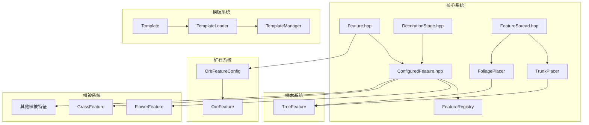

# Feature 模块

Cubium 世界生成特征系统，负责在地形生成后添加各种装饰性结构，如矿石、树木、植被、湖泊等。

## 目录结构

```
feature/
├── Feature.hpp/cpp           # 特征基类和配置（RuleTest、BlockStateProvider等）
├── ConfiguredFeature.hpp/cpp # 配置化特征和特征注册表
├── DecorationStage.hpp       # 装饰阶段枚举
├── FeatureIds.hpp            # 特征ID常量定义
├── FeatureSpread.hpp/cpp     # 特征扩散配置
├── nether/                   # 下界特征（萤石/玄武岩/岩浆/火焰）
├── fungus/                   # 下界巨型菌类特征
├── spike/                    # 末地黑曜石柱特征
├── gateway/                  # 末地折跃门特征
├── lake/                     # 湖泊特征（水湖/熔岩湖）
├── ore/                      # 矿石特征
├── template/                 # 结构模板系统（Template/TemplateLoader/TemplateManager）
├── tree/                     # 树木特征（TrunkPlacer/FoliagePlacer）
├── ocean/                    # 海洋特征（海带/海草/珊瑚/蓝冰等）
└── vegetation/               # 植被特征（花卉/草丛/蘑菇/仙人掌/冰刺/甘蔗）
```

## 内部模块关系



**关键依赖链**：
- `Feature` 是所有特征的抽象基类，定义 `place()` 接口
- `ConfiguredFeature` 组合特征与放置配置，由 `FeatureRegistry` 管理
- `DecorationStage` 控制特征生成顺序（RawGeneration → Lakes → ... → TopLayerModification）
- `TreeFeature` 依赖 `TrunkPlacer` + `FoliagePlacer` 组合

## 上下游外部依赖关系

### 上游依赖（本模块依赖的外部模块）

- `mc::core` - 基础类型定义
- `mc::util::math::Random` - 随机数生成
- `mc::world::block` - 方块系统（Block、BlockState、BlockRegistry、VanillaBlocks）
- `mc::world::biome` - 生物群系定义和 BiomeGenerationSettings
- `mc::world::chunk` - ChunkPrimer 区块数据
- `mc::world::gen::placement` - 放置修饰器
- `mc::resource` - ResourceLocation、资源包系统

### 下游依赖（依赖本模块的外部模块）

- `mc::world::gen::ChunkGenerator` - 区块生成器调用特征生成
- `mc::world::biome` - 生物群系通过 BiomeGenerationSettings 配置特征列表
- `mc::server::world::ServerWorld` - 服务端世界初始化时注册特征

## 容易踩的坑

### 1. 特征ID偏移量

VegetalDecoration 阶段的特征ID需要使用 `FeatureIds.hpp` 中定义的偏移量常量，不要硬编码：
```cpp
// 正确
constexpr u32 myFlowerId = FlowerFeatureIds::Offset + 0;
// 错误（如果树木数量变化会出错）
constexpr u32 myFlowerId = 9;
```

### 2. 初始化顺序

特征初始化依赖方块系统，必须在 `VanillaBlocks::initialize()` 之后调用 `FeatureRegistry::instance().initialize()`。

### 3. TrunkPlacer/FoliagePlacer 深拷贝

`TreeFeatureConfig` 包含 `unique_ptr` 成员，已实现拷贝构造函数和赋值运算符，确保正确深拷贝。

### 4. 放置位置检查

特征放置时需正确检查位置有效性：
- 树木：检查下方是否为泥土/耕地
- 仙人掌：检查周围是否有实体方块

### 5. 随机数种子

特征生成使用区块种子，计算方式：
```cpp
const u64 chunkSeed = seed
    ^ static_cast<u64>(static_cast<i64>(chunkX) * 341873128712ULL)
    ^ static_cast<u64>(static_cast<i64>(chunkZ) * 132897987541ULL);
```

### 6. 模板加载路径

NBT 模板文件路径格式：`data/<namespace>/structure/<path>.nbt`

### 7. 高度常量使用

【重要】必须使用 `mc::world::MIN_BUILD_HEIGHT`、`MAX_BUILD_HEIGHT` 等常量，禁止硬编码 0、256 等数字。

### 8. 区块尺寸常量使用

【重要】必须使用 `mc::world::CHUNK_WIDTH`、`CHUNK_HEIGHT`、`CHUNK_SECTION_HEIGHT` 等常量，禁止硬编码 16 等数字。
