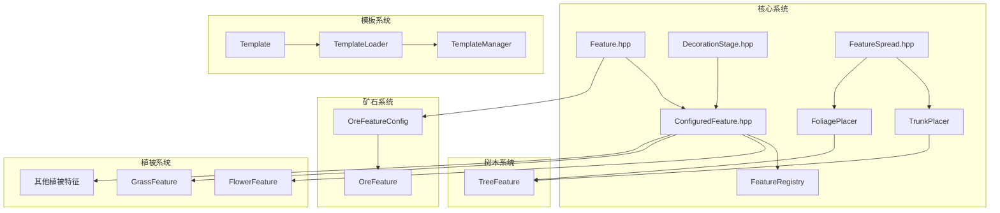

# Feature 模块

Cubium 世界生成特征系统，负责在地形生成后添加各种装饰性结构，如矿石、树木、植被、湖泊等。

## 目录结构

```
feature/
├── Feature.hpp/cpp                   # 特征基类和配置
├── ConfiguredFeature.hpp/cpp         # 配置化特征和特征注册表
├── FeatureSorter.hpp/cpp             # MC 1.21 特征拓扑排序器
├── DecorationStage.hpp               # 装饰阶段枚举
├── FeatureIds.hpp                    # 特征ID常量定义
├── FeatureSpread.hpp/cpp             # 特征扩散配置
├── LakeFeature.hpp/cpp               # 湖泊特征（水湖/熔岩湖）
├── SnowAndFreezeFeature.hpp/cpp      # 雪和冰冻结特征（TopLayerModification 阶段）
├── SimpleBlockFeature.hpp/cpp        # 简单方块放置特征
├── BlockColumnFeature.hpp/cpp        # 方块柱特征
├── RandomBooleanSelectorFeature.hpp/cpp  # 随机布尔选择器特征
├── SimpleRandomSelectorFeature.hpp/cpp   # 简单随机选择器特征
├── cave/                             # 洞穴特征（繁茂洞穴/根系/植被贴片）
│   ├── CaveFeatureConfigs.hpp        # 配置结构体聚合头文件
│   ├── CaveFeatures.hpp/cpp          # 洞穴特征聚合
│   ├── CaveSurface.hpp               # 洞穴表面辅助
│   ├── LushCavesFeatures.hpp/cpp     # 繁茂洞穴特征
│   ├── RootSystemFeature.hpp/cpp     # 根系特征
│   └── VegetationPatchFeature.hpp/cpp # 植被贴片特征
├── end/                              # 末地特征（黑曜石柱/折跃门/冰刺/紫颂树/末地小岛）
│   ├── EndSpikeFeature.hpp/cpp       # 黑曜石柱
│   ├── EndGatewayFeature.hpp/cpp     # 末地折跃门
│   ├── IceSpikeFeature.hpp/cpp       # 冰刺
│   ├── ChorusPlantFeature.hpp/cpp    # 紫颂树特征（VegetalDecoration 阶段）
│   ├── EndIslandFeature.hpp/cpp      # 末地小岛特征（RawGeneration 阶段）
│   └── EndFeatures.hpp/cpp           # 末地特征注册
├── nether/                           # 下界特征（萤石/玄武岩/岩浆/火焰/巨型菌类）
│   ├── GlowstoneFeature.hpp/cpp      # 萤石簇
│   ├── BasaltColumnFeature.hpp/cpp   # 玄武岩柱
│   ├── BasaltDeltaFeature.hpp/cpp    # 玄武岩三角洲
│   ├── BasaltFeature.hpp             # 玄武岩聚合头文件
│   ├── MagmaPatchFeature.hpp/cpp     # 岩浆池
│   ├── NetherFireFeature.hpp/cpp     # 下界火焰
│   ├── HugeFungusFeature.hpp/cpp     # 巨型菌类
│   └── NetherFeatures.hpp/cpp        # 下界特征注册
├── ocean/                            # 海洋特征（海带/海草/珊瑚/蓝冰等）
│   ├── KelpFeature.hpp/cpp           # 海带
│   ├── SeagrassFeature.hpp/cpp       # 海草
│   ├── SeaPickleFeature.hpp/cpp      # 海泡菜
│   ├── CoralFeature.hpp/cpp          # 珊瑚基类
│   ├── CoralTreeFeature.hpp/cpp      # 珊瑚树变体
│   ├── CoralMushroomFeature.hpp/cpp  # 珊瑚蘑菇变体
│   ├── CoralClawFeature.hpp/cpp      # 珊瑚爪变体
│   ├── OceanDecorationFeature.hpp/cpp # 海洋装饰
│   └── BlueIceFeature.hpp/cpp        # 蓝冰
├── ore/                              # 矿石特征
├── predicate/                        # 方块谓词（条件判断）
│   ├── BlockPredicate.hpp            # 谓词基类
│   ├── Predicates.hpp                # 聚合头文件
│   └── ...（各谓词独立文件）
├── ruletest/                         # 规则测试（矿石匹配条件）
├── state/                            # 方块状态提供者
├── template/                         # 结构模板系统
├── tree/                             # 树木特征（TrunkPlacer/FoliagePlacer）
└── vegetation/                       # 植被特征（花卉/草丛/蘑菇/仙人掌/甘蔗）
```

## 内部模块关系



**关键依赖链**：
- `Feature` 是所有特征的抽象基类，定义 `place()` 接口
- `ConfiguredFeature` 组合特征与放置配置，由 `FeatureRegistry` 管理
- `DecorationStage` 控制特征生成顺序（RawGeneration → Lakes → ... → TopLayerModification）
- `FeatureSorter` 对所有可能生物群系的特征进行拓扑排序，确保跨生物群系边界的确定性放置
- `TreeFeature` 依赖 `TrunkPlacer` + `FoliagePlacer` 组合

## 上下游外部依赖关系

### 上游依赖（本模块依赖的外部模块）

- `mc::core` - 基础类型定义
- `mc::util::math::Random` - 随机数生成
- `mc::world::block` - 方块系统（Block、BlockState、BlockRegistry、VanillaBlocks）
- `mc::world::biome` - 生物群系定义和 BiomeGenerationSettings
- `mc::world::chunk` - ChunkPrimer 区块数据
- `mc::world::gen::placement` - 放置修饰器
- `mc::resource` - ResourceLocation、资源包系统

### 下游依赖（依赖本模块的外部模块）

- `mc::world::gen::ChunkGenerator` - 区块生成器调用特征生成
- `mc::world::biome` - 生物群系通过 BiomeGenerationSettings 配置特征列表
- `mc::server::world::ServerWorld` - 服务端世界初始化时注册特征

## 容易踩的坑

### 1. 特征ID偏移量

VegetalDecoration 阶段的特征ID需要使用 `FeatureIds.hpp` 中定义的偏移量常量，不要硬编码：
```cpp
// 正确
constexpr u32 myFlowerId = FlowerFeatureIds::Offset + 0;
// 错误（如果树木数量变化会出错）
constexpr u32 myFlowerId = 9;
```

### 2. 初始化顺序

特征初始化依赖方块系统，必须在 `VanillaBlocks::initialize()` 之后调用 `FeatureRegistry::instance().initialize()`。

### 3. TrunkPlacer/FoliagePlacer 深拷贝

`TreeFeatureConfig` 包含 `unique_ptr` 成员，已实现拷贝构造函数和赋值运算符，确保正确深拷贝。

### 4. 放置位置检查

特征放置时需正确检查位置有效性：
- 树木：检查下方是否为泥土/耕地
- 仙人掌：检查周围是否有实体方块

### 5. getFeatureById() 查找特征

`FeatureRegistry::getFeatureById(u32)` 按特征 ID 查找特征指针，ID 等于 `m_ownedFeatures` 中的索引。越界 ID 返回 `nullptr`。骨粉等运行时逻辑可通过此方法结合 `dynamic_cast<ConfiguredFlowerFeature*>` 筛选特定类型的特征。

### 5. 随机数种子

特征生成使用区块种子，计算方式：
```cpp
const u64 chunkSeed = seed
    ^ static_cast<u64>(static_cast<i64>(chunkX) * 341873128712ULL)
    ^ static_cast<u64>(static_cast<i64>(chunkZ) * 132897987541ULL);
```

### 6. 模板加载路径

NBT 模板文件路径格式：`data/<namespace>/structure/<path>.nbt`

### 7. 高度常量使用

【重要】必须使用 `mc::world::MIN_BUILD_HEIGHT`、`MAX_BUILD_HEIGHT` 等常量，禁止硬编码 0、256 等数字。

### 8. 区块尺寸常量使用

【重要】必须使用 `mc::world::CHUNK_WIDTH`、`CHUNK_HEIGHT`、`CHUNK_SECTION_HEIGHT` 等常量，禁止硬编码 16 等数字。

### 9. 末地折跃门结构

`EndGatewayFeature._generateGateway()` 和 `EndGatewayEntity::createGatewayStructure()` 生成相同的 3x5x3 十字框架结构，与 MC Java 的 `EndGatewayFeature.place()` 一致：

```
顶/底盖层（dy = ±2）：仅中心列为基岩
  . . .
  . B .
  . . .

十字臂层（dy = ±1）：十字形基岩框架
  . B .
  B B B
  . B .

中心层（dy = 0）：中心为折跃门方块，其余为空气
  . . .
  . G .
  . . .
```

结构以 pos 为中心，范围 `pos + (-1, -2, -1)` 到 `pos + (1, 2, 1)`。修改结构时需同步更新两处代码。
