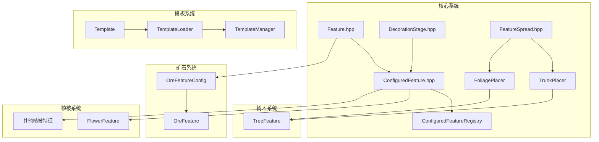

# Feature 模块

Cubium 世界生成特征系统，负责在地形生成后添加各种装饰性结构，如矿石、树木、植被、湖泊等。

## 目录结构

```
feature/
├── Feature.hpp/cpp                   # 特征基类和配置
├── ConfiguredFeature.hpp             # 配置化特征基类（ConfiguredFeatureBase）
├── ConfiguredFeatureRegistry.hpp/cpp # 配置化特征注册表（数据驱动，按 ResourceLocation 索引）
├── ConfiguredFeatureLoader.hpp/cpp   # 从数据包加载 configured_feature JSON
├── FeatureTypeRegistry.hpp/cpp       # feature type 字符串→C++ 工厂映射（严格报错，增量注册）
├── FeatureSorter.hpp/cpp             # MC 1.21 特征拓扑排序器（PlacedFeature* + ResourceLocation）
├── DecorationStage.hpp               # 装饰阶段枚举
├── FeatureSpread.hpp/cpp             # 特征扩散配置
├── MonsterRoomFeature.hpp/cpp        # 地牢特征（忠实复刻 MC 1.21.11 MonsterRoomFeature）
├── LakeFeature.hpp/cpp               # 湖泊特征（水湖/熔岩湖）
├── SnowAndFreezeFeature.hpp/cpp      # 雪和冰冻结特征（TopLayerModification 阶段）
├── SimpleBlockFeature.hpp/cpp        # 简单方块放置特征
├── BlockColumnFeature.hpp/cpp        # 方块柱特征
├── RandomBooleanSelectorFeature.hpp/cpp  # 随机布尔选择器特征
├── SimpleRandomSelectorFeature.hpp/cpp   # 简单随机选择器特征
├── cave/                             # 洞穴特征（繁茂洞穴/根系/植被贴片）
│   ├── CaveSurface.hpp               # 洞穴表面辅助
│   ├── RootSystemFeature.hpp/cpp     # 根系特征
│   └── VegetationPatchFeature.hpp/cpp # 植被贴片特征
├── end/                              # 末地特征（黑曜石柱/折跃门/冰刺/紫颂树/末地小岛）
│   ├── EndSpikeFeature.hpp/cpp       # 黑曜石柱
│   ├── EndGatewayFeature.hpp/cpp     # 末地折跃门
│   ├── IceSpikeFeature.hpp/cpp       # 冰刺
│   ├── ChorusPlantFeature.hpp/cpp    # 紫颂树特征（VegetalDecoration 阶段）
│   └── EndIslandFeature.hpp/cpp      # 末地小岛特征（RawGeneration 阶段）
├── nether/                           # 下界特征（萤石/玄武岩/三角洲/水下岩浆/火焰/巨型菌类）
│   ├── GlowstoneFeature.hpp/cpp      # 萤石簇
│   ├── BasaltColumnFeature.hpp/cpp   # 玄武岩柱
│   ├── BasaltFeature.hpp             # 玄武岩聚合头文件
│   ├── DeltaFeature.hpp/cpp          # 三角洲（contents/rim + size/rim_size）
│   ├── UnderwaterMagmaFeature.hpp/cpp # 水下岩浆（Column.scan 找水柱底）
│   └── HugeFungusFeature.hpp/cpp     # 巨型菌类
├── ocean/                            # 海洋特征（海带/海草/珊瑚/蓝冰等）
│   ├── KelpFeature.hpp/cpp           # 海带
│   ├── SeagrassFeature.hpp/cpp       # 海草
│   ├── SeaPickleFeature.hpp/cpp      # 海泡菜
│   ├── CoralFeature.hpp/cpp          # 珊瑚基类
│   ├── CoralTreeFeature.hpp/cpp      # 珊瑚树变体
│   ├── CoralMushroomFeature.hpp/cpp  # 珊瑚蘑菇变体
│   ├── CoralClawFeature.hpp/cpp      # 珊瑚爪变体
│   └── BlueIceFeature.hpp/cpp        # 蓝冰
├── ore/                              # 矿石特征
├── predicate/                        # 方块谓词（条件判断）
│   ├── BlockPredicate.hpp            # 谓词基类
│   ├── Predicates.hpp                # 聚合头文件
│   └── ...（各谓词独立文件）
├── state/                            # 方块状态提供者（多态基类 BlockStateProvider + 8 子类，见 state/README.md）
├── template/                         # 结构模板系统
├── tree/                             # 树木特征（TrunkPlacer/FoliagePlacer）
└── vegetation/                       # 植被特征（花卉/蘑菇/竹子）
```

## 内部模块关系



**关键依赖链**：
- `Feature` 是所有特征的抽象基类，定义 `place()` 接口
- `ConfiguredFeature` 组合特征与配置，由 `ConfiguredFeatureRegistry` 管理（数据驱动，从数据包 JSON 加载）
- `DecorationStage` 控制特征生成顺序（RawGeneration → Lakes → ... → TopLayerModification）
- `FeatureSorter` 对所有可能生物群系的 placed_feature 进行拓扑排序，确保跨生物群系边界的确定性放置
- `TreeFeature` 依赖 `TrunkPlacer` + `FoliagePlacer` 组合

## 上下游外部依赖关系

### 上游依赖（本模块依赖的外部模块）

- `mc::core` - 基础类型定义
- `mc::util::math::Random` - 随机数生成
- `mc::world::block` - 方块系统（Block、BlockState、BlockRegistry、VanillaBlocks）
- `mc::world::biome` - 生物群系定义和 BiomeGenerationSettings
- `mc::world::chunk` - ChunkPrimer 区块数据
- `mc::world::gen::placement` - 放置修饰器
- `mc::resource` - ResourceLocation、资源包系统

### 下游依赖（依赖本模块的外部模块）

- `mc::world::gen::ChunkGenerator` - 区块生成器调用特征生成
- `mc::world::biome` - 生物群系通过 BiomeGenerationSettings 配置特征列表
- `mc::server::world::ServerWorld` - 服务端世界初始化时从数据包加载特征注册表

## 容易踩的坑

### 1. 特征 ID 使用 ResourceLocation

特征不再使用 u32 整型 ID，统一以 `ResourceLocation`（如 `minecraft:monster_room`）标识。`ConfiguredFeatureBase::id()` 返回其 ResourceLocation，由 `ConfiguredFeatureRegistry` 按 `ResourceLocation` 索引。biome 的 `features` 数组、`placed_feature` JSON 的 `feature` 字段、`FeatureSorter` 的拓扑 key 全部是 `ResourceLocation`，不要混入整型 ID。
```cpp
// 正确
const auto id = ResourceLocation("minecraft", "monster_room");
auto* feature = ConfiguredFeatureRegistry::instance().get(id);
// 错误（已删除整型 ID 体系）
// u32 featureId = FeatureIds::MonsterRoom;  // FeatureIds.hpp 已删除
```

### 2. 初始化顺序与数据驱动加载

特征注册表依赖方块系统与放置修饰器，加载顺序为：
`VanillaBlocks::initialize()` → `PlacementRegistry::initialize()` → `FeatureTypeRegistry::initialize()`（注册 type 字符串→C++ 工厂）→ `ConfiguredFeatureLoader`（从数据包加载 configured_feature JSON）→ `PlacedFeatureLoader`（加载 placed_feature JSON，引用 configured_feature）→ `ConfiguredCarverLoader` → `BiomeLoader`（最后加载，引用前三者）。

每个 Loader 从 `DataPackRepository` 枚举 `data/<namespace>/worldgen/<registry>/*.json`，遇未实现的 feature type / placement type / 引用未注册 id 时严格报错中断（`return Error`），便于按报错逐个补缺口。

### 3. TrunkPlacer/FoliagePlacer 深拷贝

`TreeFeatureConfig` 包含 `unique_ptr` 成员，已实现拷贝构造函数和赋值运算符，确保正确深拷贝。

### 4. 放置位置检查

特征放置时需正确检查位置有效性：
- 树木：检查下方是否为泥土/耕地
- 仙人掌：检查周围是否有实体方块

### 5. 查询特征

`ConfiguredFeatureRegistry::get(const ResourceLocation&)` 按 ResourceLocation 查找配置化特征指针，未找到返回 `nullptr`。`PlacedFeatureRegistry::get(const ResourceLocation&)` 同理查找 placed_feature（含 placement 链）。骨粉等运行时逻辑可通过 `ConfiguredFeatureRegistry::get` + `dynamic_cast` 筛选特定类型的特征。

### 6. 随机数种子

特征生成使用区块种子，计算方式：
```cpp
const u64 chunkSeed = seed
    ^ static_cast<u64>(static_cast<i64>(chunkX) * 341873128712ULL)
    ^ static_cast<u64>(static_cast<i64>(chunkZ) * 132897987541ULL);
```

### 6. 模板加载路径

NBT 模板文件路径格式：`data/<namespace>/structure/<path>.nbt`

### 7. 高度常量使用

【重要】必须使用 `mc::world::MIN_BUILD_HEIGHT`、`MAX_BUILD_HEIGHT` 等常量，禁止硬编码 0、256 等数字。

### 8. 区块尺寸常量使用

【重要】必须使用 `mc::world::CHUNK_WIDTH`、`CHUNK_HEIGHT`、`CHUNK_SECTION_HEIGHT` 等常量，禁止硬编码 16 等数字。

### 9. 末地折跃门结构

`EndGatewayFeature._generateGateway()` 和 `EndGatewayEntity::createGatewayStructure()` 生成相同的 3x5x3 十字框架结构，与 MC Java 的 `EndGatewayFeature.place()` 一致：

```
顶/底盖层（dy = ±2）：仅中心列为基岩
  . . .
  . B .
  . . .

十字臂层（dy = ±1）：十字形基岩框架
  . B .
  B B B
  . B .

中心层（dy = 0）：中心为折跃门方块，其余为空气
  . . .
  . G .
  . . .
```

结构以 pos 为中心，范围 `pos + (-1, -2, -1)` 到 `pos + (1, 2, 1)`。修改结构时需同步更新两处代码。

### 10. FeatureSorter 成环断言

`FeatureSorter::buildFeaturesPerStep` 检测到 feature 依赖环时会通过 `MC_ASSERT_RELEASE_MSG(false, ...)` 中断生成（与原版 `IllegalStateException` 语义一致），断言消息包含环节点链和生物群系来源诊断信息。成环属于数据包配置错误，必须在数据包层面修复 feature 依赖关系，不能依赖排序器容错。

### 11. random_selector / simple_random_selector 子特征引用是 PlacedFeature id

**问题**：`RandomSelectorFeature` 的 `features[].feature` / `default` 引用，在 MC 1.21.11 中是 `WeightedPlacedFeature` / `Holder<PlacedFeature>`，即 **PlacedFeature 引用**，命中后调用其 `place(origin)`（先走该 PlacedFeature 自带的 placement 链，再放置其配置化特征）。若错误地仅按 `ConfiguredFeatureRegistry` 解析这些 id，则所有以 placed_feature id 作 default 的 trees_*（snowy/taiga/jungle/savanna/water/windswept_hills 等用 `oak_checked`/`spruce_checked` 作 default）都会 `default-miss`，树木不生成。

**数据包两种写法**（均为合法 vanilla 形式）：(1) 字符串 id 指向已注册 placed_feature（如 `"minecraft:spruce_checked"`）；(2) 内联对象 `{"feature":"<configured_id>","placement":[]}`，加载器提取出 configured id（如 `"minecraft:oak_bees_005"`，无对应 placed_feature 文件）。

**解决**：`RandomSelectorFeature::place`（及 `SimpleRandomSelectorFeature`）解析子特征 id 时，**先查 `PlacedFeatureRegistry`，未命中再查 `ConfiguredFeatureRegistry`** 兜底（见 `RandomSelectorFeature.cpp` 的 `dispatchChildFeature`）。新增同类 selector feature 必须沿用此双注册表解析，不能只查单一注册表。注意：嵌套 placed_feature 会重跑其 placement 链，若其含 `in_square`/`heightmap` 会二次随机化坐标——核对子 placed_feature 的 placement 链是否仅含过滤类（如 `block_predicate_filter`），避免坐标被覆盖。
