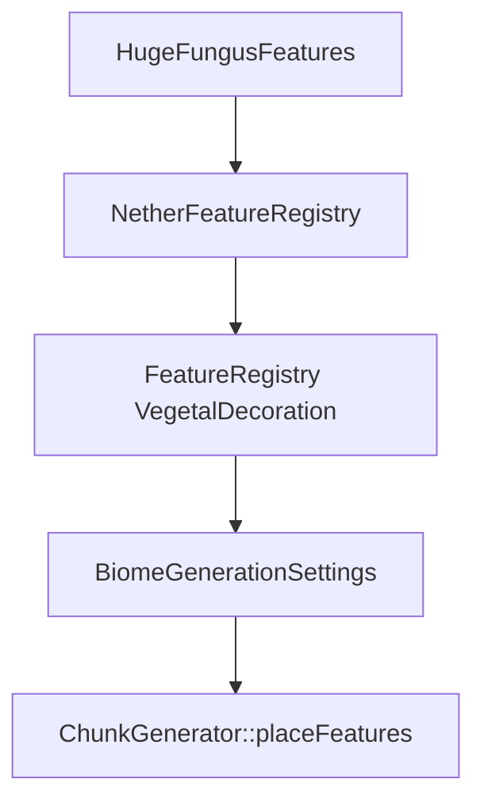

# 巨型菌类特征模块

## 目录结构树

```text
fungus/
├── HugeFungusFeature.hpp    # 巨型真菌特征类定义、配置结构体与特征列表工厂
├── HugeFungusFeature.cpp    # 巨型真菌生成算法实现（菌柄、菌盖、藤蔓、基座）
└── README.md
```

## 内部模块关系

- `HugeFungusFeature`：核心放置逻辑，包含空间检查、菌柄生成、菌盖生成、藤蔓生成、基座生成
- `HugeFungusFeatureConfig`：配置结构体，封装真菌类型（绯红/诡异）和种植标志
- `ConfiguredHugeFungusFeature`：继承 `ConfiguredFeatureBase`，桥接配置与放置逻辑
- `HugeFungusFeatures`：静态工厂，提供预配置的绯红/诡异真菌特征实例

## 上下游外部依赖关系

**上游依赖（本模块依赖）：**
- `ConfiguredFeature` / `Feature` 基类（特征框架）
- `VanillaBlocks`（方块状态获取：菌柄、菌盖、菌光体、藤蔓等）
- `WorldGenRegion`（世界区域访问）
- `math::Random`（随机数生成）
- `ChunkPrimer` / `IChunkGenerator`（区块生成上下文）

**下游依赖（依赖本模块）：**
- `NetherFeatureRegistry`：调用 `HugeFungusFeatures::initialize()` 初始化，并通过 `getAllVegetationFeaturesAndClear()` 获取特征实例
- 生物群系生成设置：通过 `NetherFeatureIds` 中的 ID 注册到 VegetalDecoration 阶段



## 容易踩的坑

- **`getAllFeaturesAndClear()` 会清空静态缓存**：调用后内部 `s_features` 被清空，若上层不允许重建会导致后续注册缺失。通常只在 `NetherFeatureRegistry` 初始化时调用一次。
- **特征 ID 槽位**：巨型菌类特征 ID 必须放在海带/海草等海洋植被 ID 之后，避免 `VegetalDecoration` 槽位冲突。参见 `NetherFeatureIds` 命名空间。
- **放置成功率异常偏低**：特征执行位置需符合下界生态前置条件（底材必须是绯红/诡异菌岩或下界岩、空间高度充足、邻域可替换），否则 `_canPlaceAt()` 会返回 false。
- **`planted` 标志影响空间检查**：`HugeFungusFeatureConfig::planted = true` 时跳过空间检查，适用于玩家种植场景；自然生成时应为 false。
- **菌光体回退逻辑**：若 `SHROOMLIGHT` 未注册，会回退到 `GLOWSTONE`；菌柄/菌盖也有类似回退到 `NETHERRACK`/`GLOWSTONE` 的逻辑，确保方块注册完整可避免意外回退。
