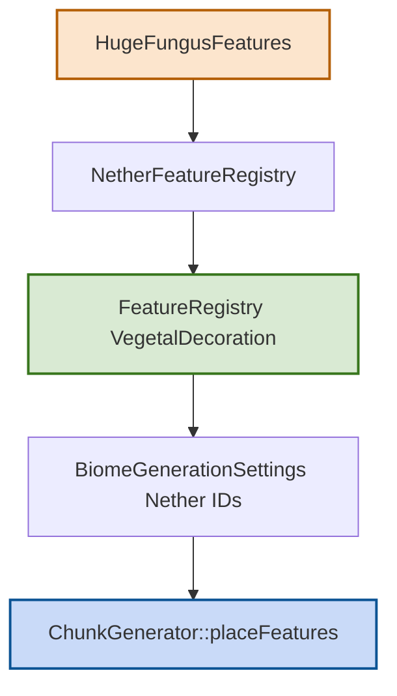

# 巨型菌类特征模块

## 1. 目录结构树

```text
fungus/
├── HugeFungusFeature.hpp
├── HugeFungusFeature.cpp
└── README.md
```

## 2. 文件介绍

| 文件 | 职责 |
|---|---|
| HugeFungusFeature.hpp/.cpp | 巨型绯红/诡异菌类生成算法、配置包装与特征列表导出 |

## 3. 模块关系

- HugeFungusFeature 负责具体放置逻辑（树干、菌盖、藤蔓/装饰等）。
- HugeFungusFeatures 负责提供 ConfiguredFeature 列表并交给 NetherFeatureRegistry 聚合。
- NetherFeatureRegistry 将其纳入 VegetalDecoration 阶段，最终由 FeatureRegistry 与 ChunkGenerator 调度。

## 4. 整体职责

- 提供下界菌林生态核心结构生成能力。
- 将巨型菌类作为“植被阶段特征”接入统一特征管线。
- 支持不同菌类配置（绯红菌、诡异菌）复用同一实现。

## 5. 输入/输出

- 输入：WorldGenRegion、ChunkPrimer、IChunkGenerator、Random、BlockPos、HugeFungusConfig。
- 输出：
  - 在区块中写入菌柄、菌盖及相关装饰方块。
  - 返回 bool 表示本次放置是否成功。

## 6. 依赖项

- 内部依赖：ConfiguredFeature、FeatureIds、VanillaBlocks、方块状态工具。
- 外部依赖：
  - 世界与区块访问：WorldGenRegion / IChunkAccess
  - 随机数：math::Random
  - 生成器上下文：IChunkGenerator

## 7. 使用方法

```cpp
#include "common/world/gen/feature/fungus/HugeFungusFeature.hpp"

// 一般通过 NetherFeatureRegistry 间接使用，不建议业务层直接拼装
auto fungusFeatures = mc::HugeFungusFeatures::getAllFeaturesAndClear();

// 返回的是可注册到 VegetalDecoration 阶段的配置化特征集合
```

## 8. 容易踩的坑

- `getAllFeaturesAndClear()` 会清空静态缓存，若上层不允许重建会导致后续注册缺失。
- 巨型菌类特征 ID 必须放在海带/海草等海洋植被 ID 之后，避免 VegetalDecoration 槽位冲突。
- 特征执行位置通常需符合下界生态前置条件（底材、空间高度、邻域可替换性），否则放置成功率会异常偏低。

## 9. 测试用例

- tests/common/world/gen/feature/NetherFeatureTest.cpp：下界特征集合完整性检查。
- tests/common/world/gen/test_vegetation_features.cpp：VegetalDecoration 偏移与名称槽位校验（含菌类）。

## 10. Mermaid 图表


