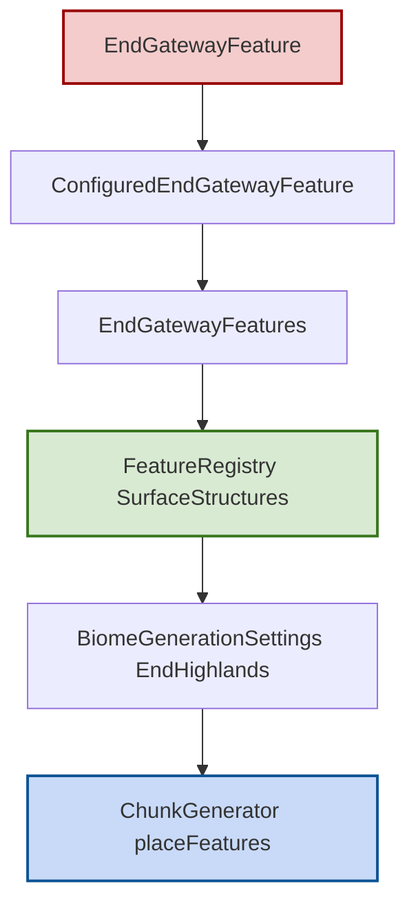

# 末地折跃门特征模块

## 1. 目录结构树

```text
gateway/
├── EndGatewayFeature.hpp
├── EndGatewayFeature.cpp
└── README.md
```

## 2. 文件介绍

| 文件 | 职责 |
|---|---|
| EndGatewayFeature.hpp/.cpp | 定义并实现末地折跃门特征、配置对象、配置化包装与特征集合导出 |

## 3. 模块关系

- `EndGatewayFeature` 负责折跃门结构放置与目标点计算辅助逻辑。
- `ConfiguredEndGatewayFeature` 封装为统一可调度特征。
- `EndGatewayFeatures` 向 `FeatureRegistry` 提供标准/退出折跃门特征对象。
- `BiomeGenerationSettings::createEndHighlands()` 通过 `FeatureIds` 引用普通折跃门槽位。

## 4. 整体职责

- 在末地地表结构阶段提供折跃门生成能力。
- 将折跃门作为可配置特征统一接入生物群系生成设置。
- 在区块内通过高度图定位候选位置，并以稀疏概率触发，避免每区块强制生成。
- 为后续完善“外岛传送逻辑”和“战斗后生成规则”提供基础模块。

## 5. 输入/输出

- 输入：`WorldGenRegion`、`Random`、起始坐标、`EndGatewayFeatureConfig`。
- 输出：
  - 在世界中放置基岩框架与折跃门方块。
  - 返回 `bool` 表示是否成功放置。

## 6. 依赖项

- 内部依赖：`ConfiguredFeature`、`DecorationStage`、`FeatureIds`。
- 外部依赖：`VanillaBlocks`、`ChunkPrimer`、`IChunkGenerator`、`math::Random`。

## 7. 使用方法

```cpp
#include "common/world/gen/feature/gateway/EndGatewayFeature.hpp"

// 一般由 FeatureRegistry 统一注册，不建议手动多次调用
mc::EndGatewayFeatures::initialize();
auto features = mc::EndGatewayFeatures::getAllFeaturesAndClear();

// features 包含 end_gateway 与 end_gateway_exit
```

## 8. 容易踩的坑

- `getAllFeaturesAndClear()` 调用后静态容器会清空，重复使用前必须重新 `initialize()`。
- 若放置起始 Y 直接使用区块原点（Y=0），`canPlaceAt()` 会始终失败；必须基于高度图选择地表候选点。
- `EndGatewayFeatureConfig::isExit` 当前主要是配置位，完整战斗流程触发规则尚需上层系统补齐。
- `calculateTeleportTarget()` 是静态算法近似实现，具体落点校正（安全落地/岛屿检测）仍需后续细化。

## 9. 测试用例

- tests/common/world/gen/test_vegetation_features.cpp：
  - `EndSurfaceFeatureIdsAreOffsetAfterIceSpikes`
  - `IceSpikeFeatureNames`（覆盖 `end_gateway` / `end_gateway_exit` 槽位名称）
  - `EndHighlandsBiomeSettings`（高地配置已引用折跃门）

## 10. Mermaid 图表


