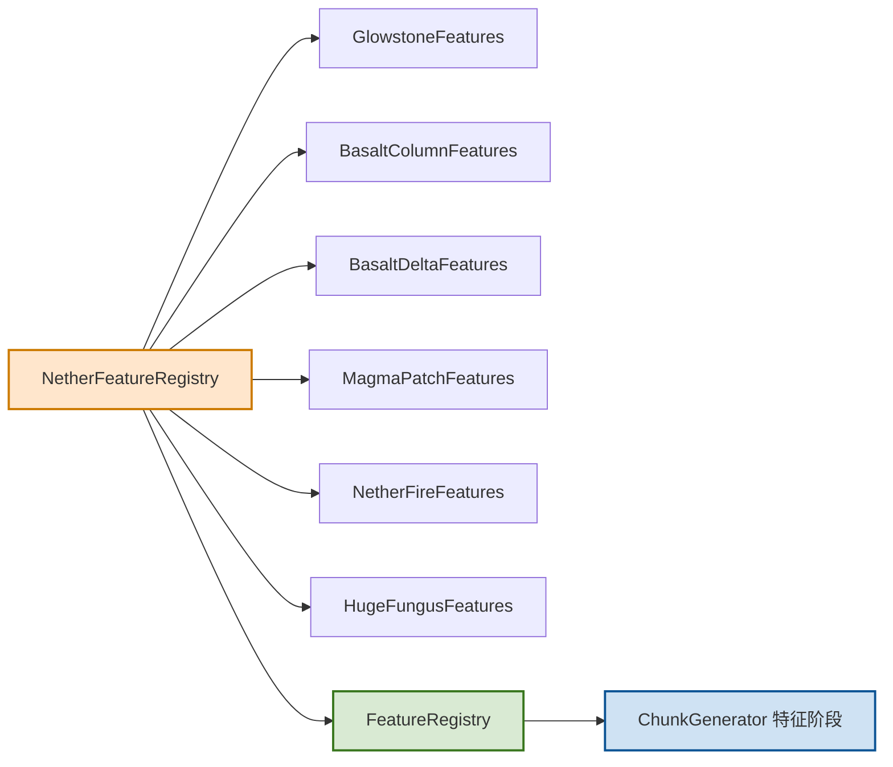

# 下界特征模块

## 1. 目录结构树

```text
nether/
├── BasaltFeature.hpp
├── BasaltFeature.cpp
├── GlowstoneFeature.hpp
├── GlowstoneFeature.cpp
├── MagmaPatchFeature.hpp
├── MagmaPatchFeature.cpp
├── NetherFeatures.hpp
├── NetherFeatures.cpp
└── README.md
```

## 2. 文件介绍

| 文件 | 职责 |
|---|---|
| BasaltFeature.hpp/.cpp | 玄武岩柱与玄武岩三角洲特征实现与配置化封装 |
| GlowstoneFeature.hpp/.cpp | 萤石簇特征实现与配置化封装 |
| MagmaPatchFeature.hpp/.cpp | 岩浆地表斑块与下界火焰特征实现与配置化封装 |
| NetherFeatures.hpp/.cpp | 下界特征聚合注册入口，向外提供按阶段打包后的特征集合 |

## 3. 模块关系

- 该目录下的具体特征类负责“单特征算法”。
- 配置化包装类负责与 ConfiguredFeatureBase 接口对接。
- NetherFeatureRegistry 负责聚合各子特征并按阶段返回给 FeatureRegistry。
- FeatureRegistry 再被 ChunkGenerator 的特征阶段调用。

## 4. 整体职责

- 提供下界专属装饰特征（萤石、玄武岩、岩浆斑块、下界火焰）。
- 保证这些特征可被统一特征管线按 DecorationStage 调度。
- 为下界生物群系生成设置（BiomeGenerationSettings::createNether*）提供可执行特征 ID 目标。

## 5. 输入/输出

- 输入：WorldGenRegion、ChunkPrimer、IChunkGenerator、Random、BlockPos、对应配置对象。
- 输出：
  - 对区块/邻域方块写入（放置玄武岩、萤石、岩浆、火焰）。
  - 返回 bool 表示本次特征放置是否成功。

## 6. 依赖项

- 内部依赖：ConfiguredFeature、FeatureIds、DecorationStage、VanillaBlocks。
- 外部依赖：
  - 世界访问接口：WorldGenRegion
  - 随机数：math::Random
  - 生成器上下文：IChunkGenerator

## 7. 使用方法

```cpp
#include "common/world/gen/feature/nether/NetherFeatures.hpp"

// 初始化并收集下界特征
mc::NetherFeatureRegistry::initialize();
auto underground = mc::NetherFeatureRegistry::getAllUndergroundFeaturesAndClear();
auto vegetation = mc::NetherFeatureRegistry::getAllVegetationFeaturesAndClear();

// 通常由 FeatureRegistry::initialize() 统一接管，无需业务层重复调用
```

## 8. 容易踩的坑

- `getAllFeaturesAndClear()` 是“转移所有权”语义，调用后对应容器会被清空。
- 如果聚合注册层做了“一次性初始化”且不允许重复初始化，容易在二次构建时拿到空特征列表。
- VegetalDecoration 阶段 ID 必须与 FeatureRegistry 注册顺序一致，否则会出现“生物群系配置指向错误特征槽位”的错配。

## 9. 测试用例

- tests/common/world/gen/feature/NetherFeatureTest.cpp：下界特征模块与阶段校验。
- tests/common/world/gen/test_vegetation_features.cpp：特征 ID 偏移与 FeatureRegistry 槽位映射校验。
- tests/common/world/gen/NetherSurfaceParityTest.cpp：下界地表与基岩策略回归（间接覆盖下界生成链路）。

## 10. Mermaid 图表


