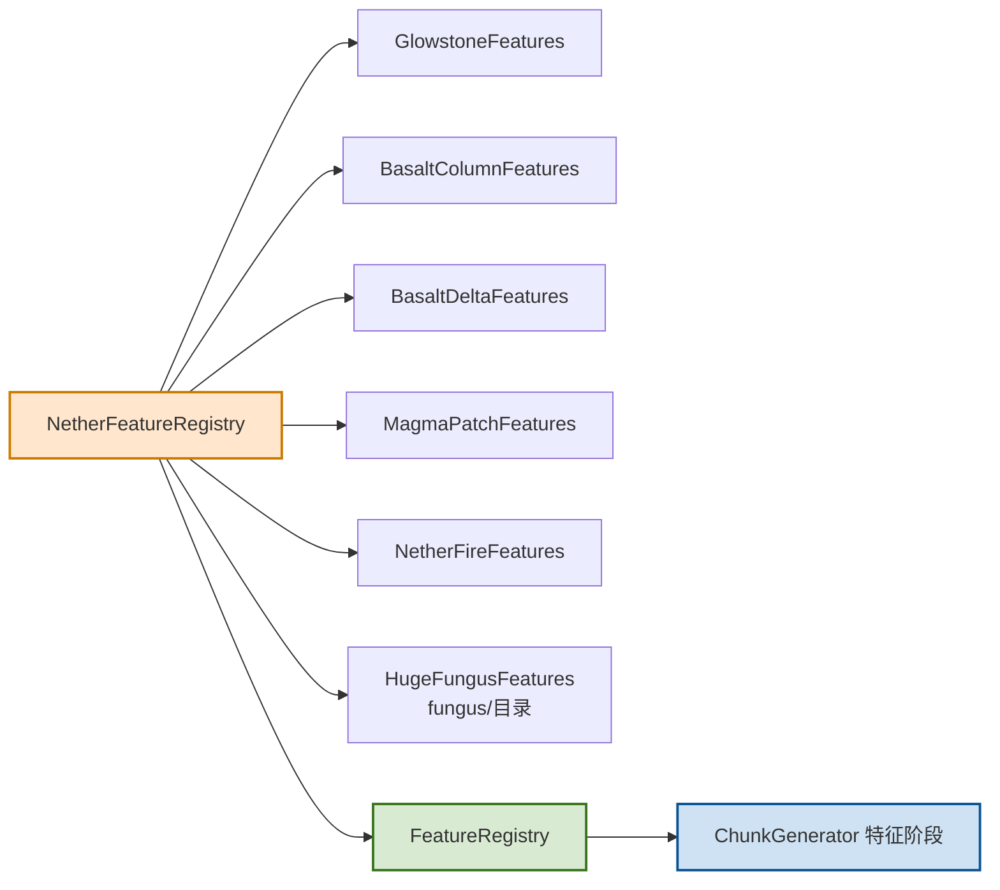

# 下界特征模块

## 1. 目录结构树

```text
nether/
├── BasaltFeature.hpp          # 玄武岩柱与玄武岩三角洲特征
├── BasaltFeature.cpp
├── GlowstoneFeature.hpp       # 萤石簇特征
├── GlowstoneFeature.cpp
├── MagmaPatchFeature.hpp      # 岩浆池特征
├── MagmaPatchFeature.cpp
├── NetherFeatures.hpp         # 下界特征聚合注册入口
├── NetherFeatures.cpp
├── NetherFireFeature.hpp      # 下界火焰特征（自动选择普通火/灵魂火）
├── NetherFireFeature.cpp
└── README.md
```

## 2. 内部模块关系

- `NetherFeatureRegistry` 聚合各子特征模块，按 `DecorationStage` 分类返回特征集合
- 各特征类（`GlowstoneFeature`、`BasaltColumnFeature` 等）负责单特征算法
- 配置化包装类（`ConfiguredXxxFeature`）与 `ConfiguredFeatureBase` 接口对接

## 3. 上下游外部依赖关系

**上游依赖（本模块依赖）：**
- `ConfiguredFeature` / `ConfiguredFeatureBase` - 配置化特征基类
- `FeatureIds` - 特征 ID 定义
- `DecorationStage` - 装饰阶段枚举
- `VanillaBlocks` - 原版方块定义
- `FireBlock` / `SoulFireBlock` - 火焰方块（自动选择普通火/灵魂火）
- `WorldGenRegion` - 世界访问接口
- `math::Random` - 随机数生成
- `IChunkGenerator` - 区块生成器接口
- `fungus/HugeFungusFeature` - 巨型真菌特征（通过 NetherFeatures.hpp 聚合）

**下游依赖（依赖本模块）：**
- `FeatureRegistry` - 统一特征注册入口
- `ChunkGenerator` - 通过特征阶段调度调用
- `BiomeGenerationSettings::createNether*` - 下界生物群系生成设置

## 4. 容易踩的坑

- `getAllFeaturesAndClear()` 是"转移所有权"语义，调用后对应容器会被清空
- 如果聚合注册层做了"一次性初始化"且不允许重复初始化，容易在二次构建时拿到空特征列表
- VegetalDecoration 阶段 ID 必须与 FeatureRegistry 注册顺序一致，否则会出现"生物群系配置指向错误特征槽位"的错配
- `HugeFungusFeatures` 位于 `fungus/` 子目录而非本目录，但通过 `NetherFeatures.hpp` 统一聚合
- `NetherFireFeature` 的 `minHeight`/`maxHeight` 配置字段控制火焰的垂直偏移范围：
  - `dy = nextInt(maxHeight + 1) - nextInt(minHeight + 1)`（三角分布，参考 MC Java NetherForestVegetationFeature）
  - 默认配置 `createNormal()` 使用 `minHeight=1, maxHeight=3`，火焰可在原点 Y 向上 0~3 格、向下 0~1 格
  - 放置时自动检查 `isWithinWorldBounds` 边界


