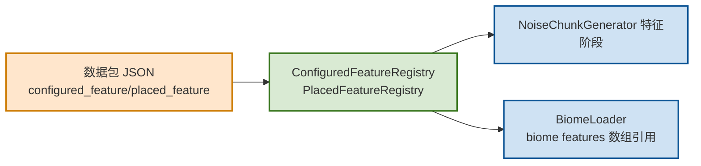

# 下界特征模块

## 1. 目录结构树

```text
nether/
├── BasaltFeature.hpp/cpp        # 玄武岩柱特征聚合头文件
├── BasaltColumnFeature.hpp/cpp  # 玄武岩柱特征（reach/height IntProvider）
├── DeltaFeature.hpp/cpp         # 三角洲特征（contents/rim + size/rim_size）
├── UnderwaterMagmaFeature.hpp/cpp # 水下岩浆特征（Column.scan 找水柱底）
├── GlowstoneFeature.hpp/cpp     # 萤石簇特征
├── HugeFungusFeature.hpp/cpp    # 巨型菌类特征
└── README.md
```

## 2. 内部模块关系

- 各特征类（`GlowstoneFeature`、`BasaltColumnFeature`、`HugeFungusFeature` 等）负责单特征算法
- 配置化包装类（`ConfiguredXxxFeature`）实现 `ConfiguredFeatureBase` 接口
- 特征不再通过硬编码注册，而是由数据包 `configured_feature` JSON 定义、通过 `FeatureTypeRegistry` 工厂构造后注册到 `ConfiguredFeatureRegistry`，再经 `placed_feature` JSON 包装为 `PlacedFeature` 供 `BiomeLoader` 引用

## 3. 上下游外部依赖关系

**上游依赖（本模块依赖）：**
- `ConfiguredFeature` / `ConfiguredFeatureBase` - 配置化特征基类
- `DecorationStage` - 装饰阶段枚举
- `VanillaBlocks` - 原版方块定义
- `FireBlock` / `SoulFireBlock` - 火焰方块（自动选择普通火/灵魂火）
- `WorldGenRegion` - 世界访问接口
- `math::Random` - 随机数生成
- `IChunkGenerator` - 区块生成器接口

**下游依赖（依赖本模块）：**
- `ConfiguredFeatureRegistry` / `PlacedFeatureRegistry` - 数据驱动注册表
- `NoiseChunkGenerator` - 通过 `PlacedFeature::place` 在特征阶段调度调用
- `BiomeLoader` - 从 biome JSON 的 `features` 数组按 `ResourceLocation` 引用下界特征

## 4. 容易踩的坑

- 特征 id 统一为 `ResourceLocation`（如 `minecraft:glowstone`、`minecraft:basalt_columns`、`minecraft:huge_fungus`），不再有整型 `FeatureIds`。下界生物群系的 `features` 数组直接以 `ResourceLocation` 引用，不会出现"指向错误特征槽位"的错配。


