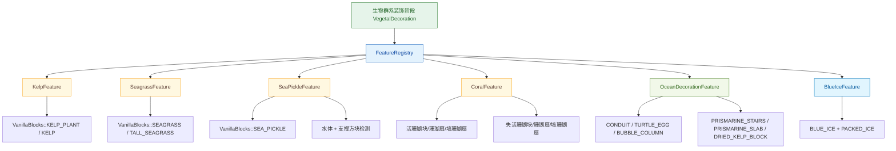

# 海洋特征模块 (Ocean Features)

该目录实现海洋生态相关的世界生成特征，负责在海底与不同温区海洋中补充海带、海草、海泡菜、活/失活珊瑚、蓝冰，以及海洋遗迹风格装饰物。

## 目录结构树

```text
ocean/
├── README.md                       # 本文档
├── KelpFeature.hpp/cpp             # 海带特征（kelp + kelp_plant）
├── SeagrassFeature.hpp/cpp         # 海草特征（普通海草 + 高海草）
├── SeaPickleFeature.hpp/cpp        # 海泡菜特征（基于水体与地面支撑）
├── CoralFeature.hpp/cpp            # 珊瑚特征（活体 + 失活，树形/蘑菇形/爪形）
├── OceanDecorationFeature.hpp/cpp  # 海洋装饰特征（潮涌核心/海龟蛋/气泡柱/海晶石部件/干海带块）
└── BlueIceFeature.hpp/cpp          # 蓝冰簇特征（冷水/冻洋）
```

## 文件介绍

- `KelpFeature.hpp/cpp`
  - 负责海带柱状生长放置。
  - 配置项包含主体状态、顶部状态与最大高度。
- `SeagrassFeature.hpp/cpp`
  - 负责普通海草与高海草混合放置。
  - 高海草通过 `HALF` 属性区分上下半。
- `SeaPickleFeature.hpp/cpp`
  - 负责海泡菜簇放置与数量控制（`PICKLES_1_4`）。
  - 使用“当前位置为水 + 下方有支撑”规则进行放置。
- `CoralFeature.hpp/cpp`
  - 负责珊瑚结构生成。
  - 包含树形、蘑菇形、爪形三类结构，并带有珊瑚扇/墙珊瑚扇装饰。
  - 统一支持活珊瑚与失活珊瑚两套方块族。
- `OceanDecorationFeature.hpp/cpp`
  - 负责海洋“可见道具装饰”闭环。
  - 会生成潮涌核心、干海带块、海龟蛋、气泡柱、海晶石楼梯/台阶等组合。
- `BlueIceFeature.hpp/cpp`
  - 负责在冷海域/冻洋中基于打包冰邻接条件扩散蓝冰。

## 模块关系

- 该目录依赖方块注册层：`VanillaBlocks`、`BlockRegistry`、`BlockStateProperties`。
- 该目录被 `ConfiguredFeature`/`FeatureRegistry` 注册并在 `VegetalDecoration` 阶段触发。
- 生物群系配置通过 `BiomeGenerationSettings` 引用对应 `FeatureIds`：
  - `KelpFeatureIds`
  - `SeagrassFeatureIds`
  - `SeaPickleFeatureIds`
  - `CoralFeatureIds`（含活体与失活）
  - `OceanDecorationFeatureIds`
  - `BlueIceFeatureIds`

## 整体职责

- 将海洋生态相关地物从“基础植被”扩展为“完整可见装饰闭环”。
- 从区块原点输入 (`y=0`) 通过 `OceanFloor` 高度图回推真实海底放置高度。
- 保证特征只在合理环境中放置：
  - 海带/海草：水体 + 海底支撑。
  - 海泡菜：水体 + 海底支撑。
  - 珊瑚：水体中生成结构并附带装饰（活体/失活）。
  - 海洋装饰：在海底水体中组合放置海晶石部件、潮涌核心、海龟蛋、气泡柱等。
  - 蓝冰：在海平面以下、邻接打包冰条件下扩散蓝冰。

## 输入 / 输出

- 输入：
  - `WorldGenRegion`（读写方块）
  - `math::Random`（随机形态）
  - `BlockPos`（起始位置）
  - 各 FeatureConfig（状态指针、概率、高度等）
- 输出：
  - 在世界生成区域内写入海洋方块状态
  - 返回布尔值指示是否成功放置至少一个方块

## 依赖项

- 内部依赖：
  - `world/gen/chunk/IChunkGenerator.hpp`
  - `world/chunk/ChunkPrimer.hpp`
  - `world/block/VanillaBlocks.hpp`
  - `util/Direction.hpp`
- 关键状态属性：
  - `PICKLES_1_4`
  - `HALF`
  - `FACING`
  - `EGGS_1_4`

## 使用方法

```cpp
VanillaBlocks::initialize();
FeatureRegistry::instance().initialize();

// 以海洋装饰特征为例
auto oceanProps = OceanDecorationFeatures::createOceanProps();
OceanDecorationFeature feature;
math::Random rng(12345);

feature.place(region, rng, BlockPos(8, 0, 8), oceanProps->getConfig());
```

## 容易踩的坑

- 传入的起始坐标通常是区块原点，不能直接用其 `y` 做向下扫描起点。
- 海泡菜要求当前位置在水中，且下方有可支撑方块。
- 高海草需要同时设置上下半状态，缺失任一状态会退化为普通海草或直接失败。
- 珊瑚墙扇使用 `FACING` 指向支撑面方向，方向传反会导致后续掉落。
- 海洋装饰特征依赖多种方块状态，若 `VanillaBlocks` 未初始化会导致特征全空配置。

## 测试用例

- `tests/common/world/gen/OceanFeatureTest.cpp`
  - `KelpFeaturePlacesKelpInWater`
  - `SeagrassMixedFeaturePlacesSeaPlant`
  - `CoralFeaturePlacesConfiguredCoralBlock`
  - `CoralFeaturePlacesDeadCoralBlock`
  - `SeaPickleFeaturePlacesOnSolidOceanFloor`
  - `SeaPickleFeaturePlacesOnLivingCoral`
  - `OceanDecorationFeaturePlacesOceanProps`
  - `BlueIceFeaturePlacesBlueIceInWater`

## Mermaid 图表


