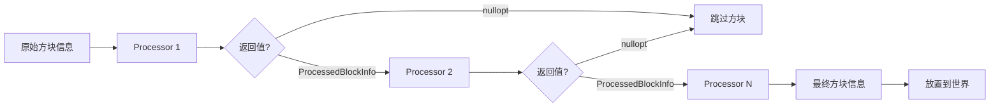

# Template 模板系统

结构模板系统，用于加载、存储和放置NBT格式的结构模板文件。

## 目录结构

```
template/
├── Template.hpp           # 模板类定义（BlockInfo、PlacementSettings、StructureProcessor等）
├── Template.cpp           # 模板类实现
├── TemplateLoader.hpp     # NBT模板加载器
├── TemplateLoader.cpp     # 模板加载实现
├── TemplateManager.hpp    # 模板管理器（缓存）
├── TemplateManager.cpp    # 模板管理实现
├── RuleTest.hpp           # 规则测试类（用于RuleStructureProcessor）
└── RuleTest.cpp           # 规则测试实现
```

## 核心类详解

### BlockInfo - 方块信息

存储模板中单个方块的信息：

```cpp
struct BlockInfo {
    BlockPos pos;              // 相对位置
    u32 blockStateId;          // 方块状态ID
    std::unique_ptr<nbt::CompoundTag> nbt;  // 方块实体NBT数据
};
```

### TemplateEntityInfo - 实体信息

存储模板中的实体信息（MC 1.16.5 格式）：

```cpp
struct TemplateEntityInfo {
    std::string typeId;             // 实体类型ID
    f64 posx, posy, posz;      // 精确位置（Double列表）
    BlockPos blockPos;         // 方块坐标（Int列表）
    std::unique_ptr<nbt::CompoundTag> nbt;  // 实体NBT数据
};
```

### ProcessedBlockInfo - 处理后的方块信息

处理器链处理后的结果：

```cpp
struct ProcessedBlockInfo {
    BlockPos pos;
    u32 blockStateId;
    std::unique_ptr<nbt::CompoundTag> nbt;
};
```

### PlacementSettings - 放置设置

控制模板如何放置到世界中：

```cpp
class PlacementSettings {
    Rotation m_rotation;           // 旋转角度
    Mirror m_mirror;               // 镜像模式
    bool m_ignoreEntities;         // 是否忽略实体
    bool m_keepLiquids;            // 是否保留液体
    const StructureBoundingBox* m_boundingBox;  // 边界框限制
    BlockPos m_centerOffset;       // 中心偏移
    u32 m_blockUpdateFlags;        // 方块更新标志
    const StructureProcessorList* m_processors; // 处理器链
    const IWorld* m_world;         // 可选的世界读取器
    math::Random* m_random;        // 可选的预设随机数生成器
};
```

**随机数生成**：

`getRandom(BlockPos)` 方法用于获取确定性随机数生成器：

```cpp
// 如果设置了预设随机数，返回副本
// 否则基于位置种子创建新的 Random
math::Random rng = settings.getRandom(pos);
```

此方法用于处理器链中需要确定性随机的场景（如 IntegrityProcessor、RuleStructureProcessor）。

### StructureProcessor - 结构处理器

处理模板中的方块，可实现自定义变换：

```cpp
class StructureProcessor {
public:
    virtual std::optional<ProcessedBlockInfo> process(
        const BlockPos& seedPos,
        const BlockPos& pos,
        const BlockInfo& rawBlockInfo,
        const BlockInfo& blockInfo,
        const PlacementSettings& settings) = 0;
};
```

#### 内置处理器

| 处理器 | 功能 |
|--------|------|
| `GravityStructureProcessor` | 根据高度图调整Y坐标 |
| `BlockIgnoreStructureProcessor` | 忽略指定方块 |
| `JigsawReplacementStructureProcessor` | 替换Jigsaw方块为final_state指定的方块 |
| `IntegrityProcessor` | 根据完整度随机移除方块 |
| `RuleStructureProcessor` | 根据规则替换方块 |
| `NopStructureProcessor` | 空操作处理器，直接返回原始方块 |
| `LavaSubmergingProcessor` | 岩浆淹没处理器，用于下界堡垒生成 |
| `BlockAgeProcessor` | 方块老化处理器，添加苔藓效果 |
| `BlackstoneReplacementProcessor` | 黑石替换处理器，用于堡垒遗迹 |

### Template - 结构模板

存储完整的结构模板数据，支持 MC 1.16.5 的多调色板（Palette）机制：

```cpp
class Template {
    BlockPos m_size;                              // 模板尺寸
    std::vector<Palette> m_palettes;              // 调色板列表（支持结构变体）
    std::vector<TemplateJigsawBlockInfo> m_jigsawBlocks;  // Jigsaw方块列表
    std::vector<TemplateEntityInfo> m_entities;   // 实体列表

    // 多调色板支持
    void addPalette(Palette palette);
    const Palette* selectPalette(math::Random& rng) const;
    size_t getPaletteCount() const;
    
    bool place(IWorldWriter& world, const BlockPos& pos,
               const PlacementSettings& settings,
               math::Random& rng, u32 flags) const;
};
```

### Palette - 调色板

MC 1.16.5 引入的多调色板机制，允许一个模板包含多个变体：

```cpp
class Palette {
public:
    explicit Palette(std::vector<BlockInfo> blocks);
    
    // 获取所有方块
    const std::vector<BlockInfo>& blocks() const;
    
    // 按方块类型查找（带缓存）
    const std::vector<const BlockInfo*>& getBlocksByType(const Block& block) const;
    
    size_t size() const;
    bool empty() const;
};
```

**调色板用途**：
- 同一结构的不同变体（如村庄房屋的不同材质版本）
- 结构生成时随机选择一个变体
- 减少重复的结构文件

## 位置随机种子

结构生成中的确定性随机使用 `MathUtils.hpp` 中的位置哈希函数：

### hashBlockPos / getPositionRandom

```cpp
#include "util/math/MathUtils.hpp"

// 计算方块位置的确定性哈希值
u64 seed = math::hashBlockPos(x, y, z);

// 等价于 hashBlockPos，用于结构完整度
u64 seed = math::getPositionRandom(x, y, z);

// 仅使用 XZ 坐标的版本
u64 seed = math::getPositionRandomXZ(x, z);
```

**算法** (MC 1.16.5 `MathHelper.getCoordinateRandom`)：
```
i = (x * 3129871) XOR (z * 116129781) XOR y
i = i * i * 42317861 + i * 11
return i >> 16
```

**用途**：
- IntegrityProcessor：完整度处理
- RuleStructureProcessor：规则匹配随机
- 结构变体选择

## 坐标变换

### 旋转变换

```cpp
// rotation = 0:   (x, y, z) -> (x, y, z)
// rotation = 90:  (x, y, z) -> (-z, y, x)
// rotation = 180: (x, y, z) -> (-x, y, -z)
// rotation = 270: (x, y, z) -> (z, y, -x)
BlockPos Template::transformBlockPos(pos, mirror, rotation, center);
```

### 镜像变换

```cpp
// mirror = LeftRight:  Z轴镜像
// mirror = FrontBack:  X轴镜像
```

## 使用示例

### 加载模板

```cpp
#include "TemplateManager.hpp"

// 设置资源包
TemplateManager::setResourcePack(&resourcePack);

// 获取模板
ResourceLocation location("minecraft:village/plains/houses/small_house_01");
const Template* templ = TemplateManager::instance().getTemplate(location);

if (!templ) {
    // 模板加载失败
    return;
}
```

### 放置模板

```cpp
// 创建放置设置
PlacementSettings settings;
settings.setRotation(Rotation::Clockwise90);
settings.setMirror(Mirror::None);
settings.setBoundingBox(&chunkBounds);

// 添加处理器
StructureProcessorList processors;
processors.addProcessor(std::make_unique<BlockIgnoreStructureProcessor>(
    std::vector<u32>{airBlockId, structureVoidId}
));
settings.setProcessors(&processors);

// 放置模板
math::Random rng(seed);
templ->place(world, position, settings, rng, 18);
```

### 自定义处理器

```cpp
class MyProcessor : public StructureProcessor {
public:
    std::optional<ProcessedBlockInfo> process(
        const BlockPos& seedPos,
        const BlockPos& pos,
        const BlockInfo& rawBlockInfo,
        const BlockInfo& blockInfo,
        const PlacementSettings& settings) override
    {
        // 修改或过滤方块
        if (shouldSkip(blockInfo)) {
            return std::nullopt;  // 跳过此方块
        }

        ProcessedBlockInfo result;
        result.pos = blockInfo.pos;
        result.blockStateId = transformBlock(blockInfo.blockStateId);
        
        if (blockInfo.nbt) {
            result.nbt = std::make_unique<nbt::CompoundTag>(*blockInfo.nbt);
        }
        
        return result;
    }
};
```

### 使用 RuleStructureProcessor

```cpp
// 创建规则：将石头替换为圆石
auto inputTest = std::make_unique<BlockMatchRuleTest>(stoneBlockId);
auto locationTest = std::make_unique<AlwaysTrueRuleTest>();
auto posTest = std::make_unique<AlwaysTruePosRuleTest>();

auto rule = std::make_unique<RuleEntry>(
    std::move(inputTest),
    std::move(locationTest),
    std::move(posTest),
    cobblestoneStateId
);

std::vector<std::unique_ptr<RuleEntry>> rules;
rules.push_back(std::move(rule));

RuleStructureProcessor processor(std::move(rules));
```

## 文件格式

模板文件存储为NBT格式，位于资源包的`structures/`目录下：

```
assets/minecraft/structures/
├── village/
│   ├── plains/
│   │   ├── houses/
│   │   │   ├── small_house_01.nbt
│   │   │   └── ...
│   │   └── streets/
│   └── ...
├── bastion/
├── stronghold/
└── ...
```

### NBT结构

```nbt
{
    "size": [10, 8, 12],
    "blocks": [
        {
            "pos": [0, 0, 0],
            "state": 0,
            "nbt": {...}  // 可选，方块实体数据
        },
        ...
    ],
    "entities": [
        {
            "id": "minecraft:zombie",
            "pos": [1.5, 2.0, 3.5],    // Double列表，精确位置
            "blockPos": [1, 2, 3],      // Int列表，方块坐标
            "nbt": {...}
        },
        ...
    ],
    "palette": [...],       // 单调色板格式
    // 或
    "palettes": [[...], [...]]  // 多调色板格式（MC 1.16.5）
}
```

### 多调色板支持

MC 1.16.5 支持两种调色板格式：
- **单调色板**: `palette` 字段包含方块状态列表
- **多调色板**: `palettes` 字段包含多个调色板列表的列表

加载时默认使用第一个调色板，完整实现应根据结构配置选择不同调色板。

## 处理器链执行顺序



## JigsawReplacementStructureProcessor

当放置Jigsaw结构时，该处理器会：

1. 检测方块是否为 `minecraft:jigsaw`
2. 读取NBT中的 `final_state` 字段
3. 解析方块状态字符串（如 `minecraft:stone[axis=y]`）
4. 如果 `final_state` 是 `minecraft:structure_void`，跳过此方块
5. 否则替换为解析后的方块状态

```cpp
// Jigsaw方块的NBT结构
{
    "id": "minecraft:jigsaw",
    "name": "minecraft:bottom",
    "target_pool": "minecraft:village/street",
    "target_name": "minecraft:empty",
    "final_state": "minecraft:cobblestone",  // 替换为的方块
    "joint": "rollable"
}
```

## RuleStructureProcessor

基于规则的方块替换处理器，支持复杂的条件匹配：

### 规则测试类型

| 测试类型 | 说明 |
|---------|------|
| `AlwaysTrueRuleTest` | 总是返回true |
| `BlockMatchRuleTest` | 匹配特定方块ID |
| `BlockStateMatchRuleTest` | 匹配特定方块状态ID |
| `RandomBlockMatchRuleTest` | 随机匹配方块ID |
| `RandomBlockStateMatchRuleTest` | 随机匹配状态ID |

### 位置测试类型

| 测试类型 | 说明 |
|---------|------|
| `AlwaysTruePosRuleTest` | 总是返回true |
| `LinearPosRuleTest` | 根据Y坐标线性插值概率 |

## 新增处理器详解

### NopStructureProcessor

空操作处理器，直接返回原始方块信息不做任何修改。

```cpp
// 用于测试或作为占位符
auto nopProcessor = std::make_unique<NopStructureProcessor>();
```

### LavaSubmergingProcessor

用于下界堡垒遗迹在岩浆海中生成。当结构放置在岩浆中时：
- 如果方块是不透明的（完整方块），正常放置方块替换岩浆
- 如果方块是透明的（如栅栏、楼梯），保留岩浆不放置方块

```cpp
// 用于堡垒遗迹
auto lavaProcessor = std::make_unique<LavaSubmergingProcessor>();
```

**MC 1.16.5 参考**: `LavaSubmergingProcessor.java`

### BlockAgeProcessor

方块老化处理器，用于村庄等结构的老化效果。根据苔藓概率随机将石砖相关方块替换为苔藓化版本。

```cpp
// 30% 苔藓化概率
auto ageProcessor = std::make_unique<BlockAgeProcessor>(0.3f);
```

**替换规则**:
- 黑曜石 → 哭泣黑曜石（固定15%概率，不受mossiness影响）
- 石砖/石头/錾刻石砖 → 苔藓石砖（mossiness概率）或裂纹石砖
- 圆石 → 苔藓圆石（mossiness概率）
- 石砖墙 → 苔藓石砖墙（mossiness概率，需要MOSSY_STONE_BRICK_WALL注册）

**MC 1.16.5 参考**: `BlockAgeProcessor.java` / `BlockMosinessProcessor.java`

### IntegrityProcessor

结构完整度处理器，根据完整度概率性移除方块。核心算法使用基于位置的确定性随机：

```cpp
// 30% 完整度 - 70% 的方块会被移除
auto integrityProcessor = std::make_unique<IntegrityProcessor>(0.3f);
```

**算法详解**:

MC 1.16.5 的完整度计算使用位置种子随机：

1. 计算位置种子：`seed = hashBlockPos(x, y, z)`
2. 创建随机数生成器：`Random rng(seed)`
3. 概率判断：`if (rng.nextFloat() <= integrity) 保留方块`

位置哈希算法 (`MathHelper.getCoordinateRandom`)：
```cpp
i64 i = (x * 3129871) ^ (z * 116129781) ^ y;
i = i * i * 42317861 + i * 11;
return i >> 16;
```

**重要**: 必须使用 `Random::nextFloat()` 而非哈希值取模，以保证正确的概率分布。

**MC 1.16.5 参考**: `IntegrityProcessor.java`, `MathHelper.getPositionRandom`

### BlackstoneReplacementProcessor

黑石替换处理器，用于堡垒遗迹结构生成。将普通石质方块替换为黑石变体，并保持方块状态属性（如楼梯方向、台阶类型等）。

```cpp
auto blackstoneProcessor = std::make_unique<BlackstoneReplacementProcessor>();
```

**替换映射**:
| 原方块 | 替换为 |
|--------|--------|
| 圆石 | 黑石 |
| 苔藓圆石 | 黑石 |
| 石头 | 磨制黑石 |
| 石砖 | 磨制黑石砖 |
| 苔藓石砖 | 磨制黑石砖 |
| 裂纹石砖 | 裂纹磨制黑石砖 |
| 錾刻石砖 | 錾刻磨制黑石 |
| 铁栏杆 | 锁链 |
| 圆石楼梯 | 黑石楼梯 |
| 苔藓圆石楼梯 | 黑石楼梯 |
| 石楼梯 | 磨制黑石楼梯 |
| 石砖楼梯 | 磨制黑石砖楼梯 |
| 苔藓石砖楼梯 | 磨制黑石砖楼梯 |
| 圆石台阶 | 黑石台阶 |
| 苔藓圆石台阶 | 黑石台阶 |
| 平滑石台阶 | 磨制黑石台阶 |
| 石台阶 | 磨制黑石台阶 |
| 石砖台阶 | 磨制黑石砖台阶 |
| 苔藓石砖台阶 | 磨制黑石砖台阶 |
| 石砖墙 | 磨制黑石砖墙 |
| 苔藓石砖墙 | 磨制黑石砖墙 |
| 圆石墙 | 黑石墙 |
| 苔藓圆石墙 | 黑石墙 |

**属性保持**: 楼梯的 `facing` 和 `half` 属性、台阶的 `type` 属性会被保持。

**MC 1.16.5 参考**: `BlackStoneReplacementProcessor.java`

## 方块排序

MC 1.16.5 中模板放置时，方块按特定顺序排列：

1. **普通方块**（有opaque碰撞箱的方块）- 首先放置
2. **透明方块**（非opaque或变量透明度的方块）- 其次放置
3. **方块实体**（有NBT数据的方块）- 最后放置

每类方块内部按 `(Y, X, Z)` 坐标排序。

```cpp
// MC 1.16.5: Template.func_237151_a_
// 方块排序在 Template::place() 中自动执行
```

## 实现限制

以下功能需要其他子系统支持，当前为已知限制：

### 1. ✅ 已完成：BlockAgeProcessor 楼梯/台阶苔藓化

当前 `BlockAgeProcessor` 已支持：
- `VanillaBlocks::MOSSY_STONE_BRICK_STAIRS`（苔藓石砖楼梯）
- `VanillaBlocks::MOSSY_STONE_BRICK_SLAB`（苔藓石砖台阶）
- `VanillaBlocks::MOSSY_STONE_BRICK_WALL`（苔藓石砖墙）
- `VanillaBlocks::STONE_BRICK_STAIRS`（石砖楼梯）
- `VanillaBlocks::STONE_BRICK_SLAB`（石砖台阶）

注意：当前简化实现使用默认状态，不保留原方块的 facing/half 属性。

### 2. 实体 NBT 加载

`Template::placeInWorld` 中实体创建仅设置位置和朝向，不加载模板中的实体 NBT 数据（如 CustomName、Equipment 等）。
完整实现需要：
- `Entity::loadFromNBT(nbt::CompoundTag&)` 方法
- 实体数据参数的 NBT 反序列化

### 3. TileEntity NBT 加载

方块实体 NBT 更新仅设置位置坐标（x、y、z），不加载模板中的 NBT 数据。
完整实现需要：
- `BlockEntity::loadFromNBT(nbt::CompoundTag&)` 方法（当前使用 JSON 格式）
- 战利品表种子设置（`LockableLootTileEntity`）

### 4. Jigsaw 方块 orientation 属性

当前 `JigsawPiece` 从模板加载时，Jigsaw 方块的 orientation（方向）属性无法从方块状态读取。
原因：`JigsawBlock` 尚未注册 `ORIENTATION` 属性到 `BlockStateProperties`。
当前行为：所有 Jigsaw 方块使用默认方向 `NorthUp`。
完整实现需要：
- 在 `BlockStateProperties` 中添加 `ORIENTATION` 枚举属性
- 更新 `JigsawBlock` 构造函数注册该属性
- 更新 `JigsawPiece::loadJointsFromTemplate` 读取属性值

### 5. JigsawJunction 地形适配

`JigsawJunction` 类用于记录拼图块连接时的地形高度信息，支持 NoiseChunkGenerator 中的地形平滑。

**已完成** ✅:

1. **数据结构** (`JigsawJunction.hpp`)
   - `sourceX`, `sourceGroundY`, `sourceZ` - 源连接点坐标
   - `deltaY` - 高度偏移量
   - `destProjection` - 目标放置行为

2. **Jigsaw 集成** (`JigsawManager.cpp`)
   - `PlacedPiece.junctions` 存储字段
   - 在 `tryPlacePiece()` 中创建 JigsawJunction

3. **NoiseChunkGenerator 集成** (`NoiseChunkGenerator.cpp`)
   - `collectStructureData()` - 收集区块 12 格范围内的 JigsawJunction
   - `initGaussianLUT()` - 初始化 24x24x24 高斯查找表
   - `calculateStructureDensityOffset()` - 计算地形密度偏移
   - 在 `generateNoise()` 中应用结构片段和 Junction 的地形平滑

**MC 1.16.5 参考**: 
- `JigsawJunction.java` - 数据结构定义
- `JigsawManager.Assembler` - Junction 创建逻辑
- `NoiseChunkGenerator.func_230352_b_` - Junction 使用（地形平滑）

## 容易踩的坑

### 1. 方块状态ID

**问题**: 使用了未注册的方块状态ID。

**解决方案**: 确保`BlockRegistry`已初始化，并使用正确的状态ID。

### 2. 处理器返回值

**问题**: 处理器忘记复制NBT数据。

**解决方案**: 始终检查并复制nbt：
```cpp
if (blockInfo.nbt) {
    result.nbt = std::make_unique<nbt::CompoundTag>(*blockInfo.nbt);
}
```

### 3. 边界框检查

**问题**: 模板方块超出区块边界。

**解决方案**: 设置边界框：
```cpp
auto chunkBounds = StructureBoundingBox::fromChunk(chunkX, chunkZ);
settings.setBoundingBox(&chunkBounds);
```

### 4. 方块更新标志

**问题**: 放置方块后产生过多更新。

**解决方案**: 使用适当的标志：
```cpp
// 默认值18: 通知邻居和观察者
// 标志2: 通知邻居
// 标志16: 通知观察者
settings.setBlockUpdateFlags(18);
```

### 5. 实体位置精度

**问题**: 实体位置只读取整数坐标。

**解决方案**: 实体有两个位置字段：
- `pos`: Double列表，精确位置（用于实体放置）
- `blockPos`: Int列表，方块坐标（用于方块对齐）

### 6. 调色板格式

**问题**: 只支持单调色板格式。

**解决方案**: 加载器同时支持 `palette` 和 `palettes` 字段，优先使用 `palettes[0]`。

## 参考资料

- Minecraft 1.16.5 源码: `net.minecraft.world.gen.feature.template`
- Template类: `net.minecraft.world.gen.feature.template.Template`
- PlacementSettings: `net.minecraft.world.gen.feature.template.PlacementSettings`
- StructureProcessor: `net.minecraft.world.gen.feature.template.StructureProcessor`
- JigsawReplacementStructureProcessor: `net.minecraft.world.gen.feature.template.JigsawReplacementStructureProcessor`
- RuleStructureProcessor: `net.minecraft.world.gen.feature.template.RuleStructureProcessor`
- RuleTest: `net.minecraft.world.gen.feature.template.RuleTest`
- LavaSubmergingProcessor: `net.minecraft.world.gen.feature.template.LavaSubmergingProcessor`
- BlackStoneReplacementProcessor: `net.minecraft.world.gen.feature.template.BlackStoneReplacementProcessor`
- BlockAgeProcessor (BlockMosinessProcessor): `net.minecraft.world.gen.feature.template.BlockAgeProcessor`

*最后更新: 2026-05-03*
