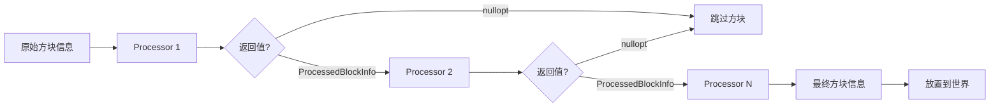

# Template 模板系统

结构模板系统，用于加载、存储和放置NBT格式的结构模板文件。

## 目录结构

```
template/
├── Template.hpp           # 模板类定义（BlockInfo、PlacementSettings、StructureProcessor等）
├── Template.cpp           # 模板类实现
├── TemplateLoader.hpp     # NBT模板加载器
├── TemplateLoader.cpp     # 模板加载实现
├── TemplateManager.hpp    # 模板管理器（缓存）
└── TemplateManager.cpp    # 模板管理实现
```

## 核心类详解

### BlockInfo - 方块信息

存储模板中单个方块的信息：

```cpp
struct BlockInfo {
    BlockPos pos;              // 相对位置
    u32 blockStateId;          // 方块状态ID
    std::unique_ptr<nbt::CompoundTag> nbt;  // 方块实体NBT数据
};
```

### ProcessedBlockInfo - 处理后的方块信息

处理器链处理后的结果：

```cpp
struct ProcessedBlockInfo {
    BlockPos pos;
    u32 blockStateId;
    std::unique_ptr<nbt::CompoundTag> nbt;
};
```

### PlacementSettings - 放置设置

控制模板如何放置到世界中：

```cpp
class PlacementSettings {
    Rotation m_rotation;           // 旋转角度
    Mirror m_mirror;               // 镜像模式
    bool m_ignoreEntities;         // 是否忽略实体
    bool m_keepLiquids;            // 是否保留液体
    const StructureBoundingBox* m_boundingBox;  // 边界框限制
    BlockPos m_centerOffset;       // 中心偏移
    u32 m_blockUpdateFlags;        // 方块更新标志
    const StructureProcessorList* m_processors; // 处理器链
};
```

### StructureProcessor - 结构处理器

处理模板中的方块，可实现自定义变换：

```cpp
class StructureProcessor {
public:
    virtual std::optional<ProcessedBlockInfo> process(
        const BlockPos& seedPos,
        const BlockPos& pos,
        const BlockInfo& rawBlockInfo,
        const BlockInfo& blockInfo,
        const PlacementSettings& settings) = 0;
};
```

#### 内置处理器

| 处理器 | 功能 |
|--------|------|
| `GravityStructureProcessor` | 根据高度图调整Y坐标 |
| `BlockIgnoreStructureProcessor` | 忽略指定方块 |
| `JigsawReplacementStructureProcessor` | 替换Jigsaw方块为结构空位 |
| `IntegrityProcessor` | 根据完整度随机移除方块 |

### Template - 结构模板

存储完整的结构模板数据：

```cpp
class Template {
    BlockPos m_size;                              // 模板尺寸
    std::vector<BlockInfo> m_blocks;              // 方块列表
    std::vector<TemplateJigsawBlockInfo> m_jigsawBlocks;  // Jigsaw方块列表
    std::vector<TemplateEntityInfo> m_entities;   // 实体列表

    bool place(IWorldWriter& world, const BlockPos& pos,
               const PlacementSettings& settings,
               math::Random& rng, u32 flags) const;
};
```

## 坐标变换

### 旋转变换

```cpp
// rotation = 0:   (x, y, z) -> (x, y, z)
// rotation = 90:  (x, y, z) -> (-z, y, x)
// rotation = 180: (x, y, z) -> (-x, y, -z)
// rotation = 270: (x, y, z) -> (z, y, -x)
BlockPos Template::transformBlockPos(pos, mirror, rotation, center);
```

### 镜像变换

```cpp
// mirror = LeftRight:  Z轴镜像
// mirror = FrontBack:  X轴镜像
```

## 使用示例

### 加载模板

```cpp
#include "TemplateManager.hpp"

// 设置资源包
TemplateManager::setResourcePack(&resourcePack);

// 获取模板
ResourceLocation location("minecraft:village/plains/houses/small_house_01");
const Template* templ = TemplateManager::instance().getTemplate(location);

if (!templ) {
    // 模板加载失败
    return;
}
```

### 放置模板

```cpp
// 创建放置设置
PlacementSettings settings;
settings.setRotation(Rotation::Clockwise90);
settings.setMirror(Mirror::None);
settings.setBoundingBox(&chunkBounds);

// 添加处理器
StructureProcessorList processors;
processors.addProcessor(std::make_unique<BlockIgnoreStructureProcessor>(
    std::vector<u32>{airBlockId, structureVoidId}
));
settings.setProcessors(&processors);

// 放置模板
math::Random rng(seed);
templ->place(world, position, settings, rng, 18);
```

### 自定义处理器

```cpp
class MyProcessor : public StructureProcessor {
public:
    std::optional<ProcessedBlockInfo> process(
        const BlockPos& seedPos,
        const BlockPos& pos,
        const BlockInfo& rawBlockInfo,
        const BlockInfo& blockInfo,
        const PlacementSettings& settings) override
    {
        // 修改或过滤方块
        if (shouldSkip(blockInfo)) {
            return std::nullopt;  // 跳过此方块
        }

        ProcessedBlockInfo result;
        result.pos = blockInfo.pos;
        result.blockStateId = transformBlock(blockInfo.blockStateId);
        
        if (blockInfo.nbt) {
            result.nbt = std::make_unique<nbt::CompoundTag>(*blockInfo.nbt);
        }
        
        return result;
    }
};
```

## 文件格式

模板文件存储为NBT格式，位于资源包的`structures/`目录下：

```
assets/minecraft/structures/
├── village/
│   ├── plains/
│   │   ├── houses/
│   │   │   ├── small_house_01.nbt
│   │   │   └── ...
│   │   └── streets/
│   └── ...
├── bastion/
├── stronghold/
└── ...
```

### NBT结构

```nbt
{
    "size": [10, 8, 12],
    "blocks": [
        {
            "pos": [0, 0, 0],
            "state": 0,
            "nbt": {...}  // 可选，方块实体数据
        },
        ...
    ],
    "entities": [...],
    "palettes": [
        {
            "Name": "minecraft:stone",
            "Properties": {...}
        },
        ...
    ]
}
```

## 处理器链执行顺序



## 容易踩的坑

### 1. 方块状态ID

**问题**: 使用了未注册的方块状态ID。

**解决方案**: 确保`BlockRegistry`已初始化，并使用正确的状态ID。

### 2. 处理器返回值

**问题**: 处理器忘记复制NBT数据。

**解决方案**: 始终检查并复制nbt：
```cpp
if (blockInfo.nbt) {
    result.nbt = std::make_unique<nbt::CompoundTag>(*blockInfo.nbt);
}
```

### 3. 边界框检查

**问题**: 模板方块超出区块边界。

**解决方案**: 设置边界框：
```cpp
auto chunkBounds = StructureBoundingBox::fromChunk(chunkX, chunkZ);
settings.setBoundingBox(&chunkBounds);
```

### 4. 方块更新标志

**问题**: 放置方块后产生过多更新。

**解决方案**: 使用适当的标志：
```cpp
// 默认值18: 通知邻居和观察者
// 标志2: 通知邻居
// 标志16: 通知观察者
settings.setBlockUpdateFlags(18);
```

## 参考资料

- Minecraft 1.16.5 源码: `net.minecraft.world.gen.feature.template`
- Template类: `net.minecraft.world.gen.feature.template.Template`
- PlacementSettings: `net.minecraft.world.gen.feature.template.PlacementSettings`
- StructureProcessor: `net.minecraft.world.gen.feature.template.StructureProcessor`

*最后更新: 2026-05-03*
