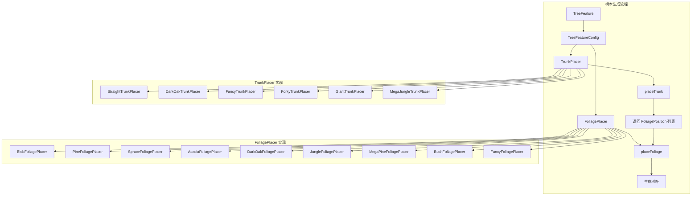
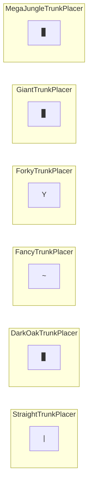
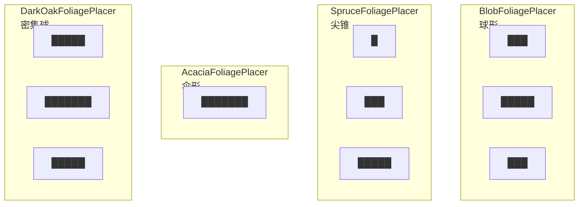
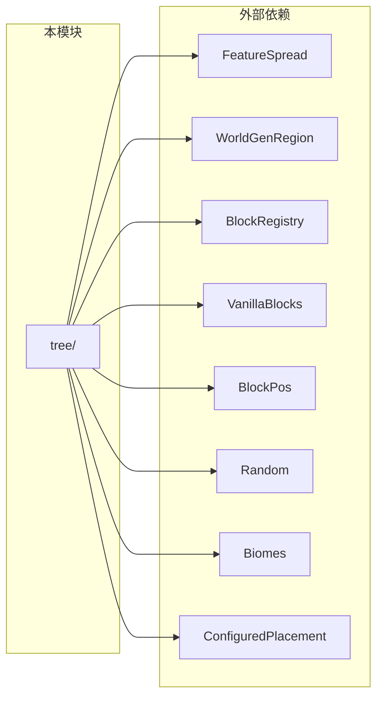

# 树木生成系统 (Tree Generation System)

本目录实现了 Minecraft 1.16.5 风格的树木生成系统，采用 **TrunkPlacer + FoliagePlacer** 架构，支持灵活组合不同类型的树干和树冠。

## 📁 目录结构

```
tree/
├── TreeFeature.hpp          # 树木特征主类和配置
├── TreeFeature.cpp          # 树木特征实现
├── trunk/                   # 树干放置器
│   ├── TrunkPlacer.hpp      # 树干放置器基类
│   ├── TrunkPlacer.cpp      # 基类实现
│   ├── StraightTrunkPlacer.hpp  # 直树干放置器
│   ├── StraightTrunkPlacer.cpp
│   ├── TrunkPlacers.hpp     # 其他树干放置器声明
│   └── TrunkPlacers.cpp     # 其他树干放置器实现
├── foliage/                 # 树叶放置器
│   ├── FoliagePlacer.hpp    # 树叶放置器基类
│   ├── FoliagePlacer.cpp    # 基类实现
│   ├── BlobFoliagePlacer.hpp    # 球形树叶放置器
│   ├── BlobFoliagePlacer.cpp
│   ├── FoliagePlacers.hpp   # 其他树叶放置器声明
│   └── FoliagePlacers.cpp   # 其他树叶放置器实现
└── README.md                # 本文档
```

## 🏗️ 架构概览



## 📋 文件详解

### 核心文件

#### `TreeFeature.hpp` / `TreeFeature.cpp`

树木生成的主入口，包含：

| 类/结构 | 职责 |
|---------|------|
| `TreeFeatureConfig` | 树木配置：树干方块、树叶方块、放置器、高度限制等 |
| `TreeFeature` | 树木放置逻辑：空间检查、树干/树叶协调 |
| `ConfiguredTreeFeature` | 配置化的树木特征，组合配置和放置规则 |
| `TreeFeatures` | 预定义树木工厂：9种原版树木 |

**关键方法：**
```cpp
// TreeFeature::place() - 主入口
bool place(WorldGenRegion& world, Random& random, 
           const BlockPos& startPos, const TreeFeatureConfig& config);

// 静态检查方法
static bool isReplaceableAt(WorldGenRegion& world, const BlockPos& pos);
static bool isAirOrLeavesAt(WorldGenRegion& world, const BlockPos& pos);
static bool isDirtOrFarmlandAt(WorldGenRegion& world, const BlockPos& pos);
```

`isDirtOrFarmlandAt(...)` 允许草方块、泥土、灰化土、菌丝和耕地作为树木根部支撑，这样树苗和树生成检查保持一致，不会出现“能种下但长不出树”的分裂行为。

#### `TreeFeatureConfig` 配置项

| 字段 | 类型 | 说明 |
|------|------|------|
| `trunkBlock` | `const BlockState*` | 树干方块状态 |
| `foliageBlock` | `const BlockState*` | 树叶方块状态 |
| `trunkPlacer` | `std::unique_ptr<TrunkPlacer>` | 树干放置器 |
| `foliagePlacer` | `std::unique_ptr<FoliagePlacer>` | 树叶放置器 |
| `maxWaterDepth` | `i32` | 最大水深（树木不能生成在深水中） |
| `ignoreVines` | `bool` | 是否忽略藤蔓 |
| `forcePlacement` | `bool` | 强制放置（跳过空间体积检查） |
| `minHeight` | `i32` | 最小高度 |

### trunk/ 目录

#### `TrunkPlacer.hpp` / `TrunkPlacer.cpp`

树干放置器基类，定义树干生成的通用接口。

**核心概念：**
- **高度计算**：`getHeight(random)` 返回 `baseHeight + rand(0, heightRandA) + rand(0, heightRandB)`
- **放置逻辑**：`placeTrunk()` 返回 `FoliagePosition` 列表，告诉树叶放置器在哪里放树叶

```cpp
class TrunkPlacer {
public:
    TrunkPlacer(i32 baseHeight, i32 heightRandA, i32 heightRandB);
    
    // 获取树干高度
    [[nodiscard]] i32 getHeight(math::Random& random) const;
    
    // 放置树干，返回树叶位置列表
    virtual std::vector<FoliagePosition> placeTrunk(...) = 0;
    
    // 克隆（用于配置复制）
    [[nodiscard]] virtual std::unique_ptr<TrunkPlacer> clone() const = 0;
    
protected:
    // 辅助方法
    void placeBlock(...);
    static bool canPlaceAt(...);
    static void placeDirtUnder(...);
    void placeTrunkLayer2x2(...);  // 2x2 树干层（巨型树木）
};
```

**`FoliagePosition` 结构：**
```cpp
struct FoliagePosition {
    BlockPos pos;       // 树叶中心位置
    i32 radius;         // 树叶半径
    i32 height;         // 树叶高度（用于 BlobFoliagePlacer）
    bool trunkTop;      // 是否在树干顶部
};
```

#### `StraightTrunkPlacer.hpp` / `StraightTrunkPlacer.cpp`

**直树干放置器** - 最基础的树干类型。

**适用树木：** 橡树、白桦、云杉、丛林木

**特点：**
- 生成垂直的单根树干
- 在底部放置泥土
- 返回单一树叶位置在树干顶部

```cpp
class StraightTrunkPlacer : public TrunkPlacer {
    // 生成：| (垂直树干)
    // 返回：顶部一个 FoliagePosition
};
```

#### `TrunkPlacers.hpp` / `TrunkPlacers.cpp`

包含 5 种其他树干放置器：

| 类名 | 用途 | 特点 |
|------|------|------|
| `DarkOakTrunkPlacer` | 深色橡树 | 2x2 截面，顶部 4 个树叶位置 |
| `FancyTrunkPlacer` | 精美橡树 | 弯曲树干，沿途多个树叶位置 |
| `ForkyTrunkPlacer` | 金合欢 | 主干 + 随机分叉，末端树叶位置 |
| `GiantTrunkPlacer` | 巨型云杉 | 2x2 截面，顶部多个树叶位置 |
| `MegaJungleTrunkPlacer` | 巨型丛林木 | 2x2 截面，简化版（无藤蔓） |

**树干形状示意：**



### foliage/ 目录

#### `FoliagePlacer.hpp` / `FoliagePlacer.cpp`

树叶放置器基类，定义树叶生成的通用接口。

```cpp
class FoliagePlacer {
public:
    FoliagePlacer(const FeatureSpread& radius, const FeatureSpread& offset);
    
    // 放置树叶（主入口）
    void placeFoliage(
        WorldGenRegion& world, Random& random, i32 trunkHeight,
        const std::vector<FoliagePosition>& foliagePositions,
        const std::set<BlockPos>& trunkBlocks,
        i32 trunkOffset, const BlockState* foliageBlock);
    
    // 获取树叶高度
    [[nodiscard]] virtual i32 getFoliageHeight(Random& random, i32 trunkHeight) const = 0;
    
    // 克隆
    [[nodiscard]] virtual std::unique_ptr<FoliagePlacer> clone() const = 0;
    
protected:
    // 放置单层树叶
    void placeFoliageLayer(...);
    
    // 是否跳过该位置（子类实现具体形状）
    [[nodiscard]] virtual bool shouldSkip(...) const = 0;
    
    // 内部放置逻辑
    virtual void placeFoliageInternal(...) = 0;
    
    FeatureSpread m_radius;   // 树叶半径配置
    FeatureSpread m_offset;   // 树叶偏移配置
};
```

#### `BlobFoliagePlacer.hpp` / `BlobFoliagePlacer.cpp`

**球形树叶放置器** - 最基础的树冠类型。

**适用树木：** 橡树、白桦

**特点：**
- 从上到下生成多层树叶
- 每层半径随高度递减
- 角落位置随机跳过，使外观自然

```cpp
// 形状示意：
//     ███
//    █████
//     ███
```

#### `FoliagePlacers.hpp` / `FoliagePlacers.cpp`

包含 8 种其他树叶放置器：

| 类名 | 用途 | 形状特点 |
|------|------|----------|
| `PineFoliagePlacer` | 松树 | 锥形，底部大顶部小 |
| `SpruceFoliagePlacer` | 云杉 | 尖顶锥形 |
| `AcaciaFoliagePlacer` | 金合欢 | 伞形，单层大半径 |
| `DarkOakFoliagePlacer` | 深色橡树 | 密集球形 |
| `JungleFoliagePlacer` | 丛林木 | 稀疏单层 |
| `MegaPineFoliagePlacer` | 巨型云杉 | 大型锥形 |
| `BushFoliagePlacer` | 灌木 | 单层球形 |
| `FancyFoliagePlacer` | 精美橡树 | 大型密集球形 |

**树叶形状示意：**



## 🔗 组件关系图

```mermaid
classDiagram
    class TreeFeature {
        +place() bool
        +isReplaceableAt() bool
        +isAirOrLeavesAt() bool
        +isDirtOrFarmlandAt() bool
    }
    
    class TreeFeatureConfig {
        +trunkBlock: BlockState*
        +foliageBlock: BlockState*
        +trunkPlacer: TrunkPlacer*
        +foliagePlacer: FoliagePlacer*
        +minHeight: i32
    }
    
    class TrunkPlacer {
        <<abstract>>
        +getHeight() i32
        +placeTrunk() vector~FoliagePosition~
        +clone() TrunkPlacer*
        #m_baseHeight: i32
        #m_heightRandA: i32
        #m_heightRandB: i32
    }
    
    class FoliagePlacer {
        <<abstract>>
        +placeFoliage() void
        +getFoliageHeight() i32
        +clone() FoliagePlacer*
        #m_radius: FeatureSpread
        #m_offset: FeatureSpread
    }
    
    class FoliagePosition {
        +pos: BlockPos
        +radius: i32
        +height: i32
        +trunkTop: bool
    }
    
    TreeFeature --> TreeFeatureConfig : uses
    TreeFeatureConfig --> TrunkPlacer : contains
    TreeFeatureConfig --> FoliagePlacer : contains
    TrunkPlacer --> FoliagePosition : returns
    FoliagePlacer --> FoliagePosition : receives
    
    class StraightTrunkPlacer {
        +placeTrunk() vector~FoliagePosition~
    }
    class DarkOakTrunkPlacer {
        +placeTrunk() vector~FoliagePosition~
    }
    class FancyTrunkPlacer {
        +placeTrunk() vector~FoliagePosition~
    }
    class ForkyTrunkPlacer {
        +placeTrunk() vector~FoliagePosition~
    }
    class GiantTrunkPlacer {
        +placeTrunk() vector~FoliagePosition~
    }
    class MegaJungleTrunkPlacer {
        +placeTrunk() vector~FoliagePosition~
    }
    
    TrunkPlacer <|-- StraightTrunkPlacer
    TrunkPlacer <|-- DarkOakTrunkPlacer
    TrunkPlacer <|-- FancyTrunkPlacer
    TrunkPlacer <|-- ForkyTrunkPlacer
    TrunkPlacer <|-- GiantTrunkPlacer
    TrunkPlacer <|-- MegaJungleTrunkPlacer
    
    class BlobFoliagePlacer {
        +placeFoliageInternal() void
        +shouldSkip() bool
    }
    class PineFoliagePlacer {
        +placeFoliageInternal() void
        +shouldSkip() bool
    }
    class SpruceFoliagePlacer {
        +placeFoliageInternal() void
        +shouldSkip() bool
    }
    class AcaciaFoliagePlacer {
        +placeFoliageInternal() void
        +shouldSkip() bool
    }
    class DarkOakFoliagePlacer {
        +placeFoliageInternal() void
        +shouldSkip() bool
    }
    class JungleFoliagePlacer {
        +placeFoliageInternal() void
        +shouldSkip() bool
    }
    class MegaPineFoliagePlacer {
        +placeFoliageInternal() void
        +shouldSkip() bool
    }
    class BushFoliagePlacer {
        +placeFoliageInternal() void
        +shouldSkip() bool
    }
    class FancyFoliagePlacer {
        +placeFoliageInternal() void
        +shouldSkip() bool
    }
    
    FoliagePlacer <|-- BlobFoliagePlacer
    FoliagePlacer <|-- PineFoliagePlacer
    FoliagePlacer <|-- SpruceFoliagePlacer
    FoliagePlacer <|-- AcaciaFoliagePlacer
    FoliagePlacer <|-- DarkOakFoliagePlacer
    FoliagePlacer <|-- JungleFoliagePlacer
    FoliagePlacer <|-- MegaPineFoliagePlacer
    FoliagePlacer <|-- BushFoliagePlacer
    FoliagePlacer <|-- FancyFoliagePlacer
```



## 🌳 预定义树木

`TreeFeatures` 工厂类提供 9 种预定义树木：

| 方法 | 树木类型 | TrunkPlacer | FoliagePlacer | 适用生物群系 |
|------|----------|-------------|---------------|--------------|
| `createOakTree()` | 橡树 | StraightTrunkPlacer(4,2,0) | BlobFoliagePlacer(2+1,0,3) | 森林、 wooded_hills |
| `createBirchTree()` | 白桦 | StraightTrunkPlacer(5,2,0) | BlobFoliagePlacer(2+1,0,2) | 白桦森林、森林 |
| `createSpruceTree()` | 云杉 | StraightTrunkPlacer(5,2,1) | SpruceFoliagePlacer(2+1,0,2) | 针叶林、雪山 |
| `createJungleTree()` | 丛林木 | StraightTrunkPlacer(4,8,0) | JungleFoliagePlacer(2+1,0,2) | 丛林 |
| `createAcaciaTree()` | 金合欢 | ForkyTrunkPlacer(5,2,1) | AcaciaFoliagePlacer(2+1,0) | 稀树草原 |
| `createDarkOakTree()` | 深色橡树 | DarkOakTrunkPlacer(6,3,1) | DarkOakFoliagePlacer(2+1,0,4) | 黑森林 |
| `createSparseOakTree()` | 稀疏橡树 | StraightTrunkPlacer(4,2,0) | BlobFoliagePlacer(2+1,0,3) | 平原、稀树草原 |
| `createGiantSpruceTree()` | 巨型云杉 | GiantTrunkPlacer(13,5,3) | MegaPineFoliagePlacer(3+2,0,8) | 大型针叶林 |
| `createGiantJungleTree()` | 巨型丛林木 | MegaJungleTrunkPlacer(10,8,5) | JungleFoliagePlacer(3+2,0,3) | 丛林 |

## 📥 输入和输出

### 输入

| 类型 | 来源 | 说明 |
|------|------|------|
| `WorldGenRegion` | 世界生成系统 | 区块区域访问接口 |
| `Random` | 世界生成系统 | 确定性随机数生成器 |
| `BlockPos` | 生物群系生成器 | 树木起始位置 |
| `TreeFeatureConfig` | 预定义配置 | 树木配置参数 |

### 输出

| 类型 | 说明 |
|------|------|
| 方块修改 | 在 `WorldGenRegion` 中放置树干和树叶方块 |
| 返回值 | `bool` 表示是否成功放置 |

## 🔌 依赖项



| 依赖模块 | 路径 | 用途 |
|----------|------|------|
| FeatureSpread | `../FeatureSpread.hpp` | 随机数值范围配置 |
| WorldGenRegion | `../../chunk/IChunkGenerator.hpp` | 区块区域访问 |
| BlockRegistry | `../../../block/BlockRegistry.hpp` | 方块注册表 |
| VanillaBlocks | `../../../block/VanillaBlocks.hpp` | 原版方块常量 |
| BlockPos | `../../../chunk/ChunkPos.hpp` | 方块位置类型 |
| Random | `../../../../util/math/random/Random.hpp` | 随机数生成器 |
| Biomes | `../../../biome/Biome.hpp` | 生物群系 ID |
| ConfiguredPlacement | `../../placement/Placement.hpp` | 放置规则配置 |

## 📖 使用方法

### 1. 使用预定义树木

```cpp
#include "world/gen/feature/tree/TreeFeature.hpp"

// 初始化方块系统
VanillaBlocks::initialize();

// 创建橡树特征
auto oakTree = TreeFeatures::createOakTree();

// 在世界中放置
if (oakTree->place(region, chunk, generator, random, pos)) {
    // 树木放置成功
}
```

### 2. 自定义树木配置

```cpp
#include "world/gen/feature/tree/TreeFeature.hpp"
#include "world/gen/feature/tree/trunk/StraightTrunkPlacer.hpp"
#include "world/gen/feature/tree/foliage/BlobFoliagePlacer.hpp"

// 创建自定义配置
TreeFeatureConfig config;
config.trunkBlock = &VanillaBlocks::OAK_LOG->defaultState();
config.foliageBlock = &VanillaBlocks::OAK_LEAVES->defaultState();
config.trunkPlacer = std::make_unique<StraightTrunkPlacer>(6, 3, 2);  // 更高的树
config.foliagePlacer = std::make_unique<BlobFoliagePlacer>(
    FeatureSpread::spread(3, 2),  // 半径 3-5
    FeatureSpread::fixed(0),      // 无偏移
    4                              // 4 层树叶
);
config.minHeight = 6;

// 放置树木
TreeFeature feature;
feature.place(world, random, pos, config);
```

### 3. 注册到特征系统

```cpp
// 在 TreeFeatures::initialize() 中注册
void TreeFeatures::initialize() {
    std::lock_guard<std::mutex> lock(g_treeFeaturesMutex);
    s_features.clear();
    
    s_features.push_back(createOakTree());
    s_features.push_back(createBirchTree());
    // ... 其他树木
    
    spdlog::info("[TreeFeatures] Initialized {} tree features", s_features.size());
}

// 生物群系使用
auto settings = BiomeGenerationSettings::createForest();
settings.addFeature(DecorationStage::VegetalDecoration, TreeFeatureIds::OakTree);
```

## ⚠️ 容易踩的坑

### 1. 配置深拷贝问题

**问题：** `TreeFeatureConfig` 包含 `unique_ptr` 成员，默认拷贝是浅拷贝。

**解决方案：** 已实现深拷贝构造函数和赋值运算符：

```cpp
TreeFeatureConfig(const TreeFeatureConfig& other) {
    if (other.trunkPlacer) {
        trunkPlacer = other.trunkPlacer->clone();
    }
    // ...
}
```

### 2. 树叶距离属性未实现

**问题：** `setFoliageDistance()` 方法尚未实现，树叶不会腐烂。

**影响：** 树叶不会因为距离树干太远而自动腐烂。

**解决方案：** 需要补齐树叶距离计算逻辑。

### 3. 高度检查边界

**问题：** 树木生成位置必须满足 `y >= 1 && y + trunkHeight < 256`。

**注意：** `TreeFeature::place()` 会检查边界，但不检查生成后的树叶是否会超出世界高度。

### 4. 空间检查半径与 forcePlacement

**问题：** `calculateAvailableHeight()` 采用分层半径（底部 0，中段 1，顶部 2）检查可替换方块。

**注意：** `forcePlacement=true` 会跳过该体积检查，只保留最基本的边界与地基约束。

### 5. TrunkPlacer 和 FoliagePlacer 必须配对

**问题：** 某些组合可能产生不自然的形状。

**推荐组合：**
- StraightTrunkPlacer + BlobFoliagePlacer（橡树、白桦）
- StraightTrunkPlacer + SpruceFoliagePlacer（云杉）
- ForkyTrunkPlacer + AcaciaFoliagePlacer（金合欢）
- DarkOakTrunkPlacer + DarkOakFoliagePlacer（深色橡树）
- GiantTrunkPlacer + MegaPineFoliagePlacer（巨型云杉）

### 6. 随机数种子一致性

**问题：** 相同种子必须生成相同的树木。

**解决方案：** 使用 `math::Random` 类，确保随机序列可重现。

### 7. FeatureSpread 理解

**问题：** `FeatureSpread::spread(base, spread)` 返回 `[base, base + spread]`，不是 `[base - spread, base + spread]`。

```cpp
FeatureSpread::spread(4, 2)  // 返回 4, 5, 或 6
FeatureSpread::fixed(5)      // 总是返回 5
```

## 🧪 测试用例

### 测试文件位置

- `tests/common/test_tree_feature.cpp` - 核心树木功能测试
- `tests/common/world/gen/test_vegetation_features.cpp` - 植被特征集成测试

### 测试覆盖

| 测试类型 | 测试内容 |
|----------|----------|
| `FeatureSpreadTest` | 数值范围配置：固定值、随机范围 |
| `TrunkPlacerTest` | 树干高度计算、名称 |
| `FoliagePlacerTest` | 树叶高度计算、名称 |
| `TreeFeaturePlacementWorldTest` | 空间体积检查与 forcePlacement 行为 |
| `TreeFeatureConfigTest` | 各种树木配置验证 |
| `TreeFeatureTest` | 特征展开分布、高度分布统计 |
| `VegetationFeatureTest` | 特征 ID 连续性、注册表完整性、生物群系配置 |

### 运行测试

```powershell
./build/bin/Release/mc_tests.exe --gtest_filter="*Tree*"
./build/bin/Release/mc_tests.exe --gtest_filter="*Foliage*"
./build/bin/Release/mc_tests.exe --gtest_filter="*Trunk*"
./build/bin/Release/mc_tests.exe --gtest_filter="*VegetationFeature*"
```

## 📚 参考资料

- Minecraft 1.16.5 源码：`net.minecraft.world.gen.feature.TreeFeature`
- Minecraft 1.16.5 源码：`net.minecraft.world.gen.trunkplacer.*`
- Minecraft 1.16.5 源码：`net.minecraft.world.gen.foliageplacer.*`

## 📝 更新历史

| 日期 | 变更 |
|------|------|
| 2026-03-26 | 创建文档，分析 tree 目录结构 |
