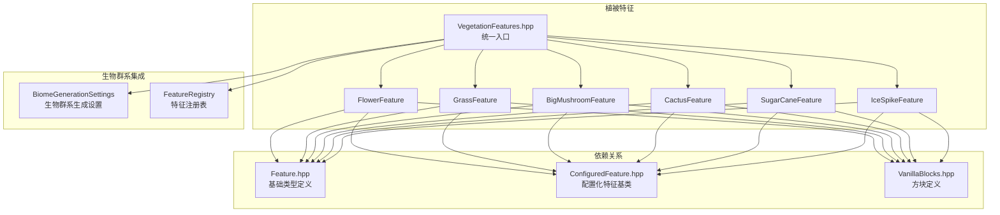
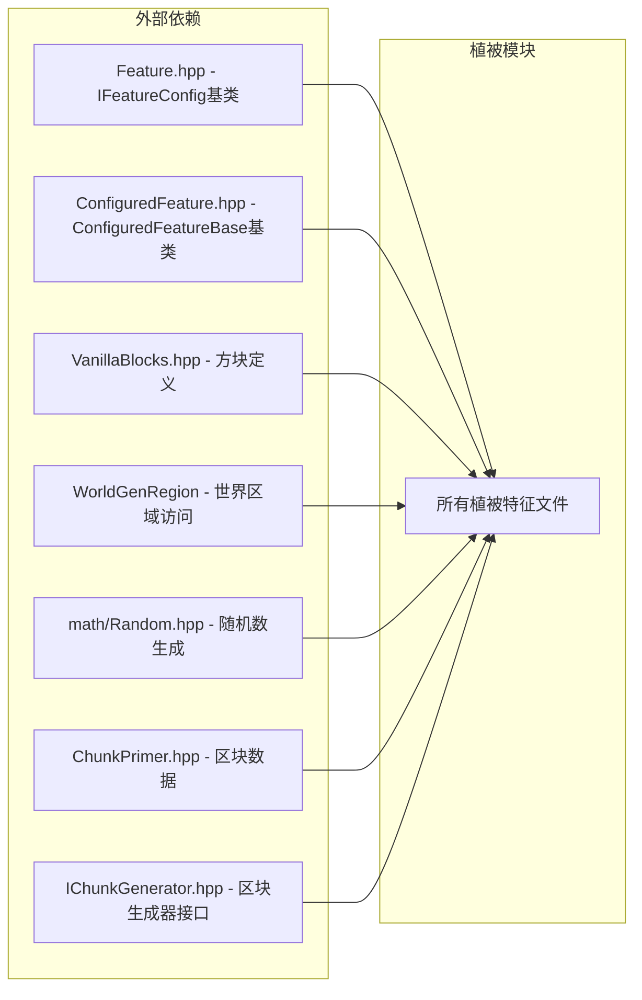

# Vegetation Features 植被特征模块

## 目录结构

```
vegetation/
├── BigMushroomFeature.hpp/cpp     # 巨型蘑菇特征（棕色/红色）
├── CactusFeature.hpp/cpp          # 仙人掌特征（沙漠/恶地）
├── FlowerFeature.hpp/cpp          # 花卉特征（蒲公英、虞美人、郁金香等）
├── GrassFeature.hpp/cpp           # 草丛特征（草、蕨类、枯萎灌木）
├── IceSpikeFeature.hpp/cpp        # 冰刺特征（尖塔型/冰丘型）
├── SugarCaneFeature.hpp/cpp       # 甘蔗特征（需水源）
├── VegetationFeatures.hpp         # 统一头文件和管理器
└── README.md                      # 本文档
```

## 内部模块关系



## 上下游外部依赖关系

### 上游依赖（本模块依赖的外部模块）



### 下游依赖（依赖本模块的外部模块）

- **BiomeGenerationSettings** - 各生物群系的生成设置（平原、森林、沙漠、沼泽、冰刺平原等）
- **FeatureRegistry** - 特征注册表，管理所有特征的 ID 和实例
- **ChunkGenerator** - 区块生成器，在 VegetalDecoration 和 SurfaceStructures 阶段调用

## 模块整体职责

植被特征模块负责在世界生成过程中放置各种地表植被装饰：

| 特征类型 | 装饰阶段 | 主要生物群系 |
|---------|---------|-------------|
| 花卉 | VegetalDecoration | 平原、森林、繁花森林、沼泽 |
| 草丛/蕨类 | VegetalDecoration | 所有有草地的生物群系 |
| 巨型蘑菇 | VegetalDecoration | 沼泽、蘑菇岛 |
| 仙人掌 | VegetalDecoration | 沙漠、恶地 |
| 甘蔗 | VegetalDecoration | 河流、沼泽等水源附近 |
| 冰刺 | SurfaceStructures | 冰刺平原 |

## 容易踩的坑

### 1. 初始化顺序错误

在 `VanillaBlocks::initialize()` 之前调用植被特征初始化会导致空指针崩溃。正确顺序：
1. `VanillaBlocks::initialize()` - 先初始化方块
2. `VegetationFeatureManager::initialize()` - 再初始化植被特征
3. `FeatureRegistry::instance().initialize()` - 最后注册特征

### 2. getAllFeaturesAndClear() 所有权转移

调用 `getAllFeaturesAndClear()` 后，静态存储被清空，再次调用返回空。只能调用一次，转移所有权给 FeatureRegistry。

### 3. 甘蔗没有水就不生成

甘蔗特征需要周围4格有水才会生成。确保在河流、沼泽等有水源的生物群系使用甘蔗特征。

### 4. 仙人掌周围不能有实体方块

仙人掌检查 `hasValidSpace()` 要求周围4格都是空气。不要在密集区域使用仙人掌特征。

### 5. 冰刺需要雪块作为基座

冰刺只在雪块上方生成，不会在普通方块上生成。确保 `IceSpikesBiomeSettings` 在雪层覆盖后再生成冰刺。

### 6. 花卉/草丛需要草方块或泥土

`isValidGround()` 只检查草方块和泥土。如果需要在其他方块上放置，需修改 `isValidGround()` 或添加新的特征类型。

### 7. 特征ID顺序必须与注册顺序一致

`FeatureIds.hpp` 中的 ID 必须与 `initialize()` 中的注册顺序完全一致，否则会导致特征 ID 错乱。

### 8. FlowerFeatureConfig 的 ySpread 必须显式设置

`FlowerFeatureConfig` 的 `ySpread` 默认值为 3，但花卉预设通常使用 `ySpread=2`。创建新的花卉配置时务必显式设置 `ySpread`，否则花卉会在 Y 方向过度扩散。偏移算法为三角形分布：`dy = nextInt(ySpread+1) - nextInt(ySpread+1)`，当 `ySpread=0` 时无 Y 偏移。
