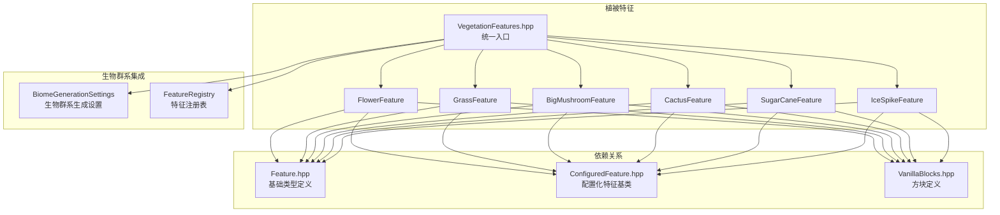
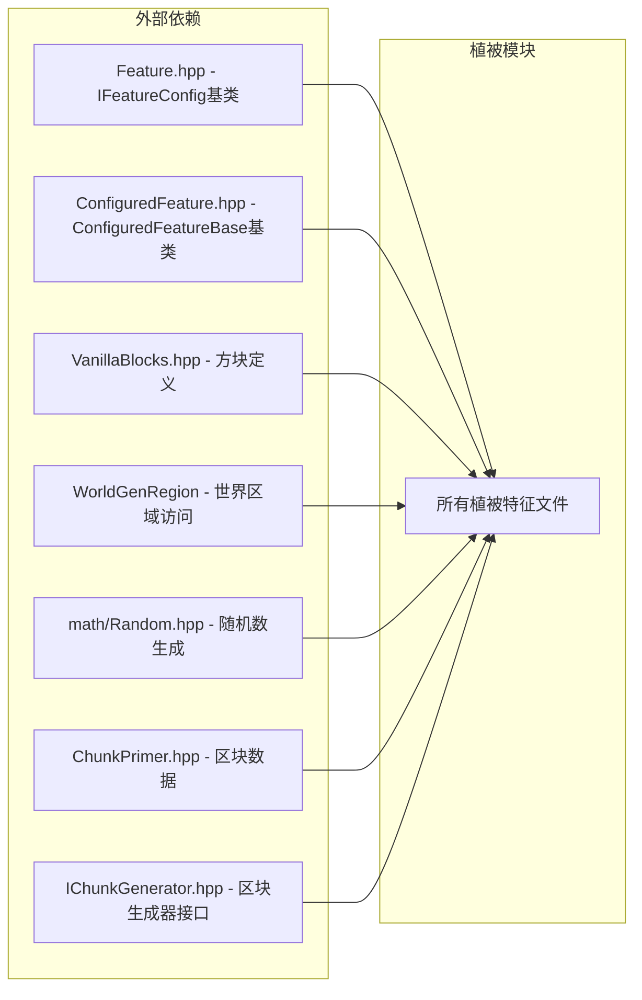

# Vegetation Features 植被特征模块

## 目录结构

```
vegetation/
├── BigMushroomFeature.hpp/cpp     # 巨型蘑菇特征
├── CactusFeature.hpp/cpp          # 仙人掌特征
├── FlowerFeature.hpp/cpp          # 花卉特征
├── GrassFeature.hpp/cpp           # 草丛特征
├── IceSpikeFeature.hpp/cpp        # 冰刺特征
├── SugarCaneFeature.hpp/cpp       # 甘蔗特征
├── VegetationFeatures.hpp         # 统一头文件和管理器
└── README.md                      # 本文档
```

## 文件详细介绍

### 1. BigMushroomFeature.hpp/cpp - 巨型蘑菇特征

**职责**：在黑暗区域（如沼泽、蘑菇岛）生成巨型棕色蘑菇和巨型红色蘑菇。

**主要内容**：
- `BigMushroomFeatureConfig` - 配置结构体
  - `capState` - 蘑菇盖方块状态
  - `stemState` - 蘑菇柄方块状态
  - `capRadius` - 蘑菇盖半径（默认2）

- `BigMushroomFeature` - 基类，提供：
  - `place()` - 放置蘑菇主逻辑
  - `generateStem()` - 生成蘑菇柄
  - `calculateHeight()` - 计算高度（4-6格，有1/12概率翻倍）
  - `canPlaceAt()` - 检查放置条件（需要草方块/泥土/菌丝/灰化土）

- `BigBrownMushroomFeature` - 棕色巨型蘑菇
  - 平顶形状，只有顶部有盖

- `BigRedMushroomFeature` - 红色巨型蘑菇
  - 多层圆顶形状，盖子更复杂

- `BigMushroomFeatures` - 工厂类
  - `createBrownMushroom()` - 创建棕色巨型蘑菇
  - `createRedMushroom()` - 创建红色巨型蘑菇

**参考**：MC 1.16.5 `BigMushroomFeature` / `BigBrownMushroomFeature` / `BigRedMushroomFeature`

---

### 2. CactusFeature.hpp/cpp - 仙人掌特征

**职责**：在沙漠和恶地生物群系生成仙人掌。

**主要内容**：
- `CactusFeatureConfig` - 配置结构体
  - `state` - 仙人掌方块状态
  - `maxHeight` - 最大高度（沙漠3格，恶地5格）

- `CactusFeature` - 仙人掌特征类
  - `place()` - 放置仙人掌
  - `canPlaceAt()` - 检查放置条件
  - `hasValidSpace()` - 检查周围4格是否为空气（仙人掌不能相邻实体方块）
  - `isValidGround()` - 检查是否为沙子或仙人掌

- `CactusFeatures` - 工厂类
  - `createDesertCactus()` - 沙漠仙人掌（最大高度3）
  - `createBadlandsCactus()` - 恶地仙人掌（最大高度5）

**参考**：MC 1.16.5 `CactusFeature`

---

### 3. FlowerFeature.hpp/cpp - 花卉特征

**职责**：在各生物群系生成花卉（蒲公英、虞美人、郁金香等）。

**主要内容**：
- `FlowerFeatureConfig` - 配置结构体
  - `flowers` - 可选花卉列表（随机选择）
  - `tries` - 尝试放置次数（默认64）
  - `xzSpread` - XZ扩散范围（默认7）
  - `requiresWater` - 是否需要周围有水

- `FlowerFeature` - 花卉特征类
  - `place()` - 在范围内随机放置花卉
  - `canPlaceAt()` - 检查放置条件（需要草方块或泥土）
  - `isValidGround()` - 验证地面方块

- `FlowerFeatures` - 工厂类，提供生物群系特定配置：
  - `createPlainsFlowers()` - 平原花卉（蒲公英、虞美人）
  - `createForestFlowers()` - 森林花卉
  - `createFlowerForestFlowers()` - 繁花森林花卉（更多种类，128次尝试）
  - `createSwampFlowers()` - 沼泽花卉（兰花）
  - `createSunflower()` - 向日葵平原

**参考**：MC 1.16.5 `DefaultFlowerFeature` / `FlowerFeatureConfig`

---

### 4. GrassFeature.hpp/cpp - 草丛特征

**职责**：在各生物群系生成草丛、蕨类、枯萎灌木等地表植被。

**主要内容**：
- `GrassFeatureConfig` - 配置结构体
  - `states` - 可选方块状态列表
  - `tries` - 尝试次数（默认64）
  - `xSpread/ySpread/zSpread` - XYZ扩散范围
  - `canReplace` - 是否可替换现有方块
  - `requiresWater` - 是否需要水
  - `project` - 是否投影到地面

- `GrassFeature` - 草丛特征类
  - `place()` - 在范围内随机放置草丛
  - `canPlaceAt()` - 检查放置条件
  - `isValidGround()` - 验证地面（草方块、泥土、灰化土、菌丝等）

- `GrassFeatures` - 工厂类，提供生物群系特定配置：
  - `createPlainsGrass()` - 平原草丛（高草、矮草）
  - `createForestGrass()` - 森林草丛（高草、矮草、蕨类）
  - `createJungleGrass()` - 丛林草丛（高草、蕨类，64次尝试）
  - `createSwampGrass()` - 沼泽草丛（高草）
  - `createSavannaGrass()` - 稀树草原草丛（高草为主）
  - `createTaigaGrass()` - 针叶林草丛（蕨类为主）
  - `createBadlandsDeadBush()` - 恶地枯萎灌木

**参考**：MC 1.16.5 `RandomPatchFeature` / `BlockClusterFeatureConfig`

---

### 5. IceSpikeFeature.hpp/cpp - 冰刺特征

**职责**：在冰刺平原生物群系生成冰刺和冰丘结构。

**主要内容**：
- `IceSpikeFeatureConfig` - 配置结构体
  - `isSpike` - 冰刺类型（true=尖塔型，false=冰丘型）
  - `maxHeight` - 最大高度（尖塔30，冰丘15）
  - `baseRadius` - 基础半径

- `IceSpikeFeature` - 冰刺特征类
  - `place()` - 放置冰刺
  - `canPlaceAt()` - 检查是否在雪块上方
  - `generateSpike()` - 生成尖塔型冰刺（向上锥形）
  - `generateIceberg()` - 生成冰丘（较矮、较宽）

- `IceSpikeFeatures` - 工厂类
  - `createSpike()` - 创建尖塔型冰刺
  - `createIceberg()` - 创建冰丘

**特点**：
- 尖塔型：向上锥形，顶部尖锐，使用浮冰
- 冰丘型：较矮较宽，混合使用冰和浮冰
- 有概率生成特别高的冰刺（高度+10~30）

**参考**：MC 1.16.5 `IceSpikeFeature`

---

### 6. SugarCaneFeature.hpp/cpp - 甘蔗特征

**职责**：在水源附近生成甘蔗。

**主要内容**：
- `SugarCaneFeatureConfig` - 配置结构体
  - `state` - 甘蔗方块状态
  - `maxHeight` - 最大高度（默认3）
  - `tries` - 尝试次数（普通20，密集40）
  - `xzSpread` - XZ扩散范围

- `SugarCaneFeature` - 甘蔗特征类
  - `place()` - 放置甘蔗
  - `canPlaceAt()` - 检查放置条件
  - `hasWaterNearby()` - **关键**：检查周围4格是否有水
  - `isValidGround()` - 验证地面（草方块、泥土、沙子、灰化土、菌丝）

- `SugarCaneFeatures` - 工厂类
  - `createNormal()` - 普通甘蔗（高度3，尝试20次）
  - `createDense()` - 密集甘蔗（高度4，尝试40次，沼泽用）

**参考**：MC 1.16.5 `SugarCaneFeature` / `ReedsFeature`

---

### 7. VegetationFeatures.hpp - 统一头文件

**职责**：统一管理所有植被特征的初始化和注册。

**主要内容**：
- 包含所有植被特征头文件
- `VegetationFeatureManager` - 管理器类
  - `initialize()` - 初始化所有植被特征
  - `getFlowerFeaturesAndClear()` - 获取花卉特征
  - `getGrassFeaturesAndClear()` - 获取草丛特征
  - `getBigMushroomFeaturesAndClear()` - 获取蘑菇特征
  - `getCactusFeaturesAndClear()` - 获取仙人掌特征
  - `getSugarCaneFeaturesAndClear()` - 获取甘蔗特征
  - `getIceSpikeFeaturesAndClear()` - 获取冰刺特征

---

## 文件关系图



---

## 模块整体职责

植被特征模块负责在世界生成过程中放置各种地表植被装饰，包括：

| 特征类型 | 装饰阶段 | 主要生物群系 |
|---------|---------|-------------|
| 花卉 | VegetalDecoration | 平原、森林、繁花森林、沼泽 |
| 草丛/蕨类 | VegetalDecoration | 所有有草地的生物群系 |
| 巨型蘑菇 | VegetalDecoration | 沼泽、蘑菇岛 |
| 仙人掌 | VegetalDecoration | 沙漠、恶地 |
| 甘蔗 | VegetalDecoration | 河流、沼泽等水源附近 |
| 冰刺 | SurfaceStructures | 冰刺平原 |

---

## 输入和输出

### 输入

```cpp
// 放置特征需要的参数
WorldGenRegion& world     // 世界生成区域（可读写方块）
ChunkPrimer& chunk        // 区块数据
IChunkGenerator& generator// 区块生成器
math::Random& random      // 随机数生成器
BlockPos pos              // 起始位置
```

### 输出

```cpp
bool success  // 是否成功放置了至少一个植被
```

---

## 依赖项



---

## 使用方法

### 1. 初始化

```cpp
#include "world/gen/feature/vegetation/VegetationFeatures.hpp"

// 必须先初始化方块系统
VanillaBlocks::initialize();

// 初始化植被特征
VegetationFeatureManager::initialize();

// 注册到特征注册表
FeatureRegistry::instance().initialize();
```

### 2. 直接使用单个特征

```cpp
#include "world/gen/feature/vegetation/FlowerFeature.hpp"

// 创建配置
FlowerFeatureConfig config;
config.tries = 64;
config.xzSpread = 7;
config.addFlower(&VanillaBlocks::DANDELION->defaultState());

// 放置特征
FlowerFeature feature;
bool success = feature.place(world, random, pos, config);
```

### 3. 通过工厂创建预定义特征

```cpp
// 获取预定义特征
auto flowerFeature = FlowerFeatures::createPlainsFlowers();

// 放置
bool success = flowerFeature->place(region, chunk, generator, random, pos);
```

### 4. 通过FeatureRegistry使用

```cpp
// 获取特定阶段的特征
const auto& features = FeatureRegistry::instance().getFeatures(
    DecorationStage::VegetalDecoration);

// 通过ID获取特定特征
auto* feature = features[FlowerFeatureIds::PlainsFlowers];
feature->place(region, chunk, generator, random, pos);
```

---

## 容易踩的坑

### 1. 初始化顺序错误

**问题**：在 `VanillaBlocks::initialize()` 之前调用植被特征初始化会导致空指针崩溃。

**解决**：
```cpp
// 正确顺序
VanillaBlocks::initialize();           // 1. 先初始化方块
VegetationFeatureManager::initialize(); // 2. 再初始化植被特征
FeatureRegistry::instance().initialize(); // 3. 最后注册特征
```

### 2. getAllFeaturesAndClear() 所有权转移

**问题**：调用 `getAllFeaturesAndClear()` 后，静态存储被清空，再次调用返回空。

**解决**：
```cpp
// 错误：多次调用
auto features1 = FlowerFeatures::getAllFeaturesAndClear(); // OK
auto features2 = FlowerFeatures::getAllFeaturesAndClear(); // 返回空！

// 正确：只调用一次，转移所有权给FeatureRegistry
```

### 3. 甘蔗没有水就不生成

**问题**：甘蔗特征需要周围4格有水才会生成。

**解决**：确保在河流、沼泽等有水源的生物群系使用甘蔗特征。

### 4. 仙人掌周围不能有实体方块

**问题**：仙人掌检查 `hasValidSpace()` 要求周围4格都是空气。

**解决**：不要在密集区域使用仙人掌特征，或修改 `hasValidSpace()` 逻辑。

### 5. 冰刺需要雪块作为基座

**问题**：冰刺只在雪块上方生成，不会在普通方块上生成。

**解决**：确保 `IceSpikesBiomeSettings` 在雪层覆盖后再生成冰刺。

### 6. 花卉/草丛需要草方块或泥土

**问题**：`isValidGround()` 只检查草方块和泥土。

**解决**：如果需要在其他方块上放置，修改 `isValidGround()` 或添加新的特征类型。

### 7. 特征ID顺序必须与注册顺序一致

**问题**：`FeatureIds.hpp` 中的 ID 必须与 `initialize()` 中的注册顺序完全一致。

**解决**：
```cpp
// FeatureIds.hpp
namespace FlowerFeatureIds {
    constexpr u32 Offset = TreeFeatureIds::Count;
    constexpr u32 PlainsFlowers = Offset + 0;      // 第一个注册
    constexpr u32 ForestFlowers = Offset + 1;      // 第二个注册
    // ...
}

// FlowerFeatures::initialize()
void FlowerFeatures::initialize() {
    s_features.clear();
    s_features.push_back(createPlainsFlowers());   // 必须第一个
    s_features.push_back(createForestFlowers());   // 必须第二个
    // ...
}
```

---

## 测试用例

测试文件：`tests/common/world/gen/test_vegetation_features.cpp`

### ID连续性测试

| 测试名称 | 验证内容 |
|---------|---------|
| `OreFeatureIdsAreConsecutive` | 矿石特征ID连续 |
| `TreeFeatureIdsAreConsecutive` | 树木特征ID连续 |
| `FlowerFeatureIdsHaveCorrectOffset` | 花卉特征偏移正确 |
| `GrassFeatureIdsHaveCorrectOffset` | 草丛特征偏移正确 |
| `MushroomFeatureIdsHaveCorrectOffset` | 蘑菇特征偏移正确 |
| `CactusFeatureIdsHaveCorrectOffset` | 仙人掌特征偏移正确 |
| `SugarCaneFeatureIdsHaveCorrectOffset` | 甘蔗特征偏移正确 |
| `IceSpikeFeatureIdsAreConsecutive` | 冰刺特征ID连续 |
| `TotalVegetalFeatureCount` | 总数正确（27个） |

### 特征名称测试

| 测试名称 | 验证内容 |
|---------|---------|
| `FeatureRegistryFeatureNames` | 矿石特征名称正确 |
| `TreeFeatureNames` | 树木特征名称正确 |
| `FlowerFeatureNames` | 花卉特征名称正确 |
| `GrassFeatureNames` | 草丛特征名称正确 |
| `MushroomFeatureNames` | 蘑菇特征名称正确 |
| `CactusFeatureNames` | 仙人掌特征名称正确 |
| `SugarCaneFeatureNames` | 甘蔗特征名称正确 |
| `IceSpikeFeatureNames` | 冰刺特征名称正确 |

### 生物群系集成测试

| 测试名称 | 验证内容 |
|---------|---------|
| `PlainsBiomeSettings` | 平原有稀疏橡树、花卉、草丛 |
| `ForestBiomeSettings` | 森林有橡树、白桦、花卉、草丛 |
| `DesertBiomeSettings` | 沙漠有仙人掌、枯萎灌木 |
| `SwampBiomeSettings` | 沼泽有密集甘蔗、蘑菇、兰花 |
| `IceSpikesBiomeSettings` | 冰刺平原有尖塔和冰丘 |
| `BadlandsBiomeSettings` | 恶地有恶地仙人掌、枯萎灌木 |
| `FlowerForestBiomeSettings` | 繁花森林有繁花森林花卉 |
| `MountainsBiomeSettings` | 山地有云杉、针叶林草丛、绿宝石 |
| `OceanBiomeSettings` | 海洋无植被 |
| `TaigaBiomeSettings` | 针叶林有云杉、蕨类 |
| `JungleBiomeSettings` | 丛林有丛林树、丛林草丛 |
| `SavannaBiomeSettings` | 稀树草原有稀疏橡树、高草 |

---

## 特征ID总览

```cpp
// 树木特征 (0-8)
TreeFeatureIds::OakTree = 0
TreeFeatureIds::BirchTree = 1
TreeFeatureIds::SpruceTree = 2
TreeFeatureIds::JungleTree = 3
TreeFeatureIds::AcaciaTree = 4
TreeFeatureIds::DarkOakTree = 5
TreeFeatureIds::SparseOakTree = 6
TreeFeatureIds::GiantSpruceTree = 7
TreeFeatureIds::GiantJungleTree = 8

// 花卉特征 (9-13)
FlowerFeatureIds::PlainsFlowers = 9
FlowerFeatureIds::ForestFlowers = 10
FlowerFeatureIds::FlowerForestFlowers = 11
FlowerFeatureIds::SwampFlowers = 12
FlowerFeatureIds::Sunflower = 13

// 草丛特征 (14-20)
GrassFeatureIds::PlainsGrass = 14
GrassFeatureIds::ForestGrass = 15
GrassFeatureIds::JungleGrass = 16
GrassFeatureIds::SwampGrass = 17
GrassFeatureIds::SavannaGrass = 18
GrassFeatureIds::TaigaGrass = 19
GrassFeatureIds::BadlandsDeadBush = 20

// 蘑菇特征 (21-22)
MushroomFeatureIds::BrownMushroom = 21
MushroomFeatureIds::RedMushroom = 22

// 仙人掌特征 (23-24)
CactusFeatureIds::DesertCactus = 23
CactusFeatureIds::BadlandsCactus = 24

// 甘蔗特征 (25-26)
SugarCaneFeatureIds::Normal = 25
SugarCaneFeatureIds::Dense = 26

// 冰刺特征 (独立，SurfaceStructures阶段)
IceSpikeFeatureIds::Spike = 0
IceSpikeFeatureIds::Iceberg = 1
```

---

## 设计模式

### 策略模式 (Strategy Pattern)

每个特征类实现了相同的接口：

```cpp
bool place(
    WorldGenRegion& world,
    math::Random& random,
    const BlockPos& pos,
    const Config& config);
```

### 工厂方法模式 (Factory Method Pattern)

每个 `XxxFeatures` 类提供静态工厂方法创建预定义特征：

```cpp
static std::unique_ptr<ConfiguredXxxFeature> createNormal();
static std::unique_ptr<ConfiguredXxxFeature> createDense();
// ...
```

### 配置对象模式 (Configuration Object Pattern)

每个特征都有对应的配置结构体，便于灵活调整参数：

```cpp
struct XxxFeatureConfig : public IFeatureConfig {
    // 配置参数...
};
```

---

## 扩展指南

### 添加新的植被特征

1. **创建配置结构体**：
```cpp
struct MyVegetationConfig : public IFeatureConfig {
    const BlockState* state = nullptr;
    i32 count = 10;
};
```

2. **创建特征类**：
```cpp
class MyVegetationFeature {
public:
    bool place(WorldGenRegion& world, math::Random& random,
               const BlockPos& pos, const MyVegetationConfig& config);
private:
    bool canPlaceAt(WorldGenRegion& world, const BlockPos& pos) const;
};
```

3. **创建配置化特征类**：
```cpp
class ConfiguredMyVegetationFeature : public ConfiguredFeatureBase {
public:
    bool place(...) override;
    const char* name() const override;
    DecorationStage stage() const override { return DecorationStage::VegetalDecoration; }
};
```

4. **创建工厂类**：
```cpp
struct MyVegetationFeatures {
    static void initialize();
    static std::unique_ptr<ConfiguredMyVegetationFeature> createNormal();
};
```

5. **添加特征ID**：
```cpp
// FeatureIds.hpp
namespace MyVegetationIds {
    constexpr u32 Offset = SugarCaneFeatureIds::Offset + SugarCaneFeatureIds::Count;
    constexpr u32 Normal = Offset;
    constexpr u32 Count = 1;
}
```

6. **更新 VegetationFeatures.hpp**：
```cpp
#include "MyVegetationFeature.hpp"

struct VegetationFeatureManager {
    static void initialize() {
        // ...
        MyVegetationFeatures::initialize();
    }
};
```

7. **添加测试用例**：
```cpp
TEST_F(VegetationFeatureTest, MyVegetationFeatureNames) {
    const auto& features = FeatureRegistry::instance().getFeatures(
        DecorationStage::VegetalDecoration);
    EXPECT_NE(features[MyVegetationIds::Normal], nullptr);
}
```
