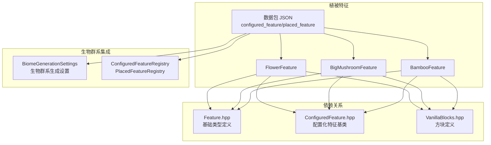
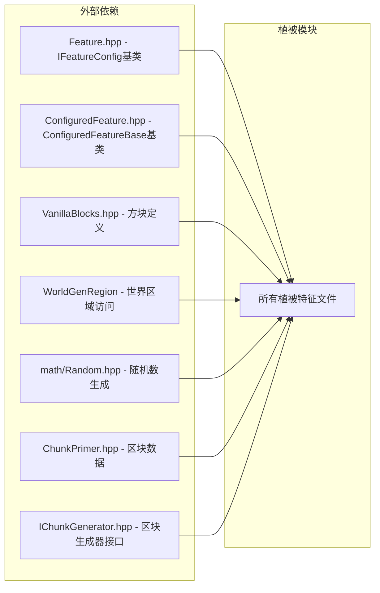

# Vegetation Features 植被特征模块

## 目录结构

```
vegetation/
├── BambooFeature.hpp/cpp          # 竹子特征（竹子丛林/普通丛林）
├── BigMushroomFeature.hpp/cpp     # 巨型蘑菇特征（棕色/红色）
├── FlowerFeature.hpp/cpp          # 花卉特征（蒲公英、虞美人、郁金香等）
└── README.md                      # 本文档
```

## 内部模块关系



## 上下游外部依赖关系

### 上游依赖（本模块依赖的外部模块）



### 下游依赖（依赖本模块的外部模块）

- **BiomeGenerationSettings** - 各生物群系的生成设置（平原、森林、沙漠、沼泽等），以 `ResourceLocation` 引用 placed_feature
- **ConfiguredFeatureRegistry / PlacedFeatureRegistry** - 数据驱动注册表，按 `ResourceLocation` 管理植被特征
- **NoiseChunkGenerator** - 区块生成器，在 VegetalDecoration 和 SurfaceStructures 阶段通过 `PlacedFeature::place` 调用

## 模块整体职责

植被特征模块负责在世界生成过程中放置各种地表植被装饰：

| 特征类型 | 装饰阶段 | 主要生物群系 |
|---------|---------|-------------|
| 花卉 | VegetalDecoration | 平原、森林、繁花森林、沼泽 |
| 巨型蘑菇 | VegetalDecoration | 沼泽、蘑菇岛 |
| 竹子 | VegetalDecoration | 竹子丛林（密集+灰化土）、普通丛林（稀疏） |

## 容易踩的坑

### 1. 初始化顺序

植被特征依赖方块系统。`MinecraftServer::initializeRegistries` 中的加载顺序为：`VanillaBlocks::initialize()` → `PlacementRegistry::initialize` → `FeatureTypeRegistry::initializeBuiltinFeatureTypes` → `ConfiguredFeatureLoader`（从数据包加载 configured_feature）→ `PlacedFeatureLoader` → `ConfiguredCarverLoader` → `BiomeRegistry::initialize` → `BiomeLoader`。在 `VanillaBlocks::initialize()` 之前加载特征会导致空指针崩溃。

### 2. 数据驱动引用

植被特征由数据包 `configured_feature`/`placed_feature` JSON 定义，生物群系通过 `features` 数组按 `ResourceLocation`（如 `minecraft:patch_grass_plain`、`minecraft:flower_forest_flower`）引用。不再有整型 ID 或 `getAllFeaturesAndClear()` 所有权转移语义。

### 3. FlowerFeatureConfig 的 ySpread 必须显式设置

`FlowerFeatureConfig` 的 `ySpread` 默认值为 3，但花卉预设通常使用 `ySpread=2`。创建新的花卉配置时务必显式设置 `ySpread`，否则花卉会在 Y 方向过度扩散。偏移算法为三角形分布：`dy = nextInt(ySpread+1) - nextInt(ySpread+1)`，当 `ySpread=0` 时无 Y 偏移。
