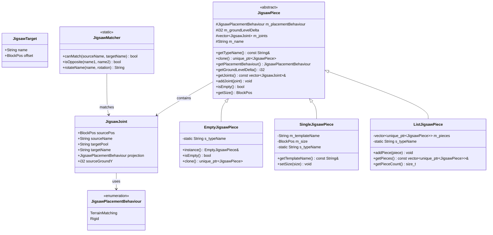
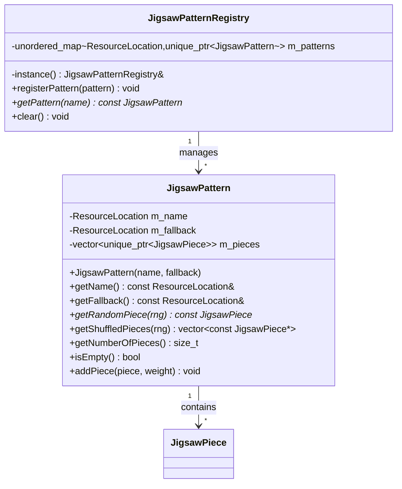
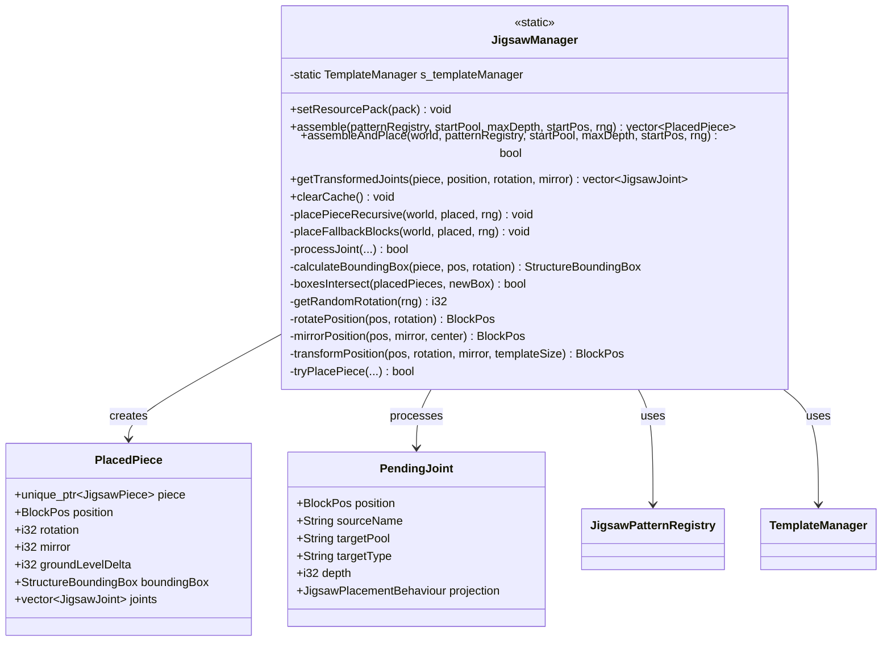
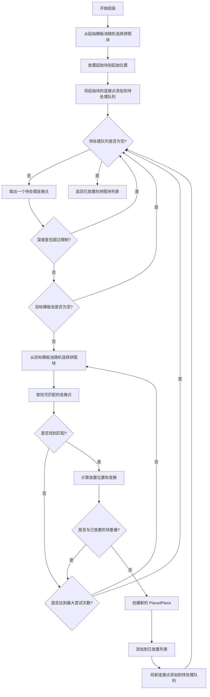
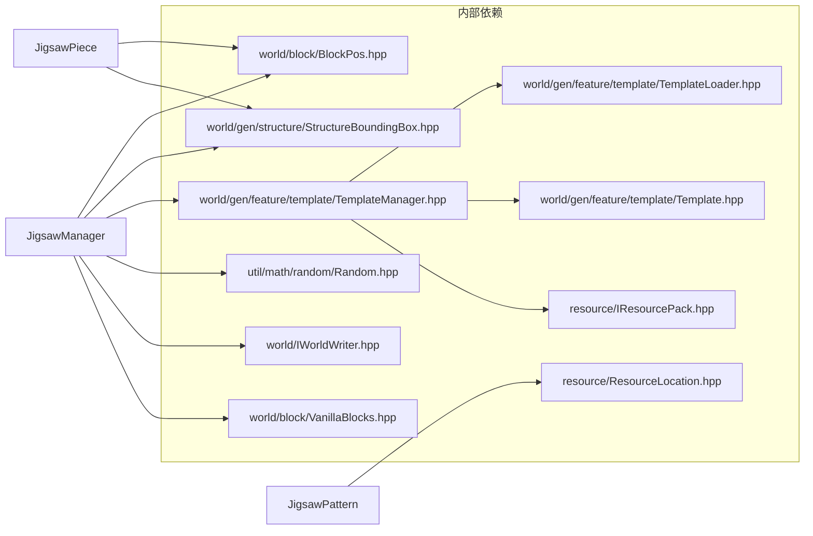

# Jigsaw 拼图结构组装系统 (Jigsaw Structure Assembly System)

[中文](#概述) | [English](#overview)

## 概述

`src/common/world/gen/jigsaw` 目录实现了 Minecraft 1.16.5 风格的 Jigsaw 拼图结构组装系统。该系统用于动态生成复杂结构（如村庄、要塞），通过 BFS（广度优先搜索）算法从模板池中选择并连接拼图块，逐步构建完整的结构。

## 目录结构

```
jigsaw/
├── JigsawJunction.hpp     # 连接点交叉数据结构
├── JigsawPiece.hpp        # 拼图块基类和实现
├── JigsawPiece.cpp        # 拼图块实现
├── JigsawPattern.hpp      # 模板池和模板池注册表
├── JigsawPattern.cpp      # 模板池实现
├── JigsawManager.hpp      # 拼图组装管理器（核心算法）
└── JigsawManager.cpp      # 拼图组装实现
```

## 文件详细说明

### JigsawJunction.hpp

**职责**: 定义 Jigsaw 连接点交叉数据结构，用于记录地形适配信息。

**主要内容**:

```cpp
class JigsawJunction {
    i32 m_sourceX;          // 源 X 坐标
    i32 m_sourceGroundY;    // 源地面高度
    i32 m_sourceZ;          // 源 Z 坐标
    i32 m_deltaY;           // 高度偏移量
    JigsawPlacementBehaviour m_destProjection;  // 目标放置行为

public:
    // 支持相等比较
    bool operator==(const JigsawJunction& other) const;
    bool operator!=(const JigsawJunction& other) const;
};
```

**关键概念**:
- `JigsawJunction` 用于记录两个拼图块连接点之间的地形高度关系
- 主要用于 `TerrainMatching` 放置行为的拼图块，确保地形高度正确衔接

### JigsawPiece.hpp / JigsawPiece.cpp

**职责**: 定义拼图块的类型系统和连接点信息，是 Jigsaw 系统的核心数据结构。

**主要内容**:



**拼图块类型说明**:

| 类型 | 说明 |
|------|------|
| `EmptyJigsawPiece` | 空拼图块，用作终止符或占位符（单例模式） |
| `SingleJigsawPiece` | 单模板拼图块，对应一个结构模板文件 |
| `ListJigsawPiece` | 列表拼图块，包含多个子拼图块（复合结构） |

**放置行为说明**:

| 行为 | 说明 |
|------|------|
| `Rigid` | 固定位置放置，不受地形影响 |
| `TerrainMatching` | 匹配地形高度放置，用于道路、桥梁等 |

**连接点匹配规则**:

Jigsaw连接点匹配基于MC 1.16.5的`JigsawBlock.func_220171_a`方法实现。

```cpp
// JigsawMatcher 提供的匹配方法

// 1. 名称匹配检查（仅检查名称）
canMatchByName(sourceTarget, targetName)

// 2. 方向匹配检查（检查facing相反）
canConnectOrientation(sourceOrientation, targetOrientation, sourceJointType)

// 3. 完整匹配检查（名称+方向）
canMatch(sourceTarget, targetName, sourceOrientation, targetOrientation, sourceJointType)
```

**连接类型说明**:

| 类型 | 说明 |
|------|------|
| `Rollable` | 可旋转连接，只需facing相反 |
| `Aligned` | 对齐连接，facing相反且rotation相同 |

**连接条件**（参考MC 1.16.5）:

1. 源连接点的`targetName`必须等于目标连接点的`sourceName`
2. 两个Jigsaw方块的facing方向必须相反（面对面）
3. 如果是`Aligned`类型，rotation方向也必须相同
4. 如果是`Rollable`类型，只需facing相反即可

**示例**:

```cpp
// Rollable连接示例（可旋转）
// 源: facing=NORTH, rotation=EAST, targetName="minecraft:bottom"
// 目标: facing=SOUTH, rotation=WEST, sourceName="minecraft:bottom"
// 匹配结果: true（facing相反，rollable类型允许rotation不同）

// Aligned连接示例（对齐）
// 源: facing=EAST, rotation=UP, targetName="village/street", jointType=Aligned
// 目标: facing=WEST, rotation=UP, sourceName="village/street"
// 匹配结果: true（facing相反且rotation相同）

// 不匹配示例
// 源: facing=NORTH, targetName="minecraft:top"
// 目标: facing=SOUTH, sourceName="minecraft:bottom"
// 匹配结果: false（targetName不匹配sourceName）
```

### JigsawPattern.hpp / JigsawPattern.cpp

**职责**: 定义模板池（Pattern Pool）和模板池注册表，管理拼图块的权重随机选择。

**主要内容**:



**权重机制**:

```cpp
// 权重通过重复添加实现
// 权重 3 意味着添加 3 个副本
pattern->addPiece(std::make_unique<SingleJigsawPiece>("house_small"), 3);   // 3/5 概率
pattern->addPiece(std::make_unique<SingleJigsawPiece>("house_large"), 2);   // 2/5 概率
```

**选择方法**（MC 1.16.5）:

`JigsawPattern` 提供两种选择拼图块的方法：

1. **`getRandomPiece(rng)`** - 随机选择一个拼图块
   - 每次调用独立随机选择
   - 适用于简单场景

2. **`getShuffledPieces(rng)`** - 返回打乱后的拼图块列表
   - MC 1.16.5 核心算法使用此方法
   - 使用 Fisher-Yates 洗牌算法
   - 遍历时保证每个拼图块只被考虑一次
   - 参考：`JigsawManager.Assembler.func_236831_a_`

```cpp
// MC 1.16.5 组装算法
std::vector<const JigsawPiece*> candidates = targetPool->getShuffledPieces(rng);
for (const JigsawPiece* piece : candidates) {
    // 尝试放置此拼图块
    if (tryPlace(piece)) {
        break;  // 成功放置后停止遍历
    }
}
```

**回退机制**:

```cpp
// 每个模板池都有一个回退池
// 当模板池为空或无法匹配时，会使用回退池
JigsawPattern villagePool(
    ResourceLocation("minecraft:village/houses"),
    ResourceLocation("minecraft:empty")  // 回退池
);
```

### JigsawManager.hpp / JigsawManager.cpp

**职责**: 实现 Jigsaw 拼图组装的核心算法，使用 BFS 算法从起始模板池递归扩展结构。

**主要内容**:



**组装算法流程**:



**坐标变换**:

```cpp
// 旋转变换（90度为单位）
// rotation = 0:   (x, y, z) -> (x, y, z)
// rotation = 90:  (x, y, z) -> (-z, y, x)
// rotation = 180: (x, y, z) -> (-x, y, -z)
// rotation = 270: (x, y, z) -> (z, y, -x)

// 镜像变换
// mirror = 0: 无镜像
// mirror = 1: X 轴镜像 (相对于模板中心)
// mirror = 2: Z 轴镜像 (相对于模板中心)

// 综合变换函数
BlockPos transformPosition(const BlockPos& pos, i32 rotation, i32 mirror,
                           const BlockPos& templateSize);
```

**重叠检测**:

```cpp
// 使用 AABB（轴对齐边界框）检测重叠
bool boxesIntersect(const std::vector<PlacedPiece>& placedPieces,
                    const StructureBoundingBox& newBox) {
    for (const auto& placed : placedPieces) {
        const auto& existing = placed.boundingBox;
        // AABB 碰撞检测
        if (newBox.maxX() >= existing.minX() && newBox.minX() <= existing.maxX() &&
            newBox.maxY() >= existing.minY() && newBox.minY() <= existing.maxY() &&
            newBox.maxZ() >= existing.minZ() && newBox.minZ() <= existing.maxZ()) {
            return true;
        }
    }
    return false;
}
```

## 文件关系图

```mermaid
graph TB
    subgraph "Jigsaw 模块"
        JJ[JigsawJunction.hpp]
        JP[JigsawPiece.hpp/cpp]
        JPa[JigsawPattern.hpp/cpp]
        JM[JigsawManager.hpp/cpp]
    end

    subgraph "外部依赖"
        TM[TemplateManager]
        TL[TemplateLoader]
        TP[Template]
        BB[StructureBoundingBox]
        BP[BlockPos]
        RNG[Random]
        RL[ResourceLocation]
        IWW[IWorldWriter]
        VB[VanillaBlocks]
    end

    JP --> JJ : uses
    JPa --> JP : contains
    JPa --> RL : uses
    JM --> JP : creates
    JM --> JPa : queries
    JM --> JJ : uses
    JM --> TM : loads templates
    JM --> BB : calculates bounds
    JM --> BP : position transforms
    JM --> RNG : random selection
    JM --> IWW : places blocks
    JM --> VB : fallback blocks

    TM --> TL : loads
    TM --> TP : caches
```

## 整体职责

### 职责范围

1. **拼图块类型系统**
   - 定义拼图块基类和派生类
   - 管理连接点信息
   - 提供连接点匹配逻辑

2. **模板池管理**
   - 维护模板池注册表
   - 实现权重随机选择
   - 支持回退模板池

3. **结构组装算法**
   - BFS 递归扩展
   - 连接点匹配和变换
   - 重叠检测和避免
   - 深度限制控制

4. **坐标变换**
   - 旋转变换（0/90/180/270度）
   - 镜像变换（X/Z 轴）
   - 综合变换计算

### 输入和输出

**输入**:

| 输入项 | 类型 | 来源 | 说明 |
|--------|------|------|------|
| 模板池注册表 | `JigsawPatternRegistry` | StructureRegistry | 已注册的所有模板池 |
| 起始模板池 | `JigsawPattern` | 结构配置 | 决定结构的起始块类型 |
| 最大深度 | `i32` | 结构配置 | 限制递归深度 |
| 起始位置 | `BlockPos` | 生成逻辑 | 结构在世界中的位置 |
| 随机数 | `Random` | 生成逻辑 | 用于随机选择和变换 |
| 资源包 | `IResourcePack` | 应用启动 | 用于加载模板文件 |

**输出**:

| 输出项 | 类型 | 目标 | 说明 |
|--------|------|------|------|
| 已放置拼图块列表 | `vector<PlacedPiece>` | 结构生成 | 结构的所有组成部分 |
| 世界方块 | `setBlockState()` | IWorldWriter | 实际放置的方块 |
| 边界框 | `StructureBoundingBox` | 区块检测 | 用于跨区块检测 |

### 依赖项



## 使用方法

### 初始化资源包

```cpp
#include "common/world/gen/jigsaw/JigsawManager.hpp"
#include "common/resource/IResourcePack.hpp"

// 在应用启动时设置资源包
mc::world::gen::jigsaw::JigsawManager::setResourcePack(&resourcePack);
```

### 注册模板池

```cpp
#include "common/world/gen/jigsaw/JigsawPattern.hpp"
#include "common/world/gen/jigsaw/JigsawPiece.hpp"

using namespace mc::world::gen::jigsaw;

// 获取模板池注册表
auto& registry = JigsawPatternRegistry::instance();

// 创建村庄起始模板池
auto startPool = std::make_unique<JigsawPattern>(
    ResourceLocation("minecraft", "village/plains/town_centers"),
    ResourceLocation("minecraft", "empty")  // 回退池
);

// 添加拼图块（权重系统）
startPool->addPiece(std::make_unique<SingleJigsawPiece>(
    "minecraft:village/plains/town_center_01",
    JigsawPlacementBehaviour::Rigid
), 1);

// 设置连接点
auto& piece = startPool->getRandomPiece(rng);
// 注意：实际中连接点从模板文件加载

registry.registerPattern(std::move(startPool));

// 创建街道模板池
auto streetPool = std::make_unique<JigsawPattern>(
    ResourceLocation("minecraft", "village/plains/streets"),
    ResourceLocation("minecraft", "empty")
);

streetPool->addPiece(std::make_unique<SingleJigsawPiece>(
    "minecraft:village/plains/street_01",
    JigsawPlacementBehaviour::TerrainMatching  // 匹配地形
), 2);

streetPool->addPiece(std::make_unique<SingleJigsawPiece>(
    "minecraft:village/plains/corner_01",
    JigsawPlacementBehaviour::Rigid
), 1);

registry.registerPattern(std::move(streetPool));

// 注册空模板池（终止符）
auto emptyPool = std::make_unique<JigsawPattern>(
    ResourceLocation("minecraft", "empty"),
    ResourceLocation("minecraft", "empty")
);
emptyPool->addPiece(EmptyJigsawPiece::instance().clone(), 1);
registry.registerPattern(std::move(emptyPool));
```

### 组装结构

```cpp
#include "common/world/gen/jigsaw/JigsawManager.hpp"

// 获取起始模板池
auto& registry = JigsawPatternRegistry::instance();
const JigsawPattern* startPool = registry.getPattern(
    ResourceLocation("minecraft", "village/plains/town_centers"));

if (!startPool || startPool->isEmpty()) {
    // 处理错误：模板池不存在或为空
    return;
}

// 设置参数
i32 maxDepth = 7;  // 最大递归深度
BlockPos startPos(chunkX * 16 + 8, 64, chunkZ * 16 + 8);
math::Random rng(worldSeed);

// 组装结构（只计算，不放置）
auto placedPieces = JigsawManager::assemble(
    registry,
    *startPool,
    maxDepth,
    startPos,
    rng
);

// 或者直接组装并放置到世界
bool success = JigsawManager::assembleAndPlace(
    world,
    registry,
    *startPool,
    maxDepth,
    startPos,
    rng
);
```

### 处理组装结果

```cpp
// 遍历已放置的拼图块
for (const auto& placed : placedPieces) {
    // 获取拼图块信息
    const JigsawPiece* piece = placed.piece.get();
    const BlockPos& pos = placed.position;
    i32 rotation = placed.rotation;

    // 如果是 SingleJigsawPiece，可以获取模板名称
    if (const SingleJigsawPiece* single = dynamic_cast<const SingleJigsawPiece*>(piece)) {
        std::cout << "Template: " << single->getTemplateName() << std::endl;
    }

    // 遍历连接点
    for (const auto& joint : placed.joints) {
        std::cout << "Joint at " << joint.sourcePos
                  << " connecting to " << joint.targetPool << std::endl;
    }
}
```

### 清理缓存

```cpp
// 在资源包更换或世界卸载时清理模板缓存
JigsawManager::clearCache();
```

## 容易踩的坑

### 1. 模板池未注册导致崩溃

**问题**: 调用 `assemble()` 时崩溃或返回空列表。

**原因**: 起始模板池或目标模板池未在注册表中注册。

**解决方案**:
```cpp
// 在组装前检查模板池
const JigsawPattern* startPool = registry.getPattern(startPoolLocation);
if (!startPool) {
    spdlog::error("Start pool not found: {}", startPoolLocation.toString());
    return {};
}
if (startPool->isEmpty()) {
    spdlog::error("Start pool is empty: {}", startPoolLocation.toString());
    return {};
}
```

### 2. 连接点名称不匹配

**问题**: 拼图块无法连接，结构生成中断。

**原因**: 连接点名称不符合匹配规则。

**解决方案**:
```cpp
// 确保连接点名称正确
// 正确的命名方式:
// 1. 使用标准 Minecraft 方向名称
joint.sourceName = "minecraft:bottom";
joint.targetName = "minecraft:top";

// 2. 使用自定义名称（必须完全相同）
joint.sourceName = "village/street_connection";
joint.targetName = "village/street_connections";  // 注意拼写一致

// 3. 终止连接
joint.targetPool = "minecraft:empty";
joint.targetName = "minecraft:empty";
```

### 3. 深度限制过小或过大

**问题**: 结构生成不完整或过度扩展。

**原因**: `maxDepth` 参数设置不当。

**解决方案**:
```cpp
// 推荐的深度设置
// 村庄: 6-8
// 要塞: 7-10
// 废弃传送门: 3-5

// 村庄配置
i32 villageDepth = 7;

// 要塞配置（更复杂的结构）
i32 strongholdDepth = 10;

// 简单结构
i32 simpleStructureDepth = 4;
```

### 4. 边界框计算错误

**问题**: 拼图块重叠或位置错误。

**原因**: `JigsawPiece::getSize()` 返回错误尺寸。

**解决方案**:
```cpp
// 确保 SingleJigsawPiece 设置正确的尺寸
auto piece = std::make_unique<SingleJigsawPiece>(
    "minecraft:village/plains/house_01",
    JigsawPlacementBehaviour::Rigid
);

// 从模板加载尺寸（如果可用）
piece->setSize(BlockPos(10, 8, 12));  // 宽度、高度、深度

// 或在 TemplateLoader 中自动设置
```

### 5. 模板加载失败

**问题**: 生成时放置回退方块（石砖）而非实际结构。

**原因**: 模板文件未找到或资源包未设置。

**解决方案**:
```cpp
// 1. 确保在组装前设置资源包
JigsawManager::setResourcePack(&resourcePack);

// 2. 检查模板路径是否正确
// 模板路径格式: namespace:path/to/template
// 例如: minecraft:village/plains/houses/small_house_01

// 3. 验证模板文件存在
// 资源包中的路径: assets/minecraft/structures/village/plains/houses/small_house_01.nbt
```

### 6. 权重系统理解错误

**问题**: 拼图块选择概率不符合预期。

**原因**: 权重实现是通过复制实现，非真正的概率。

**解决方案**:
```cpp
// 权重实现原理：添加 N 个副本
// 总概率 = 该块权重 / 所有权重之和

// 正确的权重设置
pool->addPiece(piece1, 1);  // 1/(1+2+2) = 20%
pool->addPiece(piece2, 2);  // 2/(1+2+2) = 40%
pool->addPiece(piece3, 2);  // 2/(1+2+2) = 40%

// 注意：getNumberOfPieces() 返回的是权重之和
size_t totalWeight = pool->getNumberOfPieces();  // = 1 + 2 + 2 = 5
```

### 7. 旋转变换导致连接点错位

**问题**: 旋转后连接点位置计算错误。

**原因**: 连接点偏移未正确应用旋转变换。

**解决方案**:
```cpp
// 使用 JigsawManager::getTransformedJoints 获取变换后的连接点
auto transformedJoints = JigsawManager::getTransformedJoints(
    *piece, position, rotation, mirror);

// 不要手动计算变换后的位置
// 错误做法:
// BlockPos wrongPos = joint.sourcePos + position;  // 未考虑旋转

// 正确做法（由 JigsawManager 内部处理）:
// BlockPos correctPos = transformPosition(joint.sourcePos, rotation, mirror, size) + position;
```

### 8. 内存管理问题

**问题**: 使用空拼图块后程序崩溃。

**原因**: `EmptyJigsawPiece::clone()` 返回 `nullptr`。

**解决方案**:
```cpp
// EmptyJigsawPiece 是单例
// 错误做法：
auto piece = EmptyJigsawPiece::instance().clone();  // 返回 nullptr!

// 正确做法：
const JigsawPiece& empty = EmptyJigsawPiece::instance();
if (piece->isEmpty()) {
    // 跳过或特殊处理
}

// 添加到模板池时使用单例引用
pool->addPiece(EmptyJigsawPiece::instance().clone(), 1);  // clone() 返回 nullptr 是设计行为
// 实际上空模板池的添加方式应该是：
emptyPool->addPiece(EmptyJigsawPiece::instance().clone(), 1);  // 这会在随机选择时返回 nullptr
// 在 JigsawPattern::getRandomPiece 中需要处理 nullptr
```

## 涉及的测试用例

当前 jigsaw 模块没有专门的单元测试文件。测试主要通过结构生成系统间接进行：

### 间接测试

| 测试项 | 测试文件 | 测试内容 |
|--------|----------|----------|
| 种子确定性 | WorldGenDeterminismTest.cpp | 相同种子产生相同的结构位置和布局 |
| Jigsaw 组装 | 通过 VillageStructure、StrongholdStructure | 实际结构生成验证 |
| 模板池注册 | StructureManager.cpp | 模板池初始化验证 |

### 推荐添加的测试

```cpp
// tests/common/world/gen/jigsaw/test_jigsaw_pattern.cpp

#include <gtest/gtest.h>
#include "common/world/gen/jigsaw/JigsawPattern.hpp"
#include "common/world/gen/jigsaw/JigsawPiece.hpp"
#include "common/util/math/random/Random.hpp"

using namespace mc::world::gen::jigsaw;
using namespace mc::math;

TEST(JigsawPatternTest, WeightedRandomSelection) {
    JigsawPattern pattern(
        mc::ResourceLocation("test", "pool"),
        mc::ResourceLocation("minecraft", "empty")
    );

    pattern.addPiece(std::make_unique<SingleJigsawPiece>("piece_a"), 1);
    pattern.addPiece(std::make_unique<SingleJigsawPiece>("piece_b"), 2);
    pattern.addPiece(std::make_unique<SingleJigsawPiece>("piece_c"), 3);

    EXPECT_EQ(pattern.getNumberOfPieces(), 6);  // 1 + 2 + 3

    // 统计随机选择分布
    std::map<std::string, int> counts;
    Random rng(12345);
    for (int i = 0; i < 6000; ++i) {
        const JigsawPiece* piece = pattern.getRandomPiece(rng);
        if (const SingleJigsawPiece* sp = dynamic_cast<const SingleJigsawPiece*>(piece)) {
            counts[sp->getTemplateName()]++;
        }
    }

    // 验证概率分布（允许 10% 误差）
    EXPECT_NEAR(counts["piece_a"], 1000, 100);
    EXPECT_NEAR(counts["piece_b"], 2000, 200);
    EXPECT_NEAR(counts["piece_c"], 3000, 300);
}

TEST(JigsawMatcherTest, OppositeMatching) {
    EXPECT_TRUE(JigsawMatcher::isOpposite("minecraft:top", "minecraft:bottom"));
    EXPECT_TRUE(JigsawMatcher::isOpposite("minecraft:bottom", "minecraft:top"));
    EXPECT_TRUE(JigsawMatcher::isOpposite("minecraft:left", "minecraft:right"));
    EXPECT_TRUE(JigsawMatcher::isOpposite("minecraft:front", "minecraft:back"));
    EXPECT_FALSE(JigsawMatcher::isOpposite("minecraft:top", "minecraft:top"));
    EXPECT_FALSE(JigsawMatcher::isOpposite("custom:point", "custom:other"));
}

TEST(JigsawMatcherTest, NameRotation) {
    EXPECT_EQ(JigsawMatcher::rotateName("minecraft:front", 0), "minecraft:front");
    EXPECT_EQ(JigsawMatcher::rotateName("minecraft:front", 90), "minecraft:right");
    EXPECT_EQ(JigsawMatcher::rotateName("minecraft:front", 180), "minecraft:back");
    EXPECT_EQ(JigsawMatcher::rotateName("minecraft:front", 270), "minecraft:left");
    EXPECT_EQ(JigsawMatcher::rotateName("minecraft:top", 90), "minecraft:top");  // 垂直方向不变
}

TEST(JigsawMatcherTest, CanMatch) {
    EXPECT_TRUE(JigsawMatcher::canMatch("minecraft:top", "minecraft:bottom"));
    EXPECT_TRUE(JigsawMatcher::canMatch("village:street", "village:street"));
    EXPECT_FALSE(JigsawMatcher::canMatch("minecraft:empty", "anything"));
    EXPECT_FALSE(JigsawMatcher::canMatch("", "minecraft:top"));
}
```

```cpp
// tests/common/world/gen/jigsaw/test_jigsaw_manager.cpp

#include <gtest/gtest.h>
#include "common/world/gen/jigsaw/JigsawManager.hpp"
#include "common/util/math/random/Random.hpp"

using namespace mc::world::gen::jigsaw;
using namespace mc::math;

TEST(JigsawManagerTest, CoordinateRotation) {
    // 测试坐标旋转变换
    BlockPos pos(10, 5, 20);

    // 0 度旋转
    EXPECT_EQ(JigsawManager::rotatePosition(pos, 0), BlockPos(10, 5, 20));

    // 90 度旋转
    EXPECT_EQ(JigsawManager::rotatePosition(pos, 90), BlockPos(-20, 5, 10));

    // 180 度旋转
    EXPECT_EQ(JigsawManager::rotatePosition(pos, 180), BlockPos(-10, 5, -20));

    // 270 度旋转
    EXPECT_EQ(JigsawManager::rotatePosition(pos, 270), BlockPos(20, 5, -10));
}

TEST(JigsawManagerTest, BoundingBoxCalculation) {
    // 测试边界框计算
    auto piece = std::make_unique<SingleJigsawPiece>("test", JigsawPlacementBehaviour::Rigid);
    piece->setSize(BlockPos(10, 5, 8));

    auto box = JigsawManager::calculateBoundingBox(*piece, BlockPos(100, 50, 200), 0);

    EXPECT_EQ(box.minX(), 100);
    EXPECT_EQ(box.minY(), 50);
    EXPECT_EQ(box.minZ(), 200);
    EXPECT_EQ(box.maxX(), 109);  // 100 + 10 - 1
    EXPECT_EQ(box.maxY(), 54);   // 50 + 5 - 1
    EXPECT_EQ(box.maxZ(), 207);  // 200 + 8 - 1
}

TEST(JigsawManagerTest, OverlapDetection) {
    std::vector<PlacedPiece> placedPieces;

    // 创建已放置的块
    auto piece1 = std::make_unique<SingleJigsawPiece>("piece1", JigsawPlacementBehaviour::Rigid);
    piece1->setSize(BlockPos(10, 10, 10));

    PlacedPiece placed1;
    placed1.piece = std::move(piece1);
    placed1.position = BlockPos(0, 0, 0);
    placed1.boundingBox = StructureBoundingBox(0, 0, 0, 9, 9, 9);
    placedPieces.push_back(std::move(placed1));

    // 测试重叠的边界框
    StructureBoundingBox overlapping(5, 5, 5, 15, 15, 15);
    EXPECT_TRUE(JigsawManager::boxesIntersect(placedPieces, overlapping));

    // 测试不重叠的边界框
    StructureBoundingBox nonOverlapping(10, 10, 10, 20, 20, 20);
    EXPECT_FALSE(JigsawManager::boxesIntersect(placedPieces, nonOverlapping));

    // 测试相邻但不重叠
    StructureBoundingBox adjacent(10, 0, 0, 20, 9, 9);
    EXPECT_FALSE(JigsawManager::boxesIntersect(placedPieces, adjacent));
}
```

## 与其他模块的关系

```mermaid
graph TB
    subgraph "世界生成流水线"
        CG[ChunkGenerator] --> Feature
        Feature --> Structure
    end

    subgraph "结构生成模块"
        Structure[Structure]
        JS[JigsawStructure]
        SM[StructureManager]
        SR[StructureRegistry]
    end

    subgraph "Jigsaw 子系统"
        JM[JigsawManager]
        JPR[JigsawPatternRegistry]
        JP[JigsawPattern]
        JPC[JigsawPiece]
        JMatcher[JigsawMatcher]
    end

    subgraph "模板系统"
        TM[TemplateManager]
        TL[TemplateLoader]
        Template[Template]
    end

    subgraph "外部依赖"
        RP[IResourcePack]
        WW[IWorldWriter]
        Rng[Random]
    end

    Structure <|-- JS
    JS --> JM
    SM --> SR
    SR --> JS
    SR --> JPR

    JM --> JPR
    JPR --> JP
    JP --> JPC
    JPC --> JMatcher

    JM --> TM
    TM --> TL
    TL --> RP
    TM --> Template
    JM --> WW
    JM --> Rng
```

## 实现状态

### 已完成功能

| 功能 | 状态 | 说明 |
|------|------|------|
| JigsawPiece 类型系统 | ✅ 完成 | EmptyJigsawPiece、SingleJigsawPiece、ListJigsawPiece |
| JigsawMatcher 连接匹配 | ✅ 完成 | 名称匹配、方向匹配、名称旋转 |
| JigsawPattern 模板池 | ✅ 完成 | 权重系统、随机选择、洗牌算法 |
| JigsawPatternRegistry | ✅ 完成 | 模板池注册和查询 |
| JigsawManager.assemble | ✅ 完成 | BFS 组装算法、连接点处理 |
| JigsawManager.assembleAndPlace | ✅ 完成 | 组装并放置到世界 |
| 坐标变换（旋转/镜像） | ✅ 完成 | 0/90/180/270度旋转、X/Z镜像 |
| 边界框计算与重叠检测 | ✅ 完成 | AABB 碰撞检测 |
| JigsawJunction 数据结构 | ✅ 完成 | 地形适配信息存储 |
| 回退方块放置 | ✅ 完成 | 连接失败时放置石砖 |

### 已知限制

| 限制 | 原因 | 解决方案 |
|------|------|----------|
| JigsawJunction 地形对齐 | 需要 Heightmap 系统 | 待 Heightmap 实现后集成 |
| Jigsaw 方块状态读取 | 需要 BlockState 解析 | 当前从模板 NBT 读取 |
| 实体 NBT 加载 | 需要 Entity::loadFromNBT | 待实体系统完善 |
| 方块实体 NBT 加载 | 需要 BlockEntity::loadFromNBT | 待方块实体系统完善 |

### 外部依赖

| 依赖 | 模块 | 状态 |
|------|------|------|
| TemplateManager | template/ | ✅ 已实现 |
| Template | template/ | ✅ 已实现 |
| ResourceLocation | resource/ | ✅ 已实现 |
| IResourcePack | resource/ | ✅ 已实现 |
| Random | util/math/random/ | ✅ 已实现 |
| StructureBoundingBox | world/gen/structure/ | ✅ 已实现 |
| Heightmap | world/chunk/ | ⚠️ 部分实现 |

## 参考资料

- Minecraft 1.16.5 源码：`net.minecraft.world.gen.feature.jigsaw` 包
- Minecraft Wiki：[Jigsaw structure](https://minecraft.wiki/w/Jigsaw_structure)
- Minecraft Wiki：[Jigsaw Block](https://minecraft.wiki/w/Jigsaw_Block)
- 相关目录：`src/common/world/gen/structure/` - 结构生成系统

---

*最后更新：2026-05-03*
