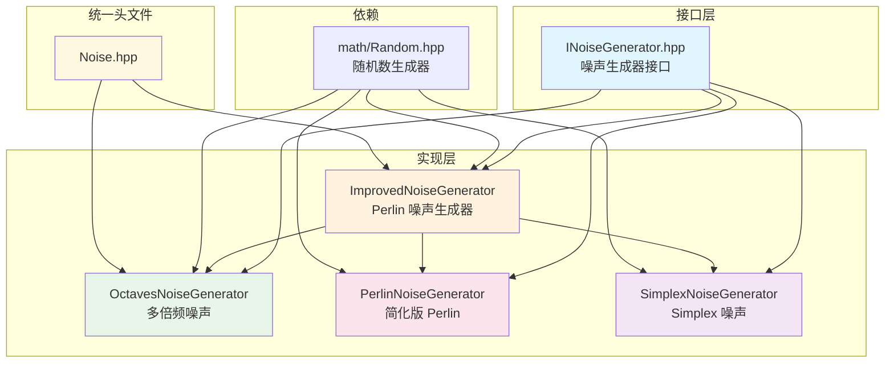
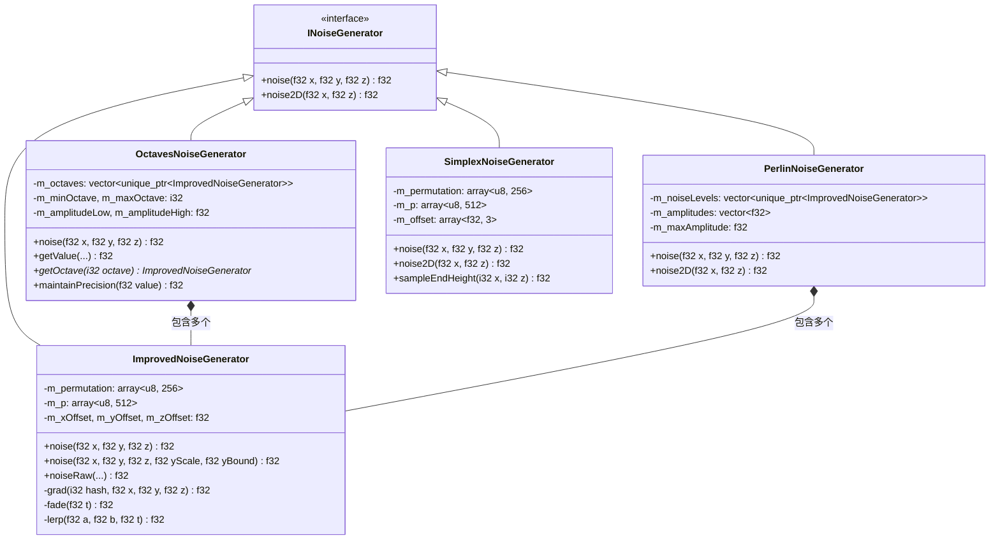
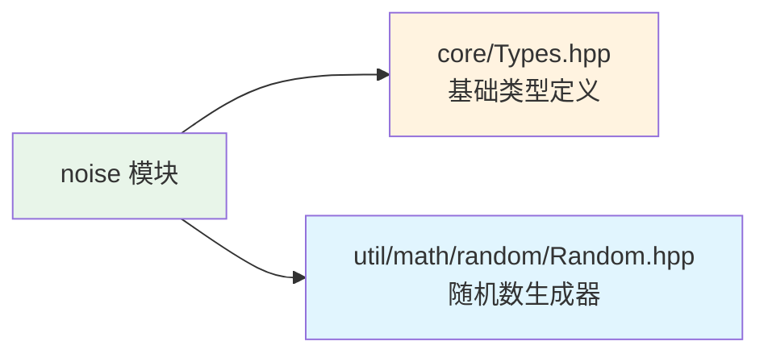

# Noise 噪声生成器模块

本目录包含 Minecraft 世界生成所需的噪声生成器实现，参考 MC 1.16.5 的噪声生成算法。

## 目录结构

```
src/common/world/gen/noise/
├── INoiseGenerator.hpp          # 噪声生成器接口（抽象基类）
├── ImprovedNoiseGenerator.hpp   # 改进的 Perlin 噪声生成器（头文件）
├── ImprovedNoiseGenerator.cpp   # 改进的 Perlin 噪声生成器（实现）
├── OctavesNoiseGenerator.hpp    # 多倍频噪声生成器（头文件）
├── OctavesNoiseGenerator.cpp    # 多倍频噪声生成器（实现）
└── Noise.hpp                    # 统一头文件（包含所有噪声生成器）
```

## 文件详细介绍

### INoiseGenerator.hpp

**职责**: 定义噪声生成器的抽象接口。

**主要内容**:
- `INoiseGenerator` 抽象类
  - `noise(f32 x, f32 y, f32 z)`: 3D 噪声采样（纯虚函数）
  - `noise2D(f32 x, f32 z)`: 2D 噪声采样（默认实现调用 3D 版本）

**设计目的**: 为所有噪声生成器提供统一的接口，支持多态使用。

---

### ImprovedNoiseGenerator.hpp / .cpp

**职责**: 实现标准的 3D Perlin 噪声生成器，是所有其他噪声生成器的基础组件。

**主要内容**:
- `ImprovedNoiseGenerator` 类，继承自 `INoiseGenerator`
- 排列表（permutation table）初始化和 Fisher-Yates 洗牌算法
- 3D Perlin 噪声采样算法
- 带有 Y 轴缩放的噪声采样（用于地形高度变化）
- 梯度计算和三线性插值

**核心算法**:
```
Perlin 噪声流程:
1. 添加随机偏移 → 2. 计算单位立方体坐标 → 3. 计算 fade 曲线
       ↓
4. 获取 8 个角的哈希值 → 5. 计算梯度值 → 6. 三线性插值
```

**公开 API**:
```cpp
// 构造函数
explicit ImprovedNoiseGenerator(u64 seed);
explicit ImprovedNoiseGenerator(math::IRandom& rng);

// 3D 噪声采样
[[nodiscard]] f32 noise(f32 x, f32 y, f32 z) const override;

// 带 Y 轴缩放的 3D 噪声采样
[[nodiscard]] f32 noise(f32 x, f32 y, f32 z, f32 yScale, f32 yBound) const;

// 原始采样方法
[[nodiscard]] f32 noiseRaw(i32 x, i32 y, i32 z,
                           f32 deltaX, f32 deltaY, f32 deltaZ,
                           f32 fadeX, f32 fadeY, f32 fadeZ) const;

// 坐标偏移访问器
[[nodiscard]] f32 xOffset() const;
[[nodiscard]] f32 yOffset() const;
[[nodiscard]] f32 zOffset() const;
```

**关键常量**:
- `PERLIN_GRADIENTS[16][3]`: 16 个 3D 梯度向量，用于计算噪声梯度

---

### OctavesNoiseGenerator.hpp / .cpp

**职责**: 实现多倍频噪声生成器，通过叠加多个不同频率和振幅的 Perlin 噪声层，产生更自然的地形。

**主要内容**:
- `OctavesNoiseGenerator` 类 - 多倍频 Perlin 噪声
- `PerlinNoiseGenerator` 类 - 简化版 Perlin 噪声（用于地表深度）
- `SimplexNoiseGenerator` 类 - Simplex 噪声（用于末地维度）

**OctavesNoiseGenerator 核心算法**:
```
倍频叠加原理:
- 低频层（大尺度）: 控制地形的基本形状（山脉、平原）
- 高频层（小尺度）: 添加细节和粗糙度
- 每层频率翻倍，振幅减半
```

**公开 API**:
```cpp
// OctavesNoiseGenerator
OctavesNoiseGenerator(u64 seed, i32 minOctave, i32 maxOctave);
OctavesNoiseGenerator(math::IRandom& rng, i32 minOctave, i32 maxOctave);

[[nodiscard]] f32 noise(f32 x, f32 y, f32 z) const override;
[[nodiscard]] f32 getValue(f32 x, f32 y, f32 z, 
                           f32 yScale, f32 yBound, bool fixY) const;
[[nodiscard]] f32 noiseAt(f32 x, f32 y, f32 z, f32 scale) const;
[[nodiscard]] ImprovedNoiseGenerator* getOctave(i32 octave);
[[nodiscard]] i32 octaveCount() const;

// 精度保持（防止大坐标问题）
[[nodiscard]] static f32 maintainPrecision(f32 value);

// PerlinNoiseGenerator
PerlinNoiseGenerator(u64 seed, i32 minOctave, i32 maxOctave);
[[nodiscard]] f32 noise(f32 x, f32 y, f32 z) const override;
[[nodiscard]] f32 noise2D(f32 x, f32 z) const;

// SimplexNoiseGenerator
SimplexNoiseGenerator(u64 seed);
[[nodiscard]] f32 noise(f32 x, f32 y, f32 z) const override;
[[nodiscard]] f32 noise2D(f32 x, f32 z) const;
[[nodiscard]] f32 sampleEndHeight(i32 x, i32 z) const;  // 末地高度
```

---

### Noise.hpp

**职责**: 统一头文件，方便一次性包含所有噪声生成器。

**内容**:
```cpp
#include "ImprovedNoiseGenerator.hpp"
#include "OctavesNoiseGenerator.hpp"
```

## 文件关系图



## 类继承关系



## 模块整体职责

### 职责

本模块负责提供世界生成所需的噪声函数，包括：

1. **基础 Perlin 噪声** - 用于生成连续、自然的随机地形
2. **多倍频噪声** - 通过叠加不同频率的噪声层，产生具有多层次细节的地形
3. **Simplex 噪声** - 用于末地维度等特殊维度的地形生成
4. **精度保持** - 处理大坐标情况下的浮点精度问题

### 输入和输出

| 类型 | 描述 |
|------|------|
| **输入** | 种子（u64 或 IRandom）、坐标（x, y, z）、倍频范围（minOctave, maxOctave） |
| **输出** | 噪声值（f32，范围约 [-1, 1]） |

### 依赖项



- **`core/Types.hpp`**: 提供 `f32`, `i32`, `u8`, `u64` 等基础类型定义
- **`util/math/random/Random.hpp`**: 提供随机数生成器接口 `IRandom` 和实现 `Random`

## 使用方法

### 基础 Perlin 噪声

```cpp
#include "common/world/gen/noise/Noise.hpp"

// 使用种子创建
mc::ImprovedNoiseGenerator noise(12345ULL);

// 采样 3D 噪声
f32 value = noise.noise(100.5f, 64.0f, -200.3f);

// 采样 2D 噪声（y = 0）
f32 value2D = noise.noise2D(100.5f, -200.3f);

// 带 Y 轴缩放的噪声（用于地形高度变化）
f32 scaledValue = noise.noise(x, y, z, yScale, yBound);
```

### 多倍频噪声

```cpp
#include "common/world/gen/noise/Noise.hpp"

// 创建 16 个倍频层（从 -15 到 0）
// 负数表示低频层，0 是最高频层
mc::OctavesNoiseGenerator octaveNoise(seed, -15, 0);

// 采样噪声
f32 value = octaveNoise.noise(x, y, z);

// 带参数采样（用于复杂地形）
f32 complexValue = octaveNoise.getValue(x, y, z, yScale, yBound, fixY);

// 简化的 2D 采样
f32 heightNoise = octaveNoise.noiseAt(x, y, z, scale);
```

### Simplex 噪声（末地维度）

```cpp
#include "common/world/gen/noise/Noise.hpp"

mc::SimplexNoiseGenerator simplex(seed);

// 采样 3D Simplex 噪声
f32 value = simplex.noise(x, y, z);

// 计算末地高度
f32 endHeight = simplex.sampleEndHeight(blockX, blockZ);
```

### 大坐标精度保持

```cpp
// 当坐标很大时，使用 maintainPrecision 防止精度问题
f32 safeX = mc::OctavesNoiseGenerator::maintainPrecision(largeX);
f32 safeZ = mc::OctavesNoiseGenerator::maintainPrecision(largeZ);
```

## 容易踩的坑

### 1. 倍频索引理解错误

```cpp
// 错误理解：认为倍频数是 0 到 15
OctavesNoiseGenerator noise(seed, 0, 15);  // 这是错误的！

// 正确理解：
// - minOctave = -15 表示最低频层（大尺度地形）
// - maxOctave = 0 表示最高频层（小尺度细节）
OctavesNoiseGenerator noise(seed, -15, 0);  // 正确
```

**解释**: MC 的倍频系统中，负数索引表示低频（大尺度），0 是最高频（小尺度）。

### 2. 随机数生成器状态共享

```cpp
// 错误：多个噪声生成器共享同一个随机数生成器
math::Random rng(seed);
ImprovedNoiseGenerator noise1(rng);  // rng 状态改变
ImprovedNoiseGenerator noise2(rng);  // noise2 使用不同的随机序列！

// 正确：每个生成器使用独立的随机数生成器
ImprovedNoiseGenerator noise1(seed);
ImprovedNoiseGenerator noise2(seed + 1);  // 或使用不同的种子
```

### 3. 坐标偏移忽略

```cpp
// ImprovedNoiseGenerator 有内部坐标偏移
// 这些偏移在构造时随机生成，用于避免不同种子产生相似的模式

// 如果需要精确控制坐标，注意偏移会被自动添加：
// 实际采样坐标 = 输入坐标 + 随机偏移
f32 actualX = x + noise.xOffset();
```

### 4. 大坐标精度问题

```cpp
// 当坐标超过约 33554432（2^25）时，浮点精度会出问题
f32 largeX = 40000000.0f;
f32 value = noise.noise(largeX, y, z);  // 可能产生伪影

// 解决方案：使用 maintainPrecision
f32 safeX = OctavesNoiseGenerator::maintainPrecision(largeX);
f32 value = noise.noise(safeX, y, z);
```

### 5. 噪声值范围误解

```cpp
// 噪声值范围约为 [-1, 1]，但不是严格保证
// 实际范围可能略微超出，特别是在多倍频叠加后

// 如果需要归一化到 [0, 1]：
f32 normalized = (noise.noise(x, y, z) + 1.0f) * 0.5f;

// 如果需要映射到特定范围：
f32 mapped = minHeight + (noise.noise(x, y, z) + 1.0f) * 0.5f * (maxHeight - minHeight);
```

### 6. OctavesNoiseGenerator 的 skip(262) 调用

```cpp
// OctavesNoiseGenerator 在创建多个倍频层时，会跳过 262 个随机数
// 这是参考 MC 的实现，确保不同倍频层有不同的噪声模式
// 如果需要复现 MC 的世界，必须保持这个行为
```

## 涉及的测试用例

### 噪声生成器确定性测试

**文件**: `tests/common/world/gen/WorldGenDeterminismTest.cpp`

```cpp
TEST_F(WorldGenDeterminismTest, NoiseGeneratorDeterminism) {
    const u64 seed = 12345;

    // 创建两个 OctavesNoiseGenerator
    math::Random rng1(seed);
    math::Random rng2(seed);

    OctavesNoiseGenerator noise1(rng1, -15, 0);
    OctavesNoiseGenerator noise2(rng2, -15, 0);

    // 测试噪声值是否相同
    for (int i = 0; i < 100; ++i) {
        f32 x = static_cast<f32>(i * 17.3f);
        f32 y = static_cast<f32>(i * 31.7f);
        f32 z = static_cast<f32>(i * 53.1f);

        f32 n1 = noise1.noise(x, y, z);
        f32 n2 = noise2.noise(x, y, z);

        EXPECT_NEAR(n1, n2, 1e-6f) << "Noise mismatch at sample " << i;
    }
}
```

**测试目的**: 验证使用相同种子的噪声生成器产生完全相同的输出。

### 区块生成测试

**文件**: `tests/common/test_chunk_generation.cpp`

```cpp
// 包含噪声生成器头文件
#include "common/world/gen/noise/ImprovedNoiseGenerator.hpp"
#include "common/world/gen/noise/OctavesNoiseGenerator.hpp"
```

**测试内容**:
- ChunkStatus 测试（区块生成阶段）
- ChunkPrimer 测试（区块数据容器）
- SingleChunkLifecycleManager 测试（区块生命周期）

### 生物群系层测试

**文件**: `tests/common/world/biome/layer/BiomeLayerTest.cpp`
**文件**: `tests/common/world/biome/layer/MergeLayersTest.cpp`

这些测试使用 `ImprovedNoiseGenerator` 作为生物群系层的噪声源。

## 性能考虑

1. **ImprovedNoiseGenerator** 是基础组件，性能已优化：
   - 使用预计算的排列表避免重复哈希
   - 使用 `mutable` 工作数组避免动态分配
   - 梯度向量表编译期常量

2. **OctavesNoiseGenerator** 叠加多层噪声：
   - 倍频层数直接影响性能
   - 典型使用 16 层（-15 到 0）
   - 每层采样都会调用 ImprovedNoiseGenerator

3. **精度保持**:
   - `maintainPrecision` 使用浮点运算
   - 只在坐标超过 2^25 时需要调用

## 参考

- Minecraft 1.16.5 源码: `net.minecraft.world.gen.ImprovedNoiseGenerator`, `net.minecraft.world.gen.OctavesNoiseGenerator`
- Perlin 噪声算法: Ken Perlin, "An Image Synthesizer", SIGGRAPH 1985
- Simplex 噪声算法: Ken Perlin, "Noise Hardware", 2001
