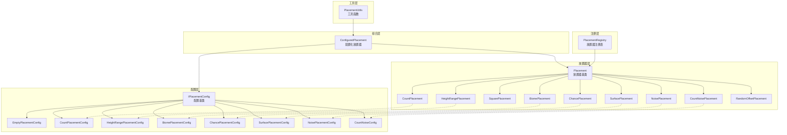
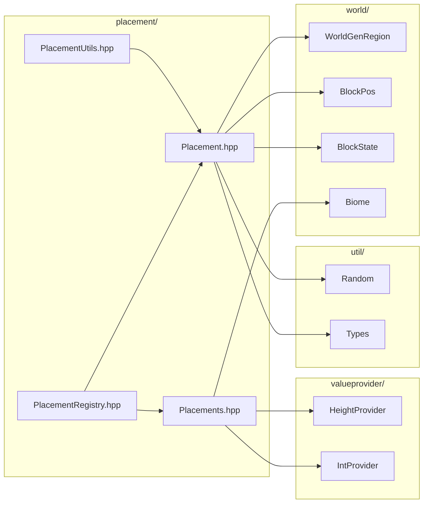

# 放置器系统 (Placement System)

本目录实现了 Minecraft 1.21.11 的特征放置器系统，控制特征（矿石、树木、花草等）在世界中的放置位置，并提供 placed_feature 的数据驱动加载。

## 目录结构

```
placement/
├── Placement.hpp              # 放置器基类和基础配置定义
├── Placement.cpp              # 放置器基类实现
├── Placements.hpp             # 扩展放置器类定义（噪声、水深等）
├── Placements.cpp             # 扩展放置器实现
├── PlacementRegistry.hpp      # 放置器注册表和工厂方法（type 字符串→工厂）
├── PlacementRegistry.cpp      # 放置器注册表实现
├── PlacementUtils.hpp         # 放置器构建辅助函数
├── PlacementUtils.cpp         # 工具函数实现
├── PlacedFeature.hpp          # placed_feature 类型（配置化特征 + 放置链 + ResourceLocation id）
├── PlacedFeature.cpp          # PlacedFeature::place 实现（先走 placement 链，再调 feature）
├── PlacedFeatureRegistry.hpp  # placed_feature 注册表（数据驱动，按 ResourceLocation 索引）
├── PlacedFeatureRegistry.cpp  # 注册表实现
├── PlacedFeatureLoader.hpp    # 从数据包加载 placed_feature JSON
├── PlacedFeatureLoader.cpp    # Loader 实现（解析 feature 引用 + placement 数组）
└── README.md                  # 本文档
```

---

## 内部模块关系



---

## 上下游外部依赖关系

### 上游依赖（本目录依赖的模块）



### 下游依赖（依赖本目录的模块）

| 模块 | 文件 | 用途 |
|------|------|------|
| feature/ | `TreeFeature.cpp`, `OreFeature.cpp` | 特征放置时使用放置器确定位置 |
| chunk/ | `NoiseChunkGenerator.cpp` | 区块生成时通过 `PlacedFeature::place` 调用放置链 |
| cave/ | `RootSystemFeature.cpp`, `VegetationPatchFeature.cpp` | 洞穴特征放置 |

---

## 整体职责

放置器系统负责控制特征（Feature）在世界中的**放置位置**。它是特征生成流水线的最后一步：

```
区块生成 → 特征选择 → 放置器确定位置 → 特征放置
```

### 核心职责

1. **位置筛选**：根据高度、生物群系、噪声等条件筛选有效位置
2. **数量控制**：决定每个区块放置多少次特征
3. **位置分散**：在区块内分散放置位置，避免聚集
4. **环境检测**：检测地表、水深、固体方块等环境条件
5. **链式处理**：支持多个放置器串联，逐步精炼位置

---

## 容易踩的坑

### 1. 配置类型不匹配

**问题**：使用错误的配置类型导致 `dynamic_cast` 返回 `nullptr`。

```cpp
// 错误：配置类型不匹配
CountPlacement placement;
HeightRangePlacementConfig config(0, 0, 64);  // 错误！
auto positions = placement.getPositions(region, random, config, pos);
// 内部 dynamic_cast 会失败，返回空列表
```

**解决**：确保配置类型与放置器类型匹配。建议使用 `ConfiguredPlacement` 封装，编译期检查类型。

### 2. 放置链顺序错误

**问题**：放置器链的顺序影响结果，顺序错误导致不符合预期的行为。

**推荐顺序**：`Count -> Square -> HeightRange/Biome -> Surface`

```cpp
// 错误顺序：先过滤高度，再分散
// 结果：所有位置在相同高度，分散效果差
chain->setNext(heightRange);
chain->setNext(square);

// 正确顺序：先分散，再过滤高度
chain->setNext(square);
chain->setNext(heightRange);
```

### 3. 空配置误用

**问题**：某些放置器需要配置但传入了 `EmptyPlacementConfig`。

**解决**：`CountPlacement` 需要 `CountPlacementConfig`，`HeightRangePlacement` 需要 `HeightRangePlacementConfig`，只有 `SquarePlacement`、`TopSolidPlacement` 等少数放置器使用 `EmptyPlacementConfig`。

### 4. 生物群系ID错误

**问题**：`BiomePlacementConfig` 使用硬编码数字可能因生物群系ID变更而出错。

**解决**：使用 `BiomeIds` 命名空间常量。

### 5. 随机数种子一致性

**问题**：相同种子应产生相同结果，但随机数使用不一致会导致世界生成不可复现。

**解决**：使用 `math::Random` 类（禁用 `std::mt19937`），种子计算方式对齐 MC 1.21.11。

### 6. WorldGenRegion 边界检查

**问题**：访问区块边界外的方块可能返回 `nullptr`，导致崩溃或断言失败。

**解决**：在 `getPositions` 中检查边界，使用 `region.getBlockState()` 前验证坐标有效性。

### 7. SurfacePlacement 水深检测

**问题**：`SurfacePlacement` 检测水深时未考虑极端情况（如全部是水）。

**解决**：设置合理的 `maxWaterDepth` 参数，并检查是否找到有效的地表位置。

### 8. HeightProvider 和 IntProvider 的使用

**问题**：新代码应使用 `HeightProviderPlacementConfig` 和 `CountWithProviderConfig`，而非旧版固定值配置。

**解决**：新版配置支持更灵活的分布（均匀、三角形、正态等），建议迁移到 Provider 模式。

### 9. HeightmapPlacement 用高度图原始值，其它 +1 placement 用 getTopBlockY+1

**问题**：`HeightmapPlacement::getPositions` 若直接返回 `region.getTopBlockY(...)`（= 最高方块本身 Y，草方块 Y），则依赖 heightmap 的 feature（含全部树木）全部生成失败——`TreeFeature` 的 `startPos` 落在草方块上，`_calculateAvailableHeight` 在 `y=0` 检查草方块（不可替换）立即返回 -2，判定"空间不足"。

**根因**：MC 1.21.11 中生成期间 `ctx.getHeight(...)` 走 `WorldGenRegion.getHeight`，其实现为 `chunk.getHeight(...) + 1`（`WorldGenRegion.java:404-407`），而 `chunk.getHeight = Heightmap.getFirstAvailable - 1`，故 `ctx.getHeight` 恰等于 `Heightmap.getFirstAvailable`（即 Heightmap 内部存储值：最高方块 Y+1，空列为哨兵）。判据 `k > ctx.getMinY()` 借此天然区分空列（哨兵 = minY-1 不大于 minY）与"minY 处有方块"。

**坑**：项目 `getTopBlockY` 把空列（`NO_BLOCK_SENTINEL`）回退为 `MIN_BUILD_HEIGHT`，使空列与"minY 处有方块"无法区分；用 `getTopBlockY+1` 当 k 会让空列 k=minY+1 误判为非空、错误返回 `(x, minY+1, z)`。

**解决**：
- `HeightmapPlacement` 直接取高度图原始值（`WorldGenRegion::getHeightmapFirstAvailable`，对齐 MC `getFirstAvailable`）作为 k，配 `k <= getMinBuildHeight()` 判空——既得 blockY+1 语义，又能精确识别空列。
- `SurfaceRelativeThresholdFilterPlacement`、`CountOnEveryLayerPlacement` 仍用 `getTopBlockY + 1` 拿 blockY+1 基准（它们对空列有各自的处理，不依赖此判据区分空列）。
- 新增对应 MC `ctx.getHeight(...)` 的 placement 时，优先用 `getHeightmapFirstAvailable`；若用 `getTopBlockY+1`，须单独确认空列路径不依赖 k>minY 判据。

---

## 与 MC 1.21.11 的对应关系

| 本项目类 | MC 1.21.11 类 | 说明 |
|----------|--------------|------|
| `Placement` | `Placement` | 放置器基类 |
| `IPlacementConfig` | `IPlacementConfig` | 配置基类 |
| `CountPlacement` | `CountPlacement` | 数量放置 |
| `HeightRangePlacement` | `RangePlacement` | 高度范围 |
| `SquarePlacement` | `SquarePlacement` | 方形分散 |
| `BiomePlacement` | `BiomePlacement` | 生物群系白名单过滤 |
| `BiomeFilterPlacement` | `BiomeFilter` | 生物群系过滤（placed_feature 是否属于该生物群系） |
| `ChancePlacement` | `ChancePlacement` | 概率放置 |
| `SurfacePlacement` | `SurfacePlacement` | 地表放置 |
| `NoisePlacement` | `NoiseBasedPlacement` | 噪声放置 |
| `CountNoisePlacement` | `CountNoisePlacement` | 噪声数量 |
| `HeightmapPlacement` | `HeightmapPlacement` | 高度图放置 |
| `RarityFilterPlacement` | `RarityFilter` | 稀有度过滤 |
| `PlacedFeature` | `PlacedFeature` | 数据驱动的 placed_feature（feature 引用 + 放置链） |

## 数据驱动加载

`PlacedFeatureLoader` 从数据包枚举 `data/<namespace>/worldgen/placed_feature/*.json`，解析每个 placed_feature：
- `feature` 字段：`ResourceLocation`，查 `ConfiguredFeatureRegistry` 得配置化特征指针
- `placement` 数组：逐项按 `type` 查 `PlacementRegistry`，按 type 解析对应 `IPlacementConfig` JSON，用 `ConfiguredPlacement::then` 串链

**MC JSON 名 ↔ 项目名映射**（loader 内部完成，对调用方透明）：
- MC `in_square` → 项目 `square`
- MC `biome`（BiomeFilter 语义）→ 项目 `biome_filter`（注意：不是项目的 `biome` 白名单）
- 其余 placement type 同名

未实现的 placement type 或引用未注册 configured_feature 时严格报错中断，便于按报错逐个补缺口。
