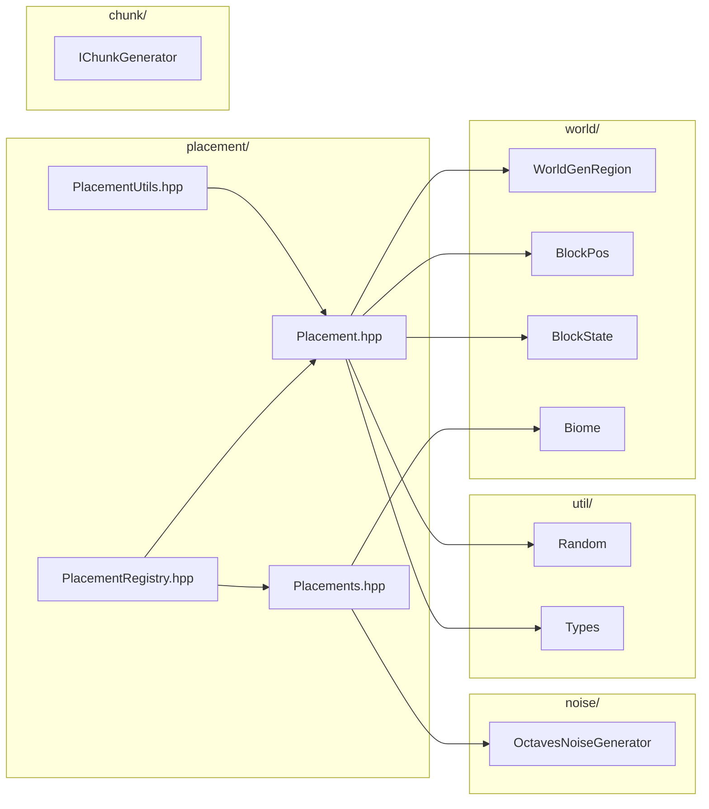

# 放置器系统 (Placement System)

本目录实现了 Minecraft 1.16.5 的特征放置器系统，控制特征（矿石、树木、花草等）在世界中的放置位置。

## 目录结构

```
placement/
├── Placement.hpp          # 放置器基类和基础配置定义
├── Placement.cpp          # 放置器基类实现
├── Placements.hpp         # 扩展放置器类定义
├── Placements.cpp         # 扩展放置器实现
├── PlacementRegistry.hpp  # 放置器注册表定义
├── PlacementRegistry.cpp  # 放置器注册表实现
├── PlacementUtils.hpp     # 工具函数声明
├── PlacementUtils.cpp     # 工具函数实现
└── README.md              # 本文档
```

---

## 文件详解

### 1. Placement.hpp / Placement.cpp

放置器系统的核心文件，定义了放置器基类和基础配置类型。

#### 配置结构体

| 配置类                       | 说明             | 关键字段                               |
| ---------------------------- | ---------------- | -------------------------------------- |
| `IPlacementConfig`           | 配置基类         | 无（纯虚接口）                         |
| `EmptyPlacementConfig`       | 空配置           | 无                                     |
| `CountPlacementConfig`       | 数量配置         | `count` - 每区块尝试次数               |
| `HeightRangePlacementConfig` | 高度范围配置     | `bottomOffset`, `topOffset`, `maximum` |
| `BiomePlacementConfig`       | 生物群系过滤配置 | `allowedBiomes` - 允许的生物群系ID列表 |
| `ChancePlacementConfig`      | 概率配置         | `chance` - 成功概率 (0.0-1.0)          |
| `SurfacePlacementConfig`     | 地表放置配置     | `maxWaterDepth`, `requireSunlight`     |

#### 放置器类

```cpp
class Placement {
public:
    virtual std::vector<BlockPos> getPositions(
        WorldGenRegion& region,
        math::Random& random,
        const IPlacementConfig& config,
        const BlockPos& basePos) const = 0;

    virtual const char* name() const = 0;
};
```

| 放置器类               | 说明               | 行为                         |
| ---------------------- | ------------------ | ---------------------------- |
| `CountPlacement`       | 数量放置器         | 将基础位置复制 N 次          |
| `HeightRangePlacement` | 高度范围放置器     | 在指定 Y 范围内随机选择高度  |
| `SquarePlacement`      | 方形分散放置器     | 在 XZ 平面内随机分散 (0-15)  |
| `BiomePlacement`       | 生物群系过滤放置器 | 仅在指定生物群系中放置       |
| `ChancePlacement`      | 概率放置器         | 以指定概率决定是否放置       |
| `SurfacePlacement`     | 地表放置器         | 从顶部向下搜索第一个固体方块 |

#### ConfiguredPlacement 类

配置化的放置器，支持链式调用：

```cpp
class ConfiguredPlacement {
public:
    ConfiguredPlacement(std::unique_ptr<Placement> placement,
                        std::unique_ptr<IPlacementConfig> config);

    std::vector<BlockPos> getPositions(...) const;

    // 链式添加放置器
    std::unique_ptr<ConfiguredPlacement> then(
        std::unique_ptr<Placement> placement,
        std::unique_ptr<IPlacementConfig> config) const;

    void setNext(std::unique_ptr<ConfiguredPlacement> next);
};
```

---

### 2. Placements.hpp / Placements.cpp

扩展放置器定义，包含基于噪声和环境的放置器。

#### 扩展配置结构体

| 配置类                      | 说明         | 关键字段                                   |
| --------------------------- | ------------ | ------------------------------------------ |
| `NoisePlacementConfig`      | 噪声阈值配置 | `noiseLevel`, `noiseFactor`, `noiseOffset` |
| `CountNoiseConfig`          | 噪声数量配置 | `noiseLevel`, `belowCount`, `aboveCount`   |
| `DepthAverageConfig`        | 深度平均配置 | `baseline`, `spread`                       |
| `RandomOffsetConfig`        | 随机偏移配置 | `xzSpread`, `ySpread`                      |
| `WaterDepthThresholdConfig` | 水深阈值配置 | `maxWaterDepth`                            |
| `SeaLevelConfig`            | 海平面配置   | `offset` - 相对海平面的偏移                |

#### 扩展放置器类

| 放置器类                       | 说明           | 行为                   |
| ------------------------------ | -------------- | ---------------------- |
| `NoisePlacement`               | 噪声阈值放置器 | 根据噪声值决定是否放置 |
| `CountNoisePlacement`          | 噪声数量放置器 | 根据噪声值决定放置数量 |
| `DepthAveragePlacement`        | 深度平均放置器 | 在基准深度附近放置     |
| `TopSolidPlacement`            | 顶层固体放置器 | 在最高固体方块上放置   |
| `CarvingMaskPlacement`         | 雕刻掩码放置器 | 在雕刻位置放置         |
| `RandomOffsetPlacement`        | 随机偏移放置器 | 对位置进行随机偏移     |
| `WaterDepthThresholdPlacement` | 水深阈值放置器 | 根据水深决定是否放置   |
| `SeaLevelPlacement`            | 海平面放置器   | 在海平面附近放置       |
| `SpreadPlacement`              | 扩散放置器     | 在原始位置周围扩散放置 |

---

### 3. PlacementRegistry.hpp / PlacementRegistry.cpp

放置器注册表，管理所有已注册的放置器类型。

#### PlacementRegistry 类

```cpp
class PlacementRegistry {
public:
    static PlacementRegistry& instance();

    void initialize();  // 注册所有内置放置器

    void registerPlacement(const String& name, std::unique_ptr<Placement> placement);
    const Placement* get(const String& name) const;
    bool isInitialized() const;
    std::vector<String> getNames() const;
};
```

#### 注册的放置器名称

| 名称                    | 类                             |
| ----------------------- | ------------------------------ |
| `count`                 | `CountPlacement`               |
| `height_range`          | `HeightRangePlacement`         |
| `square`                | `SquarePlacement`              |
| `biome`                 | `BiomePlacement`               |
| `chance`                | `ChancePlacement`              |
| `surface`               | `SurfacePlacement`             |
| `noise`                 | `NoisePlacement`               |
| `count_noise`           | `CountNoisePlacement`          |
| `depth_average`         | `DepthAveragePlacement`        |
| `top_solid`             | `TopSolidPlacement`            |
| `carving_mask`          | `CarvingMaskPlacement`         |
| `random_offset`         | `RandomOffsetPlacement`        |
| `water_depth_threshold` | `WaterDepthThresholdPlacement` |
| `sea_level`             | `SeaLevelPlacement`            |
| `spread`                | `SpreadPlacement`              |

---

### 4. PlacementUtils.hpp / PlacementUtils.cpp

放置器工具函数，提供常用的放置器构建辅助。

#### 工具函数

```cpp
namespace PlacementUtils {

// 在放置链末尾添加生物群系过滤
std::unique_ptr<ConfiguredPlacement> appendBiomePlacement(
    std::unique_ptr<ConfiguredPlacement> root,
    std::vector<u32> allowedBiomes);

// 创建地表放置链（带数量）
// 创建 Count -> Square -> Surface 链
std::unique_ptr<ConfiguredPlacement> createCountedSurfacePlacement(
    i32 count, i32 maxWaterDepth = 0);

// 创建地表放置链（带概率）
// 创建 Chance -> Square -> Surface 链
std::unique_ptr<ConfiguredPlacement> createChanceSurfacePlacement(
    f32 chance, i32 maxWaterDepth = 0);

// 创建高度范围放置链（带数量）
// 创建 Count -> Square -> HeightRange 链
std::unique_ptr<ConfiguredPlacement> createCountedHeightPlacement(
    i32 count, i32 minY, i32 maxY);

} // namespace PlacementUtils
```

---

## 架构图

```mermaid
graph TB
    subgraph 配置层
        IC[IPlacementConfig<br/>配置基类]
        EC[EmptyPlacementConfig]
        CC[CountPlacementConfig]
        HC[HeightRangePlacementConfig]
        BC[BiomePlacementConfig]
        CHC[ChancePlacementConfig]
        SC[SurfacePlacementConfig]
        NC[NoisePlacementConfig]
        CNC[CountNoiseConfig]
        DAC[DepthAverageConfig]
        ROC[RandomOffsetConfig]
        WDC[WaterDepthThresholdConfig]
        SLC[SeaLevelConfig]
    end

    subgraph 放置器层
        P[Placement<br/>放置器基类]
        CP[CountPlacement]
        HP[HeightRangePlacement]
        SP[SquarePlacement]
        BP[BiomePlacement]
        CH[ChancePlacement]
        SU[SurfacePlacement]
        NP[NoisePlacement]
        CNP[CountNoisePlacement]
        DAP[DepthAveragePlacement]
        TSP[TopSolidPlacement]
        CMP[CarvingMaskPlacement]
        ROP[RandomOffsetPlacement]
        WD[WaterDepthThresholdPlacement]
        SE[SeaLevelPlacement]
        ST[SpreadPlacement]
    end

    subgraph 组合层
        CFG[ConfiguredPlacement<br/>配置化放置器]
    end

    subgraph 注册层
        PR[PlacementRegistry<br/>放置器注册表]
    end

    subgraph 工具层
        PU[PlacementUtils<br/>工具函数]
    end

    IC --> EC
    IC --> CC
    IC --> HC
    IC --> BC
    IC --> CHC
    IC --> SC
    IC --> NC
    IC --> CNC
    IC --> DAC
    IC --> ROC
    IC --> WDC
    IC --> SLC

    P --> CP
    P --> HP
    P --> SP
    P --> BP
    P --> CH
    P --> SU
    P --> NP
    P --> CNP
    P --> DAP
    P --> TSP
    P --> CMP
    P --> ROP
    P --> WD
    P --> SE
    P --> ST

    CP -.-> CC
    HP -.-> HC
    BP -.-> BC
    CH -.-> CHC
    SU -.-> SC
    NP -.-> NC
    CNP -.-> CNC
    DAP -.-> DAC
    ROP -.-> ROC
    WD -.-> WDC
    SE -.-> SLC

    CFG --> P
    CFG --> IC

    PR --> P
    PU --> CFG
```



---

## 放置器链工作流程


**示例：矿石放置链**

```cpp
// 煤矿：每区块10次尝试，高度0-128
auto coalPlacement = PlacementUtils::createCountedHeightPlacement(10, 0, 128);

// 钻石矿：每区块8次尝试，高度2-16，深度平均
auto diamondPlacement = std::make_unique<ConfiguredPlacement>(
    std::make_unique<CountPlacement>(),
    std::make_unique<CountPlacementConfig>(8)
);
diamondPlacement->setNext(
    std::make_unique<ConfiguredPlacement>(
        std::make_unique<HeightRangePlacement>(),
        std::make_unique<HeightRangePlacementConfig>(2, 0, 16)
    )
);
```

---

## 整体职责

放置器系统负责控制特征（Feature）在世界中的**放置位置**。它是特征生成流水线的最后一步：

```
区块生成 → 特征选择 → 放置器确定位置 → 特征放置
```

### 核心职责

1. **位置筛选**：根据高度、生物群系、噪声等条件筛选有效位置
2. **数量控制**：决定每个区块放置多少次特征
3. **位置分散**：在区块内分散放置位置，避免聚集
4. **环境检测**：检测地表、水深、固体方块等环境条件
5. **链式处理**：支持多个放置器串联，逐步精炼位置

---

## 输入和输出

### 输入

| 输入项       | 类型               | 来源       | 说明                   |
| ------------ | ------------------ | ---------- | ---------------------- |
| 基础位置     | `BlockPos`         | 区块生成器 | 通常是区块起始坐标     |
| 世界生成区域 | `WorldGenRegion`   | 区块生成器 | 提供方块和生物群系访问 |
| 随机数       | `math::Random`     | 区块生成器 | 确定性的随机源         |
| 配置         | `IPlacementConfig` | 特征定义   | 放置参数               |

### 输出

| 输出项       | 类型                    | 目标       | 说明               |
| ------------ | ----------------------- | ---------- | ------------------ |
| 放置位置列表 | `std::vector<BlockPos>` | 特征生成器 | 有效放置位置的列表 |

---

## 依赖项

### 内部依赖



### 外部依赖

| 库       | 用途     |
| -------- | -------- |
| `glm`    | 数学运算 |
| `spdlog` | 日志记录 |

---

## 使用方法

### 1. 直接使用放置器

```cpp
#include "Placement.hpp"

// 创建放置器和配置
CountPlacement placement;
CountPlacementConfig config(10);  // 10次尝试

// 获取放置位置
math::Random random(seed);
std::vector<BlockPos> positions = placement.getPositions(region, random, config, basePos);
```

### 2. 使用配置化放置链

```cpp
#include "PlacementUtils.hpp"

// 创建地表放置链（树木）
auto treePlacement = PlacementUtils::createCountedSurfacePlacement(
    5,      // 每区块5棵树
    2       // 最大水深2格
);

// 添加生物群系过滤
treePlacement = PlacementUtils::appendBiomePlacement(
    std::move(treePlacement),
    { BiomeIds::FOREST, BiomeIds::BIRCH_FOREST }
);

// 获取最终位置
auto positions = treePlacement->getPositions(region, random, BlockPos(chunkX * 16, 0, chunkZ * 16));
```

### 3. 从注册表获取放置器

```cpp
#include "PlacementRegistry.hpp"

// 初始化注册表
PlacementRegistry::instance().initialize();

// 按名称获取放置器
const Placement* countPlacement = PlacementRegistry::instance().get("count");
const Placement* biomePlacement = PlacementRegistry::instance().get("biome");
```

### 4. 自定义放置器

```cpp
class CustomPlacement : public Placement {
public:
    std::vector<BlockPos> getPositions(
        WorldGenRegion& region,
        math::Random& random,
        const IPlacementConfig& config,
        const BlockPos& basePos) const override
    {
        // 自定义逻辑
        std::vector<BlockPos> result;
        // ...
        return result;
    }

    const char* name() const override { return "custom"; }
};
```

---

## 容易踩的坑

### 1. 配置类型不匹配

**问题**：使用错误的配置类型导致 `dynamic_cast` 返回 `nullptr`。

```cpp
// 错误：配置类型不匹配
CountPlacement placement;
HeightRangePlacementConfig config(0, 0, 64);  // 错误！
auto positions = placement.getPositions(region, random, config, pos);
// 内部 dynamic_cast 会失败
```

**解决**：确保配置类型与放置器类型匹配。

```cpp
// 正确
CountPlacement placement;
CountPlacementConfig config(10);
auto positions = placement.getPositions(region, random, config, pos);
```

### 2. 放置链顺序错误

**问题**：放置器链的顺序影响结果，顺序错误导致不符合预期的行为。

```cpp
// 错误顺序：先过滤高度，再分散
// 结果：所有位置在相同高度，分散无效
chain->setNext(heightRange);
chain->setNext(square);

// 正确顺序：先分散，再过滤高度
chain->setNext(square);
chain->setNext(heightRange);
```

**推荐顺序**：`Count -> Square -> HeightRange/Biome -> Surface`

### 3. 空配置误用

**问题**：某些放置器需要配置但传入了 `EmptyPlacementConfig`。

```cpp
// 错误：CountPlacement 需要 CountPlacementConfig
auto config = std::make_unique<EmptyPlacementConfig>();
auto placement = std::make_unique<ConfiguredPlacement>(
    std::make_unique<CountPlacement>(),
    std::move(config)  // 配置无效！
);
```

### 4. 生物群系ID错误

**问题**：`BiomePlacementConfig` 使用错误的生物群系ID。

```cpp
// 错误：使用硬编码数字可能不正确
BiomePlacementConfig config({1, 2, 3});  // ID可能已变化

// 正确：使用 BiomeIds 常量
BiomePlacementConfig config({
    BiomeIds::FOREST,
    BiomeIds::BIRCH_FOREST
});
```

### 5. 随机数种子一致性

**问题**：相同种子应产生相同结果，但随机数使用不一致。

```cpp
// 错误：每次创建新随机数生成器
f32 getChunkNoise(i64 seed, i32 chunkX, i32 chunkZ) {
    math::Random random(seed + chunkX * chunkZ);  // 种子计算不一致
    return random.nextFloat();
}

// 正确：使用确定性哈希
u64 hash = static_cast<u64>(chunkX) * 3418731287ULL
         ^ static_cast<u64>(chunkZ) * 132897987541ULL;
hash ^= static_cast<u64>(seed);
```

### 6. WorldGenRegion 边界检查

**问题**：访问区块边界外的方块可能返回 `nullptr`。

```cpp
// 可能返回 nullptr
const BlockState* state = region.getBlockState(basePos.x, y, basePos.z);
if (state == nullptr) {
    return {};  // 正确处理
}
```

### 7. SurfacePlacement 水深检测

**问题**：`SurfacePlacement` 检测水深时未考虑极端情况。

```cpp
// 在 SurfacePlacement::getPositions 中
// 检查水深时从 topY 向下遍历
for (i32 y = MAX_Y; y >= MIN_Y; --y) {
    // ...
    if (state->is(VanillaBlocks::WATER)) {
        i32 waterDepth = 0;
        for (i32 wy = y; wy >= MIN_Y && waterDepth <= config.maxWaterDepth; --wy) {
            // TODO：需要检查 wy >= MIN_Y
        }
    }
}
```

---

## 涉及的测试用例

| 测试文件                               | 路径                   | 测试内容                 |
| -------------------------------------- | ---------------------- | ------------------------ |
| `test_ore_feature.cpp`                 | `tests/common/`        | 放置器与矿石特征集成测试 |
| `EntitySpawnPlacementRegistryTest.cpp` | `tests/common/entity/` | 实体生成放置注册测试     |

### 测试示例

```cpp
// tests/common/test_ore_feature.cpp
TEST_F(PlacementTest, CountPlacement) {
    CountPlacement placement;
    CountPlacementConfig config(5);  // 5次尝试

    // 验证配置
    EXPECT_EQ(config.count, 5);
    EXPECT_STREQ(placement.name(), "count");
}

TEST_F(PlacementTest, HeightRangePlacementConfig) {
    // 均匀分布
    auto uniform = HeightRangePlacementConfig::uniform(10, 50);
    EXPECT_EQ(uniform.bottomOffset, 10);
    EXPECT_EQ(uniform.maximum, 50);

    // 三角形分布
    auto triangle = HeightRangePlacementConfig::triangle(30, 10);
    EXPECT_EQ(triangle.bottomOffset, 20);
    EXPECT_EQ(triangle.maximum, 40);
}
```

---

## 与 MC 1.16.5 的对应关系

| 本项目类                       | MC 1.16.5 类                   | 说明         |
| ------------------------------ | ------------------------------ | ------------ |
| `Placement`                    | `Placement`                    | 放置器基类   |
| `IPlacementConfig`             | `IPlacementConfig`             | 配置基类     |
| `CountPlacement`               | `CountPlacement`               | 数量放置     |
| `HeightRangePlacement`         | `RangePlacement`               | 高度范围     |
| `SquarePlacement`              | `SquarePlacement`              | 方形分散     |
| `BiomePlacement`               | `BiomePlacement`               | 生物群系过滤 |
| `ChancePlacement`              | `ChancePlacement`              | 概率放置     |
| `SurfacePlacement`             | `SurfacePlacement`             | 地表放置     |
| `NoisePlacement`               | `NoiseBasedPlacement`          | 噪声放置     |
| `CountNoisePlacement`          | `CountNoisePlacement`          | 噪声数量     |
| `DepthAveragePlacement`        | `DepthAveragePlacement`        | 深度平均     |
| `TopSolidPlacement`            | `TopSolidPlacement`            | 顶层固体     |
| `CarvingMaskPlacement`         | `CarvingMaskPlacement`         | 雕刻掩码     |
| `RandomOffsetPlacement`        | `RandomOffsetPlacement`        | 随机偏移     |
| `WaterDepthThresholdPlacement` | `WaterDepthThresholdPlacement` | 水深阈值     |
| `SeaLevelPlacement`            | `SeaLevelPlacement`            | 海平面       |
| `SpreadPlacement`              | `SpreadPlacement`              | 扩散放置     |

---

## 参考资料

- Minecraft 1.16.5 源码：`D:\Minecraft\MC研究\Minecraft1.16.5源码\net\minecraft\world\gen\placement`
- MC Wiki 放置器：https://minecraft.fandom.com/wiki/Placement

---

## 版本历史

| 版本  | 日期    | 变更                     |
| ----- | ------- | ------------------------ |
| 1.0.0 | 2025-03 | 初始版本，实现15种放置器 |
