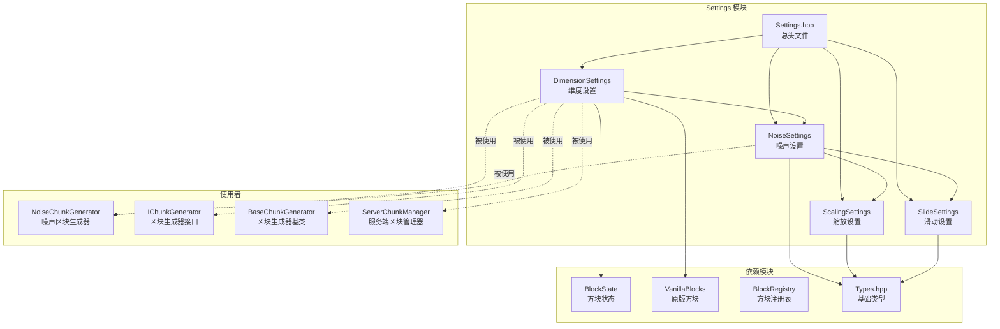

# Settings 模块 - 世界生成设置

本模块包含世界生成的配置设置，参考 Minecraft 1.16.5 的 DimensionSettings 和 NoiseSettings 实现。

## 目录结构

```
settings/
├── DimensionSettings.cpp    # 维度设置实现
├── DimensionSettings.hpp    # 维度设置定义
├── NoiseSettings.hpp        # 噪声设置定义
├── ScalingSettings.hpp      # 缩放设置定义
├── Settings.hpp             # 总头文件（包含所有设置）
└── SlideSettings.hpp        # 滑动设置定义
```

## 文件详解

### 1. ScalingSettings.hpp

**职责**：噪声缩放设置，控制噪声在不同轴上的缩放比例。

**内容**：
```cpp
struct ScalingSettings {
    f32 xzScale = 0.9999999814507745f;   // XZ 平面缩放
    f32 yScale = 0.9999999814507745f;    // Y 轴缩放
    f32 xzFactor = 80.0f;                 // XZ 因子
    f32 yFactor = 160.0f;                 // Y 因子
};
```

**参数说明**：
| 参数 | 默认值 | 说明 |
|------|--------|------|
| `xzScale` | 0.9999999814507745 | XZ 平面的噪声缩放，值越小地形越平缓 |
| `yScale` | 0.9999999814507745 | Y 轴的噪声缩放，影响地形高度变化 |
| `xzFactor` | 80.0 | XZ 平面噪声倍频因子 |
| `yFactor` | 160.0 | Y 轴噪声倍频因子 |

---

### 2. SlideSettings.hpp

**职责**：滑动设置，用于地形边界平滑过渡。

**内容**：
```cpp
struct SlideSettings {
    i32 target = 0;    // 目标值
    i32 size = 0;      // 大小（影响范围）
    i32 offset = 0;    // 偏移
};
```

**参数说明**：
| 参数 | 说明 |
|------|------|
| `target` | 滑动的目标密度值 |
| `size` | 滑动影响的范围大小 |
| `offset` | 滑动起始位置的偏移量 |

**作用**：使地形在接近世界顶部和底部时逐渐变得平坦，避免地形突然截断。

---

### 3. NoiseSettings.hpp

**职责**：噪声地形生成设置，配置地形噪声生成的核心参数。

**内容**：

```cpp
struct NoiseSettings {
    // === 基本尺寸 ===
    i32 height = 256;                       // 噪声高度
    i32 sizeHorizontal = 1;                 // 水平大小
    i32 sizeVertical = 2;                   // 垂直大小

    // === 缩放设置 ===
    ScalingSettings scaling;

    // === 滑动设置 ===
    SlideSettings topSlide{-10, 3, 0};      // 顶部滑动
    SlideSettings bottomSlide{-30, 0, 0};   // 底部滑动

    // === 密度参数 ===
    f32 densityFactor = 1.0f;                // 密度因子
    f32 densityOffset = -0.46875f;           // 密度偏移

    // === 噪声选项 ===
    bool simplexSurfaceNoise = true;        // 使用 Simplex 地表噪声
    bool randomDensityOffset = true;        // 随机密度偏移
    bool isAmplified = false;               // 放大化地形
};
```

**计算方法**：
```cpp
// 噪声尺寸计算
i32 noiseSizeX() const;    // 16 / (sizeHorizontal * 4)
i32 noiseSizeY() const;    // height / (sizeVertical * 4)
i32 noiseSizeZ() const;    // 16 / (sizeHorizontal * 4)

// 噪声粒度
i32 verticalNoiseGranularity() const;   // sizeVertical * 4
i32 horizontalNoiseGranularity() const; // sizeHorizontal * 4
```

**预设方法**：
| 方法 | 用途 |
|------|------|
| `NoiseSettings::overworld()` | 主世界标准设置 |
| `NoiseSettings::amplified()` | 放大化主世界设置 |
| `NoiseSettings::nether()` | 下界设置 |
| `NoiseSettings::end()` | 末地设置 |

---

### 4. DimensionSettings.hpp / .cpp

**职责**：维度生成设置，包含维度级别的生成配置。

**内容**：
```cpp
struct DimensionSettings {
    NoiseSettings noise;                    // 噪声设置
    const BlockState* defaultBlock = nullptr;   // 默认方块（石头等）
    const BlockState* defaultFluid = nullptr;   // 默认流体（水/熔岩）
    i32 seaLevel = 63;                      // 海平面高度
    i32 bedrockRoof = -10;                  // 基岩顶部（下界用）
    i32 bedrockFloor = 0;                   // 基岩底部
};
```

**预设方法**：
| 方法 | 默认方块 | 默认流体 | 海平面 | 说明 |
|------|----------|----------|--------|------|
| `DimensionSettings::overworld()` | 石头 | 水 | 63 | 主世界 |
| `DimensionSettings::nether()` | 下界岩 | 熔岩 | 32 | 下界 |
| `DimensionSettings::end()` | 末地石 | 空气 | 0 | 末地 |
| `DimensionSettings::flat()` | 石头 | 空气 | 0 | 平坦世界 |

---

### 5. Settings.hpp

**职责**：总头文件，方便一次性包含所有设置类型。

**内容**：
```cpp
#pragma once

#include "ScalingSettings.hpp"
#include "SlideSettings.hpp"
#include "NoiseSettings.hpp"
#include "DimensionSettings.hpp"
```

---

## 模块关系图



---

## 整体职责

Settings 模块负责**定义世界生成的配置参数**，包括：

1. **维度级别配置**：默认方块、流体、海平面等
2. **噪声参数配置**：地形噪声的尺寸、密度、滑动等
3. **预设配置**：提供主世界、下界、末地、平坦世界的开箱即用配置

---

## 输入和输出

### 输入
该模块不接收外部输入，所有配置都是预设的静态值。

### 输出
- **DimensionSettings** 结构体，供区块生成器使用
- **NoiseSettings** 结构体，供噪声生成器使用
- **ScalingSettings** 和 **SlideSettings** 作为 NoiseSettings 的组件

---

## 依赖项

### 内部依赖
```cpp
#include "../../../core/Types.hpp"              // 基础类型 (i32, f32 等)
#include "../../block/Block.hpp"                // 方块基类
#include "../../block/VanillaBlocks.hpp"        // 原版方块定义
#include "../../block/BlockRegistry.hpp"        // 方块注册表
```

### 被依赖
```cpp
// 区块生成器
#include "common/world/gen/settings/DimensionSettings.hpp"
#include "common/world/gen/settings/NoiseSettings.hpp"

// 服务端
#include "common/world/gen/settings/DimensionSettings.hpp"
```

---

## 使用方法

### 基本使用

```cpp
#include "common/world/gen/settings/Settings.hpp"

// 创建主世界设置
mc::DimensionSettings settings = mc::DimensionSettings::overworld();

// 创建区块生成器
auto generator = std::make_unique<mc::NoiseChunkGenerator>(
    seed,                    // 世界种子
    std::move(settings)      // 维度设置
);

// 使用生成器生成区块
mc::ChunkPrimer primer(chunkX, chunkZ);
generator->generateBiomes(region, primer);
generator->generateNoise(region, primer);
generator->buildSurface(region, primer);
```

### 自定义设置

```cpp
// 自定义维度设置
mc::DimensionSettings custom;
custom.noise = mc::NoiseSettings::overworld();
custom.noise.isAmplified = true;       // 放大化地形
custom.noise.densityFactor = 2.0f;     // 增加密度变化
custom.defaultBlock = mc::VanillaBlocks::getState(mc::VanillaBlocks::STONE);
custom.defaultFluid = mc::VanillaBlocks::getState(mc::VanillaBlocks::WATER);
custom.seaLevel = 128;                 // 提高海平面

// 自定义噪声设置
mc::NoiseSettings noise;
noise.height = 512;                    // 增加世界高度
noise.sizeHorizontal = 2;              // 增大水平噪声尺寸
noise.sizeVertical = 1;                // 减小垂直噪声尺寸
noise.densityFactor = 1.5f;
noise.densityOffset = -0.3f;
```

### 在服务端初始化中使用

```cpp
// IntegratedServer.cpp 或 StandaloneServer.cpp
void Server::initializeWorld() {
    auto settings = DimensionSettings::overworld();
    auto generator = std::make_unique<NoiseChunkGenerator>(
        m_seed,
        std::move(settings)
    );
    m_chunkManager = std::make_unique<ServerChunkManager>(
        *m_world,
        std::move(generator)
    );
}
```

---

## 容易踩的坑

### 1. BlockState 指针有效性

```cpp
// ❌ 错误：在方块注册前获取 BlockState
DimensionSettings settings = DimensionSettings::overworld();  // defaultBlock 为 nullptr

// ✅ 正确：在方块注册后获取
BlockRegistry::instance().initialize();
VanillaBlocks::registerAll();
DimensionSettings settings = DimensionSettings::overworld();  // defaultBlock 有效
```

**原因**：`DimensionSettings::overworld()` 等预设方法在调用时从 `VanillaBlocks::getState()` 获取 `BlockState*`。如果方块尚未注册，返回的指针为 `nullptr`。

### 2. NoiseSettings 的默认值不适合所有维度

```cpp
// ❌ 错误：直接使用默认 NoiseSettings
NoiseSettings noise;  // 默认值是主世界参数
// 用于下界会有问题

// ✅ 正确：使用预设或自定义
NoiseSettings noise = NoiseSettings::nether();  // 下界专用参数
```

### 3. 海平面高度与噪声高度的配合

```cpp
// ❌ 错误：海平面超过噪声高度
DimensionSettings settings;
settings.noise.height = 128;
settings.seaLevel = 200;  // 海平面超过世界高度！

// ✅ 正确：海平面在噪声高度范围内
settings.noise.height = 256;
settings.seaLevel = 63;   // 合理的海平面
```

### 4. 下界的特殊基岩设置

```cpp
// 下界需要设置 bedrockRoof
DimensionSettings nether = DimensionSettings::nether();
// bedrockRoof = 127 (顶部基岩层)
// bedrockFloor = 0 (底部基岩层)
```

### 5. 密度参数的影响

```cpp
// densityFactor 和 densityOffset 控制地形高度分布
// densityFactor > 0: 密度随深度增加
// densityOffset < 0: 增加空气空间

// 主世界默认
densityFactor = 1.0f;
densityOffset = -0.46875f;

// 放大化世界
densityFactor = 2.0f;  // 更大的高度变化

// 下界
densityFactor = 0.0f;   // 无深度相关密度
densityOffset = 0.019921875f;  // 基础密度
```

---

## 涉及的测试用例

| 测试文件 | 测试内容 |
|----------|----------|
| `tests/common/test_chunk_generation.cpp` | 区块生成测试，使用 `NoiseSettings` |
| `tests/server/ServerChunkManagerCallbackTest.cpp` | 区块管理器回调测试，使用 `DimensionSettings::overworld()` |
| `tests/server/test_server_chunk_manager.cpp` | 服务端区块管理器测试，使用 `DimensionSettings::overworld()` |

### 测试示例

```cpp
// tests/common/test_chunk_generation.cpp
#include "common/world/gen/settings/NoiseSettings.hpp"

TEST(ChunkGenerationTest, GenerateOverworldChunk) {
    auto settings = DimensionSettings::overworld();
    auto generator = std::make_unique<NoiseChunkGenerator>(12345, std::move(settings));
    
    ChunkPrimer primer(0, 0);
    // ... 生成测试
}
```

---

## 配置参数速查表

### 主世界 (Overworld)

| 参数 | 值 |
|------|-----|
| height | 256 |
| sizeHorizontal | 1 |
| sizeVertical | 2 |
| densityFactor | 1.0 |
| densityOffset | -0.46875 |
| topSlide | {-10, 3, 0} |
| bottomSlide | {-30, 0, 0} |
| seaLevel | 63 |
| defaultBlock | 石头 |
| defaultFluid | 水 |

### 下界 (Nether)

| 参数 | 值 |
|------|-----|
| height | 128 |
| sizeHorizontal | 1 |
| sizeVertical | 2 |
| densityFactor | 0.0 |
| densityOffset | 0.019921875 |
| topSlide | {120, 3, 0} |
| bottomSlide | {320, 4, -1} |
| seaLevel | 32 |
| bedrockRoof | 127 |
| bedrockFloor | 0 |
| defaultBlock | 下界岩 |
| defaultFluid | 熔岩 |

### 末地 (End)

| 参数 | 值 |
|------|-----|
| height | 128 |
| sizeHorizontal | 2 |
| sizeVertical | 1 |
| densityFactor | 0.0 |
| densityOffset | 0.0 |
| seaLevel | 0 |
| defaultBlock | 末地石 |
| defaultFluid | 空气 |

---

## 参考链接

- MC 1.16.5 源码: `net.minecraft.world.gen.DimensionSettings`
- MC 1.16.5 源码: `net.minecraft.world.gen.NoiseSettings`
- 项目文档: `CLAUDE.md` - World Generation System 章节
