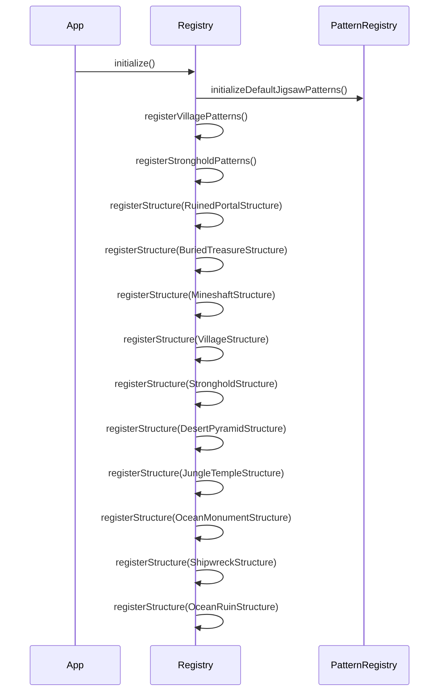
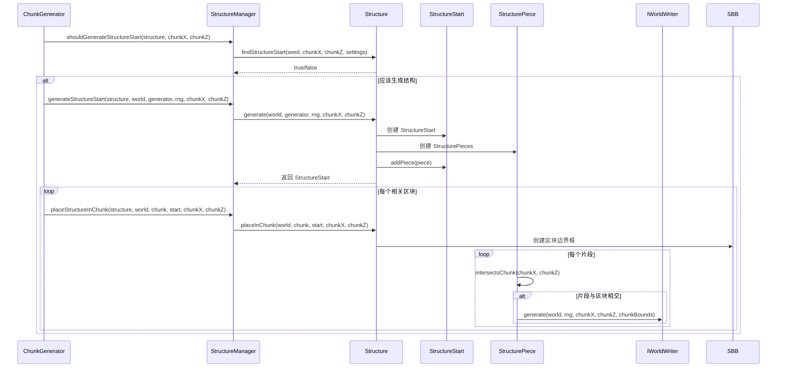
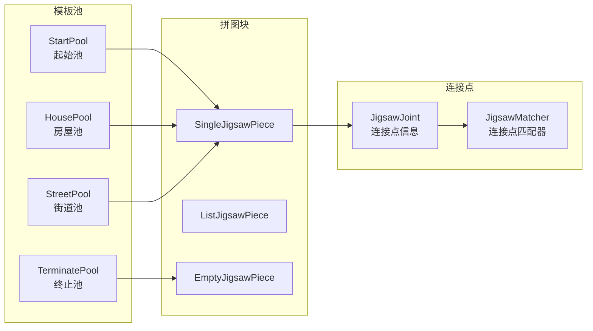
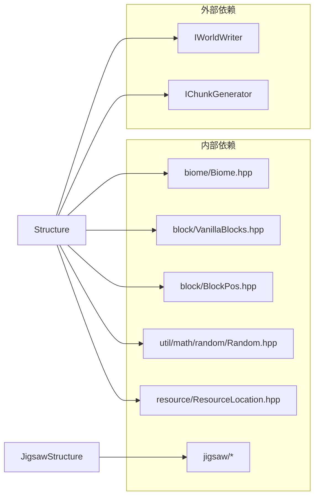
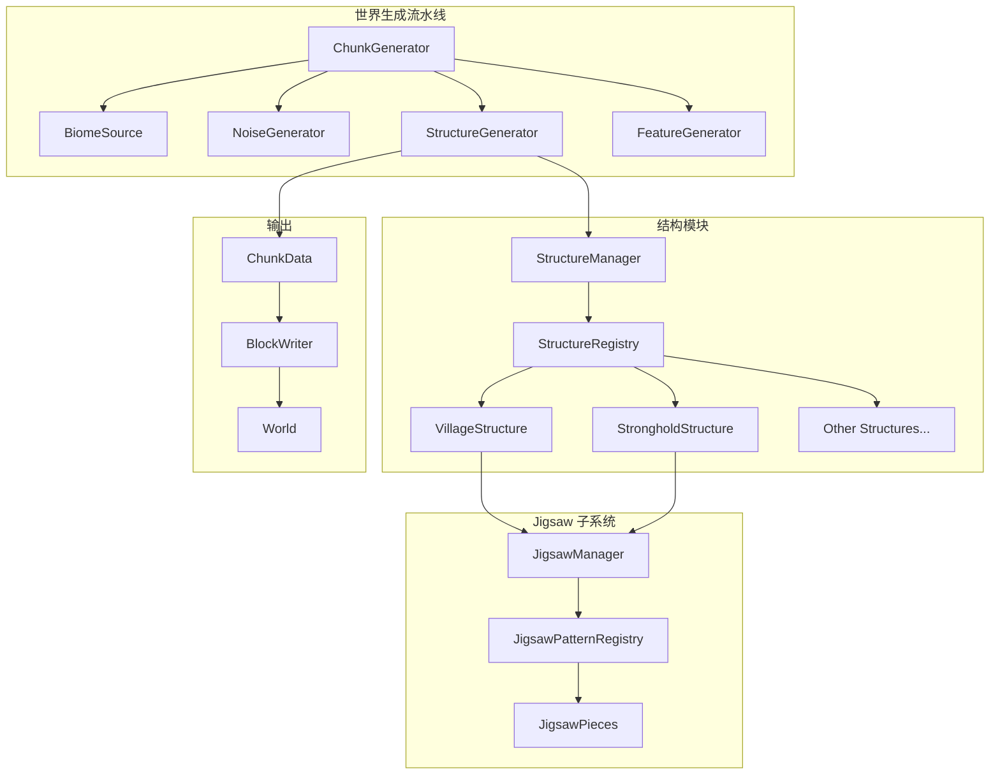

#结构生成系统(Structure Generation System)

[中文](#概述) |
    [English](#overview)

            ##概述

`src / common
        / world / gen /
        structure` 目录实现了 Minecraft
        1.16.5 风格的世界结构生成系统。该系统负责在区块生成过程中放置各种复杂结构，包括村庄、废弃矿井、要塞、沙漠神殿、丛林神庙、海洋纪念碑、废弃传送门、埋藏宝藏、沉船、海底废墟、雪屋、沼泽小屋、下界化石、掠夺者前哨站、末地城、林地府邸和堡垒遗迹等。

        ##目录结构

``` structure
        /
├── Structure.hpp #结构基类定义
├── Structure.cpp #结构基类实现
├── StructureBoundingBox.hpp #结构边界框
├── JigsawStructure.hpp #Jigsaw 结构（基于模板池的结构）
├── JigsawStructure.cpp
├── StructureManager.hpp #结构管理器和注册表
├── StructureManager.cpp
├── pieces / #结构片段（预留目录）
└── structures /
        #具体结构实现
    ├── README.md #结构实现子目录说明
    ├── VillageStructure.hpp #村庄结构
    ├── StrongholdStructure.hpp #要塞结构
    ├── MineshaftStructure.hpp #废弃矿井结构
    ├── DesertPyramidStructure.hpp #沙漠神殿结构
    ├── JungleTempleStructure.hpp #丛林神庙结构
    ├── OceanMonumentStructure.hpp #海洋纪念碑结构
    ├── RuinedPortalStructure.hpp #废弃传送门结构
    ├── BuriedTreasureStructure.hpp #埋藏宝藏结构
    ├── ShipwreckStructure.hpp #沉船结构
    ├── OceanRuinStructure.hpp #海底废墟结构
    ├── FortressStructure.hpp #下界要塞结构
    ├── IglooStructure.hpp #雪屋结构
    ├── SwampHutStructure.hpp #沼泽小屋（女巫小屋）结构
    ├── NetherFossilStructure.hpp #下界化石结构
    ├── PillagerOutpostStructure.hpp #掠夺者前哨站结构
    ├── EndCityStructure.hpp #末地城结构
    ├── WoodlandMansionStructure.hpp #林地府邸结构
    └── BastionRemnantStructure.hpp #堡垒遗迹结构
```

        ##已实现结构列表

    | 结构类型 | 类名 | 生成生物群系 | 实现方式 | | -- -- -- -- -| -- -- --| -- -- -- -- -- -- -| -- -- -- -- -| | 村庄
    | VillageStructure | 平原、沙漠、热带草原、针叶林、雪地 | Jigsaw | | 要塞 | StrongholdStructure | 主世界多数生物群系
    | 递归 StructurePiece | | 废弃矿井 | MineshaftStructure | 所有生物群系 | 程序化 | | 沙漠神殿
    | DesertPyramidStructure | 沙漠 | 模板 | | 丛林神庙 | JungleTempleStructure | 丛林 | 模板 | | 海洋纪念碑
    | OceanMonumentStructure | 深海 | 程序化 | | 废弃传送门 | RuinedPortalStructure | 所有生物群系 | 模板 | | 埋藏宝藏
    | BuriedTreasureStructure | 沙滩、雪地海滩 | 程序化 | | 沉船 | ShipwreckStructure | 海洋 | 模板 | | 海底废墟
    | OceanRuinStructure | 海洋 | 模板 | | 下界要塞 | FortressStructure | 下界荒地 | Jigsaw | | 雪屋 | IglooStructure
    | 雪地苔原、雪地针叶林 | 程序化 | | 沼泽小屋 | SwampHutStructure | 沼泽 | 程序化 | | 下界化石
    | NetherFossilStructure | 灵魂沙峡谷 | 程序化 | | 掠夺者前哨站 | PillagerOutpostStructure | 平原、沙漠、热带草原等
    | Jigsaw | | 末地城 | EndCityStructure | 末地外岛 | 程序化 | | 林地府邸 | WoodlandMansionStructure | 黑森林 | 程序化
    | | 堡垒遗迹 | BastionRemnantStructure | 下界（除玄武岩三角洲） | Jigsaw |

    ##文件详细说明

        ## #核心文件

        ####Structure.hpp
        /
        Structure.cpp

            ** 职责** : 定义所有结构类型的基类，提供结构生成的通用接口和基础设施。

                            ** 主要内容** :

```mermaid classDiagram class Structure {
    << abstract >> -StructureType m_type + name() const std::string &
        +separationSettings() const StructureSeparationSettings +
            validBiomes() const vector ~BiomeId ~&+canGenerate(world, generator, rng, chunkX, chunkZ) bool +
            generate(world, generator, rng, chunkX, chunkZ) unique_ptr ~StructureStart
            ~+placeInChunk(world, chunk, start, chunkX, chunkZ) void +
            findStructureStart(seed, chunkX, chunkZ, settings, outStartX, outStartZ) bool
#createRandom(seed, chunkX, chunkZ, salt) Random
}

class StructurePiece {
    << abstract >> -i32 m_type - i32 m_minX, m_minY, m_minZ - i32 m_maxX, m_maxY,
        m_maxZ + generate(world, rng, chunkX, chunkZ, chunkBounds) void + intersectsChunk(chunkX, chunkZ) bool
}

class StructureStart {
    - vector ~unique_ptr ~StructurePiece ~~m_pieces -
        i32 m_chunkX,
        m_chunkZ + addPiece(piece)void + pieces()const vector ~unique_ptr ~StructurePiece ~~&+isValid()bool
}

        Structure < |
    --StructureStart : contains StructureStart < |
    --StructurePiece : contains
```

                           ** 关键类型** :

    | 类型 | 说明 | | -- -- --| -- -- --| | `StructureType` | 结构类型枚举（Temple,
    Monument, Stronghold, Village 等） | | `StructureSeparationSettings` | 结构间距设置（spacing, separation,
    salt） | | `StructurePiece` | 结构片段基类，定义单个可生成片段 | | `StructureStart` | 结构实例，包含一组结构片段 |
    | `Rotation` | 旋转枚举（定义在 Direction.hpp） | | `Mirror` | 镜像枚举（定义在 Direction.hpp） |

                                                                       ** 旋转和镜像工具**（定义在 `util /
        Direction.hpp`）:

```cpp
            // 旋转工具函数（Rotations 命名空间）
            Rotation rot = Rotation::Clockwise90;
i32 degrees = Rotations::toDegrees(rot);                                     // 90
Rotation inv = Rotations::getInverse(rot);                                   // CounterClockwise90
Rotation sum = Rotations::add(Rotation::Clockwise90, Rotation::Clockwise90); // Clockwise180

// 镜像工具函数（Mirrors 命名空间）
Mirror mir = Mirror::LeftRight;
Mirror mirInv = Mirrors::getInverse(mir); // LeftRight（镜像自逆）

// 方向旋转
Direction rotated = Directions::rotateDirection(Direction::North, Rotation::Clockwise90); // East
```

        ** 关键方法** :

    - `findStructureStart()`: 使用网格算法确定是否在指定区块生成结构起点
                              - `canGenerate()`: 检查是否可以在指定位置生成结构
                                                 - `generate()`
    : 生成结构实例
      - `placeInChunk()`: 将结构片段放置到区块中

                          ####StructureBoundingBox.hpp

                              ** 职责** : 定义结构边界框，用于判断结构片段与区块的交集。

                                              ** 主要内容** :

```cpp class StructureBoundingBox {
    i32 m_minX, m_minY, m_minZ; // 最小坐标
    i32 m_maxX, m_maxY, m_maxZ; // 最大坐标
    bool m_valid;               // 是否有效

    // 静态工厂方法
    static StructureBoundingBox fromChunk(i32 chunkX, i32 chunkZ);

    // 查询方法
    bool contains(i32 x, i32 y, i32 z) const;
    bool intersectsChunk(i32 chunkX, i32 chunkZ) const;
    i32 xSpan(), ySpan(), zSpan() const;

    // 修改方法
    void expandToInclude(i32 x, i32 y, i32 z);
};
```

        ####JigsawStructure.hpp /
        JigsawStructure.cpp

            ** 职责** : 实现 Jigsaw 拼图系统结构，用于复杂结构如村庄、要塞的生成。

                            ** 特点** : -基于 Jigsaw 模板池动态组装结构 -
    支持 BFS（广度优先搜索）扩展算法 -
    可配置起始模板池和最大深度

        ** 配置结构** :

```cpp struct JigsawConfig {
    ResourceLocation startPool; // 起始模板池
    i32 size = 7;               // 最大递归深度
};
```

    ####StructureManager.hpp /
    StructureManager.cpp

        ** 职责** : 管理所有结构类型的注册、查询和生成协调。

                        ** 主要内容** :

```mermaid classDiagram class StructureRegistry {
    - static unordered_map ~std::string,
        unique_ptr ~Structure ~~s_structures - static vector ~const Structure * ~s_structureList -
        static bool s_initialized + static initialize()void + static registerStructure(structure)void +
        static get(name)const Structure * +static getAll()const vector ~const Structure *
            ~-static initializeDefaultJigsawPatterns()void -
        static registerVillagePatterns(registry)void - static registerStrongholdPatterns(registry)void
}

class StructureManager {
    - i64 m_seed -
        i32 m_referenceDistance + StructureManager(seed) + shouldGenerateStructureStart(structure, chunkX, chunkZ)bool +
        generateStructureStart(structure, world, generator, rng, chunkX, chunkZ)unique_ptr ~StructureStart
        ~+placeStructureInChunk(structure, world, chunk, start, chunkX, chunkZ)void +
        clearCache()void - createRandom(chunkX, chunkZ, salt)Random
    }
    
    StructureRegistry <-- StructureManager : uses
```

**初始化流程**:



### 具体结构实现

#### VillageStructure（村庄）

**职责**: 生成村庄结构，使用 Jigsaw 系统动态组装。

**特点**:
- 5 种村庄类型：平原、沙漠、热带草原、针叶林、雪地
- 僵尸村庄变体支持
- 使用 Jigsaw 模板池连接房屋、道路和广场

**配置参数**:

| 参数 | 默认值 | 说明 |
|------|--------|------|
| spacing | 32 | 村庄平均间距 |
| separation | 8 | 最小分离距离 |
| salt | 10387312 | 随机种子盐 |
| size | 6 | Jigsaw 递归深度 |

**有效生物群系**:
- 平原村庄：Plains
- 沙漠村庄：Desert
- 热带草原村庄：Savanna
- 针叶林村庄：Taiga, SnowyTaiga
- 雪地村庄：SnowyTundra

#### StrongholdStructure（要塞）

**职责**: 生成末地传送门要塞，使用递归 `StructurePiece` 片段系统组装复杂走廊和房间。

**特点**:
- 使用 StrongholdPieces 系统递归生成
- 包含多种房间类型：直走廊、监狱、十字路口、图书馆、传送门房间等
- 生成深度约 Y=20-40
- 65 个要塞分布在 8 个环上（MC 1.16.5 标准）
- 随机选择门类型（开口、木门、铁栏杆、铁门）
- 石砖随机变体（普通、苔藓、裂纹）

**片段类型**:

| 类型 | ID | 说明 |
|------|-----|------|
| STRAIGHT | 100 | 直走廊 |
| PRISON | 101 | 监狱 |
| LEFT_TURN | 102 | 左转 |
| RIGHT_TURN | 103 | 右转 |
| ROOM_CROSSING | 104 | 房间交叉点 |
| STAIRS_STRAIGHT | 105 | 直楼梯 |
| STAIRS | 106 | 螺旋楼梯 |
| START_STAIRS | 107 | 起始楼梯 |
| CROSSING | 108 | 十字路口 |
| CHEST_CORRIDOR | 109 | 宝箱走廊 |
| LIBRARY | 110 | 图书馆（单层/双层） |
| PORTAL_ROOM | 111 | 末地传送门房间 |
| CORRIDOR | 112 | 填充走廊 |

**配置参数**:

| 参数 | 默认值 | 说明 |
|------|--------|------|
| spacing | 128 | 要塞间距 |
| separation | 32 | 最小分离距离 |
| salt | 10285673 | 随机种子盐 |

#### MineshaftStructure（废弃矿井）

**职责**: 生成地下废弃矿井结构。

**特点**:
- 程序化生成走廊、交叉点和楼梯
- 包含矿车、铁轨和宝箱
- 使用 StructurePiece 实现片段化生成

**片段类型**:

| 类型 | ID | 说明 |
|------|-----|------|
| MINESHAFT_ROOM | 60 | 中心房间 |
| MINESHAFT_CORRIDOR | 61 | 水平走廊 |
| MINESHAFT_CROSS | 62 | 十字交叉点 |
| MINESHAFT_STAIRS | 63 | 上下楼梯 |

**配置参数**:

| 参数 | 默认值 | 说明 |
|------|--------|------|
| spacing | 4 | 废弃矿井平均间距 |
| separation | 0 | 最小分离距离 |
| salt | 56789 | 随机种子盐 |
| probability | 0.004 | 生成概率 |

#### DesertPyramidStructure（沙漠神殿）

**职责**: 生成沙漠生物群系的神殿结构。

**特点**:
- 21x21 地面尺寸
- 包含隐藏地下室
- TNT 陷阱（四个角落各 2 个 TNT 在地板下）
- 石头压力板触发陷阱
- 80% 概率生成中央宝藏
- 橙色陶瓦装饰

**配置参数**:

| 参数 | 默认值 | 说明 |
|------|--------|------|
| spacing | 32 | 神殿间距 |
| separation | 8 | 最小分离距离 |
| salt | 14357620 | 随机种子盐 |

**有效生物群系**: Desert, DesertHills, DesertLakes

#### JungleTempleStructure（丛林神庙）

**职责**: 生成丛林生物群系的神庙结构。

**特点**:
- 12x15 地面尺寸
- 拉杆谜题房间
- 绊线陷阱和发射器箭矢陷阱
- 隐藏宝箱房间
- 苔石和錾制石砖装饰
- 藤蔓外墙装饰

**配置参数**:

| 参数 | 默认值 | 说明 |
|------|--------|------|
| spacing | 32 | 神庙间距 |
| separation | 8 | 最小分离距离 |
| salt | 14357621 | 随机种子盐 |

**有效生物群系**: Jungle, JungleHills, JungleEdge, ModifiedJungle, ModifiedJungleEdge

#### OceanMonumentStructure（海洋纪念碑）

**职责**: 生成深海的大型结构。

**特点**:
- 58x58 基底尺寸
- 高度 23 格
- 由海晶石、暗海晶石、海晶灯构成
- 包含金块和海绵宝藏室
- 四角塔楼和翼楼

**配置参数**:

| 参数 | 默认值 | 说明 |
|------|--------|------|
| spacing | 32 | 纪念碑间距 |
| separation | 5 | 最小分离距离 |
| salt | 10387313 | 随机种子盐 |

**有效生物群系**: DeepOcean, DeepWarmOcean, DeepLukewarmOcean, DeepColdOcean, DeepFrozenOcean

**当前实现状态说明**:

- 已切换到 `OceanMonumentPieces` 体系，包含 `RoomDefinition`、基础房间图生成、`EntryRoom` / `CoreRoom` /
  `SimpleRoom` / `SimpleTopRoom` / `DoubleX/XY/Y/YZ/ZRoom` / `WingRoom` / `Penthouse` 等房型。
- 多数单房间 `generate()` 已按 MC 1.16.5 体块布局实现，且已包含 Elder Guardian 生成入口。
- 但整体仍未与 Java 版完全对齐，主要偏差包括：
  - `OceanMonumentStructure::generate()` 采用 eager placement，在 `generate()` 阶段直接把整座纪念碑写入世界。
  - 朝向当前固定为 `Direction::North`，尚未对齐 Java 的随机水平朝向。
  - `generateRoomGraph()` 与 `OceanMonumentBuilding` 的 claim 顺序、helper 优先级、特殊房间连接语义仍有偏差。
  - Elder Guardian 仅做基础 `spawnEntity()`，尚未补齐 Java 版结构生成初始化/持久化语义。

#### RuinedPortalStructure（废弃传送门）

**职责**: 生成残破的下界传送门结构。

**特点**:
- 主世界和下界都可生成
- 黑曜石框架（部分损坏）
- 岩浆块和石砖装饰
- 4-5 格宽，5-7 格高

**配置参数**:

| 参数 | 默认值 | 说明 |
|------|--------|------|
| spacing | 40 | 传送门间距 |
| separation | 15 | 最小分离距离 |
| salt | 34222645 | 随机种子盐 |
| probability | 0.3 | 生成概率 |

**有效生物群系**: Plains, Desert, Forest, Taiga, Mountains, SnowyPlains, Swamp, Badlands

#### BuriedTreasureStructure（埋藏宝藏）

**职责**: 生成沙滩生物群系的埋藏宝藏。

**特点**:
- 最简单的结构类型
- 只包含一个宝藏箱子
- 埋在沙子下 3-6 格

**配置参数**:

| 参数 | 默认值 | 说明 |
|------|--------|------|
| spacing | 1 | 区块检查间隔 |
| separation | 0 | 最小分离距离 |
| salt | 0 | 随机种子盐 |
| probability | 0.01 | 生成概率 |

**有效生物群系**: Beach, SnowyBeach

#### ShipwreckStructure（沉船）

**职责**: 在海洋与海滩边缘生成沉船残骸。

**特点**:
- 木板船体 + 去皮原木桅杆
- 甲板护栏与船首/船尾坡面
- 随机破损开口，保留沉船视觉特征

**配置参数**:

| 参数 | 默认值 | 说明 |
|------|--------|------|
| spacing | 24 | 沉船平均间距 |
| separation | 4 | 最小分离距离 |
| salt | 165745296 | 随机种子盐 |
| probability | 0.35 | 生成概率 |

**有效生物群系**: Ocean, WarmOcean, LukewarmOcean, ColdOcean, FrozenOcean, Deep*Ocean, Beach, SnowyBeach

#### OceanRuinStructure（海底废墟）

**职责**: 在海底生成冷/暖两种风格的小型废墟结构。

**特点**:
- 冷海：石砖/苔石砖/圆石混合风化风格
- 暖海：砂岩/切制砂岩风格
- 中央塌陷区与死珊瑚侵蚀装饰

**配置参数**:

| 参数 | 默认值 | 说明 |
|------|--------|------|
| spacing | 20 | 海底废墟平均间距 |
| separation | 8 | 最小分离距离 |
| salt | 14357623 | 随机种子盐 |
| probability | 0.4 | 生成概率 |

**有效生物群系**: Ocean, WarmOcean, LukewarmOcean, ColdOcean, FrozenOcean, Deep*Ocean

#### PillagerOutpostStructure（掠夺者前哨站）

**职责**: 生成掠夺者前哨站塔楼结构。

**特点**:
- 使用 Jigsaw 系统动态组装
- 掠夺者塔楼和周围辅助设施
- 村庄检测：不会在村庄附近（10 区块半径内）生成
- 使用与村庄相同的种子算法检测冲突位置

**配置参数**:

| 参数 | 默认值 | 说明 |
|------|--------|------|
| spacing | 32 | 前哨站间距 |
| separation | 8 | 最小分离距离 |
| salt | 165745296 | 随机种子盐 |

**有效生物群系**: Plains, Desert, Savanna, Taiga, SnowyPlains, SnowyTaiga, SavannaPlateau, WoodedHills, BirchForest, DarkForest, TaigaHills, GiantTreeTaiga, GiantTreeTaigaHills

## 模块架构

```mermaid
graph TB
    subgraph "结构生成系统"
        SM[StructureManager]
        SR[StructureRegistry]
        
        subgraph "结构基类"
            S[Structure]
            SS[StructureStart]
            SP[StructurePiece]
            SBB[StructureBoundingBox]
        end
        
        subgraph "具体结构"
            VS[VillageStructure]
            SS2[StrongholdStructure]
            MS[MineshaftStructure]
            DPS[DesertPyramidStructure]
            JTS[JungleTempleStructure]
            OMS[OceanMonumentStructure]
            RPS[RuinedPortalStructure]
            BTS[BuriedTreasureStructure]
            SWS[ShipwreckStructure]
            ORS[OceanRuinStructure]
        end
        
        subgraph "Jigsaw 系统"
            JS[JigsawStructure]
            JM[JigsawManager]
            JP[JigsawPattern]
            JPC[JigsawPiece]
        end
    end
    
    SM --> SR
    SR --> S
    S <|-- VS
    S <|-- SS2
    S <|-- MS
    S <|-- DPS
    S <|-- JTS
    S <|-- OMS
    S <|-- RPS
    S <|-- BTS
    S <|-- SWS
    S <|-- ORS
    S <|-- JS
    
    SS --> SP
    SP --> SBB
    
    JS --> JM
    JM --> JP
    JP --> JPC
```

## 生成流程



## Jigsaw 拼图系统

Jigsaw 系统用于复杂结构（如村庄、要塞）的动态组装。



**连接点匹配规则**:

| 源连接点 | 目标连接点 | 可匹配 |
|----------|------------|--------|
| minecraft:top | minecraft:bottom | ✓ |
| minecraft:bottom | minecraft:top | ✓ |
| minecraft:left | minecraft:right | ✓ |
| minecraft:right | minecraft:left | ✓ |
| minecraft:front | minecraft:back | ✓ |
| minecraft:back | minecraft:front | ✓ |
| 自定义名称 | 相同名称 | ✓ |
| 任意 | minecraft:empty | ✗ (终止) |

## 整体职责

### 职责范围

1. **结构注册与管理**
   - 注册所有结构类型
   - 提供结构查询接口
   - 管理结构生成间距和种子

2. **结构位置计算**
   - 基于世界种子和结构盐值计算生成位置
   - 支持网格化分布（spacing/separation 系统）

3. **结构片段生成**
   - 将大型结构分割为可跨区块的片段
   - 支持片段与区块的交集检测

4. **Jigsaw 动态组装**
   - BFS 算法扩展结构
   - 模板池权重随机选择
   - 连接点匹配和变换

### 输入和输出

**输入**:

| 输入项 | 类型 | 来源 | 说明 |
|--------|------|------|------|
| 世界种子 | `i64` | WorldSettings | 用于确定结构位置 |
| 区块坐标 | `ChunkCoord` | ChunkGenerator | 当前生成的区块 |
| 生物群系 | `BiomeId` | BiomeProvider | 用于结构可用性检查 |
| 地形高度 | `i32` | IChunkGenerator | 用于结构放置位置 |
| 随机数 | `Random` | ChunkGenerator | 结构变化和装饰 |

**输出**:

| 输出项 | 类型 | 目标 | 说明 |
|--------|------|------|------|
| 结构起点 | `StructureStart` | 区块数据 | 结构实例引用 |
| 方块放置 | `setBlockState()` | IWorldWriter | 实际世界方块 |
| 结构边界 | `StructureBoundingBox` | 区块数据 | 用于跨区块检测 |

### 依赖项



## 使用方法

### 初始化

```cpp
#include "common/world/gen/structure/StructureManager.hpp"

// 初始化结构注册表（应用启动时调用一次）
mc::world::gen::structure::StructureRegistry::initialize();

// 创建结构管理器
i64 worldSeed = 12345;
mc::world::gen::structure::StructureManager structureManager(worldSeed);
```

### 检查是否生成结构

```cpp
// 获取所有注册的结构
const auto& structures = mc::world::gen::structure::StructureRegistry::getAll();

for (const auto* structure : structures) {
    if (structureManager.shouldGenerateStructureStart(*structure, chunkX, chunkZ)) {
        // 此区块应生成该结构的起点
    }
}
```

### 生成结构

```cpp
// 创建随机数生成器
mc::math::Random rng = mc::world::gen::structure::Structure::createRandom(
    worldSeed, chunkX, chunkZ, structure->separationSettings().salt);

// 检查是否可以生成
if (structure->canGenerate(world, generator, rng, chunkX, chunkZ)) {
    // 生成结构起点
    auto start = structureManager.generateStructureStart(
        *structure, world, generator, rng, chunkX, chunkZ);
    
    if (start && start->isValid()) {
        // 在区块中放置结构
        structureManager.placeStructureInChunk(
            *structure, world, chunk, *start, chunkX, chunkZ);
    }
}
```

### 注册自定义结构

```cpp
class MyStructure : public mc::world::gen::structure::Structure {
public:
    MyStructure() : Structure(StructureType::Temple) {}
    
    const std::string& name() const override { return m_name; }
    StructureSeparationSettings separationSettings() const override { return m_settings; }
    const std::vector<BiomeId>& validBiomes() const override { return m_validBiomes; }
    
    bool canGenerate(IWorld& world, IChunkGenerator& generator,
                     math::Random& rng, i32 chunkX, i32 chunkZ) override {
        // 自定义检查逻辑
        return true;
    }
    
    std::unique_ptr<StructureStart> generate(
        IWorldWriter& world, IChunkGenerator& generator,
        math::Random& rng, i32 chunkX, i32 chunkZ) const override {
        auto start = std::make_unique<StructureStart>(chunkX, chunkZ);
        // 创建并添加片段
        return start;
    }

private:
    static const std::string m_name;
    static constexpr StructureSeparationSettings m_settings{50, 10, 12345678};
    static const std::vector<BiomeId> m_validBiomes;
};

// 注册
mc::world::gen::structure::StructureRegistry::registerStructure(
    std::make_unique<MyStructure>());
```

## 容易踩的坑

### 1. 结构种子计算错误

**问题**: 结构位置在不同运行之间不一致。

**原因**: 结构种子计算公式错误或随机数生成器状态未正确初始化。

**解决方案**:
```cpp
// 正确的种子计算方式（参考 MC 1.16.5）
i64 combinedSeed = worldSeed ^ (static_cast<i64>(chunkX) * 341873128712LL) ^
                   (static_cast<i64>(chunkZ) * 132897987541LL) +
                   static_cast<i64>(settings.salt);
math::Random rng(combinedSeed);
```

### 2. 结构间距配置不当

**问题**: 结构生成过于密集或稀疏。

**原因**: spacing 和 separation 参数设置不合理。

**解决方案**:
```cpp
// spacing 必须大于 separation
constexpr StructureSeparationSettings m_settings{32, 8, 12345};
// spacing = 32: 平均每 32 个区块检查一次
// separation = 8: 结构间至少相隔 8 个区块
// salt = 12345: 用于区分不同结构类型
```

### 3. 跨区块结构片段问题

**问题**: 大型结构（如要塞）跨越多个区块时，部分片段丢失。

**原因**: 只在结构起点区块生成，未在其他相关区块调用 `placeInChunk`。

**解决方案**:
```cpp
// 必须对每个结构覆盖的区块调用 placeInChunk
for (i32 cx = startChunkX - radius; cx <= startChunkX + radius; ++cx) {
    for (i32 cz = startChunkZ - radius; cz <= startChunkZ + radius; ++cz) {
        for (const auto& piece : start->pieces()) {
            if (piece->intersectsChunk(cx, cz)) {
                structure.placeInChunk(world, chunk, *start, cx, cz);
                break;
            }
        }
    }
}
```

### 4. 生物群系检查遗漏

**问题**: 结构生成在错误的生物群系中。

**原因**: 未正确实现 `validBiomes()` 或未在 `canGenerate()` 中检查。

**解决方案**:
```cpp
bool canGenerate(IWorld& world, IChunkGenerator& generator,
                 math::Random& rng, i32 chunkX, i32 chunkZ) override {
    // 获取区块中心生物群系
    BiomeId biome = generator.getBiome(chunkX * 16 + 8, 64, chunkZ * 16 + 8);
    if (!isValidBiome(biome)) {
        return false;
    }
    // 其他检查...
}
```

### 5. Jigsaw 模板池未注册

**问题**: Jigsaw 结构生成时崩溃或生成空结构。

**原因**: 起始模板池未注册或模板池为空。

**解决方案**:
```cpp
// 在 StructureRegistry::initialize() 中注册模板池
void StructureRegistry::registerVillagePatterns(jigsaw::JigsawPatternRegistry& registry) {
    auto startPool = std::make_unique<jigsaw::JigsawPattern>(
        ResourceLocation("minecraft", "village/plains/town_centers"),
        ResourceLocation("minecraft", "empty"));
    
    startPool->addPiece(std::make_unique<jigsaw::SingleJigsawPiece>(
        "minecraft:village/plains/town_center_01",
        jigsaw::JigsawPlacementBehaviour::Rigid), 1);
    
    registry.registerPattern(std::move(startPool));
}
```

### 6. 结构片段边界计算错误

**问题**: 结构片段部分方块未生成。

**原因**: `StructureBoundingBox` 计算不正确或 `intersectsChunk` 判断有误。

**解决方案**:
```cpp
// 确保边界框包含所有方块
StructurePiece::StructurePiece(i32 type, i32 minX, i32 minY, i32 minZ,
                                i32 maxX, i32 maxY, i32 maxZ)
    : m_type(type)
    , m_minX(minX), m_minY(minY), m_minZ(minZ)
    , m_maxX(maxX), m_maxY(maxY), m_maxZ(maxZ)  // 注意是包含边界
{}

// 正确的区块相交检测
bool StructurePiece::intersectsChunk(i32 chunkX, i32 chunkZ) const {
    i32 chunkMinX = chunkX << 4;
    i32 chunkMinZ = chunkZ << 4;
    i32 chunkMaxX = chunkMinX + 15;  // 区块内最后一个方块
    i32 chunkMaxZ = chunkMinZ + 15;
    
    return m_maxX >= chunkMinX && m_minX <= chunkMaxX &&
           m_maxZ >= chunkMinZ && m_minZ <= chunkMaxZ;
}
```

### 7. 内存泄漏问题

**问题**: 长时间运行后内存持续增长。

**原因**: 结构缓存未清理或 StructureStart 未正确释放。

**解决方案**:
```cpp
// 定期清理结构缓存
void StructureManager::clearCache() {
    // 清理不再需要的结构起点缓存
}

// 在区块卸载时释放结构引用
void onChunkUnload(i32 chunkX, i32 chunkZ) {
    structureManager.clearCache();
}
```

## 涉及的测试用例

结构生成系统的测试主要集中在确定性测试方面：

### WorldGenDeterminismTest.cpp

```cpp
// 结构种子确定性测试
TEST_F(WorldGenDeterminismTest, StructureSeedDeterminism) {
    const u64 seed = 42;
    const ChunkCoord chunkX = 100;
    const ChunkCoord chunkZ = -200;
    
    // 验证相同种子产生相同的结构生成位置
    auto computeStructureValues = [chunkX, chunkZ](u64 worldSeed) {
        math::Random rng(static_cast<u64>(chunkX) * 341873128712ULL +
                         static_cast<u64>(chunkZ) * 132897987541ULL +
                         worldSeed);
        std::vector<u64> values;
        for (int i = 0; i < 20; ++i) {
            values.push_back(rng.nextU64());
        }
        return values;
    };
    
    auto values1 = computeStructureValues(seed);
    auto values2 = computeStructureValues(seed);
    
    for (size_t i = 0; i < values1.size(); ++i) {
        EXPECT_EQ(values1[i], values2[i]);
    }
}
```

### 测试覆盖范围

| 测试项 | 测试文件 | 测试内容 |
|--------|----------|----------|
| 种子确定性 | WorldGenDeterminismTest.cpp | 相同种子产生相同结构位置 |
| 生物群系层确定性 | WorldGenDeterminismTest.cpp | 生物群系检查一致性 |
| 特征生成确定性 | WorldGenDeterminismTest.cpp | 装饰阶段种子一致性 |
| 区块状态 | test_chunk_generation.cpp | STRUCTURE_STARTS/REFERENCES 状态 |
| 装饰阶段 | test_decoration_stage.cpp | UndergroundStructures/SurfaceStructures |

### 推荐添加的测试

1. **结构间距测试**
   ```cpp
   TEST(StructureTest, SeparationSettings) {
       // 验证结构间距符合配置
   }
   ```

2. **生物群系过滤测试**
   ```cpp
   TEST(StructureTest, BiomeFiltering) {
       // 验证结构只在正确生物群系生成
   }
   ```

3. **Jigsaw 组装测试**
   ```cpp
   TEST(JigsawTest, AssemblyCorrectness) {
       // 验证 Jigsaw 连接点正确匹配
   }
   ```

4. **跨区块片段测试**
   ```cpp
   TEST(StructurePieceTest, MultiChunkPlacement) {
       // 验证大型结构正确跨区块生成
   }
   ```

## 与其他模块的关系



## 参考资料

- Minecraft 1.16.5 源码：`net.minecraft.world.gen.feature.structure` 包
- Minecraft Wiki：[Structure](https://minecraft.wiki/w/Structure)
- Jigsaw Block 机制：[Jigsaw structure generation](https://minecraft.wiki/w/Jigsaw_structure)

---

*最后更新：2026-03-26*
