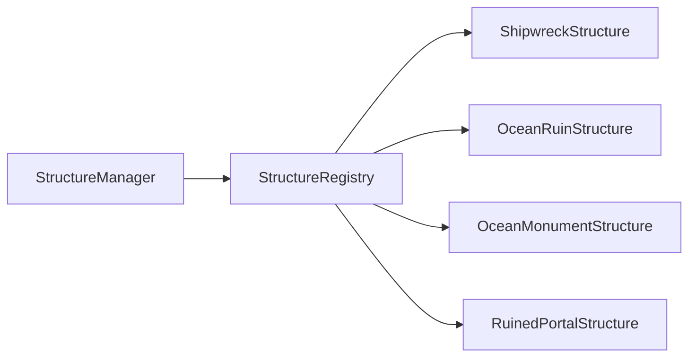

# structures 子模块说明

本目录存放具体结构实现类，负责把抽象结构规则转化为可写入世界的方块布局。

## 1. 目录结构树

```text
structures/
├── BuriedTreasureStructure.hpp/.cpp
├── DesertPyramidStructure.hpp/.cpp
├── FortressStructure.hpp/.cpp
├── JungleTempleStructure.hpp/.cpp
├── MineshaftStructure.hpp/.cpp
├── OceanMonumentStructure.hpp/.cpp
├── OceanRuinStructure.hpp/.cpp
├── RuinedPortalStructure.hpp/.cpp
├── ShipwreckStructure.hpp/.cpp
├── StrongholdStructure.hpp/.cpp
└── VillageStructure.hpp/.cpp
```

## 2. 文件介绍

- BuriedTreasureStructure: 沙滩藏宝点，低概率单点结构。
- DesertPyramidStructure: 沙漠神殿体块与地下室逻辑。
- FortressStructure: 下界要塞主体结构生成。
- JungleTempleStructure: 丛林神庙外壳与陷阱布局。
- MineshaftStructure: 废弃矿井片段化生成。
- OceanMonumentStructure: 深海纪念碑大型体块布局。
- OceanRuinStructure: 海底废墟（冷海/暖海材质分支）。
- RuinedPortalStructure: 废弃传送门与周边破损装饰。
- ShipwreckStructure: 沉船船体、桅杆和破损开口。
- StrongholdStructure: 要塞骨架与关键房间入口。
- VillageStructure: 村庄起始点与拼图池衔接。

## 3. 模块关系

- 上游依赖: StructureManager 负责统一注册与调度。
- 横向依赖: IChunkGenerator 提供高度/生物群系查询，VanillaBlocks 提供方块状态。
- 下游输出: 通过 IWorldWriter::setBlock 写入世界，或将结果挂入 StructureStart。

## 4. 整体职责

- 以结构类型为边界，封装各结构的间距、概率、生物群系门槛与具体摆放算法。
- 维持“可注册、可查询、可生成”的最小闭环，避免仅有枚举无实现的孤岛状态。

## 5. 输入/输出

- 输入:
  - 世界写入器 IWorldWriter
  - 生成器 IChunkGenerator（高度/海平面/生物群系）
  - 随机源 Random 与区块坐标
- 输出:
  - StructureStart（结构起点）
  - 对世界区块的方块写入副作用

## 6. 依赖项

- 内部依赖:
  - world/gen/structure/Structure.hpp
  - world/gen/chunk/IChunkGenerator.hpp
  - world/block/VanillaBlocks.hpp
  - world/IWorldWriter.hpp
- 标准库依赖:
  - memory
  - vector

## 7. 使用方法

```cpp
#include "world/gen/structure/StructureManager.hpp"

mc::world::gen::structure::StructureRegistry::initialize();
const auto* shipwreck = mc::world::gen::structure::StructureRegistry::get("shipwreck");
const auto* oceanRuin = mc::world::gen::structure::StructureRegistry::get("ocean_ruin");
```

## 8. 容易踩的坑

- 仅在 StructureType 增加枚举但未在 StructureRegistry::initialize 注册，运行时不会生成。
- 结构使用的新方块若未在 VanillaBlocks 注册，会出现空指针或降级方块。
- 结构过早直接写入世界可能被后续地形阶段覆盖，需结合当前生成链路验证阶段顺序。

## 9. 测试用例

- tests/common/world/gen/WaterContentRegistryTest.cpp
  - 校验 shipwreck/ocean_ruin 已注册。
  - 校验水域补齐方块（气泡柱、海龟蛋、死亡珊瑚、海晶楼梯台阶等）已注册。

## 10. Mermaid 图表


