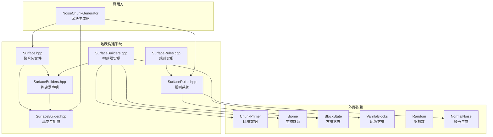

# 地表构建系统 (Surface Builder System)

## 目录结构

```
src/common/world/gen/surface/
├── Surface.hpp              # 聚合头文件，包含所有地表构建相关头文件
├── SurfaceBuilder.hpp       # 地表构建器基类和配置结构定义
├── SurfaceBuilders.hpp      # 具体地表构建器声明（Default、Mountain、Desert等）
├── SurfaceBuilders.cpp      # 所有地表构建器的实现代码
├── SurfaceRules.hpp         # MC 1.21 SurfaceRules 条件/规则系统
└── SurfaceRules.cpp         # SurfaceRules 实现
```

## 模块整体职责

地表构建系统负责在区块生成过程中，根据生物群系类型和噪声值，将默认方块（石头）替换为适合该生物群系的地表方块（草方块、沙子、雪等）和次地表方块（泥土、砂岩等）。

**两套系统并存**：
- **SurfaceBuilder（旧版）**：MC 1.16 风格的地表构建，每个生物群系关联一个构建器
- **SurfaceRules（新版）**：MC 1.21 风格的规则树系统，通过条件+规则组合实现更灵活的地表生成

## 内部模块关系



## 上下游外部依赖关系

### 上游依赖（本模块依赖）

| 模块 | 用途 |
|------|------|
| `common/core/Types.hpp` | 基础类型定义 (i32, f32, u64 等) |
| `common/util/math/random/Random.hpp` | 随机数生成 |
| `common/world/block/Block.hpp` | 方块基类 |
| `common/world/block/BlockState.hpp` | 方块状态 |
| `common/world/block/VanillaBlocks.hpp` | 原版方块定义 |
| `common/world/chunk/ChunkPrimer.hpp` | 区块数据 |
| `common/world/biome/Biome.hpp` | 生物群系定义 |
| `common/world/gen/noise/NormalNoise.hpp` | 正态噪声（SurfaceRules） |
| `common/world/gen/noise/OctavesNoiseGenerator.hpp` | 多倍频噪声 |

### 下游依赖（依赖本模块）

| 模块 | 用途 |
|------|------|
| `NoiseChunkGenerator` | 区块生成器在 SURFACE 阶段调用地表构建 |

## 核心类型

### SurfaceBuilderConfig

地表构建配置，定义三层方块类型：
- `topBlock` - 表层方块（草方块、沙子等）
- `underBlock` - 次表层方块（泥土、沙子等）
- `underWaterBlock` - 水下表面方块（沙砾等）

预设配置：`grass()`, `sand()`, `stone()`, `gravel()`, `redSand()`, `podzolDirtGravel()`, `myceliumDirtGravel()`, `netherrack()` 等

### SurfaceBuilder（基类）

抽象基类，核心方法：
- `buildSurface()` - 构建地表，接收区块、生物群系、坐标、噪声等参数
- `setSeed()` - 设置世界种子（部分构建器需要）
- `name()` - 获取构建器名称

### 具体构建器（部分）

| 构建器 | 适用场景 | 特点 |
|--------|---------|------|
| `DefaultSurfaceBuilder` | 大多数生物群系 | 根据噪声计算深度，放置表层+次层 |
| `MountainSurfaceBuilder` | 山地 | 根据噪声选择石头或草地配置 |
| `BadlandsSurfaceBuilder` | 恶地 | 生成彩色陶瓦层，需要基于种子的噪声 |
| `SwampSurfaceBuilder` | 沼泽 | 水面附近生成粘土斑块 |
| `FrozenOceanSurfaceBuilder` | 冻洋 | 生成浮冰冰山 |

### SurfaceRules（新版 MC 1.21）

基于规则树的声明式地表生成系统：
- **条件（SurfaceCondition）**：`StoneDepthCondition`, `YCondition`, `WaterCondition`, `BiomeCondition`, `NoiseThresholdCondition`, `VerticalGradientCondition`, `SteepCondition`, `TemperatureCondition`, `HoleCondition`
- **规则（SurfaceRule）**：`IfTrueRule`, `SequenceRule`, `BlockRule`, `BandlandsRule`
- **上下文（SurfaceRuleContext）**：维护当前位置的状态（stoneDepth、waterHeight、biome等）
- **SurfaceSystem**：规则执行器，遍历区块每个方块应用规则

工厂命名空间 `SurfaceRules` 提供便捷创建方法：`onFloor()`, `underFloor()`, `isBiome()`, `ifTrue()`, `sequence()`, `overworld()`, `nether()`, `end()`

## 容易踩的坑

### 1. 方块状态指针检查

构建器内部使用 `VanillaBlocks::getState()` 获取方块状态，某些方块可能未定义。所有构建器在构建前都会检查方块状态是否为空，静默跳过。

### 2. 恶地色带连续性

`BadlandsSurfaceBuilder` 的陶瓦色带依赖**世界坐标**，如果误用区块内坐标会在区块边界出现明显断层。正确做法：使用 `chunk.x()*16 + x`、`chunk.z()*16 + z` 计算世界坐标。

### 3. 区块坐标范围

`buildSurface()` 的 `x` 和 `z` 参数是区块内坐标 (0-15)，不是世界坐标。调用时需确保正确的坐标转换。

### 4. 噪声值范围

`surfaceNoise` 参数直接影响地表深度，过大或过小可能导致异常。确保噪声值在合理范围内（由区块生成器控制）。

### 5. 生物群系温度判断

`MountainSurfaceBuilder` 中的雪生成依赖生物群系温度参数。确保生物群系正确设置了温度。

### 6. SurfaceBuilder vs SurfaceRules 两套系统

项目同时保留了两套地表生成系统：
- **SurfaceBuilder**：MC 1.16 风格，通过 `Biome` 关联构建器
- **SurfaceRules**：MC 1.21 风格，通过 `NoiseChunkGenerator` 使用 `SurfaceSystem`

`NoiseChunkGenerator` 优先使用 `SurfaceSystem`（如果 `m_useDensityFunctionPipeline` 为 true），否则回退到旧版构建器。

### 7. 世界种子初始化

部分构建器（`BadlandsSurfaceBuilder`、`FrozenOceanSurfaceBuilder`、`SwampSurfaceBuilder`、`NetherForestsSurfaceBuilder`）需要调用 `setSeed()` 初始化噪声生成器。确保在区块生成前正确设置种子。

### 8. SurfaceRules 条件组合顺序

`SequenceRule` 按顺序尝试规则，返回第一个非空结果。规则顺序直接影响生成结果，确保规则优先级正确。
