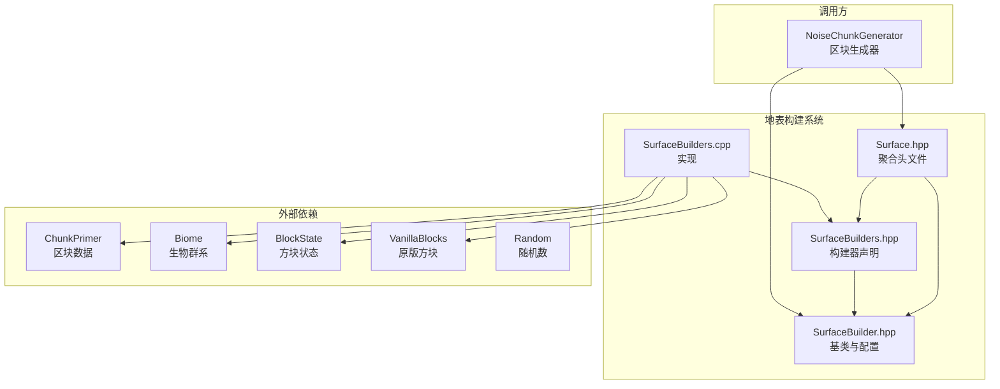

# 地表构建系统 (Surface Builder System)

## 目录结构

```
src/common/world/gen/surface/
├── Surface.hpp           # 聚合头文件，包含所有地表构建相关头文件
├── SurfaceBuilder.hpp    # 地表构建器基类和配置结构定义
├── SurfaceBuilders.hpp   # 12种具体地表构建器声明
└── SurfaceBuilders.cpp   # 所有地表构建器的实现代码
```

## 文件详解

### 1. Surface.hpp - 聚合头文件

**职责**: 提供统一的地表构建系统入口点，简化外部依赖。

**内容**:
```cpp
#include "SurfaceBuilder.hpp"
#include "SurfaceBuilders.hpp"
```

**使用方式**: 外部模块只需包含此文件即可使用所有地表构建功能。

---

### 2. SurfaceBuilder.hpp - 核心基类与配置

**职责**: 定义地表构建器的抽象接口和配置数据结构。

**主要内容**:

#### SurfaceBuilderConfig 结构体
地表构建配置，定义三层方块类型：

| 字段 | 类型 | 说明 |
|------|------|------|
| `topBlock` | `const BlockState*` | 表层方块（草方块、沙子等） |
| `underBlock` | `const BlockState*` | 次表层方块（泥土、沙子等） |
| `underWaterBlock` | `const BlockState*` | 水下表面方块（沙砾等） |

**预设配置方法**:
- `grass()` - 草地配置（草方块/泥土/沙砾）
- `sand()` - 沙地配置（沙子/沙子/沙子）
- `stone()` - 石头配置（石头/石头/石头）
- `gravel()` - 沙砾配置（沙砾/沙砾/沙砾）
- `redSand()` - 红沙配置（红沙/红沙/红沙）

#### SurfaceBuilder 抽象基类
```cpp
class SurfaceBuilder {
public:
    virtual ~SurfaceBuilder() = default;

    virtual void buildSurface(
        math::Random& random,
        ChunkPrimer& chunk,
        const Biome& biome,
        i32 x, i32 z,
        i32 startHeight,
        f32 surfaceNoise,
        const BlockState* defaultBlock,
        const BlockState* defaultFluid,
        i32 seaLevel,
        const SurfaceBuilderConfig& config) = 0;

    [[nodiscard]] virtual const char* name() const = 0;
};
```

**参数说明**:

| 参数 | 类型 | 说明 |
|------|------|------|
| `random` | `math::Random&` | 随机数生成器 |
| `chunk` | `ChunkPrimer&` | 区块数据（可读写） |
| `biome` | `const Biome&` | 当前生物群系 |
| `x`, `z` | `i32` | 区块内坐标 (0-15) |
| `startHeight` | `i32` | 起始高度（从地表向下遍历） |
| `surfaceNoise` | `f32` | 地表噪声值（控制地表深度变化） |
| `defaultBlock` | `const BlockState*` | 默认方块（石头） |
| `defaultFluid` | `const BlockState*` | 默认流体（水） |
| `seaLevel` | `i32` | 海平面高度 |
| `config` | `const SurfaceBuilderConfig&` | 地表配置 |

---

### 3. SurfaceBuilders.hpp - 具体构建器声明

**职责**: 声明12种具体的地表构建器类型。

#### 构建器类型一览

| 构建器 | 名称 | 适用生物群系 | 特殊行为 |
|--------|------|-------------|---------|
| `DefaultSurfaceBuilder` | `default` | 平原、森林等 | 标准草地/泥土层，水下用沙砾 |
| `MountainSurfaceBuilder` | `mountain` | 山地、雪山 | 高海拔生成雪，温度<0.15且Y>90 |
| `DesertSurfaceBuilder` | `desert` | 沙漠 | 沙子表层，砂岩次层 |
| `SwampSurfaceBuilder` | `swamp` | 沼泽 | 水下生成粘土斑块（噪声>0.5） |
| `FrozenOceanSurfaceBuilder` | `frozen_ocean` | 冻洋 | 海平面生成冰层 |
| `BadlandsSurfaceBuilder` | `badlands` | 恶地 | 红沙表层，分层彩色陶瓦带 |
| `BeachSurfaceBuilder` | `beach` | 海滩 | 海平面±2格使用沙子 |
| `GiantTreeTaigaSurfaceBuilder` | `giant_tree_taiga` | 巨型针叶林 | 灰化土表层，砂土次层 |
| `ShatteredSavannaSurfaceBuilder` | `shattered_savanna` | 破碎热带草原 | 30%概率生成石头斑块 |
| `BambooJungleSurfaceBuilder` | `bamboo_jungle` | 竹林 | 20%概率使用灰化土 |
| `NetherForestsSurfaceBuilder` | `nether_forests` | 下界森林 | 下界岩次层 |
| `SoulSandValleySurfaceBuilder` | `soul_sand_valley` | 灵魂沙峡谷 | 灵魂沙表层，灵魂土次层 |

---

### 4. SurfaceBuilders.cpp - 实现代码

**职责**: 实现所有地表构建器的构建逻辑和配置预设。

**核心算法**:

#### 通用构建流程
```cpp
// 1. 计算地表深度
i32 depth = calculateDepth(surfaceNoise, random);

// 2. 从上到下遍历
i32 currentDepth = -1;
for (i32 y = startHeight; y >= 0; --y) {
    // 3. 检测方块类型
    if (currentState->isAir()) {
        currentDepth = -1;  // 重置深度
        continue;
    }

    // 4. 只处理默认方块（石头）
    if (currentState->blockId() == defaultBlock->blockId()) {
        if (currentDepth == -1) {
            // 到达地表，放置表层
            chunk.setBlock(x, y, z, topBlock);
            currentDepth = depth;
        } else if (currentDepth > 0) {
            // 放置次层
            chunk.setBlock(x, y, z, underBlock);
            --currentDepth;
        }
    }
}
```

#### 深度计算公式
```cpp
i32 DefaultSurfaceBuilder::calculateDepth(f32 noise, math::Random& random) const {
    // 地表深度 = noise / 3.0 + 3.0 + random(0, 0.25)
    i32 depth = static_cast<i32>(noise / 3.0 + 3.0 + random.nextDouble() * 0.25);
    return std::max(1, depth);  // 最小深度为1
}
```

---

## 模块关系图



---

## 模块整体职责

地表构建系统负责在区块生成过程中，根据生物群系类型和噪声值，将默认方块（石头）替换为适合该生物群系的地表方块（草方块、沙子、雪等）和次地表方块（泥土、砂岩等）。

### 输入

| 输入项 | 来源 | 说明 |
|--------|------|------|
| `ChunkPrimer` | 区块生成器 | 包含噪声生成后的原始区块数据 |
| `Biome` | 生物群系列表 | 当前坐标的生物群系定义 |
| `surfaceNoise` | 区块生成器 | 控制地表层厚度的噪声值 |
| `seaLevel` | 维度设置 | 海平面高度（默认63） |
| `defaultBlock` | 维度设置 | 默认方块（石头） |
| `defaultFluid` | 维度设置 | 默认流体（水） |

### 输出

| 输出项 | 说明 |
|--------|------|
| 修改后的 `ChunkPrimer` | 地表和次地表方块已替换 |

---

## 使用方法

### 基本使用

```cpp
#include "common/world/gen/surface/Surface.hpp"

// 创建构建器
DefaultSurfaceBuilder builder;

// 准备配置
auto config = SurfaceBuilderConfig::grass();

// 构建地表
builder.buildSurface(
    random,          // 随机数生成器
    chunk,           // 区块数据
    biome,           // 生物群系
    x, z,            // 区块内坐标
    surfaceHeight,   // 起始高度
    surfaceNoise,    // 噪声值
    stone,           // 默认方块
    water,           // 默认流体
    seaLevel,        // 海平面
    config           // 配置
);
```

### 在区块生成中使用

```cpp
// NoiseChunkGenerator::buildSurface() 中的调用
void NoiseChunkGenerator::buildSurface(WorldGenRegion& region, ChunkPrimer& chunk) {
    for (i32 x = 0; x < 16; ++x) {
        for (i32 z = 0; z < 16; ++z) {
            BiomeId biomeId = chunk.getBiome(x, 63, z);
            buildSurfaceForColumn(chunk, x, z, surfaceHeight, surfaceNoise, biomeId);
        }
    }
}
```

### 多态使用

```cpp
std::vector<std::unique_ptr<SurfaceBuilder>> builders;
builders.push_back(std::make_unique<DefaultSurfaceBuilder>());
builders.push_back(std::make_unique<MountainSurfaceBuilder>());
builders.push_back(std::make_unique<DesertSurfaceBuilder>());

for (const auto& builder : builders) {
    std::cout << builder->name() << std::endl;
}
```

---

## 依赖项

### 内部依赖

| 模块 | 用途 |
|------|------|
| `common/core/Types.hpp` | 基础类型定义 (i32, f32, etc.) |
| `common/util/math/random/Random.hpp` | 随机数生成 |
| `common/world/block/Block.hpp` | 方块基类 |
| `common/world/block/BlockState.hpp` | 方块状态 |
| `common/world/block/VanillaBlocks.hpp` | 原版方块定义 |
| `common/world/block/BlockRegistry.hpp` | 方块注册表 |
| `common/world/chunk/ChunkPrimer.hpp` | 区块数据 |
| `common/world/biome/Biome.hpp` | 生物群系定义 |

### 外部依赖

| 库 | 用途 |
|-----|------|
| `<algorithm>` | std::max 等算法 |

---

## 容易踩的坑

### 1. 方块状态指针检查

**问题**: 构建器内部使用 `VanillaBlocks::getState()` 获取方块状态，但某些方块可能未定义。

**解决方案**: 所有构建器在构建前都会检查方块状态是否为空：
```cpp
if (!topState || !underState || !underWaterState || !defaultBlock) {
    return;  // 静默跳过
}
```

### 2. 恶地色带连续性

**问题**: 恶地陶瓦色带依赖世界坐标，如果误用区块内坐标会在区块边界出现明显断层。

**解决方案**: 在 `BadlandsSurfaceBuilder` 中使用世界坐标（`chunk.x()*16 + x`、`chunk.z()*16 + z`）计算色带。

### 3. 区块坐标范围

**问题**: `buildSurface()` 的 `x` 和 `z` 参数是区块内坐标 (0-15)，不是世界坐标。

**解决方案**: 调用时确保使用正确的坐标转换。

### 4. 噪声值范围

**问题**: `surfaceNoise` 参数直接影响地表深度，过大或过小可能导致异常。

**解决方案**: 确保噪声值在合理范围内（通常由区块生成器控制）。

### 5. 生物群系温度判断

**问题**: `MountainSurfaceBuilder` 中的 `shouldPlaceSnow()` 依赖生物群系温度。

**解决方案**: 确保生物群系正确设置了温度参数。

---

## 测试用例

测试文件位置: `tests/common/test_surface.cpp`

### 测试覆盖范围

| 测试套件 | 测试数量 | 覆盖内容 |
|----------|---------|---------|
| `SurfaceBuilderConfigTest` | 7 | 默认值、自定义值、预设配置 |
| `RandomTest` | 4 | 随机数范围、可重复性 |
| `DefaultSurfaceBuilderTest` | 2 | 名称、基本构建功能 |
| `MountainSurfaceBuilderTest` | 1 | 名称 |
| `DesertSurfaceBuilderTest` | 2 | 名称、沙漠地表构建 |
| `SwampSurfaceBuilderTest` | 1 | 名称 |
| `FrozenOceanSurfaceBuilderTest` | 1 | 名称 |
| `BadlandsSurfaceBuilderTest` | 2 | 名称、红沙+陶瓦层构建 |
| `BeachSurfaceBuilderTest` | 1 | 名称 |
| `SurfaceBuilderPolymorphismTest` | 2 | 多态性、所有构建器有效性 |

### 测试示例

```cpp
TEST_F(DefaultSurfaceBuilderTest, BuildSurfaceBasic) {
    // 准备区块数据（填充石头）
    const BlockState* stone = &VanillaBlocks::STONE->defaultState();
    for (int y = 0; y < 64; ++y) {
        for (int x = 0; x < 16; ++x) {
            for (int z = 0; z < 16; ++z) {
                chunk->setBlock(x, y, z, stone);
            }
        }
    }

    // 构建地表
    auto config = SurfaceBuilderConfig::grass();
    builder->buildSurface(*random, *chunk, biome, 8, 8, 63, 0.5, stone, water, 63, config);

    // 验证结果
    EXPECT_TRUE(chunk->getBlock(8, 63, 8)->is(VanillaBlocks::GRASS_BLOCK));  // 表层
    EXPECT_TRUE(chunk->getBlock(8, 62, 8)->is(VanillaBlocks::DIRT));         // 次层
}
```

---

## 与 Minecraft 1.16.5 的对应关系

| 本项目类 | MC 1.16.5 类 |
|----------|-------------|
| `SurfaceBuilder` | `net.minecraft.world.gen.surfacebuilders.SurfaceBuilder` |
| `SurfaceBuilderConfig` | `net.minecraft.world.gen.surfacebuilders.SurfaceBuilderConfig` |
| `DefaultSurfaceBuilder` | `net.minecraft.world.gen.surfacebuilders.DefaultSurfaceBuilder` |
| `MountainSurfaceBuilder` | `net.minecraft.world.gen.surfacebuilders.MountainSurfaceBuilder` |
| `DesertSurfaceBuilder` | `net.minecraft.world.gen.surfacebuilders.DesertSurfaceBuilder` |
| `SwampSurfaceBuilder` | `net.minecraft.world.gen.surfacebuilders.SwampSurfaceBuilder` |
| `FrozenOceanSurfaceBuilder` | `net.minecraft.world.gen.surfacebuilders.FrozenOceanSurfaceBuilder` |
| `BadlandsSurfaceBuilder` | `net.minecraft.world.gen.surfacebuilders.BadlandsSurfaceBuilder` |
| `BeachSurfaceBuilder` | `net.minecraft.world.gen.surfacebuilders.BeachSurfaceBuilder` |
| `GiantTreeTaigaSurfaceBuilder` | `net.minecraft.world.gen.surfacebuilders.GiantTreeTaigaSurfaceBuilder` |
| `ShatteredSavannaSurfaceBuilder` | `net.minecraft.world.gen.surfacebuilders.ShatteredSavannaSurfaceBuilder` |
| `BambooJungleSurfaceBuilder` | `net.minecraft.world.gen.surfacebuilders.BambooJungleSurfaceBuilder` |
| `NetherForestsSurfaceBuilder` | `net.minecraft.world.gen.surfacebuilders.NetherForestsSurfaceBuilder` |
| `SoulSandValleySurfaceBuilder` | `net.minecraft.world.gen.surfacebuilders.SoulSandValleySurfaceBuilder` |

---

## 扩展指南

### 添加新的地表构建器

1. **在 `SurfaceBuilders.hpp` 中声明新类**:
```cpp
class MySurfaceBuilder : public SurfaceBuilder {
public:
    MySurfaceBuilder() = default;

    void buildSurface(
        math::Random& random,
        ChunkPrimer& chunk,
        const Biome& biome,
        i32 x, i32 z,
        i32 startHeight,
        f32 surfaceNoise,
        const BlockState* defaultBlock,
        const BlockState* defaultFluid,
        i32 seaLevel,
        const SurfaceBuilderConfig& config) override;

    [[nodiscard]] const char* name() const override { return "my_surface"; }
};
```

2. **在 `SurfaceBuilders.cpp` 中实现**:
```cpp
void MySurfaceBuilder::buildSurface(...) {
    // 实现构建逻辑
}
```

3. **添加测试用例**:
```cpp
TEST_F(MySurfaceBuilderTest, Name) {
    EXPECT_STREQ(builder->name(), "my_surface");
}
```

### 添加新的预设配置

在 `SurfaceBuilderConfig` 中添加静态方法：
```cpp
static SurfaceBuilderConfig myPreset() {
    return SurfaceBuilderConfig(
        VanillaBlocks::getState(VanillaBlocks::MY_TOP),
        VanillaBlocks::getState(VanillaBlocks::MY_UNDER),
        VanillaBlocks::getState(VanillaBlocks::MY_UNDERWATER)
    );
}
```
