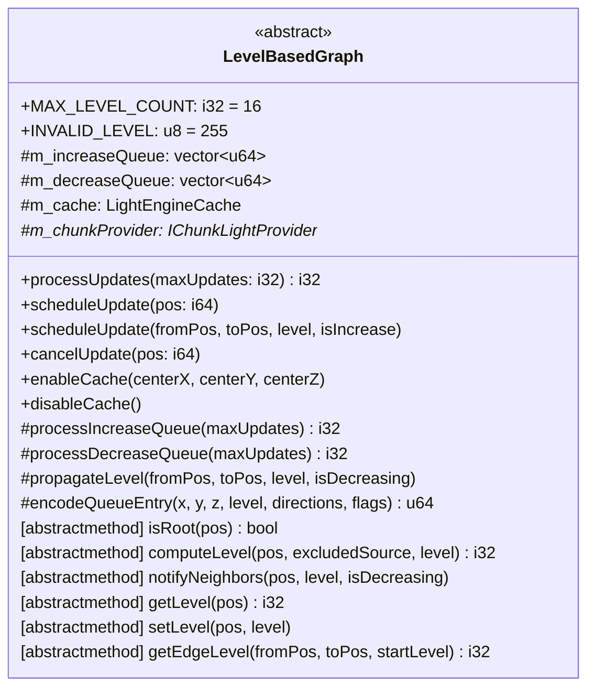
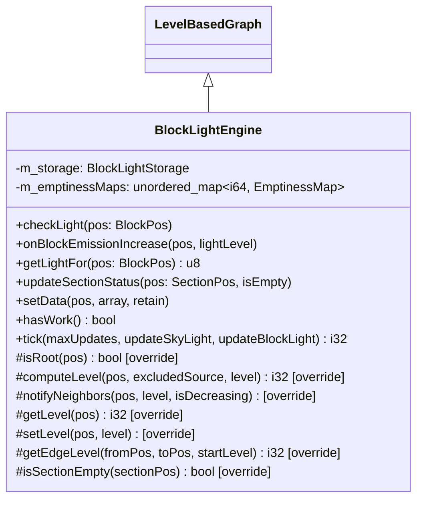
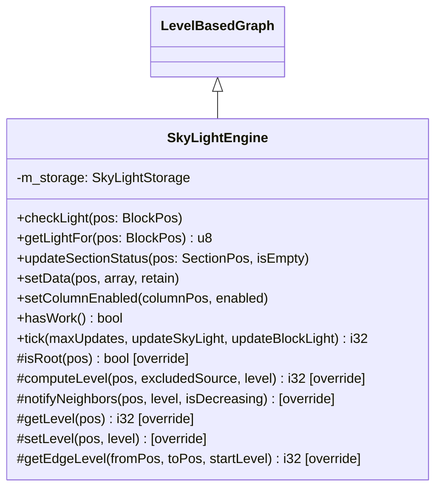
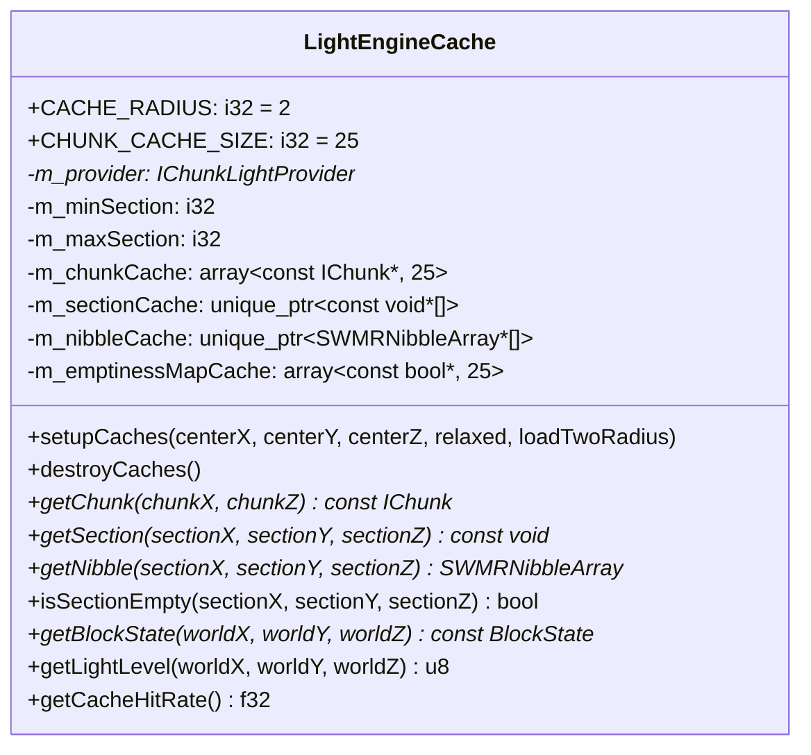
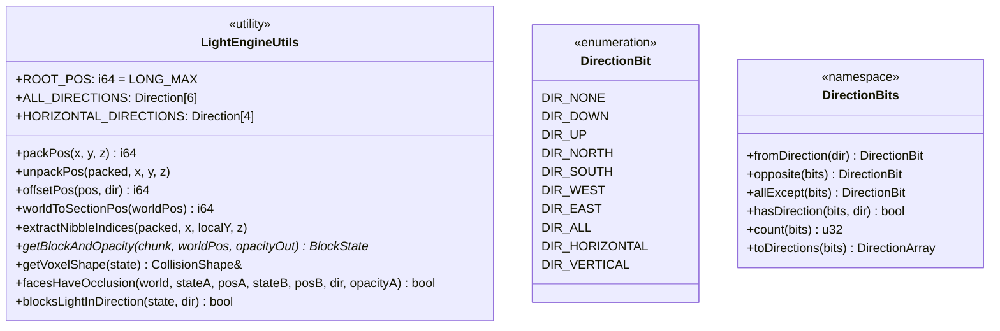
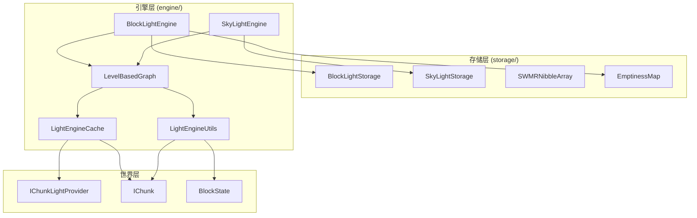

# 光照引擎模块 (Lighting Engine)

本目录包含 Minecraft 光照系统的核心引擎实现，负责计算和传播方块光照和天空光照。

## 目录结构

```
engine/
├── LevelBasedGraph.hpp/cpp     # 基于级别的传播图基类（Starlight 优化版）
├── BlockLightEngine.hpp/cpp    # 方块光照引擎
├── SkyLightEngine.hpp/cpp      # 天空光照引擎
├── LightEngineCache.hpp/cpp    # 光照引擎缓存系统
├── LightEngineUtils.hpp/cpp    # 光照引擎工具类
└── README.md                   # 本文档
```

## 文件详细介绍

### LevelBasedGraph.hpp/cpp

**职责**: 提供基于级别的 BFS 光照传播算法的核心框架，是所有光照引擎的基类。

**主要内容**:



**队列元素编码格式** (64位):

| 位范围 | 内容 | 说明 |
|--------|------|------|
| 0-27 | 坐标 | x(6位) \| z(6位) \| y(16位) |
| 28-31 | 光照等级 | 0-15 |
| 32-37 | 方向位集 | 传播方向标记 |
| 38-60 | 保留 | - |
| 61-63 | 标志位 | WRITE_LEVEL, RECHECK_LEVEL, HAS_SIDED_TRANSPARENT |

**核心算法**:
- **增亮队列**: 光照增加时传播到相邻方块
- **减亮队列**: 光照减少时重新计算受影响方块
- **空区块段优化**: 跳过全空气区块段

### BlockLightEngine.hpp/cpp

**职责**: 实现方块光照的传播算法。方块光源（如火把、萤石）发出的光向相邻方块传播，每传播一个方块衰减 1 级。

**主要内容**:



**光照传播规则**:
- 光源发出 15 级光
- 每穿过一个方块衰减 1 级（最小 1 级）
- 部分透明方块（如水）有特定透明度
- 完全不透明方块（透明度 15）阻挡光线

### SkyLightEngine.hpp/cpp

**职责**: 实现天空光照的传播算法。天空光照从天空向下传播，在透明方块中传播时不衰减，只有在不透明方块阻挡时才会衰减。

**主要内容**:



**天空光照特点**:
- 天空光照没有根节点（`isRoot()` 始终返回 `false`）
- 从天空向下传播时，透明方块不衰减
- 遇到不透明方块时开始衰减
- 支持跨区块段向下传播（空区块段优化）

### LightEngineCache.hpp/cpp

**职责**: 提供光照引擎的缓存系统，避免重复的区块查找操作。

**主要内容**:



**缓存范围**:
- 以中心区块为原点的 5x5 区块区域
- 高度范围：从 `minSection - 1` 到 `maxSection + 1`（包含缓冲区）

### LightEngineUtils.hpp/cpp

**职责**: 提供光照引擎的共享工具方法。

**主要内容**:



**位置编码格式** (64位):

| 位范围 | 内容 | 说明 |
|--------|------|------|
| 0-11 | Y 坐标 | 12位有符号 (-2048 ~ 2047) |
| 12-37 | Z 坐标 | 26位有符号 |
| 38-63 | X 坐标 | 26位有符号 |

## 模块架构



## 模块职责

### 整体职责

光照引擎模块负责计算和更新 Minecraft 世界中的光照数据，包括：

1. **方块光照 (Block Light)**: 由发光方块（火把、萤石等）产生的光照
2. **天空光照 (Sky Light)**: 来自天空的光照，受高度和遮挡物影响

### 输入

| 输入项 | 类型 | 说明 |
|--------|------|------|
| 区块数据 | `IChunk*` | 包含方块状态和高度图 |
| 光源位置 | `BlockPos` | 发光方块的位置和亮度 |
| 区块段状态 | `SectionPos, bool` | 区块段是否全为空气 |
| 光照数据 | `SWMRNibbleArray` | 从存档加载的光照数据 |

### 输出

| 输出项 | 类型 | 说明 |
|--------|------|------|
| 更新的光照数据 | `SWMRNibbleArray*` | 修改后的光照数组 |
| 光照变更通知 | 回调 | 通知客户端光照变化 |

### 依赖项

```
common/world/lighting/storage/  - 光照存储层
common/world/chunk/             - 区块数据结构
common/world/block/             - 方块状态和属性
common/physics/collision/       - 碰撞形状用于遮挡检测
common/util/Direction.hpp       - 方向枚举
```

## 使用方法

### 基本用法

```cpp
#include "common/world/lighting/engine/BlockLightEngine.hpp"
#include "common/world/lighting/engine/SkyLightEngine.hpp"

// 创建光照引擎
BlockLightEngine blockLightEngine(chunkProvider);
SkyLightEngine skyLightEngine(chunkProvider);

// 设置区块段状态
blockLightEngine.updateSectionStatus(SectionPos(0, 0, 0), false);  // 非空
skyLightEngine.updateSectionStatus(SectionPos(0, 0, 0), false);

// 当方块发光等级增加时
blockLightEngine.onBlockEmissionIncrease(BlockPos(100, 64, 200), 15);  // 火把

// 处理光照更新（每 tick 调用）
int remaining = blockLightEngine.tick(512, false, true);
remaining = skyLightEngine.tick(512, true, false);

// 获取光照等级
u8 blockLight = blockLightEngine.getLightFor(BlockPos(100, 64, 200));
u8 skyLight = skyLightEngine.getLightFor(BlockPos(100, 64, 200));
```

### 批量光照计算

```cpp
// 启用缓存以提高批量计算性能
blockLightEngine.enableCache(centerX, centerY, centerZ);

// 执行光照计算...

// 完成后禁用缓存
blockLightEngine.disableCache();
```

### 检查方块变化

```cpp
void onBlockChanged(World& world, const BlockPos& pos) {
    // 检查光照更新
    blockLightEngine.checkLight(pos);
    skyLightEngine.checkLight(pos);
}
```

## 容易踩的坑

### 1. 光照传播顺序

**问题**: 减亮队列必须在增亮队列之前处理。

**原因**: 减亮操作需要先清除旧光照，增亮操作才能正确计算新光照。

```cpp
// 正确的 tick 处理顺序
i32 LevelBasedGraph::processUpdates(i32 maxUpdates) {
    // 先处理减亮队列
    if (m_decreaseQueueInitialLength > 0) {
        maxUpdates = processDecreaseQueue(maxUpdates);
    }
    // 再处理增亮队列
    if (m_increaseQueueInitialLength > 0) {
        maxUpdates = processIncreaseQueue(maxUpdates);
    }
}
```

### 2. 空区块段优化

**问题**: 忘记更新空区块段状态会导致光照计算错误。

**解决方案**: 当区块段内容变化时，必须调用 `updateSectionStatus()`。

```cpp
void onChunkSectionChanged(ChunkSection& section, SectionPos pos) {
    bool isEmpty = section.isEmpty();
    blockLightEngine.updateSectionStatus(pos, isEmpty);
    skyLightEngine.updateSectionStatus(pos, isEmpty);
}
```

### 3. 天空光照的特殊处理

**问题**: 天空光照引擎的 `isRoot()` 始终返回 `false`，这与方块光照不同。

**原因**: 天空光照没有单一的"光源"位置，而是从上方无限高处照射。

**注意**: 在 `checkLight()` 中需要特殊处理天空光照为 15 的情况。

### 4. 坐标范围限制

**问题**: Y 坐标限制在 12 位有符号范围内 (-2048 ~ 2047)。

**原因**: 使用紧凑的 64 位位置编码格式。

**解决方案**: 对于超出范围的坐标，需要额外的处理或检查。

### 5. 缓存生命周期

**问题**: 缓存启用后未正确清理会导致数据不一致。

**解决方案**: 确保每次批量计算后调用 `disableCache()` 或在下次使用前调用 `setupCaches()`。

### 6. 方向位集的正确使用

**问题**: 错误理解方向位集的传播方向。

**说明**:
- `DIR_UP` 表示"向上传播"
- `opposite(DIR_UP)` 返回 `DIR_DOWN`，表示"从上方传来"

```cpp
// 传播方向是"从哪里来"
DirectionBit fromDirection = DIR_UP;  // 光从下方传来
DirectionBit checkDirs = DirectionBits::opposite(fromDirection);  // 检查 DIR_DOWN（向上传播）
```

## 性能优化

### Starlight 优化

本实现采用了 Starlight mod 的核心优化：

1. **64 位队列编码**: 将坐标、等级、方向打包到单个 64 位整数，减少内存分配
2. **方向位集**: 使用位运算快速计算相反方向，避免遍历所有方向
3. **空区块段跳过**: 全空气区块段直接跳过光照计算
4. **缓存系统**: 扁平数组缓存区块和区块段，避免重复查找

### 缓存命中率

通过 `getCacheHitRate()` 监控缓存性能。正常情况下命中率应 > 90%。

```cpp
f32 hitRate = blockLightEngine.getCacheHitRate();
if (hitRate < 0.9f) {
    // 可能需要检查缓存设置
}
```

## 涉及的测试用例

| 测试文件 | 测试内容 |
|----------|----------|
| `tests/lighting/LightingTest.cpp` | 位置编码/解码、方向工具、光照类型 |
| `tests/lighting/LightUpdateTest.cpp` | 光照数据序列化、数据包测试 |

### 测试覆盖范围

- **NibbleArray**: 存储、索引、边界值
- **SectionPos**: 坐标转换、编码/解码
- **LightEngineUtils**:
  - `packPos` / `unpackPos`: 正负坐标
  - `offsetPos`: 各方向偏移
  - `worldToSectionPos`: 世界坐标到区块段坐标
  - `extractNibbleIndices`: 提取局部坐标
- **DirectionBit**: 方向转换、位操作
- **DirectionBits**: 相反方向、方向计数

## 参考资料

- **Minecraft 1.16.5 源码**: `net.minecraft.world.lighting.BlockLightEngine`, `net.minecraft.world.lighting.SkyLightEngine`
- **Starlight Mod**: `ca.spottedleaf.moonrise.patches.starlight.light.StarLightEngine` - 队列编码和方向位集优化
