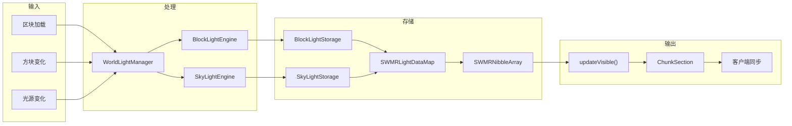

# 光照存储模块 (Lighting Storage)

本目录包含 Minecraft 光照系统的数据存储层，实现了单写多读（SWMR）的光照数据存储架构，参考了 Starlight 的优化设计。

## 目录结构

```
src/common/world/lighting/storage/
├── SWMRNibbleArray.hpp      # 单写多读 Nibble 数组核心实现
├── SWMRNibbleArray.cpp      # SWMRNibbleArray 实现文件
├── SWMRLightDataMap.hpp     # SWMR 光照数据映射容器
├── SectionLightStorage.hpp  # 区块段光照存储基类
├── BlockLightStorage.hpp    # 方块光照存储
├── BlockLightStorage.cpp    # BlockLightStorage 实现文件
├── SkyLightStorage.hpp      # 天空光照存储
├── SkyLightStorage.cpp      # SkyLightStorage 实现文件
├── EmptinessMap.hpp         # 空区块段映射
└── EmptinessMap.cpp         # EmptinessMap 实现文件
```

## 文件详细介绍

### SWMRNibbleArray.hpp / .cpp

**职责**：单写多读 Nibble 数组的核心实现，提供线程安全的 4-bit 数据存储。

**主要特性**：
- **写时复制 (Copy-on-Write)**：写操作时创建数据副本，避免影响正在进行的读操作
- **延迟初始化**：未初始化状态不分配内存，节省内存开销
- **状态管理**：四种状态转换
  - `Null`：不存在，所有读取返回 0
  - `Uninit`：未初始化（全零），不分配内存
  - `Init`：已初始化，有实际数据
  - `Hidden`：已初始化但隐藏，对 Vanilla 来说视为 NULL
- **线程安全读取**：使用原子操作实现可见侧数据的并发读取
- **对象池**：线程本地对象池减少内存分配开销

**关键常量**：
```cpp
static constexpr size_t ARRAY_SIZE = 2048;    // 字节数组大小 (16*16*16 / 2)
static constexpr size_t VALUE_COUNT = 4096;   // 元素数量 (16*16*16)
static constexpr u8 MAX_VALUE = 15;           // 4-bit 最大值
```

**核心方法**：
```cpp
// 更新侧操作（单线程）
u8 getUpdating(i32 x, i32 y, i32 z) const;
void set(i32 x, i32 y, i32 z, u8 value);

// 可见侧操作（线程安全）
u8 getVisible(i32 x, i32 y, i32 z) const;

// 同步操作
bool updateVisible();  // 将更新侧数据同步到可见侧

// 批量操作
void setFull();   // 设置全亮 (15)
void setZero();   // 设置全暗 (0)

// 状态查询
bool isNullUpdating() const;
bool isUninitializedUpdating() const;
bool isInitializedUpdating() const;
bool isHiddenUpdating() const;
```

**索引计算**：
```cpp
// 索引公式: x | (z << 4) | (y << 8)
static constexpr i32 getIndex(i32 x, i32 y, i32 z) {
    return (x & 15) | ((z & 15) << 4) | ((y & 15) << 8);
}
```

---

### SWMRLightDataMap.hpp

**职责**：SWMT 光照数据映射容器，管理多个区块段的 SWMRNibbleArray。

**设计模式**：CRTP（奇异递归模板模式），允许派生类扩展功能。

**主要类**：
- `SWMRLightDataMap<Derived>`：基类模板，提供通用的数据映射功能
- `BlockLightDataMap`：方块光照数据映射（无额外功能）
- `SkyLightDataMap`：天空光照数据映射，增加表面高度追踪

**核心方法**：
```cpp
// 数据访问
SWMRNibbleArray* getArray(i64 sectionPos);
const SWMRNibbleArray* getArray(i64 sectionPos) const;
bool hasArray(i64 sectionPos) const;
SWMRNibbleArray& getOrCreateArray(i64 sectionPos);
void setArray(i64 sectionPos, SWMRNibbleArray array);

// 光照读写
u8 getLight(i64 worldPos) const;
void setLight(i64 worldPos, u8 light);

// 同步操作
void updateVisible();           // 同步所有区块段
void updateVisible(i64 sectionPos);  // 同步指定区块段

// 状态查询
bool isSectionNull(i64 sectionPos) const;
bool isSectionUninitialized(i64 sectionPos) const;
bool hasSectionData(i64 sectionPos) const;

// 转换
void setFromArray(i64 sectionPos, const NibbleArray& array);
NibbleArray toArray(i64 sectionPos) const;
```

**SkyLightDataMap 额外方法**：
```cpp
void setSurfaceHeight(i64 columnPos, i32 height);
i32 getSurfaceHeight(i64 columnPos) const;
void removeSurfaceHeight(i64 columnPos);
```

---

### SectionLightStorage.hpp

**职责**：区块段光照存储的基类模板，管理区块段级别的光照数据生命周期。

**主要功能**：
- 区块段数据管理（添加、移除、更新状态）
- 变更追踪（脏区块段、变更位置）
- 数据同步和通知

**关键成员**：
```cpp
protected:
    LightType m_type;                              // 光照类型
    IChunkLightProvider* m_chunkProvider;          // 区块提供者
    M m_cachedLightData;                           // 缓存的光照数据
    M m_newArrays;                                 // 待写入的新数组

    std::unordered_set<i64> m_activeLightSections;    // 活跃光照区块段
    std::unordered_set<i64> m_addedEmptySections;     // 新增空区块段
    std::unordered_set<i64> m_addedActiveSections;    // 新增活跃区块段
    std::unordered_set<i64> m_noLightSections;        // 无光照区块段
    std::unordered_set<i64> m_enabledColumns;         // 启用的列
    std::unordered_set<i64> m_dirtyCachedSections;    // 脏缓存区块段
    std::unordered_set<i64> m_changedLightPositions;  // 变更位置
```

**核心方法**：
```cpp
// 区块段管理
bool hasSection(i64 sectionPos) const;
SWMRNibbleArray* getArray(i64 sectionPos, bool useCache);
void setData(i64 sectionPos, SWMRNibbleArray&& array, bool retain);
void updateSectionStatus(i64 sectionPos, bool isEmpty);

// 列管理
virtual void setColumnEnabled(i64 columnPos, bool enabled);

// 处理更新
void processAllLevelUpdates();  // 处理所有待处理的区块段更新
void updateAndNotify();         // 同步并通知变更
```

---

### BlockLightStorage.hpp / .cpp

**职责**：方块光照存储，管理方块光源（如火把、熔岩）产生的光照数据。

**继承关系**：`BlockLightStorage : public SectionLightStorage<BlockLightDataMap>`

**特点**：
- 默认光照值为 0（无光）
- 设置光照时标记相邻 27 个区块段为变更

**核心方法**：
```cpp
u8 getLightOrDefault(i64 worldPos) const override;  // 不存在返回 0
u8 getLight(i64 worldPos) const;
void setLight(i64 worldPos, u8 light);
```

---

### SkyLightStorage.hpp / .cpp

**职责**：天空光照存储，管理从天空传播下来的光照数据。

**继承关系**：`SkyLightStorage : public SectionLightStorage<SkyLightDataMap>`

**特点**：
- 默认光照值为 15（全亮）
- 追踪表面区块段（最高非空区块段）
- 支持区块段添加/移除的延迟更新

**核心方法**：
```cpp
u8 getLightOrDefault(i64 worldPos) const override;  // 不存在返回 15
u8 getLight(i64 worldPos) const;
void setLight(i64 worldPos, u8 light);

// 区块段管理
void setColumnEnabled(i64 columnPos, bool enabled) override;
bool isSectionEnabled(i64 sectionPos) const;
bool isAboveWorld(i64 sectionPos) const;
bool isAtSurfaceTop(i64 worldPos) const;
bool isAboveBottom(i32 sectionY) const;

// 模板方法
template<typename E>
i32 updateSections(E* engine, i32 remainingUpdates, bool updateSkyLight, bool updateBlockLight);
```

**额外成员**：
```cpp
std::unordered_set<i64> m_sectionsWithLight;   // 有光照的区块段
std::unordered_set<i64> m_pendingAdditions;     // 待添加区块段
std::unordered_set<i64> m_pendingRemovals;      // 待移除区块段
bool m_hasPendingUpdates;                       // 是否有待处理更新
```

---

### EmptinessMap.hpp / .cpp

**职责**：追踪每个区块中哪些区块段是全空气的，用于光照引擎快速跳过空区块段。

**设计理念**：空区块段不需要光照计算，可以大幅提升性能。

**核心方法**：
```cpp
// 构造
EmptinessMap(i32 minSection, i32 maxSection);

// 状态查询
bool isSectionEmpty(i32 sectionY) const;
bool isSectionEmptyByIndex(i32 sectionIndex) const;
bool isChunkEmpty() const;

// 状态设置
void setSectionEmpty(i32 sectionY, bool empty);

// 批量操作
bool updateFromChunk(const IChunk& chunk);  // 从区块更新，返回是否变更
void reset();          // 重置为非空
void setAllEmpty();    // 设置全部为空

// 访问器
i32 getMinSection() const;
i32 getMaxSection() const;
i32 getSectionCount() const;
```

**内部存储**：
```cpp
std::vector<u8> m_sectionEmpty;  // 0 = 有方块，1 = 空
```

---

## 模块架构图

```mermaid
graph TB
    subgraph Storage["光照存储层"]
        SWMRNibbleArray["SWMRNibbleArray<br/>单写多读 Nibble 数组"]
        SWMRLightDataMap["SWMRLightDataMap<br/>光照数据映射"]
        SectionLightStorage["SectionLightStorage<br/>区块段存储基类"]
        BlockLightStorage["BlockLightStorage<br/>方块光照存储"]
        SkyLightStorage["SkyLightStorage<br/>天空光照存储"]
        EmptinessMap["EmptinessMap<br/>空区块段映射"]
    end

    subgraph Engine["光照引擎层"]
        BlockLightEngine["BlockLightEngine"]
        SkyLightEngine["SkyLightEngine"]
        WorldLightManager["WorldLightManager"]
    end

    subgraph Chunk["区块数据层"]
        ChunkData["ChunkData"]
        ChunkSection["ChunkSection"]
        NibbleArray["NibbleArray"]
    end

    SWMRNibbleArray --> SWMRLightDataMap
    SWMRLightDataMap --> SectionLightStorage
    SectionLightStorage --> BlockLightStorage
    SectionLightStorage --> SkyLightStorage

    BlockLightStorage --> BlockLightEngine
    SkyLightStorage --> SkyLightEngine
    BlockLightEngine --> WorldLightManager
    SkyLightEngine --> WorldLightManager
    EmptinessMap --> WorldLightManager

    ChunkSection --> NibbleArray
    NibbleArray --> SWMRNibbleArray : 转换
    ChunkData --> ChunkSection
    ChunkSection --> BlockLightStorage : 同步
    ChunkSection --> SkyLightStorage : 同步
```

## 数据流图



## 模块整体职责

本模块负责光照数据的高效存储和管理，主要功能包括：

1. **数据存储**：存储 4-bit 光照等级（0-15）的区块段数据
2. **并发访问**：支持单写多读模式，光照计算线程写入，渲染线程读取
3. **状态管理**：管理光照数据的状态转换（Null/Uninit/Init/Hidden）
4. **变更追踪**：追踪光照变化，触发客户端同步
5. **优化跳过**：通过 EmptinessMap 快速跳过空区块段

## 输入和输出

### 输入

| 来源 | 数据类型 | 说明 |
|------|----------|------|
| `WorldLightManager` | `NibbleArray` | 从 ChunkSection 加载的光照数据 |
| `BlockLightEngine` | 光照更新 | 方块光照计算结果 |
| `SkyLightEngine` | 光照更新 | 天空光照计算结果 |
| `IChunkLightProvider` | 区块信息 | 区块状态查询和变更通知 |

### 输出

| 目标 | 数据类型 | 说明 |
|------|----------|------|
| `ChunkSection` | `NibbleArray` | 光照数据同步到区块段 |
| `LightSyncManager` | 变更通知 | 触发客户端光照更新包 |
| 渲染线程 | 光照值 | 通过 `getVisible()` 线程安全读取 |

## 依赖项

### 内部依赖

```
common/world/lighting/storage/
├── common/core/Types.hpp           # 基础类型定义
├── common/util/NibbleArray.hpp     # 普通 Nibble 数组
├── common/util/Direction.hpp       # 方向定义
├── common/world/chunk/ChunkPos.hpp # 区块位置
├── common/world/chunk/IChunk.hpp   # 区块接口
├── common/world/lighting/LightType.hpp          # 光照类型
├── common/world/lighting/IChunkLightProvider.hpp # 区块光照提供者
└── common/world/lighting/engine/LightEngineUtils.hpp # 光照引擎工具
```

### 外部依赖

- `<vector>` - 动态数组
- `<unordered_map>` - 哈希映射
- `<unordered_set>` - 哈希集合
- `<atomic>` - 原子操作
- `<memory>` - 智能指针
- `<array>` - 固定大小数组
- `<cstring>` - 内存操作

## 使用方法

### 基本使用

```cpp
#include "common/world/lighting/storage/BlockLightStorage.hpp"
#include "common/world/lighting/storage/SkyLightStorage.hpp"

// 创建存储（需要 IChunkLightProvider 实现）
BlockLightStorage blockStorage(&provider);
SkyLightStorage skyStorage(&provider);

// 设置光照数据
i64 worldPos = LightEngineUtils::packPos(10, 64, 20);
blockStorage.setLight(worldPos, 15);  // 火把亮度

// 获取光照
u8 light = blockStorage.getLightOrDefault(worldPos);

// 同步到可见侧（每 tick 调用）
blockStorage.processAllLevelUpdates();
blockStorage.updateAndNotify();
```

### 从 ChunkSection 加载数据

```cpp
// 从 ChunkSection 获取光照数据
NibbleArray blockLightData = section.blockLightNibble().copy();
NibbleArray skyLightData = section.skyLightNibble().copy();

// 设置到存储
SectionPos sectionPos(chunkX, sectionY, chunkZ);
lightManager.setData(LightType::BLOCK, sectionPos, blockLightData, false);
lightManager.setData(LightType::SKY, sectionPos, skyLightData, false);
```

### 渲染线程读取

```cpp
// 线程安全的读取
SWMRNibbleArray* array = lightManager.getData(LightType::BLOCK, sectionPos);
if (array != nullptr && array->isInitializedVisible()) {
    u8 light = array->getVisible(localX, localY, localZ);
}
```

## 容易踩的坑

### 1. 忘记调用 `processAllLevelUpdates()`

**问题**：设置的光照数据不会立即生效。

**解决**：
```cpp
// 错误：设置后立即读取
storage.setData(pos, array, false);
storage.getLight(worldPos);  // 可能返回旧值或 0

// 正确：先处理更新再读取
storage.setData(pos, array, false);
storage.processAllLevelUpdates();
storage.getLight(worldPos);  // 返回正确的值
```

### 2. 忘记调用 `updateVisible()`

**问题**：渲染线程看不到更新后的光照数据。

**解决**：
```cpp
// 在光照计算完成后调用
storage.processAllLevelUpdates();
storage.updateAndNotify();  // 内部调用 updateVisible()
```

### 3. 混淆更新侧和可见侧

**问题**：在渲染线程使用 `getUpdating()` 或在光照线程使用 `getVisible()`。

**解决**：
```cpp
// 光照计算线程使用更新侧
array->set(x, y, z, 15);
array->getUpdating(x, y, z);

// 渲染线程使用可见侧
array->getVisible(x, y, z);
```

### 4. 天空光照默认值

**问题**：天空光照默认值是 15（全亮），方块光照默认值是 0（无光）。

```cpp
// 天空光照：不存在的区块段返回 15
u8 skyLight = skyStorage.getLightOrDefault(worldPos);  // 默认 15

// 方块光照：不存在的区块段返回 0
u8 blockLight = blockStorage.getLightOrDefault(worldPos);  // 默认 0
```

### 5. 区块段坐标计算

**问题**：世界坐标需要转换为区块段坐标。

```cpp
// 错误：直接使用世界坐标作为区块段坐标
storage.getLight(worldPos);  // 需要先编码

// 正确：使用编码函数
i64 worldPos = LightEngineUtils::packPos(x, y, z);
storage.getLight(worldPos);

// 区块段坐标转换
i64 sectionPos = LightEngineUtils::worldToSectionPos(worldPos);
```

### 6. 状态判断错误

**问题**：`isNullUpdating()` 和 `isUninitializedUpdating()` 的区别。

```cpp
// Null：数据不存在，分配内存会创建新数组
// Uninit：数据存在但全为零，不分配内存

if (array->isNullUpdating()) {
    // 不存在，需要创建
} else if (array->isUninitializedUpdating()) {
    // 存在但全零，不占用内存
}
```

### 7. 对象池线程安全

**问题**：`SWMRNibbleArray` 使用 `thread_local` 对象池，跨线程移动可能导致问题。

```cpp
// 对象池是线程本地的
// SWMRNibbleArray 的移动构造函数是安全的
// 但不建议跨线程频繁移动
```

## 涉及的测试用例

测试文件位于 `tests/lighting/LightingTest.cpp` 和 `tests/server/LightSyncTests.cpp`。

### NibbleArray 测试

| 测试名称 | 说明 |
|----------|------|
| `NibbleArrayTest.DefaultConstructor` | 默认构造函数创建空数组 |
| `NibbleArrayTest.FillTest` | 填充功能测试 |
| `NibbleArrayTest.SetAndGet` | 设置和获取测试 |
| `NibbleArrayTest.BoundaryValues` | 边界值测试 (0, 15) |
| `NibbleArrayTest.CopyTest` | 复制功能测试 |
| `NibbleArrayTest.IndexCalculation` | 索引计算正确性 |
| `NibbleArrayTest.PackedByteTest` | 打包字节测试 |

### ChunkSection 光照测试

| 测试名称 | 说明 |
|----------|------|
| `LightSyncTest.ChunkSectionLightAccess` | 区块段光照访问 |
| `LightSyncTest.ChunkSectionLightFill` | 区块段光照填充 |
| `LightSyncTest.ChunkSectionSerializePreservesLight` | 序列化保留光照 |

### ChunkData 光照测试

| 测试名称 | 说明 |
|----------|------|
| `ChunkDataLightTest.GetSkyLight` | 获取天空光照 |
| `ChunkDataLightTest.GetBlockLight` | 获取方块光照 |
| `ChunkDataLightTest.SetBlockLight` | 设置方块光照 |
| `ChunkDataLightTest.SetSkyLight` | 设置天空光照 |

### BlockLightStorage 测试

| 测试名称 | 说明 |
|----------|------|
| `LightSyncTest.BlockLightStorageAppliesPendingSectionData` | 应用待处理区块段数据 |
| `LightSyncTest.BlockLightStorageSetLightMarksNeighborSections` | 设置光照标记相邻区块段 |

### WorldLightManager 测试

| 测试名称 | 说明 |
|----------|------|
| `LightSyncTest.WorldLightManagerCreation` | 光照管理器创建 |
| `LightSyncTest.WorldLightManagerTickWithoutWorkReturnsBudget` | 无任务时返回预算 |
| `LightSyncTest.WorldLightManagerDataAccess` | 数据访问测试 |

## 性能考虑

### 内存优化

1. **延迟初始化**：`Uninit` 状态不分配内存，全零区块段节省 2KB
2. **对象池**：`SWMRNibbleArray` 使用线程本地对象池减少内存分配
3. **Null 状态**：完全不存在的区块段不分配任何内存

### 并发优化

1. **单写多读**：更新侧独占写入，可见侧并发读取
2. **原子操作**：可见侧状态和指针使用原子操作
3. **写时复制**：避免写入时阻塞读取

### 索引优化

```cpp
// 索引计算优化：位操作代替乘法
static constexpr i32 getIndex(i32 x, i32 y, i32 z) {
    return (x & 15) | ((z & 15) << 4) | ((y & 15) << 8);
}

// Nibble 提取：偶数索引低4位，奇数索引高4位
u8 getUpdating(i32 index) const {
    const u8 value = (*m_storageUpdating)[index >> 1];
    return (value >> ((index & 1) << 2)) & 0x0F;
}
```

## 参考资料

- **Starlight**：本模块的设计参考了 Starlight 光照引擎的 SWMR 架构
- **Minecraft 1.16.5**：光照系统兼容 MC 1.16.5 的数据格式
- **Vanilla Lighting**：状态管理（Null/Uninit/Init/Hidden）与 Vanilla 兼容
