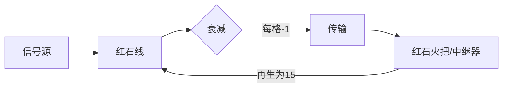
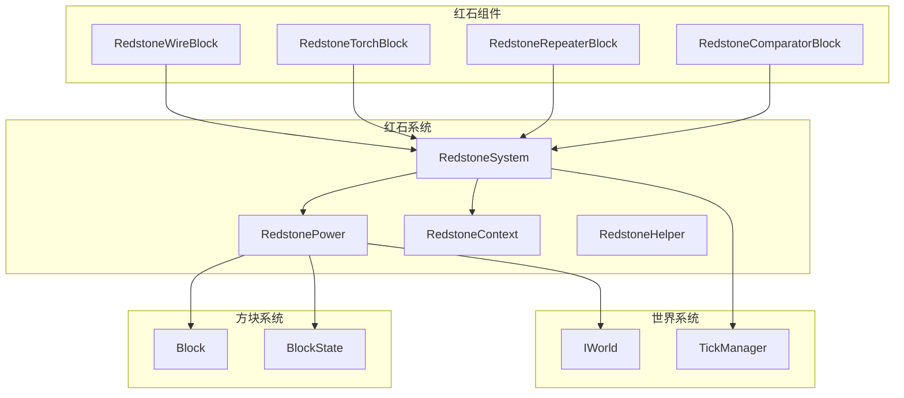

# 红石系统 (Redstone System)

红石系统是 Minecraft 的核心机制之一，负责信号传输、逻辑运算和自动化控制。

## 目录结构

```
redstone/
├── README.md              # 本文档
├── RedstoneSystem.hpp     # 红石系统管理器
├── RedstoneSystem.cpp
├── RedstonePower.hpp      # 信号强度计算
├── RedstonePower.cpp
├── RedstoneContext.hpp    # 递归防护上下文
├── RedstoneContext.cpp
├── RedstoneHelper.hpp     # 辅助函数
└── RedstoneHelper.cpp
```

## 核心概念

### 信号强度

- 范围：0-15（0为无信号，15为最大强度）
- 传输衰减：红石线每传输一格衰减1
- 强信号（Strong Power）：直接从方块侧面输出，可充能相邻实体方块
- 弱信号（Weak Power）：通过方块传导，只能被检测

### 信号传播



### 强信号 vs 弱信号

| 类型 | 来源 | 传导方式 | 用途 |
|------|------|---------|------|
| 强信号 | 红石火把、中继器输出端、比较器输出端 | 可充能实体方块 | 充能方块、激活机械 |
| 弱信号 | 被充能的方块、红石线 | 仅传导 | 信号传输 |

## 类设计

### RedstoneSystem（红石系统管理器）

单例模式，协调所有红石操作：

```cpp
auto& redstone = RedstoneSystem::instance();

// 更新相邻方块
redstone.updateNeighbors(world, pos, block);

// 调度延迟更新
redstone.scheduleUpdate(world, pos, block, 2, TickPriority::High);

// 防递归保护
if (!redstone.isUpdating(pos)) {
    redstone.beginUpdate(pos);
    // 执行红石计算...
    redstone.endUpdate(pos);
}
```

### RedstonePower（信号计算）

静态工具类，计算信号强度：

```cpp
// 获取强信号
i32 strongPower = RedstonePower::getStrongPower(world, pos, Direction::North);

// 获取弱信号
i32 weakPower = RedstonePower::getWeakPower(world, pos);

// 检查是否被充能
bool powered = RedstonePower::isPowered(world, pos);

// 获取红石线输入信号
i32 inputPower = RedstonePower::getWireInputPower(world, pos);

// 获取比较器输入信号
i32 comparatorInput = RedstonePower::getComparatorInput(world, pos, facing);
```

### RedstoneContext（递归防护）

防止红石更新无限递归：

```cpp
RedstoneContext ctx;

// 最大更新深度限制
constexpr i32 MAX_DEPTH = 512;

// 检查并开始更新
if (!ctx.isUpdating(pos) && ctx.canPushDepth()) {
    ctx.beginUpdate(pos);
    ctx.pushDepth();
    // 执行更新...
    ctx.popDepth();
    ctx.endUpdate(pos);
}
```

## 与其他模块的关系



## 输入/输出

### 输入

| 来源 | 数据 | 说明 |
|------|------|------|
| IWorld | 方块状态、方块实体 | 读取世界数据 |
| Block | 信号输出接口 | getWeakPower/getStrongPower |
| TickManager | 计划tick | 延迟更新调度 |

### 输出

| 目标 | 数据 | 说明 |
|------|------|------|
| Block | neighborChanged回调 | 触发方块更新 |
| TickManager | 延迟tick | 调度红石更新 |
| BlockState | 方块状态变化 | 信号强度改变 |

## 性能优化

### 批量更新

```cpp
// 待实现：将多个更新合并处理
RedstoneUpdateBatch batch;
batch.addUpdate(pos1, delay1);
batch.addUpdate(pos2, delay2);
batch.execute(world);
```

### 信号缓存

```cpp
// 待实现：缓存计算结果
RedstoneCache cache;
i32 power = cache.getCachedPower(pos);
if (power < 0) {
    power = RedstonePower::getStrongPower(world, pos);
    cache.cachePower(pos, power);
}
```

### 更新抑制

```cpp
// 防止无限递归
if (depth > MAX_DEPTH) {
    return; // 停止更新
}
```

## 容易踩的坑

### 1. 无限递归

**问题**：红石火把更新可能触发反馈循环。

**解决方案**：使用 RedstoneContext 跟踪正在更新的位置。

```cpp
// 错误：可能无限递归
void updateNeighbors(World& world, BlockPos pos) {
    for (auto dir : Directions::all()) {
        neighborChanged(world, pos.offset(dir));
    }
}

// 正确：使用递归保护
void updateNeighbors(World& world, BlockPos pos) {
    auto& ctx = RedstoneSystem::instance();
    if (ctx.isUpdating(pos)) return;
    ctx.beginUpdate(pos);
    // 更新...
    ctx.endUpdate(pos);
}
```

### 2. 更新顺序

**问题**：中继器面向另一个中继器时，更新顺序影响结果。

**解决方案**：使用正确的 TickPriority。

```cpp
// 面向其他二极管时使用极优先级
if (isFacingTowardsRepeater(world, pos, state)) {
    scheduleUpdate(world, pos, block, delay, TickPriority::ExtremelyHigh);
}
```

### 3. 强弱信号混淆

**问题**：错误区分强信号和弱信号导致逻辑错误。

**解决方案**：使用正确的方法。

```cpp
// 检查方块是否被充能（间接充能）
bool powered = RedstonePower::isPowered(world, pos);

// 获取强信号（直接输出）
i32 strongPower = RedstonePower::getStrongPower(world, pos, side);

// 获取弱信号（通过方块传导）
i32 weakPower = RedstonePower::getWeakPower(world, pos, side);
```

### 4. 信号衰减计算

**问题**：忘记红石线信号衰减。

**解决方案**：使用 RedstoneHelper::attenuate。

```cpp
i32 newPower = RedstoneHelper::attenuate(sourcePower, distance);
```

## 测试用例

测试文件位于：`tests/common/world/redstone/`

- `RedstonePowerTest.cpp` - 信号计算测试
- `RedstoneSystemTest.cpp` - 系统管理测试
- `RedstoneContextTest.cpp` - 递归防护测试

## 参考文档

- [Minecraft Wiki - Redstone](https://minecraft.fandom.com/wiki/Redstone)
- [MC 1.16.5 Source - RedstonePowerLogic](net/minecraft/world/World.java)
