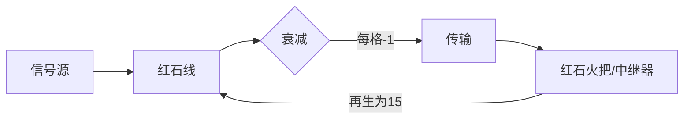
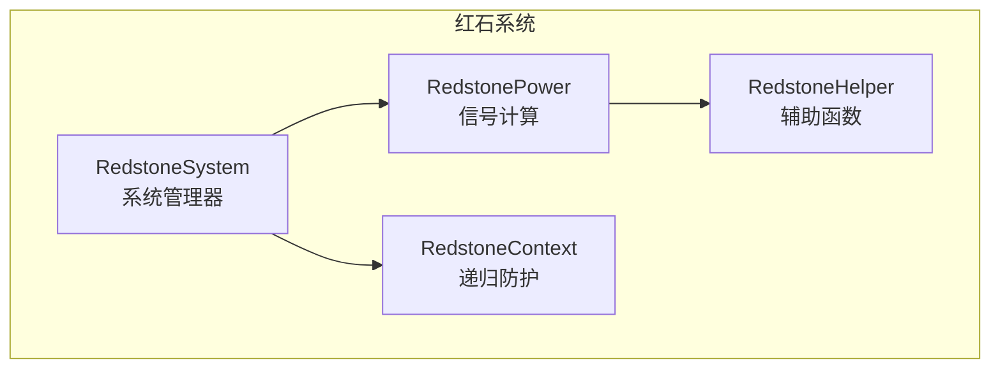
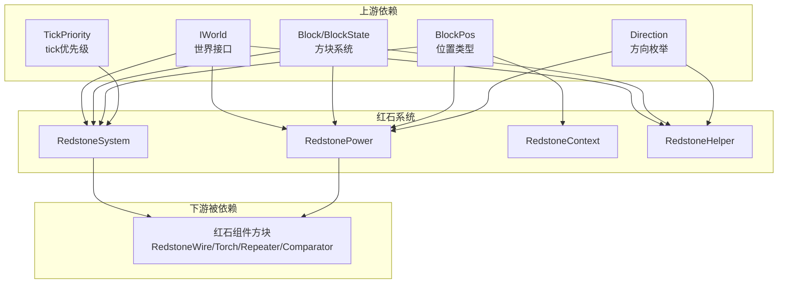

# 红石系统 (Redstone System)

红石系统是 Minecraft 的核心机制之一，负责信号传输、逻辑运算和自动化控制。

## 目录结构

```
redstone/
├── README.md              # 本文档
├── RedstoneSystem.hpp     # 红石系统管理器（单例，协调信号更新与火把烧毁）
├── RedstoneSystem.cpp
├── RedstonePower.hpp      # 信号强度计算工具类（强/弱信号、充能检测）
├── RedstonePower.cpp
├── RedstoneContext.hpp    # 递归防护上下文（防止红石更新无限循环）
├── RedstoneContext.cpp
├── RedstoneHelper.hpp     # 辅助函数（衰减计算、导体检测、连接判断）
└── RedstoneHelper.cpp
```

## 核心概念

### 信号强度

- 范围：0-15（0为无信号，15为最大强度）
- 传输衰减：红石线每传输一格衰减1
- 强信号（Strong Power）：直接从方块侧面输出，可充能相邻实体方块
- 弱信号（Weak Power）：通过方块传导，只能被检测

### 信号传播



### 强信号 vs 弱信号

| 类型 | 来源 | 传导方式 | 用途 |
|------|------|---------|------|
| 强信号 | 红石火把、中继器输出端、比较器输出端 | 可充能实体方块 | 充能方块、激活机械 |
| 弱信号 | 被充能的方块、红石线 | 仅传导 | 信号传输 |

## 内部模块关系



## 上下游外部依赖关系



## 容易踩的坑

### 无限递归

红石火把更新可能触发反馈循环。**解决方案**：使用 `RedstoneSystem::isUpdating()` 检查位置是否正在更新，配合 `beginUpdate/endUpdate` 防止递归。或者使用 `RedstoneContext` 的深度限制（MAX_DEPTH=512）。

### 更新顺序

中继器面向另一个中继器时，更新顺序影响结果。**解决方案**：使用 `scheduleExtremelyHighPriorityUpdate` 确保正确的更新顺序。

### 强弱信号混淆

`isPowered()` 检查是否被充能（包括间接充能），`getStrongPower()` 获取直接输出的强信号，`getWeakPower()` 获取通过方块传导的弱信号。三者在 MC 中的语义不同，使用时需区分。

### 信号衰减

红石线信号每传输一格衰减 1。使用 `RedstoneHelper::attenuate(strength, distance)` 计算衰减后强度。
