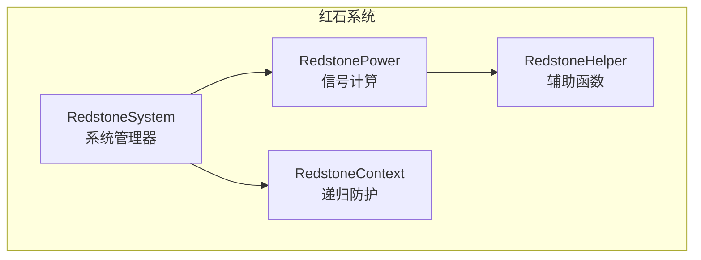
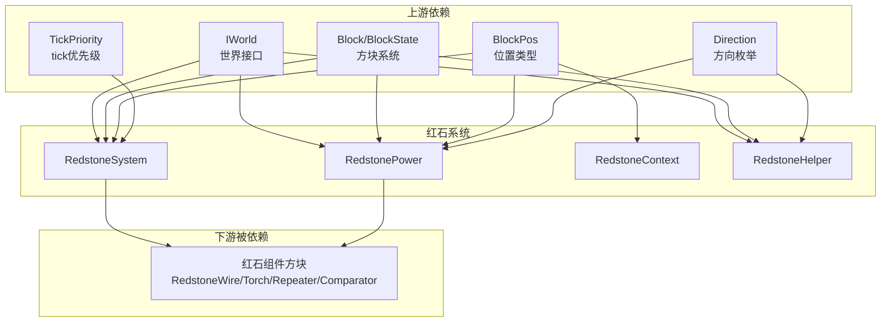

# 红石系统 (Redstone System)

红石系统是 Minecraft 的核心机制之一，负责信号传输、逻辑运算和自动化控制。

## 目录结构

```
redstone/
├── README.md              # 本文档
├── RedstoneSystem.hpp     # 红石系统管理器（单例，协调信号更新与火把烧毁）
├── RedstoneSystem.cpp
├── RedstonePower.hpp      # 信号强度计算工具类（强/弱信号、充能检测）
├── RedstonePower.cpp
├── RedstoneContext.hpp    # 递归防护上下文（防止红石更新无限循环）
├── RedstoneContext.cpp
├── RedstoneHelper.hpp     # 辅助函数（衰减计算、导体检测、连接判断、实体信号、容器信号计算）
└── RedstoneHelper.cpp
```

## 内部模块关系


```mermaid
graph TB
    subgraph 红石系统
        RS[RedstoneSystem<br/>系统管理器]
        RP[RedstonePower<br/>信号计算]
        RC[RedstoneContext<br/>递归防护]
        RH[RedstoneHelper<br/>辅助函数]
    end

    RS --> RP
    RS --> RC
    RP --> RH
```

## 上下游外部依赖关系


```mermaid
graph TB
    subgraph 上游依赖
        IW[IWorld<br/>世界接口]
        BL[Block/BlockState<br/>方块系统]
        BP[BlockPos<br/>位置类型]
        DIR[Direction<br/>方向枚举]
        TP[TickPriority<br/>tick优先级]
    end

    subgraph 红石系统
        RS[RedstoneSystem]
        RP[RedstonePower]
        RC[RedstoneContext]
        RH[RedstoneHelper]
    end

    subgraph 下游被依赖
        RW[红石组件方块<br/>RedstoneWire/Torch/Repeater/Comparator]
    end

    IW --> RS
    IW --> RP
    IW --> RH
    BL --> RS
    BL --> RP
    BL --> RH
    BP --> RS
    BP --> RC
    BP --> RP
    DIR --> RP
    DIR --> RH
    TP --> RS
    RS --> RW
    RP --> RW
```

## 容易踩的坑

### 无限递归

红石火把更新可能触发反馈循环。**解决方案**：使用 `RedstoneSystem::isUpdating()` 检查位置是否正在更新，配合 `beginUpdate/endUpdate` 防止递归。或者使用 `RedstoneContext` 的深度限制（MAX_DEPTH=512）。

### 更新顺序

中继器面向另一个中继器时，更新顺序影响结果。**解决方案**：使用 `scheduleExtremelyHighPriorityUpdate` 确保正确的更新顺序。

### 强弱信号混淆

`getStrongPower()` 与 `getWeakPower()` 查询方块自身的强、弱输出；`getSignal()` 额外包含导体接收的邻居强信号。`isPowered()` 查询位置能否接收邻居信号。查询方向始终从接收者指向信号源。红石块只有弱输出，不能强充能相邻实心方块。

### 信号衰减

红石线信号每传输一格衰减 1。使用 `RedstoneHelper::attenuate(strength, distance)` 计算衰减后强度。

### 实体信号

部分实体可以输出红石比较器信号（0-15），通过 `Entity::getComparatorOutput()` 虚方法实现。

**`RedstoneHelper::getEntitySignal()`**：在指定区域搜索实体并返回最大比较器信号强度。
- `getEntitySignal(IWorld&, const BlockPos&)` — 搜索方块位置处的实体
- `getEntitySignal(IWorld&, const AxisAlignedBB&)` — 搜索 AABB 区域内的实体

**`RedstoneHelper::calcRedstoneFromInventory()`**：计算容器填充信号，公式为 `floor(fillRatio * 14) + (hasItems ? 1 : 0)`。

**实体信号表：**

| 实体 | 信号来源 | 方法 |
|------|---------|------|
| ItemFrameEntity | 物品堆叠数/地图编号 | `getComparatorOutput()` |
| ChestMinecartEntity | 容器填充率 | `getComparatorOutput()` → `calcRedstoneFromInventory()` |
| HopperMinecartEntity | 容器填充率 | `getComparatorOutput()` → `calcRedstoneFromInventory()` |
| CommandBlockMinecartEntity | 成功计数 | `getComparatorOutput()` → `m_successCount` |

**集成路径：**
- `DetectorRailBlock::getComparatorInputOverride()` 使用 `getEntitySignal()` 查询矿车信号
- `RedstoneComparatorBlock` 对物品框直接调用 `getComparatorOutput()`
