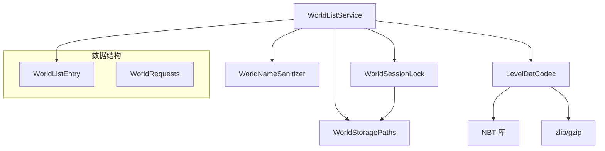
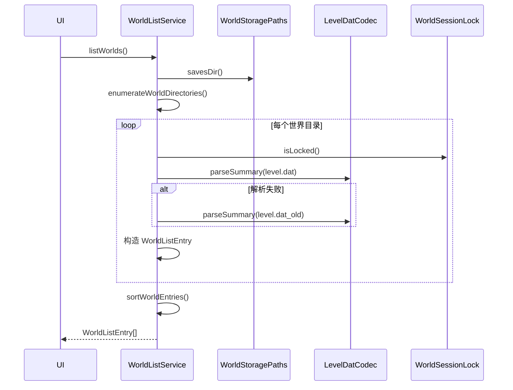
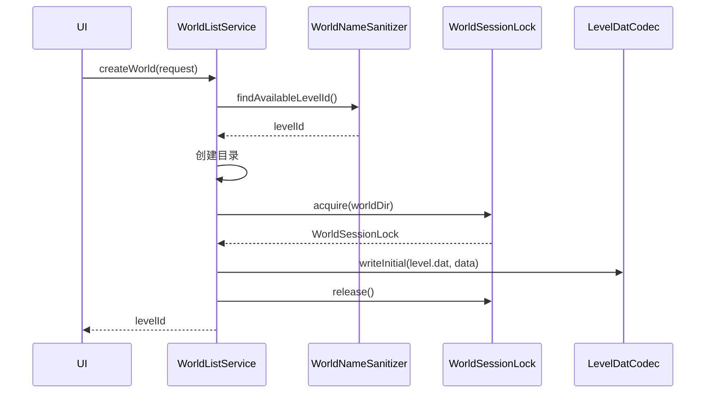
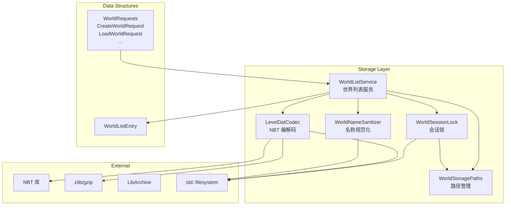

# World Storage 模块

## 概述

本模块实现世界存档的持久化层，负责世界元数据的读写、世界列表管理、会话锁和目录命名规范化。遵循 Minecraft Java 1.16.5 的 level.dat 格式规范。

## 目录结构

```
storage/
├── LevelDatCodec.hpp/.cpp    # level.dat NBT 编解码器
├── WorldListEntry.hpp/.cpp   # 世界列表条目数据模型
├── WorldListService.hpp/.cpp # 世界列表服务（枚举、创建、删除、备份）
├── WorldNameSanitizer.hpp/.cpp # 世界目录名规范化
├── WorldRequests.hpp/.cpp    # 世界操作请求结构体
├── WorldSessionLock.hpp/.cpp # 会话锁（RAII）
├── WorldStoragePaths.hpp/.cpp # 存档路径配置
└── README.md
```

## 文件介绍

### LevelDatCodec.hpp/.cpp

`LevelDatCodec` 负责 `level.dat` 文件的读写。Minecraft 使用 gzip 压缩的 NBT 格式。

**核心类型：**

- `LevelSummaryData` - 世界摘要数据（用于世界列表显示）
  - `displayName`, `lastPlayedMs`, `seed`
  - `worldType`, `gameMode`, `difficulty`
  - `hardcore`, `allowCommands`
  - `versionName`, `dataVersion`
  - `compatibility`, `errorMessage`

- `LevelRuntimeData` - 世界运行时数据（用于创建新世界）
  - 继承 `LevelSummaryData` 所有字段
  - 无持久化字段，仅用于初始化

**核心方法：**

```cpp
// 读取 level.dat 并解析摘要
static Result<LevelSummaryData> parseSummary(const std::filesystem::path& levelDatPath);

// 写入初始 level.dat（新世界）
static Result<void> writeInitial(
    const std::filesystem::path& levelDatPath,
    const LevelRuntimeData& data);

// 更新显示名称
static Result<void> updateDisplayName(
    const std::filesystem::path& levelDatPath,
    const std::string& newDisplayName);

// 更新最后游玩时间
static Result<void> updateLastPlayed(
    const std::filesystem::path& levelDatPath,
    i64 lastPlayedMs);
```

**NBT 字段映射：**

| 项目字段 | NBT 路径 | 说明 |
|---------|----------|------|
| `displayName` | `Data.LevelName` | 世界显示名 |
| `lastPlayedMs` | `Data.LastPlayed` | 最后游玩时间戳 |
| `seed` | `Data.RandomSeed` | 世界种子 |
| `gameMode` | `Data.GameType` | 游戏模式 |
| `hardcore` | `Data.hardcore` | 极限模式 |
| `allowCommands` | `Data.allowCommands` | 允许作弊 |
| `difficulty` | `Data.Difficulty` | 难度 |
| `versionName` | `Data.Version.Name` | 版本名 |
| `dataVersion` | `Data.DataVersion` | 数据版本 |
| `worldType` | `Data.Reborn.WorldType` | 世界类型（私有字段） |

**原子写入策略：**

1. 写入临时文件 `level.dat.tmp`
2. 备份现有 `level.dat` 为 `level.dat_old`
3. 重命名 `level.dat.tmp` 为 `level.dat`

### WorldListEntry.hpp/.cpp

世界列表条目数据结构。

```cpp
struct WorldListEntry {
    // 标识信息
    std::string levelId;              // 目录名（唯一标识）
    std::string displayName;          // 显示名称

    // 元数据
    i64 lastPlayedMs = 0;             // 最后游玩时间
    u64 seed = 0;                     // 世界种子
    WorldType worldType = WorldType::Default;
    GameMode gameMode = GameMode::Survival;
    Difficulty difficulty = Difficulty::Normal;
    bool hardcore = false;
    bool allowCommands = false;

    // 版本信息
    std::string versionName;
    i32 dataVersion = 0;
    WorldCompatibility compatibility = WorldCompatibility::Compatible;
    std::string errorMessage;         // 错误信息（如有）

    // 路径信息
    std::filesystem::path worldDir;   // 世界目录绝对路径
    std::filesystem::path iconPath;   // 图标路径（可能为空）
    bool locked = false;              // 是否被锁定
};

// 工具函数
void sortWorldEntries(std::vector<WorldListEntry>& entries);
std::vector<WorldListEntry> filterWorldEntries(
    const std::vector<WorldListEntry>& entries,
    const std::string& query);
```

### WorldListService.hpp/.cpp

世界列表服务，提供世界枚举、创建、删除、重命名、备份等操作。

```cpp
class WorldListService {
public:
    explicit WorldListService(WorldStoragePaths paths);

    // 列出所有世界
    Result<std::vector<WorldListEntry>> listWorlds();

    // 获取单个世界摘要
    Result<WorldListEntry> getWorldSummary(const std::string& levelId);

    // 检查世界是否存在
    bool worldExists(const std::string& levelId);

    // 创建新世界
    Result<std::string> createWorld(const CreateWorldRequest& request);

    // 删除世界
    Result<void> deleteWorld(const std::string& levelId);

    // 重命名世界（仅修改显示名）
    Result<void> renameWorld(const std::string& levelId,
                             const std::string& newDisplayName);

    // 更新最后游玩时间
    Result<void> updateLastPlayed(const std::string& levelId, i64 lastPlayedMs);

    // 创建备份
    Result<BackupWorldResult> backupWorld(const BackupWorldRequest& request);
};
```

### WorldNameSanitizer.hpp/.cpp

世界目录名规范化工具，复刻 Minecraft 原版命名规则。

```cpp
class WorldNameSanitizer {
public:
    // 非法文件名字符：/\:*?"<>|
    static const char* ILLEGAL_CHARS;

    // 检查是否为 Windows 保留名
    static bool isReservedName(const std::string& name);

    // 规范化名称（替换非法字符、处理保留名、限制长度）
    static std::string sanitizeName(const std::string& name);

    // 解析 "Name (N)" 格式
    static bool parseExistingNameWithNumber(
        const std::string& name,
        std::string& baseName,
        i32& number);

    // 查找可用目录名（冲突时追加序号）
    static Result<std::string> findAvailableLevelId(
        const std::filesystem::path& savesDir,
        const std::string& requestedName);

    // 检查目录名是否可用
    static bool isLevelIdAvailable(
        const std::filesystem::path& savesDir,
        const std::string& levelId);
};
```

### WorldRequests.hpp/.cpp

世界操作请求结构体。

```cpp
struct CreateWorldRequest {
    std::string displayName;
    std::string requestedLevelId;  // 空=自动生成
    u64 seed = 0;
    WorldType worldType = WorldType::Default;
    GameMode gameMode = GameMode::Survival;
    Difficulty difficulty = Difficulty::Normal;
    bool hardcore = false;
    bool allowCommands = false;
    i32 viewDistance = 10;
};

struct LoadWorldRequest {
    std::string levelId;
    bool allowFutureVersion = false;
    bool createBackupBeforeUpgrade = false;
    bool allowStorageConversion = false;
};

struct RenameWorldRequest {
    std::string levelId;
    std::string newDisplayName;
};

struct DeleteWorldRequest {
    std::string levelId;
};

struct BackupWorldRequest {
    std::string levelId;
    std::string reason;
};

struct BackupWorldResult {
    std::filesystem::path zipPath;
    u64 sizeBytes;
};
```

### WorldSessionLock.hpp/.cpp

会话锁 RAII 包装，防止多进程同时访问同一世界。

**平台实现：**
- Unix: `flock(LOCK_EX | LOCK_NB)`
- Windows: `LockFileEx`

```cpp
class WorldSessionLock {
public:
    // 获取锁（创建 session.lock 文件并获取文件锁）
    static Result<WorldSessionLock> acquire(const std::filesystem::path& worldDir);

    // 检查是否被锁定（仅用于 UI 显示，实际操作前必须重新 acquire）
    static bool isLocked(const std::filesystem::path& worldDir);

    // 移动语义
    WorldSessionLock(WorldSessionLock&& other) noexcept;
    WorldSessionLock& operator=(WorldSessionLock&& other) noexcept;

    // 禁止拷贝
    WorldSessionLock(const WorldSessionLock&) = delete;
    WorldSessionLock& operator=(const WorldSessionLock&) = delete;

    // 析构时释放锁
    ~WorldSessionLock();

    bool isValid() const noexcept;
    const std::filesystem::path& worldDir() const noexcept;
    void release();  // 手动释放

private:
    WorldSessionLock(std::filesystem::path worldDir);

#ifdef _WIN32
    void* m_fileHandle;  // HANDLE
#else
    int m_fd;  // file descriptor
#endif
    std::filesystem::path m_worldDir;
    std::filesystem::path m_lockPath;
    bool m_valid;
};
```

**使用方法：**

```cpp
// 尝试获取锁
auto lockResult = WorldSessionLock::acquire(worldDir);
if (!lockResult.success()) {
    // 世界已被锁定或获取失败
    spdlog::error("Failed to acquire lock: {}", lockResult.error().message());
    return;
}

// 锁获取成功，可以安全访问世界
WorldSessionLock lock = std::move(lockResult.value());

// ... 世界操作 ...

// 析构时自动释放锁
```

**跨进程互斥保证：**
- 文件锁由操作系统内核管理
- 即使进程崩溃，锁也会自动释放
- 支持跨平台（Windows/Unix）

### WorldStoragePaths.hpp/.cpp

存档路径配置。

```cpp
class WorldStoragePaths {
public:
    // 构造函数
    WorldStoragePaths(std::filesystem::path savesDir, std::filesystem::path backupsDir);
    static WorldStoragePaths defaultPaths();

    // 基础目录
    const std::filesystem::path& savesDir() const noexcept;
    const std::filesystem::path& backupsDir() const noexcept;
    std::filesystem::path worldDir(const std::string& levelId) const;

    // 传统文件路径
    std::filesystem::path levelDatPath(const std::string& levelId) const;
    std::filesystem::path levelDatOldPath(const std::string& levelId) const;
    std::filesystem::path sessionLockPath(const std::string& levelId) const;
    std::filesystem::path iconPath(const std::string& levelId) const;

    // RocksDB 数据库路径（自有格式）
    std::filesystem::path dbPath(const std::string& levelId) const;
    std::filesystem::path dbChunksPath(const std::string& levelId) const;
    std::filesystem::path dbEntitiesPath(const std::string& levelId) const;
    std::filesystem::path dbPoiPath(const std::string& levelId) const;
    std::filesystem::path dbSnapshotsMetaPath(const std::string& levelId) const;

    // 快照路径（版本控制）
    std::filesystem::path snapshotsPath(const std::string& levelId) const;
    std::filesystem::path snapshotPath(const std::string& levelId, const std::string& snapshotId) const;
    std::filesystem::path snapshotManifestPath(const std::string& levelId, const std::string& snapshotId) const;
    std::filesystem::path snapshotDeltaPath(const std::string& levelId, const std::string& snapshotId) const;

    // 导入路径（格式转换）
    std::filesystem::path importPath(const std::string& levelId) const;
    std::filesystem::path importJavaPath(const std::string& levelId) const;
    std::filesystem::path importBedrockPath(const std::string& levelId) const;

    // 目录创建
    bool ensureSavesDirExists() const;
    bool ensureBackupsDirExists() const;
    bool ensureWorldDirExists(const std::string& levelId) const;
    bool ensureDbDirExists(const std::string& levelId) const;

private:
    std::filesystem::path m_savesDir;
    std::filesystem::path m_backupsDir;
};
```

**目录结构：**

```
saves/
└── {levelId}/
    ├── level.dat              # 世界元数据（NBT格式）
    ├── level.dat_old          # 备份
    ├── session.lock           # 会话锁
    ├── icon.png               # 世界图标
    ├── db/                    # RocksDB数据库目录
    │   ├── chunks/            # 区块数据（Section粒度）
    │   ├── entities/          # 实体数据
    │   ├── poi/               # 兴趣点数据
    │   └── snapshots/         # 快照元数据
    ├── snapshots/             # 快照数据目录
    │   └── {snapshot_id}/     # 具体快照
    │       ├── manifest.json  # 快照清单
    │       └── delta/         # 增量数据
    └── import/                # 导入临时目录
        ├── java/              # Java版存档导入
        └── bedrock/           # 基岩版存档导入
```

## 模块关系



## 数据流向

### 列出世界



### 创建世界



## 依赖项

- **内部依赖**
  - `common/core/Result.hpp` - 错误处理
  - `common/util/nbt/Nbt.hpp` - NBT 解析
  - `common/core/Types.hpp` - 基础类型

- **外部依赖**
  - `zlib` - gzip 压缩/解压
  - `LibArchive` - zip 备份
  - `spdlog` - 日志
  - `std::filesystem` - 文件系统操作

## 使用方法

```cpp
#include "world/storage/WorldListService.hpp"
#include "world/storage/WorldStoragePaths.hpp"

// 创建服务
mc::world::storage::WorldStoragePaths paths("/path/to/saves");
mc::world::storage::WorldListService service(paths);

// 列出世界
auto worldsResult = service.listWorlds();
if (worldsResult.success()) {
    for (const auto& entry : worldsResult.value()) {
        std::cout << entry.displayName << " (" << entry.levelId << ")\n";
    }
}

// 创建新世界
mc::world::storage::CreateWorldRequest request;
request.displayName = "My World";
request.seed = 12345;
request.worldType = mc::world::WorldType::Default;

auto createResult = service.createWorld(request);
if (createResult.success()) {
    std::cout << "Created: " << createResult.value() << "\n";
}
```

## 容易踩的坑

1. **gzip 与 zip 混淆**：`level.dat` 使用 gzip 压缩，不是 zip。解压时使用 `inflateInit2(&stream, 15 | 16)`。

2. **NBT 字节序**：Minecraft Java Edition 使用大端序。项目 NBT 库已正确处理。

3. **文件锁跨平台**：第一版仅检测文件存在，不保证跨进程互斥。未来需使用 `flock`/`LockFileEx`。

4. **世界目录名 vs 显示名**：`levelId` 是目录名（受文件系统限制），`displayName` 是显示名（可包含任意字符）。

5. **backupWorld 使用 LibArchive**：项目已依赖 LibArchive，用于 zip 备份。不要引入 libzip。

## 测试用例

- `tests/common/world/storage/LevelDatCodecTest.cpp` - NBT 读写、gzip 解压、字段解析
- `tests/common/world/storage/WorldListServiceTest.cpp` - 世界枚举、创建、删除
- `tests/common/world/storage/WorldNameSanitizerTest.cpp` - 名称规范化、冲突处理

## Mermaid 架构图


