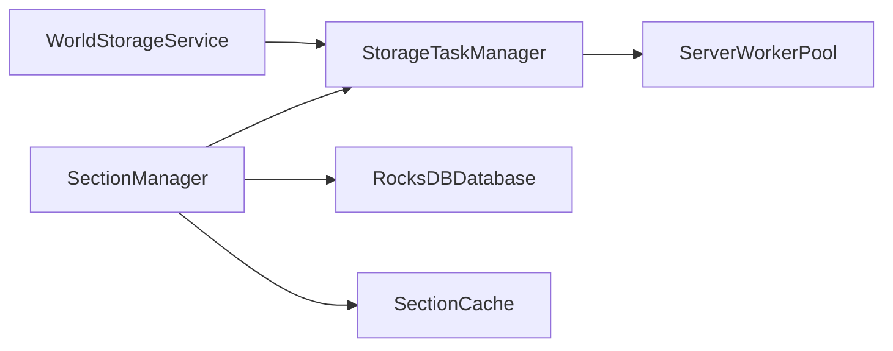
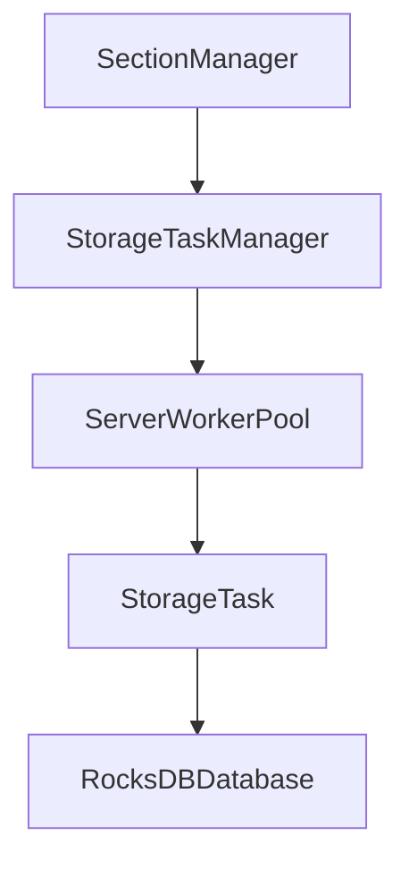
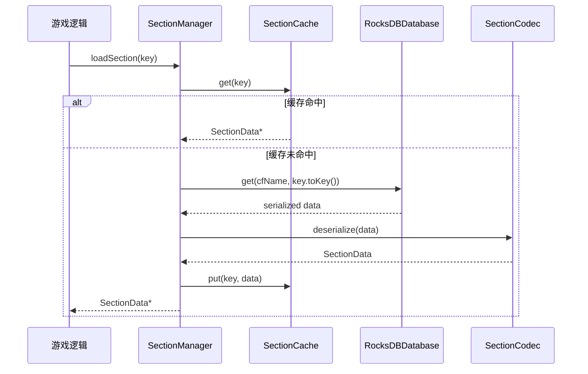
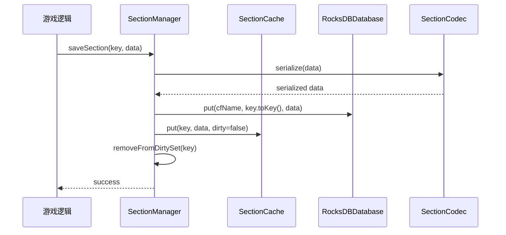
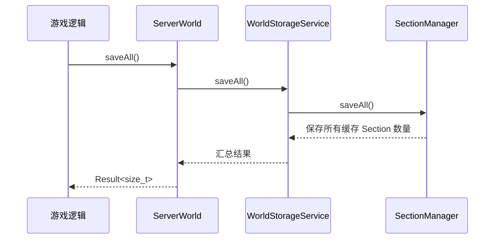
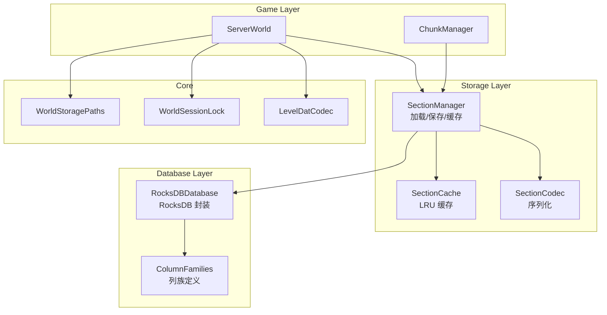

# World Storage 模块

## 概述

本模块实现世界存档的持久化层，提供以下核心功能：

1. **世界元数据管理**：level.dat NBT 编解码、世界列表管理
2. **RocksDB 存储层**：高性能 Section 级区块存储
3. **会话锁和命名规范化**：防止多进程访问冲突
4. **统一门面接口**：WorldStorageService 作为唯一对外接口
5. **保存协调**：`flushAllDirty()` 用于增量落盘，`saveAll()` 用于全量落盘

遵循 Minecraft Java 1.16.5 的 level.dat 格式规范，同时提供高性能的自有存储格式。

## 目录结构

```
storage/
├── WorldStorageService.hpp/cpp  # [核心] 存储系统门面类（唯一对外接口）
├── core/                        # 核心存储基础设施
│   ├── LevelDatCodec.hpp/cpp    # level.dat NBT 编解码器
│   ├── WorldStoragePaths.hpp/cpp # 存档路径配置
│   └── WorldSessionLock.hpp/cpp # 会话锁（RAII）
├── list/                        # 世界列表管理
│   ├── WorldListEntry.hpp/cpp   # 世界列表条目数据模型
│   ├── WorldListService.hpp/cpp # 世界列表服务
│   └── WorldNameSanitizer.hpp/cpp # 名称规范化
├── request/                     # 请求/响应结构体
│   └── WorldRequests.hpp/cpp    # 世界操作请求
├── db/                          # RocksDB 存储层
│   ├── RocksDBConfig.hpp        # RocksDB 配置
│   ├── RocksDBDatabase.hpp/cpp  # 数据库封装
│   ├── ColumnFamilies.hpp       # 列族定义
│   ├── SectionKey.hpp           # Section 键结构
│   ├── SectionCodec.hpp/cpp     # Section 序列化
│   └── ConsistencyMode.hpp      # 一致性模式枚举
├── section/                     # Section 数据管理
│   ├── SectionCache.hpp/cpp     # LRU 缓存
│   └── SectionManager.hpp/cpp   # Section 加载/保存/缓存
├── snapshot/                    # 快照系统
│   └── BackupManager.hpp/cpp    # 快照管理
├── save/                        # 保存管理
│   ├── DirtyTracker.hpp/cpp     # 脏Section追踪
│   ├── AutoSave.hpp/cpp         # 自动保存
│   └── SaveManager.hpp/cpp      # 保存协调
└── README.md
```

## 核心设计

### 访问控制原则

**重要**：`WorldStorageService` 是存储模块的唯一对外接口。

- **外部模块**（如 ServerWorld、MinecraftServer）只能访问 `WorldStorageService`
- **内部模块**（如 SectionManager、RocksDBDatabase、SectionCache）不允许被外部直接访问
- `WorldStorageService` 通过 getter 方法暴露子服务

### 使用示例

```cpp
// 在 ServerWorld 中初始化
storage::WorldStorageService m_storage;

auto result = m_storage.open(worldPath, storageConfig);
if (!result.success()) {
    // 处理错误
}

// 通过子服务访问
auto& sectionMgr = m_storage.sectionManager(dimension);
auto data = sectionMgr.loadSection(key);

// 保存数据
sectionMgr.saveSection(key, data);

// 全量保存（/save-all 或服务器关闭时使用）
auto fullSaveResult = m_storage.saveAll();
if (!fullSaveResult.success()) {
    // 处理错误
}

// 关闭时自动保存脏数据
m_storage.close();  // 自动调用 flushAllDirty()
```

## 存储架构

### 设计决策

| 决策项 | 选择 | 理由 |
|--------|------|------|
| 存储粒度 | Section (16x16x16) | 支持增量更新和快照去重 |
| Key 语义 | SectionKey (13字节) | dimensionId + chunkX + chunkZ + sectionY |
| 列族设计 | 每维度每数据类型一个 CF | 隔离查询、独立压缩配置 |
| 一致性模式 | 可配置三档 | 平衡性能与安全性 |
| 快照机制 | RocksDB BackupEngine | 原生增量备份支持 |

### 列族布局

```
┌─────────────────────────────────────────────────────────────┐
│                      RocksDB Database                        │
├─────────────────────────────────────────────────────────────┤
│ CF: default          │ 元数据                               │
│ CF: sections_overworld  │ 主世界 Section 数据              │
│ CF: sections_nether     │ 下界 Section 数据                │
│ CF: sections_the_end    │ 末地 Section 数据                │
│ CF: entities_overworld  │ 主世界实体数据                   │
│ CF: entities_nether     │ 下界实体数据                     │
│ CF: entities_the_end    │ 末地实体数据                     │
│ CF: poi_overworld       │ 主世界 POI 数据                  │
│ CF: poi_nether          │ 下界 POI 数据                    │
│ CF: poi_the_end         │ 末地 POI 数据                    │
│ CF: snapshots           │ 快照元数据                       │
│ CF: players             │ 玩家数据                         │
└─────────────────────────────────────────────────────────────┘
```

### SectionKey 布局 (13 字节)

```
┌─────────────────────────────────────────────────────────────┐
│ dimensionId (i16, BE) │ chunkX (i32, BE) │ chunkZ (i32, BE) │
│     2 bytes           │     4 bytes      │     4 bytes      │
├─────────────────────────────────────────────────────────────┤
│ sectionY (i8)         │ padding (u16)                         │
│     1 byte            │     2 bytes                           │
└─────────────────────────────────────────────────────────────┘
```

### 一致性模式

| 模式 | sync | WAL | 适用场景 |
|------|------|-----|----------|
| Strong | true | 启用 | 服务器关闭、重要操作 |
| Eventual | false | 启用 | 正常游戏运行 |
| Strongest | true | sync | 崩溃测试、开发调试 |

## 核心组件

### RocksDBDatabase

RocksDB 数据库封装，提供多列族操作。

```cpp
// 打开数据库
auto dbResult = RocksDBDatabase::open("/path/to/db", config);
if (!dbResult.success()) { /* 处理错误 */ }
auto db = std::move(dbResult.value());

// 读写操作
Result<std::vector<u8>> get(const std::string& cfName, const std::vector<u8>& key);
Result<void> put(const std::string& cfName, const std::vector<u8>& key, 
                 const std::vector<u8>& value, bool sync = false);
Result<void> del(const std::string& cfName, const std::vector<u8>& key);

// 批量写入
Result<void> writeBatch(rocksdb::WriteBatch& batch, bool sync = false);

// 范围操作
std::unique_ptr<rocksdb::Iterator> newIterator(const std::string& cfName);
Result<void> deleteRange(const std::string& cfName, 
                         const std::vector<u8>& startKey, 
                         const std::vector<u8>& endKey);

// 快照
const rocksdb::Snapshot* createSnapshot();
void releaseSnapshot(const rocksdb::Snapshot* snapshot);

// 备份
Result<u64> createBackup(const std::filesystem::path& backupDir, 
                         const std::string& metadata = "");
Result<void> restoreFromBackup(const std::filesystem::path& backupDir, 
                               u64 backupId, 
                               const std::filesystem::path& targetDir);
```

### SectionManager

Section 数据管理器，提供加载、保存、缓存功能。

```cpp
// 创建管理器
SectionManager manager(db, DimensionId::Overworld, config);

// 同步加载
Result<SectionData*> loadSection(const SectionKey& key);

// 异步加载
std::future<Result<SectionData*>> loadSectionAsync(
    const SectionKey& key, 
    TaskPriority priority = TaskPriority::Normal);

// 保存
Result<void> saveSection(const SectionKey& key, const SectionData& data, 
                         bool immediate = false);

// 批量保存脏 Section
Result<size_t> flushDirtySections();

// 保存所有缓存 Section
Result<size_t> saveAll();

// 脏标记管理
bool markDirty(const SectionKey& key);
std::vector<SectionKey> getDirtyKeys() const;
```

### StorageTask / StorageTaskManager

**职责**：把存储相关的异步工作单元显式包装成任务，并统一提交到存储 IO Worker 池。

**主要功能**：
- 统一封装 Section 读写/刷盘任务
- 提供 Perfetto 追踪类别，便于区分 load/save/flush
- 由 `StorageTaskManager` 统一转发到 `ServerWorkerPool`

**使用示例**：
```cpp
auto& storage = world.storage();
auto* taskManager = storage.taskManager();

auto task = StorageTask::createLoadTask(key, [](const std::atomic<bool>& cancelSignal) {
    if (cancelSignal.load(std::memory_order_acquire)) {
        return false;
    }
    return true;
});

taskManager->submit(std::move(task), util::TaskPriority::High);
```

**模块关系**：
- `WorldStorageService` 负责创建和销毁 `StorageTaskManager`
- `SectionManager` 通过 `StorageTaskManager` 提交异步任务
- `StorageTask` 只负责执行逻辑，不直接管理线程

## 文件介绍

### `task/StorageTask.hpp` / `StorageTask.cpp`

存储任务的轻量封装，当前支持：
- `SectionLoad`
- `SectionSave`
- `SectionFlush`

任务会在执行时写入 `storage.task.*` 追踪类别，方便定位存储卡顿点。

### `task/StorageTaskManager.hpp` / `StorageTaskManager.cpp`

存储任务调度门面，内部仅保存一个 `ServerWorkerPool*`，用于：
- 提交任务
- 取消任务
- 等待所有任务完成

该类不拥有线程池，线程池生命周期由 `WorldStorageService` 负责。

## 模块关系



## 整体职责

本模块现在不仅负责持久化数据，还负责把存储工作拆分为可追踪、可调度的异步任务，避免继续依赖零散的 `std::async`。

## 输入 / 输出

- **输入**：`SectionKey`、`SectionData`、保存配置、世界路径
- **输出**：Section 缓存、磁盘数据、快照、任务完成回调

## 依赖项

- 内部：`SectionManager`、`SectionCache`、`RocksDBDatabase`、`WorldStorageService`、`StorageTaskManager`
- 外部：`rocksdb`、`fmt`、`spdlog`、`GTest`

## 使用方法

```cpp
WorldStorageService storage;
storage.open(worldPath, config);

auto& sectionManager = storage.sectionManager(dimension);
auto future = sectionManager.loadSectionAsync(key, util::TaskPriority::High);
```

## 容易踩的坑

- `StorageTaskManager` 不拥有线程池，必须先由 `WorldStorageService::open()` 建立 IO 池。
- 异步接口当前仍然通过 `promise/future` 回传结果，调用方必须等待 future。
- `SectionManager` 的异步任务是共享同一个任务池，不要在外部重复启动额外线程。

## 测试用例

- `tests/common/world/storage/WorldStorageServiceTest.cpp`
- `tests/common/world/storage/SectionCodecTest.cpp`
- `tests/common/world/storage/StorageTaskTest.cpp`

## Mermaid 图表



### SectionCache

LRU 缓存实现，自动淘汰未使用的 Section。

```cpp
SectionCache cache(1024);  // 缓存 1024 个 Section

// 放入和获取
std::shared_ptr<SectionData> get(const SectionKey& key);
std::shared_ptr<SectionData> put(const SectionKey& key, 
                                  std::shared_ptr<SectionData> data, 
                                  bool dirty = false);

// 脏标记
bool markDirty(const SectionKey& key);
std::vector<SectionKey> getDirtyKeys() const;

// 枚举所有缓存
std::vector<std::pair<SectionKey, std::shared_ptr<SectionData>>> getAllSections() const;

// 统计
CacheStats getStats() const;
```

### SectionCodec

Section 数据序列化，支持 ZSTD 压缩。

```cpp
// 序列化格式：
// - Header (12字节): version, flags, blockCount, reserved, contentHash
// - Block States: ZSTD 压缩的 4096 个 u32
// - Biomes: 64 个 BiomeId
// - Sky Light: 可选，2048 字节 NibbleArray
// - Block Light: 可选，2048 字节 NibbleArray

Result<std::vector<u8>> SectionData::serialize() const;
Result<SectionData> SectionData::deserialize(const u8* data, size_t size);

// ChunkSection 转换
Result<SectionData> SectionCodec::fromChunkSection(
    const ChunkSection& section, 
    const SectionKey& key, 
    const std::vector<BiomeId>& biomes = {});
Result<void> SectionCodec::toChunkSection(
    const SectionData& data, 
    ChunkSection& section);
```

## 文件介绍

### LevelDatCodec.hpp/.cpp

`LevelDatCodec` 负责 `level.dat` 文件的读写。Minecraft 使用 gzip 压缩的 NBT 格式。

**核心类型：**

- `LevelSummaryData` - 世界摘要数据（用于世界列表显示）
- `LevelRuntimeData` - 世界运行时数据（用于创建新世界）

**核心方法：**

```cpp
static Result<LevelSummaryData> parseSummary(const std::filesystem::path& levelDatPath);
static Result<void> writeInitial(const std::filesystem::path& levelDatPath, 
                                 const LevelRuntimeData& data);
static Result<void> updateDisplayName(const std::filesystem::path& levelDatPath, 
                                       const std::string& newDisplayName);
static Result<void> updateLastPlayed(const std::filesystem::path& levelDatPath, 
                                      i64 lastPlayedMs);
```

### WorldSessionLock.hpp/.cpp

会话锁 RAII 包装，防止多进程同时访问同一世界。

```cpp
// 获取锁
auto lockResult = WorldSessionLock::acquire(worldDir);
if (!lockResult.success()) {
    // 世界已被锁定
    return;
}

// 锁获取成功，可以安全访问世界
WorldSessionLock lock = std::move(lockResult.value());

// ... 世界操作 ...

// 析构时自动释放锁
```

### WorldStoragePaths.hpp/.cpp

存档路径配置，定义世界存储的目录结构。

```
saves/
└── {levelId}/
    ├── level.dat              # 世界元数据（NBT格式）
    ├── level.dat_old          # 备份
    ├── session.lock           # 会话锁
    ├── icon.png               # 世界图标
    ├── db/                    # RocksDB数据库目录
    │   ├── *.sst              # SST 文件
    │   └── ...                # 其他 RocksDB 文件
    ├── backups/               # RocksDB 备份目录
    └── import/                # 导入临时目录
```

### 保存协调层

- `WorldStorageService::flushAllDirty()`：仅刷新所有脏 Section，供自动保存和关闭流程使用。
- `WorldStorageService::saveAll()`：保存所有已缓存 Section，供 `/save-all` 和全量落盘使用。
- `SaveManager`：已实现保存编排，并由 `ServerWorld`、`/save-all` 与自动保存路径接入。
- `AutoSave`：定时触发脏数据保存，并可选创建快照。

## 数据流向

### Section 加载流程



### Section 保存流程



### 全量保存流程



## 依赖项

- **内部依赖**
  - `common/core/Result.hpp` - 错误处理
  - `common/util/nbt/Nbt.hpp` - NBT 解析
  - `common/core/Types.hpp` - 基础类型
  - `common/perfetto/TraceEvents.hpp` - 性能追踪

- **外部依赖**
  - `rocksdb` - 键值存储
  - `zstd` - 压缩
  - `zlib` - gzip 压缩/解压
  - `LibArchive` - zip 备份
  - `spdlog` - 日志
  - `std::filesystem` - 文件系统操作

## 性能优化

### RocksDB 配置

- **块缓存**: 256MB（缓存热数据块）
- **行缓存**: 64MB（缓存行数据）
- **MemTable**: 64MB x 4（内存写入缓冲）
- **压缩**: 当前禁用（需要链接 Snappy/ZSTD 库）
- **Bloom 过滤器**: 10 bits/key（减少读取放大）

### Section 缓存

- 默认缓存 1024 个 Section
- LRU 淘汰策略
- 脏标记追踪，支持批量保存

### 异步 IO

- 使用 ServerWorkerPool 进行后台 IO 操作
- 支持优先级调度（区块加载优先于保存）

### 保存行为说明

- `flushDirtySections()` 只处理脏 Section，适合常规 tick 保存。
- `saveAll()` 会遍历所有缓存的 Section，适合 `/save-all`、崩溃前落盘和关闭流程。
- `ServerChunkManager` 在保存区块时会保留生物群系 4x4x4 采样；读取时会恢复到 `BiomeContainer`。

## 与区块系统集成

存储系统已与 `ServerChunkManager` 集成：

```cpp
// 区块加载时从存储读取
ChunkData* ServerChunkManager::loadChunkFromStorage(ChunkCoord x, ChunkCoord z) {
    auto& sectionMgr = m_world.storage().sectionManager(dimension);
    auto chunk = std::make_unique<ChunkData>(x, z);
    for (i8 sectionY = 0; sectionY < CHUNK_SECTIONS; ++sectionY) {
        SectionKey key(x, z, sectionY, dimension);
        auto result = sectionMgr.loadSection(key);
        if (result.success() && result.value()) {
            SectionCodec::toChunkSection(*result.value(), chunk->getOrCreateSection(sectionY));
        }
    }
    // 读取到的生物群系会回填到 chunk 中，避免区块保存后丢失 biome 数据。
    return chunk;
}

// 区块卸载时保存到存储
void ServerChunkManager::saveChunkSections(const ChunkData& chunk) {
    auto& sectionMgr = m_world.storage().sectionManager(chunk.dimension());
    for (i8 sectionY = 0; sectionY < CHUNK_SECTIONS; ++sectionY) {
        SectionKey key(chunk.x(), chunk.z(), sectionY, chunk.dimension());
        auto dataResult = SectionCodec::fromChunkSection(*section, key, biomes);
        if (dataResult.success()) {
            sectionMgr.saveSection(key, dataResult.value());
        }
    }
}
```

## 容易踩的坑

1. **Section 索引计算**: `index = y * 256 + z * 16 + x`，注意 Y 是高位
2. **生物群系采样**: 4x4x4 采样，共 64 个值
3. **光照数据**: NibbleArray，每方块 4 位
4. **列族必须预先创建**: 打开数据库时会自动创建缺失的列族
5. **RocksDB 快照**: 内存中的 sequence number，不持久化
6. **全量保存与增量保存不同**: `flushAllDirty()` 不会写入干净缓存，`saveAll()` 才会完整落盘
7. **保存开关命令仍未接入**: `/save-on` 和 `/save-off` 目前只是命令壳，尚未连接到服务器级自动保存开关

## 测试用例

- `tests/common/world/storage/WorldStorageServiceTest.cpp` - 存储门面、打开/关闭、全局刷新
- `tests/common/world/storage/SectionCodecTest.cpp` - 序列化/反序列化、区块数据 round-trip
- `tests/server/test_server_chunk_manager.cpp` - 区块与存储集成
- `tests/server/ServerWorldTest.cpp` - 世界生命周期和保存流

建议补充：

- `saveAll()` 与 `flushAllDirty()` 的差异覆盖
- 生物群系 4x4x4 采样 round-trip
- 快照创建与清理
- 一致性模式对写入路径的影响
- `SaveManager` / `AutoSave` 的触发路径（已接入 `ServerWorld`）

## 架构图


