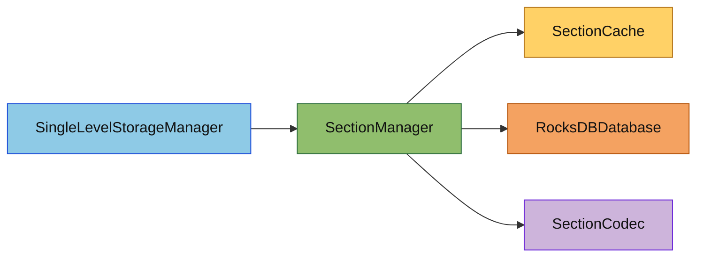

# Section 存储子模块

## 概述

`section/` 负责单维度 Section 数据的缓存、批量读取、写回和卸载协调，是 `SingleLevelStorageManager` 与 RocksDB 之间的直接桥梁。

本子模块的目标有三个：

1. 统一 Section 级缓存语义，避免运行时重复反序列化
2. 对同一维度下的多个 Section 读请求做聚合，优先命中缓存，未命中时走一次批量 DB 读取
3. 维护脏标记与批量刷盘流程，供自动保存和关闭流程复用

## 目录结构树

```text
section/
├── README.md
├── SectionCache.hpp
├── SectionCache.cpp
├── SectionManager.hpp
└── SectionManager.cpp
```

## 文件介绍

- `SectionCache.hpp/cpp`
  线程安全 LRU 缓存，保存 `SectionData`、脏标记、访问统计和驱逐顺序。
- `SectionManager.hpp/cpp`
  单维度 Section 管理器，负责：
  - 单个 Section 的同步/异步加载
  - 多个 Section 的批量加载
  - Section 保存、批量刷脏、全量保存
  - 卸载、删除、缓存统计

## 模块关系



## 整体职责

### SectionCache

- 提供线程安全的 LRU 缓存
- 记录命中、未命中、驱逐次数
- 保存脏标记，供 `flushDirtySections()` 使用

### SectionManager

- 维护“单维度 + 单列族”的 Section 读写上下文
- 保证读取顺序与请求顺序一致
- 批量读取时先逐个查缓存，再把 miss 集合交给 RocksDB `MultiGet`
- 把反序列化后的 `SectionData` 回填缓存，避免后续重复解码

## 输入 / 输出

### 输入

- `SectionKey`
- `SectionData`
- `DimensionId`
- RocksDB 列族名和序列化字节流

### 输出

- `std::shared_ptr<const SectionData>`
- `Result<std::vector<std::shared_ptr<const SectionData>>>`
- 脏 Section 写盘数量
- 缓存统计信息

## 依赖项

### 内部依赖

- `db/RocksDBDatabase`
- `db/SectionCodec`
- `db/SectionKey`
- `task/StorageTaskManager`

### 外部依赖

- `rocksdb`
- `spdlog`
- `Perfetto`

## 使用方法

```cpp
SectionManager manager(db, DimensionId::Overworld, config);

std::vector<SectionKey> keys;
keys.emplace_back(chunkX, chunkZ, 0, DimensionId::Overworld);
keys.emplace_back(chunkX, chunkZ, 1, DimensionId::Overworld);

auto loadResult = manager.loadSectionsSync(keys);
if (!loadResult.success()) {
    // 处理批量读取错误
}

for (const auto& section : loadResult.value()) {
    if (!section) {
        continue; // 该 section 不存在
    }
    // 使用 section 数据
}
```

## 容易踩的坑

1. 批量读取只适用于同一个 `SectionManager`
同一个 `SectionManager` 只服务一个 `DimensionId`，因此批量读取天然只覆盖同一维度下的同一列族。

2. 空指针只表示“Section 不存在”
`loadSectionsSync()` 现在返回 `Result<std::vector<std::shared_ptr<const SectionData>>>`。外层失败表示系统级错误；外层成功但某个位置是空指针，才表示该 Section 不存在。

3. 缓存命中和批量读取必须分开处理
不要把所有 key 都无脑送进 `MultiGet`。正确做法是先查缓存，只把 miss 交给数据库。

4. 批量读取返回顺序必须稳定
上层 `loadChunk()` 依赖返回顺序与 `sectionY` 顺序一致，不能在实现里打乱顺序。

5. 脏数据写回仍然走 `WriteBatch`
`MultiGet` 只优化读取；写路径的批量能力仍然是 `rocksdb::WriteBatch`。

## 测试用例

- `tests/common/world/storage/SingleLevelStorageManagerTest.cpp`
- `tests/common/world/storage/SectionCodecTest.cpp`
- `tests/server/test_server_chunk_manager.cpp`

建议后续补充：

- `SectionManager::loadSectionsSync()` 的缓存命中 / miss 混合场景测试
- `loadChunk()` 使用批量读取后的顺序一致性测试
- `MultiGet` 返回单项 `NotFound` 与单项反序列化失败的区分测试
