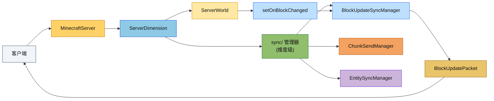

# Server Module

Cubium 服务端模块，实现了完整的 Minecraft 1.16.5 服务端逻辑。

## 目录结构

```
server/
├── application/          # 服务器应用层
│   ├── IServer.hpp       # 服务器接口定义
│   ├── MinecraftServer.hpp/cpp  # 抽象基类，共享实现
│   ├── IntegratedServer.hpp/cpp # 内置服务器（单机模式）
│   └── StandaloneServer.hpp/cpp  # 独立服务器（多人模式）
├── core/                 # 核心管理器
│   ├── ServerPlayerData.hpp   # 玩家数据
│   ├── PlayerManager.hpp/cpp  # 玩家生命周期管理
│   ├── ConnectionManager.hpp/cpp  # 网络连接管理
│   ├── TimeManager.hpp/cpp    # 游戏时间管理
│   ├── TeleportManager.hpp/cpp # 传送管理
│   ├── KeepAliveManager.hpp/cpp # 心跳管理
│   ├── PositionTracker.hpp/cpp # 位置追踪
│   ├── PacketHandler.hpp/cpp  # 数据包处理
│   └── GameModeManager.hpp/cpp # 游戏模式管理
├── interaction/          # 交互管理器
│   ├── BlockInteractionManager.hpp/cpp # 方块交互
│   ├── MiningManager.hpp/cpp  # 挖掘进度
│   ├── ContainerManager.hpp/cpp # 容器管理
│   └── InventoryManager.hpp/cpp # 物品栏管理
├── sync/                 # 同步管理器（运行时由 ServerDimension 持有）
│   ├── BlockUpdateSyncManager.hpp/cpp # 方块更新同步
│   ├── ChunkSendManager.hpp/cpp # 区块发送
│   └── EntitySyncManager.hpp/cpp # 实体同步
├── dimension/            # 维度管理
│   ├── ServerDimension.hpp/cpp         # 服务端维度实例（持有同步管理器和刷怪管理器）
│   └── ServerDimensionManager.hpp/cpp  # 服务端维度管理器
├── world/                # 世界管理
│   ├── ServerWorld.hpp/cpp     # 服务端世界
│   ├── ServerChunkManager.hpp/cpp # 区块管理
│   ├── ChunkGenerateTask.hpp/cpp # 区块生成任务
│   ├── drop/             # 掉落物处理
│   │   └── BlockDropHandler.hpp/cpp
│   ├── entity/           # 实体管理
│   │   ├── EntityTracker.hpp/cpp
│   │   └── ItemPickupManager.hpp/cpp
│   ├── spawn/            # 自然生成
│   │   ├── NaturalSpawner.hpp/cpp
│   │   └── SpawnConditions.hpp/cpp
│   └── weather/          # 天气系统
│       └── WeatherManager.hpp/cpp
├── network/              # 网络层
│   ├── TcpServer.hpp/cpp      # TCP 服务器
│   ├── TcpSession.hpp/cpp     # 会话管理
│   └── TcpConnection.hpp/cpp  # 连接封装
├── command/              # 命令系统
│   ├── CommandRegistry.hpp/cpp # 命令注册表
│   ├── ServerCommandSource.hpp/cpp # 命令源
│   └── commands/         # 命令实现
│       ├── GameModeCommand.hpp/cpp
│       ├── TeleportCommand.hpp/cpp
│       ├── TimeCommand.hpp/cpp
│       ├── WeatherCommand.hpp/cpp
│       ├── GiveCommand.hpp/cpp
│       ├── KillCommand.hpp/cpp
│       ├── ClearCommand.hpp/cpp
│       ├── SeedCommand.hpp/cpp
│       ├── ListCommand.hpp/cpp
│       └── HelpCommand.hpp/cpp
├── function/             # 数据包函数系统
│   ├── CommandFunction.hpp/cpp  # 命令函数（.mcfunction 解析结果）
│   ├── FunctionLoader.hpp/cpp   # 函数加载器（从数据包加载）
│   ├── FunctionManager.hpp/cpp  # 函数管理器（注册、查找、执行）
│   └── TimerQueue.hpp/cpp       # 函数调度定时器队列（/schedule 命令）
├── menu/                 # 容器菜单
│   ├── CraftingMenu.hpp/cpp   # 工作台菜单
│   └── InventoryCraftingMenu  # 玩家背包合成
├── player/               # 服务端玩家
│   └── ServerPlayer.hpp/cpp
├── settings/             # 服务器设置
│   └── ServerSettings.hpp/cpp
├── config/               # 配置文件（空）
└── main.cpp              # 入口点
```

## 子目录职责

### application/ - 服务器应用层

实现服务器的启动、生命周期管理和网络通信。

| 类 | 职责 |
|---|---|
| `IServer` | 服务器接口，定义所有管理器的访问方法（含 `dimensionManager()`、`getPlayerWorld(PlayerId)`、`dataPackList()`、`lootTableManager()`、`functionManager()`、`functionTimerQueue()`）。`m_world` 及单世界访问器（`world()`、`chunkManager()` 等）已移除，世界访问通过维度管理器进行 |
| `MinecraftServer` | 抽象基类，实现共享的服务器逻辑（tick 循环、数据包路由、数据包管理）。不再持有 `m_world`、同步管理器和刷怪管理器，这些已下沉到 `ServerDimension` |
| `IntegratedServer` | 内置服务器，使用 LocalConnection 与客户端通信（单机模式） |
| `StandaloneServer` | 独立服务器，使用 TCP 网络层（多人模式） |

### core/ - 核心管理器

服务器核心功能的模块化管理器。

| 类 | 职责 |
|---|---|
| `ServerPlayerData` | 服务端玩家状态（位置、心跳、传送等） |
| `PlayerManager` | 玩家生命周期（注册、移除、遍历），线程安全 |
| `ConnectionManager` | 网络消息发送、广播、断开连接 |
| `TimeManager` | 游戏时间、日光周期管理 |
| `TeleportManager` | 传送请求、确认、ID 生成 |
| `KeepAliveManager` | 心跳计时、超时检测、ping 计算 |
| `PositionTracker` | 位置更新、区块订阅、移动验证 |
| `PacketHandler` | 统一的数据包处理入口 |
| `GameModeManager` | 游戏模式切换、能力同步 |

### interaction/ - 交互管理器

处理玩家与世界交互的逻辑。

| 类 | 职责 |
|---|---|
| `BlockInteractionManager` | 方块破坏、放置、使用（距离验证、掉落生成） |
| `MiningManager` | 挖掘进度追踪、破坏动画广播 |
| `ContainerManager` | 容器菜单（打开/关闭/点击） |
| `InventoryManager` | 物品栏同步、槽位管理 |

### sync/ - 同步管理器

管理服务端到客户端的数据同步。

**重要**：同步管理器现在由各 `ServerDimension` 独立持有（每个维度一套），而非 `MinecraftServer`。初始化在 `ServerDimension::initialize()` 中完成，tick 在 `ServerDimension::tick()` 中执行。

区块发送和光照同步现在都会在需要跨线程或跨回调持有数据时，改用 `ServerChunkManager::getChunkShared()` 获取共享快照，避免 worker 线程完成回调与区块卸载之间的生命周期竞争。

| 类 | 职责 |
|---|---|
| `ChunkSendManager` | 区块发送、卸载通知，与 ChunkLoadTicketManager 协同 |
| `BlockUpdateSyncManager` | 方块更新 pending 去重、tick 末统一发送 |
| `EntitySyncManager` | 实体位置同步、生成/销毁广播 |

> 光照数据同步（`markLightChanged`/`_syncLightDataToChunk`）已由 `ServerWorld` 承担，
> 不再有独立的 `LightSyncManager`。区块加载光照由 `server/world/ChunkLoadLightTask` 在
> worker 线程完成后经 `ServerWorld` 续延队列回主线程 flush + send。

### world/ - 世界管理

服务端世界逻辑和区块管理。

`ServerChunkManager` 除了提供传统的同步/异步区块访问外，还提供共享快照接口，供光照、发包等跨线程流程在持有数据时保持区块存活。

`ServerWorld` 通过回调机制获取难度，允许运行时动态修改难度（如通过 `/difficulty` 命令）。难度回调由 `MinecraftServer` 在初始化时设置。

**重要架构变更**：
- `MinecraftServer::m_world` 已移除。世界访问必须通过 `ServerDimensionManager` / `ServerDimension` / `getPlayerWorld(PlayerId)` 进行。
- 共享存储访问必须通过 `IServer::sharedStorage()` 进行，不再通过主世界 `ServerWorld` 绕行。
- `NaturalSpawner` 和 `DespawnManager` 现在由各 `ServerDimension` 持有，在 `ServerDimension::tick()` 中独立 tick。
- 同步管理器（EntitySyncManager、ChunkSendManager、BlockUpdateSyncManager）现在由各 `ServerDimension` 持有，在 `ServerDimension::tick()` 中独立 tick。（光照同步已由 `ServerWorld` 承担，无独立 `LightSyncManager`。）
- 多维度 tick 由 `ServerDimensionManager::tick()` 统一驱动。

### dimension/ - 维度管理

服务端维度实例和管理器，负责多维度生命周期、玩家维度追踪和维度切换。

| 类 | 职责 |
|---|---|
| `ServerDimension` | 维度实例，持有 ServerWorld、同步管理器（EntitySyncManager、ChunkSendManager、BlockUpdateSyncManager）、刷怪管理器（NaturalSpawner、DespawnManager） |
| `ServerDimensionManager` | 管理所有 ServerDimension 实例，处理玩家维度切换和维度 tick 调度 |

同步管理器和刷怪管理器在 `ServerDimension::initialize()` 中创建，在 `ServerDimension::tick()` 中按顺序 tick（详见 `src/server/dimension/README.md`）。

| 类 | 职责 |
|---|---|
| `ServerWorld` | 服务端世界容器（区块、实体、光照、物理、天气、难度回调） |
| `ServerChunkManager` | 区块生命周期（加载、生成、卸载、取消），统一调度 |
| `ChunkGenerateTask` | 区块生成任务，提交到 UniversalWorkerPool 执行 |
| `EntityTracker` | 实体可见性管理，基于距离追踪 |
| `ItemPickupManager` | 物品拾取检测和处理 |
| `WeatherManager` | 天气周期、闪电生成、天气命令 |
| `NaturalSpawner` | 自然实体生成（怪物、动物） |
| `BlockDropHandler` | 方块掉落物生成（LootTable 系统） |

`ServerChunkManager` 现在不只服务玩家视距：玩家、强制区块、传送、末影龙、区块灯光等票据都会进入同一条调度链路，避免快速移动或短暂触发造成的过期生成浪费。

### network/ - 网络层

TCP 网络通信实现。

| 类 | 职责 |
|---|---|
| `TcpServer` | TCP 监听、连接管理、事件轮询 |
| `TcpSession` | 单个客户端会话、数据包缓冲 |
| `TcpConnection` | 连接接口实现 |

### command/ - 命令系统

服务端命令处理。

| 类 | 职责 |
|---|---|
| `CommandRegistry` | 命令注册表、分发执行、建议查询 |
| `ServerCommandSource` | 命令执行上下文（玩家、世界、权限、静默输出） |

**已实现命令**：
- `/gamemode` - 设置游戏模式
- `/tp` / `/teleport` - 传送（`/teleport` 通过重定向复用 `/tp` 子树）
- `/give` - 给予物品
- `/time` - 时间控制
- `/weather` - 天气控制
- `/kill` - 杀死实体
- `/clear` - 清空背包
- `/seed` - 显示种子
- `/list` - 列出玩家
- `/help` - 帮助信息
- `/execute` - 执行嵌套命令（支持 as、at、positioned、if/unless block 子命令）
- `/datapack` - 数据包管理（enable/disable/list），通过 `DataPackList` 操作
- `/reload` - 重新加载数据包内容（战利品表、配方、函数等）
- `/function` - 执行数据包函数
- `/schedule` - 调度函数延迟执行（function/clear 模式）
- `/attribute` - 查询和修改活体实体属性（支持所有 LivingEntity，使用 EntityResolver 选择器）

命令建议现在直接从命令树生成，参数节点可以挂接自定义建议提供器，因此别名、重定向和未来的动态候选项都能统一走同一条补全路径。

**架构变更**：`/attribute` 命令已从 PlayerResolver 迁移到 EntityResolver，现在支持 @e 选择器选取非玩家活体实体（僵尸、猪、马等）。非 LivingEntity 实体使用 `/attribute` 时会返回错误提示。

### function/ - 数据包函数系统

管理数据包函数（.mcfunction）的加载、注册、执行和调度。对应 MC Java 的 ServerFunctionManager。

| 类 | 职责 |
|---|---|
| `CommandFunction` | 命令函数数据类，持有 ResourceLocation ID 和命令列表 |
| `FunctionLoader` | 从数据包加载 .mcfunction 文件，解析为 CommandFunction 并注册到 FunctionManager |
| `FunctionManager` | 函数注册、查找和执行；管理 tick/load 标签函数的自动执行 |
| `TimerQueue` | 优先队列定时器，调度 /schedule 命令的延迟函数执行 |

**数据流**：
1. `FunctionLoader` 从 DataPackRepository 读取 .mcfunction 文件
2. 解析命令行（去注释、去 / 前缀、行连接、跳过宏行）
3. 通过 `FunctionManager::registerFunction()` 注册
4. `MinecraftServer::tick()` 每帧调用 `FunctionManager::tick()` 执行 minecraft:tick 标签函数
5. `/function` 命令直接调用 `FunctionManager::execute()`
6. `/schedule` 命令通过 `TimerQueue` 调度延迟执行

**已知限制**（与 MC Java 的差异）：
- 宏函数（$variable 语法）当前跳过并记录警告，需要 CompoundTag 实例化支持
- 调度事件不持久化（重启后丢失）
- 多数据包标签合并仅读取最高优先级数据包的内容，完整的多数据包合并需要在 DataPackRepository 层面提供读取所有数据包中同一资源的方法

### menu/ - 容器菜单

实现各种容器 GUI 逻辑。

| 类 | 职责 |
|---|---|
| `CraftingMenu` | 工作台 3x3 合成菜单 |
| `InventoryCraftingMenu` | 玩家背包 2x2 合成、护甲、副手 |

### player/ - 服务端玩家

| 类 | 职责 |
|---|---|
| `ServerPlayer` | 服务端玩家实体，扩展 Player 类 |

### settings/ - 服务器设置

| 类 | 职责 |
|---|---|
| `ServerSettings` | 服务器配置（端口、玩家数、视距、日志等） |

## 模块间关系

```
┌─────────────────────────────────────────────────────────────┐
│                        IServer 接口                          │
├─────────────────────────────────────────────────────────────┤
│                     MinecraftServer                          │
│  ┌─────────────────────────────────────────────────────┐    │
│  │                    core/ 管理器                       │    │
│  │  PlayerManager │ ConnectionManager │ TimeManager    │    │
│  │  TeleportManager │ KeepAliveManager │ PositionTracker│    │
│  │  PacketHandler │ GameModeManager                     │    │
│  └─────────────────────────────────────────────────────┘    │
│  ┌─────────────────────────────────────────────────────┐    │
│  │                  interaction/ 管理器                  │    │
│  │  BlockInteractionManager │ MiningManager            │    │
│  │  ContainerManager │ InventoryManager                │    │
│  └─────────────────────────────────────────────────────┘    │
│  ┌─────────────────────────────────────────────────────┐    │
│  │              ServerDimensionManager                   │    │
│  │  ┌───────────────────────────────────────────────┐   │    │
│  │  │         ServerDimension (每个维度)             │   │    │
│  │  │  ┌─────────────────────────────────────────┐  │   │    │
│  │  │  │ sync/ 管理器（维度级，每个维度独立一套） │  │   │    │
│  │  │  │ BlockUpdateSyncManager │ ChunkSendManager│  │   │    │
│  │  │  │ EntitySyncManager                        │  │   │    │
│  │  │  └─────────────────────────────────────────┘  │   │    │
│  │  │  ┌─────────────────────────────────────────┐  │   │    │
│  │  │  │ spawn/ 管理器（维度级）                   │  │   │    │
│  │  │  │ NaturalSpawner │ DespawnManager          │  │   │    │
│  │  │  └─────────────────────────────────────────┘  │   │    │
│  │  │  ┌─────────────────────────────────────────┐  │   │    │
│  │  │  │ world/                                      │  │   │    │
│  │  │  │ ServerWorld │ ServerChunkManager           │  │   │    │
│  │  │  │ EntityTracker │ ItemPickupManager          │  │   │    │
│  │  │  │ WeatherManager                              │  │   │    │
│  │  │  └─────────────────────────────────────────┘  │   │    │
│  │  └───────────────────────────────────────────────┘   │    │
│  └─────────────────────────────────────────────────────┘    │
│  ┌─────────────────────────────────────────────────────┐    │
│  │                  command/ 命令系统                    │    │
│  │  CommandRegistry │ ServerCommandSource               │    │
│  └─────────────────────────────────────────────────────┘    │
│  ┌─────────────────────────────────────────────────────┐    │
│  │                  function/ 函数系统                   │    │
│  │  FunctionLoader │ FunctionManager │ TimerQueue      │    │
│  └─────────────────────────────────────────────────────┘    │
└─────────────────────────────────────────────────────────────┘
         │                                    │
         ▼                                    ▼
┌─────────────────────┐           ┌─────────────────────┐
│   IntegratedServer   │           │   StandaloneServer   │
│   (LocalConnection)  │           │   (TcpServer)        │
│   单机模式            │           │   多人模式            │
└─────────────────────┘           └─────────────────────┘
```

**数据流向**：

1. **入站数据包**：
   ```
   网络 → MinecraftServer.pollNetwork() → dispatchPacket() → PacketHandler
   → 各 Manager 处理 → 世界状态更新
   ```

2. **出站数据包**：
   ```
   世界事件 → Manager 回调 → ConnectionManager.broadcast() → 网络
   ```

3. **区块同步**：
   ```
   玩家移动 → PositionTracker → ChunkLoadTicketManager
   → ChunkSendManager → ChunkData 序列化 → 发送给客户端
   ```

4. **世界 tick 调度**：
   ```
   MinecraftServer::tick()
   → ServerDimensionManager::tick()
   → 遍历每个 ServerDimension::tick()
       → ServerWorld::tick()
       → entitySyncManager()->tick()
       → chunkSendManager()->processPendingSends()
       → blockUpdateSyncManager()->flushPendingUpdates()
       → naturalSpawner()->tick()
       → despawnManager()->tick()
   ```

5. **方块更新同步**：
    ```
    ServerWorld::setBlockState() → setOnBlockChanged() → BlockUpdateSyncManager
    → ServerDimension::tick() 末 flushPendingUpdates() → BlockUpdatePacket → 追踪该区块的客户端
    ```

6. **区块生成**：
   ```
   ServerChunkManager.getChunkAsync() → UniversalWorkerPool
   → ChunkGenerateTask 执行 → 回调主线程 → 存入缓存
   ```

7. **函数系统 tick**：
   ```
   MinecraftServer::tick()
   → FunctionManager::tick()
       → 首次重载后执行 minecraft:load 标签函数
       → 每 tick 执行 minecraft:tick 标签函数
   → TimerQueue::tick()
       → 收集到期事件 → FunctionManager::execute() 逐行执行
   ```

## 模块整体职责

### 职责

服务端模块负责：
- **玩家管理**：连接、认证、状态维护、断开
- **世界管理**：区块加载/生成/卸载、实体管理、光照计算
- **游戏逻辑**：方块交互、挖掘、物品栏、合成
- **数据同步**：区块、方块更新、实体、光照、天气同步到客户端
- **命令系统**：服务端命令注册和执行
- **函数系统**：数据包函数加载、注册、执行和定时调度
- **网络通信**：TCP 连接管理、数据包处理

### 输入

| 来源 | 类型 |
|------|------|
| 客户端 | 数据包（移动、交互、聊天等） |
| 配置文件 | 服务器设置（server.properties） |
| 世界存档 | 区块数据、实体数据 |
| 命令行 | 启动参数 |

### 输出

| 目标 | 类型 |
|------|------|
| 客户端 | 数据包（区块、实体、状态更新等） |
| 世界存档 | 区块数据、实体数据 |
| 日志 | 运行日志、调试信息 |

### 依赖项

| 模块 | 用途 |
|------|------|
| `common/` | 核心类型、世界生成、网络协议、实体系统 |
| `vcpkg` | asio（网络）、spdlog（日志）、glm（数学） |

### 命令注册

命令在 `CommandRegistry::registerDefaults()` 中自动注册。自定义命令需通过 `CommandRegistry` 注册。

## 容易踩的坑

### 1. 线程安全

- `PlayerManager` 的公共方法都是线程安全的
- `ChunkWorkerPool` 在 Worker 线程执行区块生成
- 回调到主线程时需使用 `processPendingSends()` 或类似的同步机制
- `ChunkSendManager::submitChunkData()` 是线程安全的

### 2. 区块同步顺序

区块发送依赖 `ChunkLoadTicketManager` 的追踪回调：
1. 玩家移动触发 `PlayerChunkTracker` 更新
2. `TrackingChangeCallback` 通知 `ChunkSendManager`
3. 区块加载完成后自动发送给追踪玩家

**注意**：不要手动调用 `ChunkSendManager::sendChunkToPlayers()`，应使用票据系统。

### 3. 光照初始化

区块加载后光照由 `ChunkLoadLightTask` 在 worker 线程异步完成（效仿 Moonrise `ThreadedLevelLightEngine`）：
```cpp
// 正确方式：ChunkLoadedCallback 入队区块加载光照任务
chunkManager.setChunkLoadedCallback([world](ChunkCoord x, ChunkCoord z) {
    world->enqueueChunkLoadLight(x, z);
});
```
`enqueueChunkLoadLight` 对中心区块 add LIGHT 票据保活后，构造 `ChunkLoadLightTask` 提交到
`UniversalWorkerPool` 区域互斥池（writeRadius=2）。worker 完成后经 `ServerWorld` 续延队列回主线程
flush（`markLightChanged` 同步 visible nibble 到 ChunkSection）+ send（`ChunkSendManager` 发包）。
tick 顺序严格 flush → send → drain，保证客户端收到正确光照而非全黑区块。

### 4. Manager 初始化顺序

`MinecraftServer` 的初始化顺序：
1. `initializeRegistries()` - 游戏注册表（方块、物品、附魔、战利品表、配方），从 `DataPackList` 加载数据
2. `initializeCoreManagers()` - 核心 Manager
3. `initializeWorld()` - 世界和区块管理器
4. `initializeInteractionManagers()` - 交互 Manager
5. `ServerDimension::initialize()` - 每个维度独立创建同步管理器和刷怪管理器（替代原 `initializeSyncManagers()` + `initializeChunkSyncManagers()`）
6. `setupWorldCallbacks()` - 设置回调（遍历所有维度）

### 5. 维度感知的世界访问

- `MinecraftServer::m_world` 已移除。世界访问必须通过 `ServerDimensionManager` / `ServerDimension` / `getPlayerWorld(PlayerId)` 进行。
- 同步管理器（EntitySyncManager、ChunkSendManager、BlockUpdateSyncManager、LightSyncManager）和刷怪管理器（NaturalSpawner、DespawnManager）现在由各 `ServerDimension` 持有，不再从 `MinecraftServer` 访问。
- 所有维度的 `ServerWorld::tick()` 都通过 `ServerDimensionManager::tick()` 统一调度，每个维度在自己的 `ServerDimension::tick()` 中独立执行同步和刷怪逻辑。

### 6. 心跳超时配置

默认心跳间隔和超时通过 `ServerSettings` 和 `mc::defaults::serverCore` 命名空间管理：
```cpp
// 默认值定义在 src/common/core/DefaultValues.hpp
namespace mc::defaults::serverCore {
    inline constexpr i32 keepAliveIntervalMs = 15000;
    inline constexpr i32 keepAliveTimeoutMs = 30000;
}
```

### 7. 命令注册

命令在 `CommandRegistry::registerDefaults()` 中自动注册。自定义命令需手动注册：
```cpp
server.commandRegistry().dispatcher().registerCommand(
    mc::command::literal("mycommand")
        .executes([](auto& context) {
            // 命令逻辑
            return 1;
        })
);
```

## Mermaid 图


