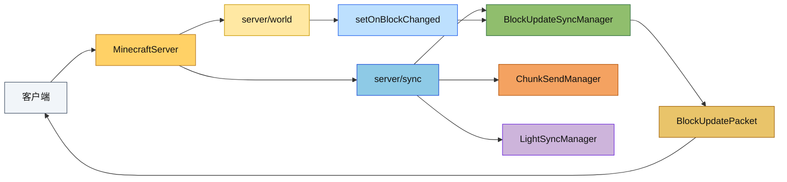

# Server Module

Minecraft Reborn 服务端模块，实现了完整的 Minecraft 1.16.5 服务端逻辑。

## 目录结构

```
server/
├── application/          # 服务器应用层
│   ├── IServer.hpp       # 服务器接口定义
│   ├── MinecraftServer.hpp/cpp  # 抽象基类，共享实现
│   ├── IntegratedServer.hpp/cpp # 内置服务器（单机模式）
│   └── StandaloneServer.hpp/cpp  # 独立服务器（多人模式）
├── core/                 # 核心管理器
│   ├── ServerCoreConfig.hpp   # 配置结构体
│   ├── ServerPlayerData.hpp   # 玩家数据
│   ├── PlayerManager.hpp/cpp  # 玩家生命周期管理
│   ├── ConnectionManager.hpp/cpp  # 网络连接管理
│   ├── TimeManager.hpp/cpp    # 游戏时间管理
│   ├── TeleportManager.hpp/cpp # 传送管理
│   ├── KeepAliveManager.hpp/cpp # 心跳管理
│   ├── PositionTracker.hpp/cpp # 位置追踪
│   ├── PacketHandler.hpp/cpp  # 数据包处理
│   └── GameModeManager.hpp/cpp # 游戏模式管理
├── interaction/          # 交互管理器
│   ├── BlockInteractionManager.hpp/cpp # 方块交互
│   ├── MiningManager.hpp/cpp  # 挖掘进度
│   ├── ContainerManager.hpp/cpp # 容器管理
│   └── InventoryManager.hpp/cpp # 物品栏管理
├── sync/                 # 同步管理器
│   ├── BlockUpdateSyncManager.hpp/cpp # 方块更新同步
│   ├── ChunkSendManager.hpp/cpp # 区块发送
│   ├── EntitySyncManager.hpp/cpp # 实体同步
│   └── LightSyncManager.hpp/cpp  # 光照同步
├── world/                # 世界管理
│   ├── ServerWorld.hpp/cpp     # 服务端世界
│   ├── ServerChunkManager.hpp/cpp # 区块管理
│   ├── ChunkGenerateTask.hpp/cpp # 区块生成任务
│   ├── drop/             # 掉落物处理
│   │   └── BlockDropHandler.hpp/cpp
│   ├── entity/           # 实体管理
│   │   ├── EntityTracker.hpp/cpp
│   │   └── ItemPickupManager.hpp/cpp
│   ├── spawn/            # 自然生成
│   │   ├── NaturalSpawner.hpp/cpp
│   │   └── SpawnConditions.hpp/cpp
│   └── weather/          # 天气系统
│       └── WeatherManager.hpp/cpp
├── network/              # 网络层
│   ├── TcpServer.hpp/cpp      # TCP 服务器
│   ├── TcpSession.hpp/cpp     # 会话管理
│   └── TcpConnection.hpp/cpp  # 连接封装
├── command/              # 命令系统
│   ├── CommandRegistry.hpp/cpp # 命令注册表
│   ├── ServerCommandSource.hpp/cpp # 命令源
│   └── commands/         # 命令实现
│       ├── GameModeCommand.hpp/cpp
│       ├── TeleportCommand.hpp/cpp
│       ├── TimeCommand.hpp/cpp
│       ├── WeatherCommand.hpp/cpp
│       ├── GiveCommand.hpp/cpp
│       ├── KillCommand.hpp/cpp
│       ├── ClearCommand.hpp/cpp
│       ├── SeedCommand.hpp/cpp
│       ├── ListCommand.hpp/cpp
│       └── HelpCommand.hpp/cpp
├── menu/                 # 容器菜单
│   ├── CraftingMenu.hpp/cpp   # 工作台菜单
│   └── InventoryCraftingMenu  # 玩家背包合成
├── player/               # 服务端玩家
│   └── ServerPlayer.hpp/cpp
├── settings/             # 服务器设置
│   └── ServerSettings.hpp/cpp
├── config/               # 配置文件（空）
└── main.cpp              # 入口点
```

## 子目录职责

### application/ - 服务器应用层

实现服务器的启动、生命周期管理和网络通信。

| 类 | 职责 |
|---|---|
| `IServer` | 服务器接口，定义所有管理器的访问方法 |
| `MinecraftServer` | 抽象基类，实现共享的服务器逻辑（tick 循环、数据包路由） |
| `IntegratedServer` | 内置服务器，使用 LocalConnection 与客户端通信（单机模式） |
| `StandaloneServer` | 独立服务器，使用 TCP 网络层（多人模式） |

### core/ - 核心管理器

服务器核心功能的模块化管理器。

| 类 | 职责 |
|---|---|
| `ServerCoreConfig` | 配置结构体（视距、心跳间隔、种子等） |
| `ServerPlayerData` | 服务端玩家状态（位置、心跳、传送等） |
| `PlayerManager` | 玩家生命周期（注册、移除、遍历），线程安全 |
| `ConnectionManager` | 网络消息发送、广播、断开连接 |
| `TimeManager` | 游戏时间、日光周期管理 |
| `TeleportManager` | 传送请求、确认、ID 生成 |
| `KeepAliveManager` | 心跳计时、超时检测、ping 计算 |
| `PositionTracker` | 位置更新、区块订阅、移动验证 |
| `PacketHandler` | 统一的数据包处理入口 |
| `GameModeManager` | 游戏模式切换、能力同步 |

### interaction/ - 交互管理器

处理玩家与世界交互的逻辑。

| 类 | 职责 |
|---|---|
| `BlockInteractionManager` | 方块破坏、放置、使用（距离验证、掉落生成） |
| `MiningManager` | 挖掘进度追踪、破坏动画广播 |
| `ContainerManager` | 容器菜单（打开/关闭/点击） |
| `InventoryManager` | 物品栏同步、槽位管理 |

### sync/ - 同步管理器

管理服务端到客户端的数据同步。

| 类 | 职责 |
|---|---|
| `ChunkSendManager` | 区块发送、卸载通知，与 ChunkLoadTicketManager 协同 |
| `BlockUpdateSyncManager` | 方块更新 pending 去重、tick 末统一发送 |
| `EntitySyncManager` | 实体位置同步、生成/销毁广播 |
| `LightSyncManager` | 光照数据同步到 ChunkSection |

### world/ - 世界管理

服务端世界逻辑和区块管理。

| 类 | 职责 |
|---|---|
| `ServerWorld` | 服务端世界容器（区块、实体、光照、物理、天气） |
| `ServerChunkManager` | 区块生命周期（加载、生成、卸载、取消），统一调度 |
| `ChunkGenerateTask` | 区块生成任务，提交到 ServerWorkerPool 执行 |
| `EntityTracker` | 实体可见性管理，基于距离追踪 |
| `ItemPickupManager` | 物品拾取检测和处理 |
| `WeatherManager` | 天气周期、闪电生成、天气命令 |
| `NaturalSpawner` | 自然实体生成（怪物、动物） |
| `BlockDropHandler` | 方块掉落物生成（LootTable 系统） |

`ServerChunkManager` 现在不只服务玩家视距：玩家、强制区块、传送、末影龙、区块灯光等票据都会进入同一条调度链路，避免快速移动或短暂触发造成的过期生成浪费。

### network/ - 网络层

TCP 网络通信实现。

| 类 | 职责 |
|---|---|
| `TcpServer` | TCP 监听、连接管理、事件轮询 |
| `TcpSession` | 单个客户端会话、数据包缓冲 |
| `TcpConnection` | 连接接口实现 |

### command/ - 命令系统

服务端命令处理。

| 类 | 职责 |
|---|---|
| `CommandRegistry` | 命令注册表、分发执行、建议查询 |
| `ServerCommandSource` | 命令执行上下文（玩家、世界、权限、静默输出） |

**已实现命令**：
- `/gamemode` - 设置游戏模式
- `/tp` / `/teleport` - 传送（`/teleport` 通过重定向复用 `/tp` 子树）
- `/give` - 给予物品
- `/time` - 时间控制
- `/weather` - 天气控制
- `/kill` - 杀死实体
- `/clear` - 清空背包
- `/seed` - 显示种子
- `/list` - 列出玩家
- `/help` - 帮助信息

命令建议现在直接从命令树生成，参数节点可以挂接自定义建议提供器，因此别名、重定向和未来的动态候选项都能统一走同一条补全路径。

### menu/ - 容器菜单

实现各种容器 GUI 逻辑。

| 类 | 职责 |
|---|---|
| `CraftingMenu` | 工作台 3x3 合成菜单 |
| `InventoryCraftingMenu` | 玩家背包 2x2 合成、护甲、副手 |

### player/ - 服务端玩家

| 类 | 职责 |
|---|---|
| `ServerPlayer` | 服务端玩家实体，扩展 Player 类 |

### settings/ - 服务器设置

| 类 | 职责 |
|---|---|
| `ServerSettings` | 服务器配置（端口、玩家数、视距、日志等） |

## 模块间关系

```
┌─────────────────────────────────────────────────────────────┐
│                        IServer 接口                          │
├─────────────────────────────────────────────────────────────┤
│                     MinecraftServer                          │
│  ┌─────────────────────────────────────────────────────┐    │
│  │                    core/ 管理器                       │    │
│  │  PlayerManager │ ConnectionManager │ TimeManager    │    │
│  │  TeleportManager │ KeepAliveManager │ PositionTracker│    │
│  │  PacketHandler │ GameModeManager                     │    │
│  └─────────────────────────────────────────────────────┘    │
│  ┌─────────────────────────────────────────────────────┐    │
│  │                  interaction/ 管理器                  │    │
│  │  BlockInteractionManager │ MiningManager            │    │
│  │  ContainerManager │ InventoryManager                │    │
│  └─────────────────────────────────────────────────────┘    │
│  ┌─────────────────────────────────────────────────────┐    │
│  │                    sync/ 管理器                       │    │
│  │  BlockUpdateSyncManager │ ChunkSendManager │ EntitySyncManager │ LightSyncManager│
│  └─────────────────────────────────────────────────────┘    │
│  ┌─────────────────────────────────────────────────────┐    │
│  │                     world/                           │    │
│  │  ServerWorld │ ServerChunkManager │ ChunkGenerateTask │    │
│  │  EntityTracker │ ItemPickupManager │ WeatherManager  │    │
│  └─────────────────────────────────────────────────────┘    │
│  ┌─────────────────────────────────────────────────────┐    │
│  │                  command/ 命令系统                    │    │
│  │  CommandRegistry │ ServerCommandSource               │    │
│  └─────────────────────────────────────────────────────┘    │
└─────────────────────────────────────────────────────────────┘
         │                                    │
         ▼                                    ▼
┌─────────────────────┐           ┌─────────────────────┐
│   IntegratedServer   │           │   StandaloneServer   │
│   (LocalConnection)  │           │   (TcpServer)        │
│   单机模式            │           │   多人模式            │
└─────────────────────┘           └─────────────────────┘
```

**数据流向**：

1. **入站数据包**：
   ```
   网络 → MinecraftServer.pollNetwork() → dispatchPacket() → PacketHandler
   → 各 Manager 处理 → 世界状态更新
   ```

2. **出站数据包**：
   ```
   世界事件 → Manager 回调 → ConnectionManager.broadcast() → 网络
   ```

3. **区块同步**：
   ```
   玩家移动 → PositionTracker → ChunkLoadTicketManager
   → ChunkSendManager → ChunkData 序列化 → 发送给客户端
   ```

4. **方块更新同步**：
    ```
    ServerWorld::setBlockState() → setOnBlockChanged() → BlockUpdateSyncManager
    → tick 末 flushPendingUpdates() → BlockUpdatePacket → 追踪该区块的客户端
    ```

5. **区块生成**：
   ```
   ServerChunkManager.getChunkAsync() → ServerWorkerPool
   → ChunkGenerateTask 执行 → 回调主线程 → 存入缓存
   ```

## 模块整体职责

### 职责

服务端模块负责：
- **玩家管理**：连接、认证、状态维护、断开
- **世界管理**：区块加载/生成/卸载、实体管理、光照计算
- **游戏逻辑**：方块交互、挖掘、物品栏、合成
- **数据同步**：区块、方块更新、实体、光照、天气同步到客户端
- **命令系统**：服务端命令注册和执行
- **网络通信**：TCP 连接管理、数据包处理

### 输入

| 来源 | 类型 |
|------|------|
| 客户端 | 数据包（移动、交互、聊天等） |
| 配置文件 | 服务器设置（server.properties） |
| 世界存档 | 区块数据、实体数据 |
| 命令行 | 启动参数 |

### 输出

| 目标 | 类型 |
|------|------|
| 客户端 | 数据包（区块、实体、状态更新等） |
| 世界存档 | 区块数据、实体数据 |
| 日志 | 运行日志、调试信息 |

### 依赖项

| 模块 | 用途 |
|------|------|
| `common/` | 核心类型、世界生成、网络协议、实体系统 |
| `vcpkg` | asio（网络）、spdlog（日志）、glm（数学） |

### 使用方法

**独立服务器**：
```cpp
#include "server/application/StandaloneServer.hpp"

mc::server::StandaloneServer server;
mc::server::StandaloneServerParams params;
params.port = 25565;
params.maxPlayers = 20;

auto result = server.initialize(params);
if (result.success()) {
    server.run();  // 阻塞运行
}
```

**内置服务器**（单机模式）：
```cpp
#include "server/application/IntegratedServer.hpp"

mc::server::IntegratedServerConfig config;
config.worldName = "singleplayer";
config.seed = 12345;
config.viewDistance = 6;

mc::server::IntegratedServer server;
auto result = server.initialize(config);
if (result.success()) {
    // 获取客户端连接端点
    auto* clientEndpoint = server.getClientEndpoint();
    // 客户端使用 clientEndpoint 进行通信
}
```

## 容易踩的坑

### 1. 线程安全

- `PlayerManager` 的公共方法都是线程安全的
- `ChunkWorkerPool` 在 Worker 线程执行区块生成
- 回调到主线程时需使用 `processPendingSends()` 或类似的同步机制
- `ChunkSendManager::submitChunkData()` 是线程安全的

### 2. 区块同步顺序

区块发送依赖 `ChunkLoadTicketManager` 的追踪回调：
1. 玩家移动触发 `PlayerChunkTracker` 更新
2. `TrackingChangeCallback` 通知 `ChunkSendManager`
3. 区块加载完成后自动发送给追踪玩家

**注意**：不要手动调用 `ChunkSendManager::sendChunkToPlayers()`，应使用票据系统。

### 3. 光照初始化

区块加载后需要初始化光照：
```cpp
// 正确方式：通过回调自动初始化
chunkManager.setChunkLoadedCallback([this](ChunkCoord x, ChunkCoord z) {
    lightSyncManager.initializeChunkLighting(x, z);
});
```

### 4. Manager 初始化顺序

`MinecraftServer` 的初始化顺序：
1. `initializeCoreManagers()` - 核心 Manager
2. `initializeWorld()` - 世界和区块管理器
3. `initializeInteractionManagers()` - 交互 Manager
4. `initializeSyncManagers()` - 同步 Manager
5. `initializeChunkSyncManagers()` - 区块同步（在 world 之后）
6. `setupWorldCallbacks()` - 设置回调

### 5. 心跳超时配置

默认心跳间隔 15 秒，超时 30 秒：
```cpp
ServerCoreConfig config;
config.keepAliveInterval = 15000;  // 毫秒
config.keepAliveTimeout = 30000;   // 毫秒
```

### 6. 命令注册

命令在 `CommandRegistry::registerDefaults()` 中自动注册。自定义命令需手动注册：
```cpp
server.commandRegistry().dispatcher().registerCommand(
    mc::command::literal("mycommand")
        .executes([](auto& context) {
            // 命令逻辑
            return 1;
        })
);
```

### 7. 实体追踪距离

默认追踪距离为 10 区块，可通过 `EntityTracker::setTrackingDistance()` 调整。

## 测试用例

测试文件位于 `tests/server/` 目录：

| 文件 | 测试内容 |
|------|----------|
| `core/PlayerManagerTest.cpp` | 玩家生命周期、会话映射、线程安全 |
| `core/ConnectionManagerTest.cpp` | 消息发送、广播、断开连接 |
| `core/TimeManagerTest.cpp` | 游戏时间、日光周期 |
| `core/TeleportManagerTest.cpp` | 传送请求、确认 |
| `core/KeepAliveManagerTest.cpp` | 心跳计时、超时检测 |
| `core/PositionTrackerTest.cpp` | 位置更新、区块订阅 |
| `ServerWorldTest.cpp` | 世界操作、方块设置 |
| `ServerWorldCollisionTests.cpp` | 碰撞检测 |
| `world/EntityTrackerTest.cpp` | 实体追踪范围、可见性 |
| `world/ItemPickupManagerTest.cpp` | 物品拾取逻辑 |
| `world/spawn/NaturalSpawnerTest.cpp` | 自然生成条件 |
| `weather/WeatherManagerTest.cpp` | 天气周期、命令 |
| `LightSyncTests.cpp` | 光照同步 |
| `BlockUpdateSyncManagerTest.cpp` | 方块更新 pending 去重、追踪玩家过滤、tick flush |
| `ServerWorldBlockUpdateCallbackTest.cpp` | ServerWorld 方块变化回调触发 |
| `test_chunk_worker_pool.cpp` | Worker 线程池 |
| `test_server_chunk_manager.cpp` | 区块管理器 |
| `ServerChunkManagerCallbackTest.cpp` | 区块回调 |
| `test_integrated_server.cpp` | 内置服务器 |
| `BlockDropHandlerTest.cpp` | 方块掉落 |
| `MiningManagerTest.cpp` | 挖掘速度计算（急迫、挖掘疲劳、工具材质、空中惩罚等） |

运行测试：
```powershell
./build/bin/Release/mc_tests.exe --gtest_filter="Server*"
```


## Mermaid 图


