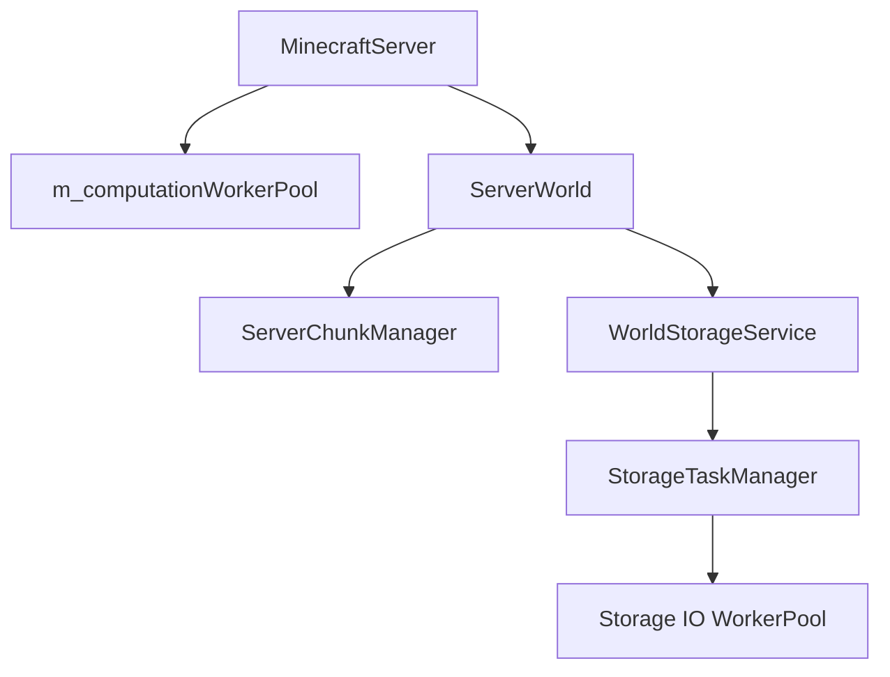
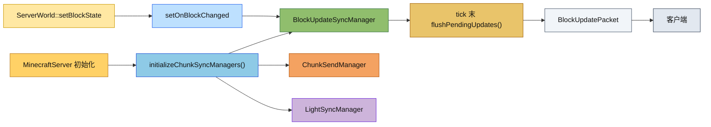

# Server Application Module

## Directory Structure

```
src/server/application/
├── IServer.hpp              # Server interface definition
├── MinecraftServer.hpp      # Abstract base class declaration
├── MinecraftServer.cpp      # Abstract base class implementation
├── IntegratedServer.hpp     # Integrated server (single-player) declaration
├── IntegratedServer.cpp     # Integrated server (single-player) implementation
├── StandaloneServer.hpp     # Standalone server (multi-player) declaration
└── StandaloneServer.cpp     # Standalone server (multi-player) implementation
```

## File Descriptions

### IServer.hpp

**Responsibility:** Defines the unified interface for all server types.

**Key Components:**

- `IServer` - Pure abstract interface class that provides:
  - Lifecycle management: `initialize()`, `shutdown()`, `tick()`, `isRunning()`
  - Core managers access: `playerManager()`, `connectionManager()`, `timeManager()`, `teleportManager()`, `keepAliveManager()`, `positionTracker()`, `packetHandler()`, `gameModeManager()`
  - Permission managers access: `whitelistManager()`, `bannedPlayerList()`, `bannedIpList()`, `opListManager()`
  - World managers access: `world()`, `chunkManager()`, `lightManager()`, `entityManager()`, `entityTracker()`, `physicsEngine()`, `weatherManager()`, `itemPickupManager()`
  - Interaction managers access: `blockInteractionManager()`, `miningManager()`, `containerManager()`, `inventoryManager()`
    - Player inventory access: `playerInventory(playerId)`
  - Sync managers access: `entitySyncManager()`, `chunkSendManager()`, `lightSyncManager()`
  - Command system access: `commandRegistry()`
  - Scoreboard system access: `scoreboard()`
  - Configuration access: `viewDistance()`, `maxPlayers()`, `seed()`, `currentTick()`

**Design Pattern:** Interface Segregation - provides clean abstraction for server types without exposing implementation details.

---

### MinecraftServer.hpp / MinecraftServer.cpp

**Responsibility:** Abstract base class providing shared implementation for all server types.

**Key Components:**

- Inherits from `IServer`
- Holds all core managers as `unique_ptr` members
- Implements `tick()` main loop framework
- Provides packet dispatching and handling
- Attaches the world sound callback after world creation so entity sounds can be broadcast through the server helpers
- Owns the server-side computation worker pool `m_computationWorkerPool` for chunk generation and other compute-heavy tasks

**Protected Methods (for subclasses):**

- `initializeCoreManagers()` - Creates PlayerManager, ConnectionManager, TimeManager, etc.
- `initializeWorld()` - Initializes world and command registry
- `initializeInteractionManagers()` - Creates BlockInteractionManager, MiningManager, etc.
- `initializeSyncManagers()` - Creates EntitySyncManager
- `initializeChunkSyncManagers()` - Creates BlockUpdateSyncManager, ChunkSendManager, LightSyncManager
- `initializeRegistries()` - Loads vanilla blocks, items, enchantments, recipes
- `setupWorldCallbacks()` - Sets up chunk loading, block change, entity spawning, and light change callbacks
- `shutdownManagers()` - Cleanup in correct order

**Pure Virtual Methods (must be implemented by subclasses):**

- `pollNetwork()` - Network event polling (LocalConnection vs TCP)
- `broadcastPacket()` - Broadcast to all players
- `getPlayerIdForSession()` - Map session ID to player ID
- `sendPacketToPlayer()` - Send to specific player
- `handleLoginRequestPacket()` - Login handling
- `handleBlockPlacementPacket()` - Block placement handling
- `handleHotbarSelectPacket()` - Hotbar selection handling
- `handleContainerClickPacket()` - Container interaction handling
- `handleCreativeInventoryActionPacket()` - Creative inventory slot write-back handling
- `handleCloseContainerPacket()` - Container close handling
- `broadcastLightUpdate()` - Light update broadcasting

**Tick Phases:**

1. `tickCore()` - Time update, weather update, cleanup disconnected players, keep-alive check
2. `tickEntities()` - Entity tick, item pickup, entity tracking
3. `entitySyncManager().tick()` - Sync entity positions
4. `miningManager().tick()` - Update mining progress
5. `pollNetwork()` - Process network packets (subclass-specific)
6. `chunkSendManager().processPendingSends()` - Send queued chunks
7. `blockUpdateSyncManager().flushPendingUpdates()` - Send queued block updates
8. `chunkManager().tick()` - Update chunk loading/unloading
9. `tickLighting()` - Light engine update
10. `tickKeepAlive()` - Send keep-alive packets

---

### IntegratedServer.hpp / IntegratedServer.cpp

**Responsibility:** Single-player server implementation with dedicated thread and LocalConnection.

**Key Features:**

- Runs in a separate thread from the client
- Uses `LocalConnectionPair` for intra-process communication
- Single player only (`maxPlayers = 1`)
- Direct inventory management (`m_clientInventory`)
- `playerInventory()` overrides the shared interface so the local player resolves to `m_clientInventory`, while other ids still use the normal inventory manager
- Container menu handling (`m_openMenu`, with the integrated-server menu player bound to the active menu for shared packet handling)
- Creative mode login uses the shared creative inventory helper to populate the local player inventory before the screen opens
- Creative inventory slot edits are handled through `CreativeInventoryActionPacket` and then mirrored back to the client inventory sync path
- Right-click crafting-table / chest / furnace-family interaction is routed through the shared menu factory:
  - empty hand / non-block item opens `CraftingMenu`
  - chest and furnace menus are created from the same `ContainerManager` / `AbstractContainerMenu` path as the client sync packets
- Generic right-click block activation is routed to `BlockInteractionManager::handleBlockUse()` when placement path does not apply
- The world sound callback is attached during initialization so local entity sounds reach the client through the same server broadcast path
- World type routing:
  - `Default` -> `NoiseChunkGenerator + DimensionSettings::overworld()`
  - `Flat` -> `NoiseChunkGenerator + DimensionSettings::flat()`
  - `LargeBiomes` -> `NoiseChunkGenerator + LayerBiomeProvider(seed, true)`
  - `Amplified` -> `NoiseChunkGenerator + NoiseSettings::amplified()`
  - `Debug` -> `DebugChunkGenerator`

**Configuration (`IntegratedServerConfig`):**

```cpp
struct IntegratedServerConfig {
    std::string worldName = "singleplayer";
    i64 seed = 0;
    GameMode defaultGameMode = GameMode::Survival;
    i32 viewDistance = 6;
    i32 tickRate = 20;  // TPS
};
```

**Key Methods:**

- `initialize(config)` - Start server thread with given config
- `stop()` - Stop server thread gracefully
- `getClientEndpoint()` - Get `LocalEndpoint` for client to connect
- `clientInventory()` - Access the single player's inventory
- `playerInventory(playerId)` - Return the local inventory for the single-player client and fall back to shared inventory lookups for everyone else

**Thread Model:**

- Dedicated `m_serverThread` running `mainLoop()`
- Mutex `m_clientDataMutex` for thread-safe inventory access
- Tick timing: `1000 / tickRate` milliseconds per tick

---

### StandaloneServer.hpp / StandaloneServer.cpp

**Responsibility:** Multi-player server with TCP networking.

**Key Features:**

- TCP-based networking via `TcpServer`
- Multiple players support
- Settings file persistence (`ServerSettings`)
- Command-line parameter overrides
- Perfetto tracing integration
- `ContainerManager` callbacks are forwarded to client protocol packets (`OpenContainer`, `CloseContainer`, `ContainerContent`)
- Shared container menu creation covers crafting tables, chests, furnaces, blast furnaces, and smokers through the same open-container path
- Creative inventory login and slot writes use the same shared creative inventory helper and `CreativeInventoryActionPacket` path as the integrated server
- Non-placement right-click interaction path now routes through `BlockInteractionManager::handleBlockUse()` for block activation
- The world sound callback is attached during initialization so mob/player sounds are broadcast the same way as other server events
- Full world type support with proper chunk generator selection:
  - `Default` → `NoiseChunkGenerator + DimensionSettings::overworld()`
  - `Flat` → `NoiseChunkGenerator + DimensionSettings::flat()`
  - `LargeBiomes` → `NoiseChunkGenerator + LayerBiomeProvider(seed, true)`
  - `Amplified` → `NoiseChunkGenerator + NoiseSettings::amplified()`
  - `Debug` → `DebugChunkGenerator` (spectator mode, fixed time, clear weather)

**Configuration (`StandaloneServerParams`):**

```cpp
struct StandaloneServerParams {
    std::optional<u16> port;
    std::optional<std::string> bindAddress;
    std::optional<u32> maxPlayers;
    std::optional<std::string> worldName;
    std::optional<i64> seed;
    std::optional<std::string> settingsPath;
};
```

**Key Methods:**

- `initialize(params)` - Initialize with command-line parameters
- `run()` - Block on main loop
- `stop()` - Graceful shutdown
- `settings()` - Access `ServerSettings` for runtime configuration

**Network Events:**

- `onClientConnect()` - New TCP session
- `onClientDisconnect()` - Session closed
- Packet routing via session ID

---

## File Relationships

```
                    IServer.hpp
                         ^
                         |
                    MinecraftServer.hpp/cpp
                    /                  \
                   /                    \
    IntegratedServer.hpp/cpp    StandaloneServer.hpp/cpp
```

**Dependency Flow:**

1. `IServer` defines the contract
2. `MinecraftServer` implements shared logic, delegates network to subclasses
3. `IntegratedServer` uses `LocalConnectionPair` for single-player
4. `StandaloneServer` uses `TcpServer` for multi-player

---

## Module Overview

### Overall Responsibility

The `application` module serves as the **entry point and orchestrator** for the Minecraft server. It:

1. **Initializes** all server subsystems (managers, world, network)
2. **Coordinates** tick execution across all components
3. **Routes** network packets to appropriate handlers
4. **Manages** server lifecycle (startup, shutdown)
5. **Provides** unified access to all server components

### 线程池职责划分

- **计算线程池**：`MinecraftServer::m_computationWorkerPool`
    - 用于区块生成、区块状态推进等计算型异步任务
- **存储 IO 线程池**：`WorldStorageService` 内部持有
    - 用于 Section 读写、刷新与其他持久化任务
- **模块专属线程池**：客户端网格构建、资源加载等仍按各自模块管理

### Input and Output

| Direction  | Component       | Description                                                              |
| ---------- | --------------- | ------------------------------------------------------------------------ |
| **Input**  | Network packets | Player movement, block interactions, chat, login                         |
| **Input**  | Configuration   | `ServerCoreConfig` / `IntegratedServerConfig` / `StandaloneServerParams` |
| **Input**  | World data      | Chunk requests, entity spawning                                          |
| **Output** | Network packets | Chunk data, entity updates, teleport, game state                         |
| **Output** | World changes   | Block modifications, entity spawning/removal                             |
| **Output** | Player state    | Position updates, inventory sync                                         |

### Dependencies

**Internal Dependencies:**

```
server/application/
├── server/core/           # PlayerManager, ConnectionManager, TimeManager, etc.
├── server/interaction/    # BlockInteractionManager, MiningManager, etc.
├── server/sync/           # EntitySyncManager, ChunkSendManager, LightSyncManager
├── server/world/          # ServerWorld, ServerChunkManager, WeatherManager
├── server/network/        # TcpServer, TcpSession
├── server/command/        # CommandRegistry
├── server/menu/           # CraftingMenu
├── common/entity/inventory/container/  # Chest/Furnace/Hopper 菜单实现
├── common/network/        # Packets, LocalConnection
├── common/world/          # World, Chunk, Lighting, Generation
├── common/entity/         # Player, Inventory, Loot
├── common/item/           # Items, BlockItems, Recipes
├── common/physics/        # PhysicsEngine
└── common/perfetto/       # Tracing
```

**External Dependencies:**

- `spdlog` - Logging
- `std::thread` - Threading
- `std::atomic` - Thread-safe flags

## 文件介绍补充

### `MinecraftServer.hpp/cpp`

- 新增 `m_computationWorkerPool`
- 在子类创建 `ServerChunkManager` 后调用 `setWorkerPool(&m_computationWorkerPool)` 注入计算池
- 在 `stopCore()` 中统一停止计算池
- `bindWorldIoWorkerPool()` 负责将 IO Worker Pool 注入到 `WorldStorageService`

## 模块关系



## 容易踩的坑

- 计算池和 IO 池职责不同，不要复用同一个 `ServerWorkerPool`。
- `ServerChunkManager` 现在只接受外部注入的池指针，不能再假设自己拥有生命周期。
- `WorldStorageService` 的异步任务需要在 `open()` 之后才可使用。

## 测试用例

- `tests/server/test_chunk_worker_pool.cpp`
- `tests/server/test_server_chunk_manager.cpp`
- `tests/common/world/storage/StorageTaskTest.cpp`

---

## Usage

### Integrated Server (Single-Player)

```cpp
#include "server/application/IntegratedServer.hpp"

// Create and configure
mc::server::IntegratedServerConfig config;
config.worldName = "my_world";
config.seed = 12345;
config.viewDistance = 10;
config.defaultGameMode = mc::GameMode::Survival;
config.tickRate = 20;

// Initialize
mc::server::IntegratedServer server;
auto result = server.initialize(config);
if (result.failed()) {
    // Handle error
}

// Get client endpoint for client connection
mc::network::LocalEndpoint* endpoint = server.getClientEndpoint();

// Run game loop (client side)
while (running) {
    // Send packets via endpoint->send()
    // Receive packets via endpoint->receive()
    // ...
}

// Shutdown
server.stop();
```

### 声音广播链路

实体调用 `Entity::playSound(...)` 后，会先进入 `ServerWorld::playSound(...)`，再由 `MinecraftServer::broadcastSound(...)` 或其子类实现把数据包发给附近玩家。这个路径现在同时服务于 `LivingEntity` 的受伤/死亡声、`MobEntity` 的环境声，以及 `Player` 的受伤/死亡声。

### 实体状态广播链路

实体状态事件（如守卫者攻击动画）通过 `IWorld::broadcastEntityStatus()` 接口广播：

```
GuardianAttackGoal::startExecuting()
  → world()->broadcastEntityStatus(entityId, status)
  → ServerWorld::broadcastEntityStatus()
  → m_onBroadcastEntityStatus callback
  → MinecraftServer::broadcastEntityStatusInRange()
  → 发送 EntityStatusPacket 给范围内玩家
```

客户端收到 `EntityStatusPacket` 后，根据状态码触发相应的动画或音效（如 `GuardianSoundStateful`）。

### 命令执行回调链路

命令方块矿车等实体执行命令通过 `IWorld::executeCommand()` 接口委托给服务器：

```
CommandBlockMinecartEntity::executeCommand()
  → world()->executeCommand(command, position, 2)
  → ServerWorld::executeCommand()
  → m_onExecuteCommand callback
  → IntegratedServer::命令执行回调
  → CommandRegistry::execute()
  → 返回命令结果
```

**回调初始化**（在 `IntegratedServer::initialize()` 中）：

```cpp
m_world->setOnExecuteCommand([this](const std::string& command,
                                     const Vector3d& position,
                                     i32 permissionLevel) -> i32 {
    // 自动添加 '/' 前缀（如果缺失）
    std::string cmd = command;
    if (!cmd.empty() && cmd[0] != '/') {
        cmd = "/" + cmd;
    }
    
    // 创建命令源（使用命令方块矿车的权限级别 2）
    command::ServerCommandSource source(this,
        nullptr, m_world.get(), position, Vector2f(0.0f, 0.0f),
        permissionLevel, 0, "@");
    
    // 执行命令
    auto result = m_commandRegistry->execute(cmd, source);
    if (result.failed()) {
        spdlog::debug("Command execution failed for '{}': {}", cmd, result.error().message());
        return 0;
    }
    return result.value();
});
```

**权限级别说明**：
- 命令方块矿车使用权限级别 2（对应 OP 级别 2）
- 命令源名称使用 "@" 表示命令方块
- 命令执行位置使用实体的世界坐标

## 测试用例

- [tests/server/ServerWorldTest.cpp](../../../tests/server/ServerWorldTest.cpp) 覆盖世界声音回调转发。
- [tests/server/world/ServerWorldCommandExecuteTest.cpp](../../../tests/server/world/ServerWorldCommandExecuteTest.cpp) 覆盖命令执行回调机制。

### Standalone Server (Multi-Player)

```cpp
#include "server/application/StandaloneServer.hpp"

// Create with parameters
mc::server::StandaloneServerParams params;
params.port = 25565;
params.maxPlayers = 20;
params.worldName = "world";
params.seed = 12345;

// Initialize
mc::server::StandaloneServer server;
auto result = server.initialize(params);
if (result.failed()) {
    // Handle error
}

// Run blocking main loop
result = server.run();

// Or run in separate thread
std::thread serverThread([&server]() {
    server.run();
});

// Later...
server.stop();
if (serverThread.joinable()) {
    serverThread.join();
}
```

### Accessing Server Components

```cpp
// Through IServer interface
mc::server::IServer& server = getServer();

// Core managers
auto& playerManager = server.playerManager();
auto& timeManager = server.timeManager();
auto& teleportManager = server.teleportManager();

// World access
auto& world = server.world();
auto& chunkManager = server.chunkManager();
auto& weatherManager = server.weatherManager();

// Configuration
i32 viewDistance = server.viewDistance();
u64 currentTick = server.currentTick();
```

---

## Common Pitfalls

### 1. Thread Safety

**Problem:** IntegratedServer runs in a separate thread. Accessing `clientInventory()` requires synchronization.

**Solution:** Use `m_clientDataMutex` or ensure access only from server thread.

```cpp
// Wrong - race condition
auto& inventory = server.clientInventory();
inventory.setItem(0, item);  // May crash if server is ticking

// Correct - mutex protection
std::lock_guard<std::mutex> lock(server.m_clientDataMutex);
// ... access inventory
```

### 2. Initialization Order

**Problem:** Managers must be initialized in correct order due to dependencies.

**Correct Order:**

1. `initializeRegistries()` - Blocks, items, recipes
2. `initializeCoreManagers()` - PlayerManager, ConnectionManager, etc.
3. Create World, ChunkManager, LightManager
4. `initializeWorld()` - Command registry
5. `initializeInteractionManagers()` - Block, mining, container managers
6. `initializeSyncManagers()` - Entity sync
7. `initializeChunkSyncManagers()` - Block update, chunk/light sync
8. `setupChunkSendCallback()` - Network callbacks
9. `setupWorldCallbacks()` - World event callbacks（包括方块变化回调）

### 3. Packet Handling Must Check Session Validity

**Problem:** Session may disconnect between packet dispatch and handling.

**Solution:** Always validate player data:

```cpp
void handlePacket(PlayerId playerId, ...) {
    auto* player = m_playerManager->getPlayer(playerId);
    if (!player || !player->loggedIn) {
        return;  // Player disconnected
    }
    // ... process packet
}
```

### 4. World Pointer May Be Null

**Problem:** `m_world` is set by subclass after initialization.

**Solution:** Always check before use:

```cpp
if (!m_world || !m_world->chunkManager()) {
    return;  // Not ready
}
```

### 5. Double Initialization

**Problem:** Calling `initialize()` twice causes error.

**Solution:** Check `m_initialized` flag or use `Result<void>` return value.

```cpp
auto result = server.initialize(config);
if (result.failed() && result.error().code() == ErrorCode::AlreadyExists) {
    // Already initialized
}
```

### 6. Proper Shutdown Sequence

**Problem:** Calling `stop()` without `shutdown()` or vice versa.

**Solution:** `shutdown()` calls `stopCore()` internally. For IntegratedServer, call `stop()`. For StandaloneServer, call `stop()` then the main loop exits.

---

## Test Coverage

| Test File                                             | Description                                     |
| ----------------------------------------------------- | ----------------------------------------------- |
| `tests/server/test_integrated_server.cpp`             | IntegratedServer unit tests                     |
| `tests/server/BlockUpdateSyncManagerTest.cpp`         | 方块更新 pending 去重、追踪玩家过滤、tick flush |
| `tests/server/ServerWorldBlockUpdateCallbackTest.cpp` | ServerWorld 方块变化回调触发                    |

**Test Categories:**

1. **Basic Lifecycle Tests:**
   - `CreateServer` - Verify initial state
   - `InitializeServer` - Basic initialization
   - `DoubleInitializeFails` - Error on double init
   - `StopWithoutInitialize` - Safe to stop without init

2. **Communication Tests:**
   - `GetClientEndpoint` - Endpoint availability
   - `ReceivePacketAfterStart` - Basic communication
   - `BidirectionalCommunication` - Send/receive
   - `MultipleSends` - Packet queue handling
   - `LargePacket` - Large data handling

3. **Timing Tests:**
   - `TickCountIncreases` - Verify tick progression
   - `ServerTicksWhileWaiting` - Background ticking

4. **Disconnect Tests:**
   - `ClientDisconnect` - Client-initiated disconnect
   - `ServerStopClosesEndpoint` - Server shutdown closes connection

---

## Architecture Decisions

### Why Two Server Types?

- **IntegratedServer:** Optimized for single-player, shares process with client, no network overhead
- **StandaloneServer:** Full TCP networking, multi-player support, persistent settings

### Why Abstract Base Class?

- `MinecraftServer` encapsulates 90%+ of shared logic
- Subclasses only implement network layer differences
- Easy to add new server types (e.g., LAN server)

### Why Direct Manager Access?

- Avoids deep call chains (`server.world().chunkManager()`)
- Allows fine-grained testing of components
- Follows composition over inheritance

### Why Separate Thread for IntegratedServer?

- Maintains consistent tick rate regardless of client frame rate
- Isolates server state from client rendering
- Enables true async chunk generation

## Mermaid Diagram


