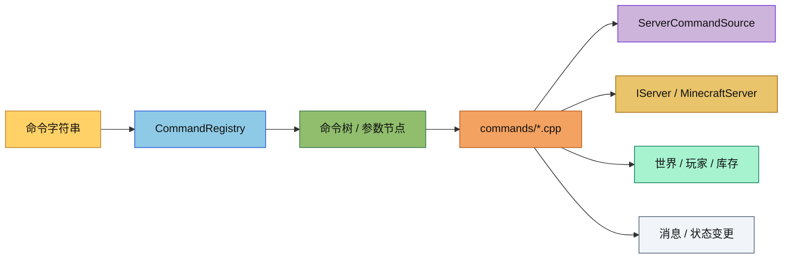

# 命令实现子目录

这里放的是服务端内置命令的具体实现。这个目录只负责把解析后的命令树节点绑定到执行逻辑，不负责命令注册入口，也不负责服务器生命周期。

## 目录结构

```text
src/server/command/commands/
├── ClearCommand.hpp / ClearCommand.cpp
├── DefaultGameModeCommand.hpp / DefaultGameModeCommand.cpp
├── DifficultyCommand.hpp / DifficultyCommand.cpp
├── ExecuteCommand.hpp / ExecuteCommand.cpp
├── ExperienceCommand.hpp / ExperienceCommand.cpp
├── GameModeCommand.hpp / GameModeCommand.cpp
├── GiveCommand.hpp / GiveCommand.cpp
├── HelpCommand.hpp / HelpCommand.cpp
├── KickCommand.hpp / KickCommand.cpp
├── KillCommand.hpp / KillCommand.cpp
├── ListCommand.hpp / ListCommand.cpp
├── SayCommand.hpp / SayCommand.cpp
├── SeedCommand.hpp / SeedCommand.cpp
├── SetIdleTimeoutCommand.hpp / SetIdleTimeoutCommand.cpp
├── SetWorldSpawnCommand.hpp / SetWorldSpawnCommand.cpp
├── SpawnPointCommand.hpp / SpawnPointCommand.cpp
├── StopCommand.hpp / StopCommand.cpp
├── TeleportCommand.hpp / TeleportCommand.cpp
├── TimeCommand.hpp / TimeCommand.cpp
├── TriggerCommand.hpp / TriggerCommand.cpp
└── WeatherCommand.hpp / WeatherCommand.cpp
```

## 文件介绍

- `ClearCommand.*`：清空背包，按玩家查询库存时走 `IServer::playerInventory()`。
- `DefaultGameModeCommand.*`：设置服务器默认游戏模式。
- `DifficultyCommand.*`：修改世界难度。
- `ExecuteCommand.*`：执行嵌套命令，支持多种执行上下文修改。
  - `/execute run <command>` - 直接执行命令
  - `/execute as <entity> run <command>` - 以指定实体身份执行命令
  - `/execute at <entity> run <command>` - 在指定实体位置执行命令
  - `/execute positioned <pos> run <command>` - 在指定位置执行命令
  - `/execute if block <pos> <block> run <command>` - 条件执行（方块检测）
  - `/execute unless block <pos> <block> run <command>` - 反条件执行（方块检测）
  - 使用 `StringArgumentType::greedyString()` 捕获剩余命令文本
  - 通过 `ServerCommandSource::withPlayer()/withPosition()/withDimension()` 创建派生命令源
  - 通过 `CommandRegistry::execute()` 执行嵌套命令
- `ExperienceCommand.*`：管理经验值和等级。
- `FillCommand.*`：填充区域方块。
  - 支持完整的方块状态属性解析（如 `oak_stairs[facing=east,half=top]`）
  - destroy 模式：破坏原方块并掉落物品（使用 BlockDropHandler）
  - hollow 模式：填充外壳，内部填充空气
  - keep 模式：仅替换空气方块
  - outline 模式：仅填充外壳，内部保持不变
  - replace 模式：替换所有或指定方块（支持带属性的过滤）
- `GameModeCommand.*`：切换玩家游戏模式。
- `GiveCommand.*`：发放物品。
  - 背包满时在玩家位置掉落物品实体（参考 MC 1.16.5）
  - 设置掉落物品的 owner UUID 和无拾取延迟
  - 播放拾取音效，音调公式：`((random - random) * 0.7 + 1.0) * 2.0`
- `HelpCommand.*`：展示命令帮助。
- `KickCommand.*`：踢出在线玩家。
- `KillCommand.*`：杀死实体或自己。
- `ListCommand.*`：列出在线玩家。
- `SayCommand.*`：广播聊天消息。
- `SeedCommand.*`：显示当前世界种子。
- `SetBlockCommand.*`：放置单个方块。
  - 支持完整的方块状态属性解析（如 `stone[facing=north]`）
  - destroy 模式：破坏原方块并掉落物品
  - keep 模式：仅在空气位置放置
  - replace 模式：直接替换（默认）
- `SetIdleTimeoutCommand.*`：设置玩家挂机超时。
- `SetWorldSpawnCommand.*`：设置世界出生点（指南针指向位置）。
  - 设置 Dimension 和 ServerWorld 的出生点
  - 广播 SpawnPositionPacket 给所有在线玩家
- `SpawnPointCommand.*`：设置玩家个人重生点。
- `StopCommand.*`：请求服务器停机。
- `TeleportCommand.*`：处理 `/tp` 与 `/teleport` 的传送逻辑。
- `TimeCommand.*`：修改或查询游戏时间。
- `WeatherCommand.*`：修改或查询天气状态，统一通过 `ServerCommandSource::world()` 获取当前世界天气管理器。
- `TeamCommand.*`：队伍系统管理命令。
  - `/team add <team>`：创建新队伍
  - `/team remove <team>`：移除队伍
  - `/team list`：列出所有队伍
  - `/team empty <team>`：清空队伍成员
  - `/team join <team> <members>`：玩家加入队伍
  - `/team leave <members>`：玩家离开队伍
  - `/team modify <team> <property> <value>`：修改队伍属性
    - 支持的属性：color, friendlyFire, seeFriendlyInvisibles, prefix, suffix, displayName, nametagVisibility, deathMessageVisibility, collisionRule
- `ScoreboardCommand.*`：记分板目标管理。
  - 通过 `IServer::scoreboard()` 获取服务端记分板实例
  - `/scoreboard objectives <add|remove|list|setdisplay> ...`：管理目标
  - `/scoreboard players <add|remove|set|reset|get|list|enable> ...`：管理玩家分数
  - `enable` 子命令：启用触发器目标，解锁分数使其可被 `/trigger` 命令修改
  - `list` 子命令：列出指定玩家在所有目标上的分数
- `TriggerCommand.*`：触发器命令实现。
  - `/trigger <objective>`：触发目标（分数 +1）
  - `/trigger <objective> add <value>`：增加分数
  - `/trigger <objective> set <value>`：设置分数
  - 权限等级 0（所有玩家可用）
  - 只有 trigger 类型目标可用
  - 玩家需先被 `/scoreboard players enable` 启用才能触发
  - 触发后分数自动锁定，需再次启用才能修改

## 模块关系

- 这些实现都被 `CommandRegistry::registerDefaults()` 注册到命令树。
- 每个命令通过 `ServerCommandSource` 读取权限、玩家、世界和反馈输出。
- `support/` 目录提供共享的元数据、参数解析、玩家解析等辅助逻辑。
- `/clear` 通过 `IServer` 的抽象库存接口工作，不再直接绑定具体服务器实现。
- `save-all` / `save-on` / `save-off` 通过 `IServer::sharedStorage()` 获取共享存储，不再绕主世界。

## 整体职责

该目录负责把 Minecraft 风格的命令行为落到具体执行逻辑上，包括参数解析、权限校验、目标解析、消息反馈和对服务器状态的修改。

## 输入 / 输出

- 输入：命令字符串、命令源、目标选择器、参数节点、服务器状态。
- 输出：聊天反馈、玩家状态变更、时间/天气/游戏模式修改、背包修改、传送请求和服务器停机请求。

## 依赖项

- 内部依赖：`server/command/CommandRegistry`、`server/command/ServerCommandSource`、`server/command/support/*`、`server/application/IServer`、`server/core/*`、`server/player/ServerPlayer`。
- 共享依赖：`common/command/*`、`common/entity/inventory/*`、`common/item/*`、`common/network/packet/*`。
- 外部依赖：`spdlog`、`GTest`（测试场景）。

## 使用方法

```cpp
ClearCommand::registerTo(dispatcher);
```

通常不直接调用具体命令函数，而是通过 `CommandRegistry::registerDefaults()` 或单独的 `registerTo()` 把子树挂到总命令树上。

## 容易踩的坑

- 不要在命令里直接 `dynamic_cast` 到 `IntegratedServer`，统一通过 `IServer::playerInventory()` 取库存。
- 命令元数据和实际语法要同步更新，否则帮助输出和补全会偏离。
- `/tp` 和 `/teleport`、`/experience` 和 `/xp` 这类别名应继续使用重定向共享同一棵树。
- 目标选择器解析要依赖共享的 support 辅助函数，不要在每个命令里重复实现。

## 测试用例

- `tests/server/command/CommandRegistryTest.cpp`：覆盖命令注册、解析、执行和部分具体命令行为。
- `tests/server/command/ExecuteCommandTest.cpp`：覆盖 /execute 命令的注册、权限检查、各子命令执行。
- `tests/server/command/TriggerCommandTest.cpp`：覆盖 /trigger 命令和触发器机制。
  - 命令注册验证
  - 目标不存在、非触发器类型、未 primed 测试
  - 成功激活、add、set 测试
  - 触发器已使用（锁定）测试
  - 通过 `/scoreboard players enable` 重新启用测试
  - 控制台无法使用测试
  - 分数锁定机制测试

## Mermaid 图表


