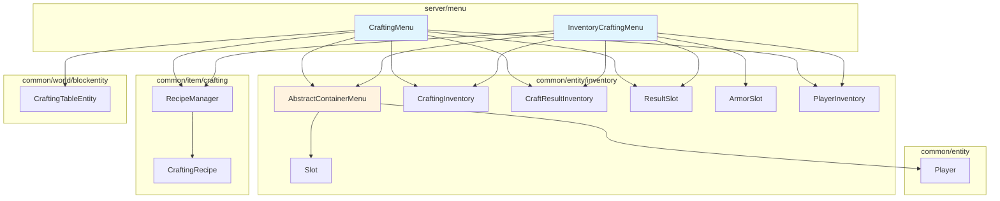

# Server Menu 模块

容器菜单系统，处理玩家与容器的交互逻辑（如工作台、玩家背包等）。

## 目录结构

```
src/server/menu/
├── CraftingMenu.hpp    # 工作台菜单和玩家背包菜单的头文件
└── CraftingMenu.cpp    # 工作台菜单和玩家背包菜单的实现
```

## 文件详解

### CraftingMenu.hpp

定义了两个核心容器菜单类：

#### CraftingMenu 类

工作台容器菜单，管理 **3x3 合成网格**和结果槽位。

**职责**：
- 管理 3x3 合成网格（9 个槽位）
- 显示合成结果
- 连接玩家背包和快捷栏
- 处理合成结果点击和原料消耗
- 支持 Shift+点击快速移动物品

**槽位布局**：
| 槽位范围 | 描述 | GUI坐标 |
|---------|------|---------|
| 0-8 | 合成网格 (3x3) | (98, 18) 起始 |
| 9 | 结果槽位 | (154, 28) |
| 10-36 | 玩家主背包 (3x9) | (8, 84) 起始 |
| 37-45 | 玩家快捷栏 (1x9) | (8, 142) 起始 |

**关键方法**：
- `updateResult()` - 查找匹配配方并更新结果槽位
- `handleResultSlotClick()` - 处理结果槽位点击，返回合成物品
- `consumeIngredients()` - 消耗合成原料
- `quickMoveStack()` - Shift+点击物品移动逻辑

#### InventoryCraftingMenu 类

玩家背包合成菜单，管理 **2x2 合成网格**、护甲槽和副手槽。

**职责**：
- 管理 2x2 合成网格（4 个槽位）
- 管理护甲槽位（头盔、胸甲、护腿、靴子）
- 管理副手槽位
- 显示合成结果
- 处理护甲装备逻辑

**槽位布局**：
| 槽位 | 描述 | GUI坐标 |
|-----|------|---------|
| 0 | 合成结果 | (154, 28) |
| 1-4 | 合成网格 (2x2) | (98, 18) 到 (116, 36) |
| 5 | 头盔 | (8, 8) |
| 6 | 胸甲 | (8, 26) |
| 7 | 护腿 | (8, 44) |
| 8 | 靴子 | (8, 62) |
| 9-35 | 玩家主背包 (3x9) | (8, 84) 起始 |
| 36-44 | 玩家快捷栏 (1x9) | (8, 142) 起始 |
| 45 | 副手 | (77, 62) |

**GUI 尺寸**：176 x 166 像素

### CraftingMenu.cpp

实现两个菜单类的所有方法：

**核心逻辑**：

1. **配方查找**：通过 `RecipeManager::findMatchingRecipe()` 查找匹配的配方
2. **结果更新**：当合成网格变化时自动更新结果槽位
3. **物品消耗**：根据配方的原料消耗数量减少网格中的物品
4. **Shift+点击**：智能移动物品到合适的目标槽位
5. **可用性校验**：`CraftingMenu::stillValid()` 会按玩家与工作台的距离判断菜单是否仍然可用

**辅助函数**：
```cpp
// 检查结果是否可以与手持物品堆叠
bool canStackResultWithCarried(const ItemStack& carried, const ItemStack& result);

// 缩减合成网格中的物品
void shrinkCraftingGrid(CraftingInventory& grid, const crafting::CraftingRecipe* recipe);
```

## 模块关系图



## 整体职责

### 模块职责

1. **容器交互管理**：处理玩家与容器的所有交互操作
2. **合成系统支持**：为工作台和玩家背包提供合成功能
3. **物品移动逻辑**：实现 Shift+点击等快速物品移动
4. **槽位管理**：定义槽位布局和物品放置规则

### 输入

| 输入 | 来源 | 描述 |
|-----|------|------|
| 玩家点击操作 | 客户端网络包 | 包含槽位索引、鼠标按钮、点击类型 |
| 合成网格内容 | CraftingInventory | 2x2 或 3x3 网格中的物品 |
| 配方数据 | RecipeManager | 注册的所有合成配方 |
| 玩家背包 | PlayerInventory | 玩家的物品存储 |

### 输出

| 输出 | 目标 | 描述 |
|-----|------|------|
| 合成结果 | CraftResultInventory | 匹配配方的产出物品 |
| 物品变化 | 客户端同步 | 槽位内容变化的网络同步 |
| 事件通知 | UI 层 | 槽位变化事件，用于界面刷新 |

## 依赖项

### 上游依赖

| 依赖 | 路径 | 用途 |
|-----|------|------|
| AbstractContainerMenu | `common/entity/inventory/` | 容器菜单基类 |
| CraftingInventory | `common/entity/inventory/` | 合成网格背包 |
| CraftResultInventory | `common/entity/inventory/` | 合成结果背包 |
| Slot, ResultSlot, ArmorSlot | `common/entity/inventory/` | 槽位类型 |
| PlayerInventory | `common/entity/inventory/` | 玩家背包 |
| RecipeManager | `common/item/crafting/` | 配方查找 |
| CraftingTableEntity | `common/world/blockentity/` | 工作台方块实体 |
| Player | `common/entity/` | 玩家实体 |
| ScreenType | `common/screen/` | 屏幕/界面类型枚举 |

### 下游使用者

| 使用者 | 用途 |
|-------|------|
| ContainerManager | 创建和管理容器菜单 |
| IntegratedServer | 处理玩家打开工作台的请求 |
| ContainerPacketHandler | 处理容器相关的网络包 |

## 使用方法

### 创建工作台菜单

```cpp
#include "server/menu/CraftingMenu.hpp"

// 创建工作台菜单（关联方块实体）
ContainerId id = nextContainerId();
CraftingMenu* menu = new CraftingMenu(id, playerInventory, craftingTableEntity);

// 创建玩家背包菜单（无方块实体）
CraftingMenu* menu = new CraftingMenu(id, playerInventory, 3, 3);
```

### 创建玩家背包合成菜单

```cpp
#include "server/menu/CraftingMenu.hpp"

// 创建玩家背包菜单（包含 2x2 合成网格和护甲）
ContainerId id = nextContainerId();
InventoryCraftingMenu* menu = new InventoryCraftingMenu(id, playerInventory);
```

### 处理玩家点击

```cpp
// 处理槽位点击
ItemStack result = menu->clicked(slotIndex, button, clickType, player);

// 处理 Shift+点击
ItemStack result = menu->quickMoveStack(slotIndex, player);
```

### 监听槽位变化

```cpp
// 添加槽位变化监听器
i32 listenerId = menu->addListener([](i32 slotIndex, ItemStack stack) {
    // 处理槽位变化
    broadcastSlotChange(slotIndex, stack);
});

// 移除监听器
menu->removeListener(listenerId);
```

## 容易踩的坑

### 1. 槽位索引常量混淆

**问题**：`CraftingMenu` 和 `InventoryCraftingMenu` 的槽位索引常量不同。

```cpp
// CraftingMenu (工作台)
static constexpr i32 RESULT_SLOT = 9;         // 结果槽位在索引 9
static constexpr i32 GRID_SLOT_START = 0;     // 网格从 0 开始

// InventoryCraftingMenu (玩家背包)
static constexpr i32 RESULT_SLOT = 0;         // 结果槽位在索引 0
static constexpr i32 GRID_SLOT_START = 1;     // 网格从 1 开始
```

**解决**：使用各自类的常量，不要硬编码索引值。

## 测试用例

| 文件 | 说明 |
|------|------|
| `tests/server/menu/CraftingMenuTest.cpp` | 验证工作台菜单的距离可用性判断 |

### 2. 结果槽位点击处理

**问题**：结果槽位的点击需要特殊处理，不能直接使用基类的 `clicked()` 方法。

**解决**：两个菜单类都重写了 `clicked()` 方法，在结果槽位点击时调用 `handleResultSlotClick()`。

```cpp
ItemStack CraftingMenu::clicked(i32 slotIndex, i32 button, ClickType clickType, Player& player) {
    if (slotIndex == RESULT_SLOT && clickType != ClickType::QuickMove) {
        if (handleResultSlotClick() != nullptr) {
            broadcastChanges();
        }
        return getCarriedItem();
    }
    return AbstractContainerMenu::clicked(slotIndex, button, clickType, player);
}
```

### 3. 配方消耗逻辑

**问题**：配方消耗物品时，需要考虑原料数量可能大于 1 的情况。

**解决**：使用 `recipe->getIngredientCount(slot)` 获取正确的消耗数量。

```cpp
void shrinkCraftingGrid(CraftingInventory& grid, const crafting::CraftingRecipe* recipe) {
    for (i32 slot = 0; slot < grid.getContainerSize(); ++slot) {
        ItemStack stack = grid.getItem(slot);
        if (stack.isEmpty()) continue;
        stack.shrink(std::max(1, recipe->getIngredientCount(slot)));
        grid.setItem(slot, stack.isEmpty() ? ItemStack() : stack);
    }
}
```

### 4. 手持物品堆叠检查

**问题**：点击结果槽位时，需要检查结果物品是否能与玩家手持物品堆叠。

**解决**：使用 `canStackResultWithCarried()` 辅助函数检查堆叠限制。

```cpp
bool canStackResultWithCarried(const ItemStack& carried, const ItemStack& result) {
    if (result.isEmpty()) return false;
    if (carried.isEmpty()) return true;
    if (!carried.isSameItem(result)) return false;
    return carried.getCount() + result.getCount() <= carried.getMaxStackSize();
}
```

### 5. 菜单关闭时物品返回

**问题**：关闭工作台时，合成网格中的物品需要返回玩家背包。

**解决**：在 `removed()` 方法中处理物品返回。

```cpp
void CraftingMenu::removed(Player& player) {
    // 返回手持物品
    if (!m_carried.isEmpty()) {
        m_playerInventory->add(m_carried);
        m_carried = ItemStack();
    }
    // 返回合成网格中的物品
    for (i32 i = 0; i < m_craftingGrid.getContainerSize(); ++i) {
        ItemStack stack = m_craftingGrid.removeItemNoUpdate(i);
        if (!stack.isEmpty()) {
            m_playerInventory->add(stack);
        }
    }
    AbstractContainerMenu::removed(player);
}
```

### 6. Shift+点击的目标槽位优先级

**问题**：不同来源槽位的 Shift+点击有不同的目标优先级。

**解决**：`quickMoveStack()` 中针对不同槽位类型实现不同的移动逻辑。

```cpp
// 主背包 Shift+点击：优先移动到护甲，然后到合成网格
if (!moveItemToRange(movingStack, ARMOR_SLOT_START, ARMOR_SLOT_START + ARMOR_SLOT_COUNT - 1)) {
    if (!moveItemToRange(movingStack, GRID_SLOT_START, GRID_SLOT_END)) {
        return ItemStack();
    }
}
```

### 7. `stillValid` 验证缺失

**问题**：`CraftingMenu::stillValid()` 方法当前总是返回 `true`，没有检查玩家是否仍在工作台附近。

**解决**：TODO 实现距离检查（通常是 3 格范围内）。

```cpp
bool CraftingMenu::stillValid(const Player& player) const {
    // TODO: 检查玩家是否仍在工作台附近
    // 需要检查玩家与方块的距离是否在范围内（通常是3格）
    (void)player;
    return true;
}
```

## 涉及的测试用例

### CraftingInventoryTest.cpp

位于 `tests/common/entity/inventory/CraftingInventoryTest.cpp`，测试 `CraftingInventory` 和 `CraftResultInventory` 类：

| 测试类别 | 测试用例 |
|---------|---------|
| 构造函数 | `Create_2x2`, `Create_3x3`, `Create_1x1` |
| 槽位索引 | `PosToSlot_*`, `SlotToPos_*` |
| 物品操作 | `SetGetItem_BySlot`, `SetGetItem_ByPosition`, `RemoveItem_*` |
| 回调测试 | `ContentChangedCallback` |
| 边界计算 | `ContentBounds_*`, `IsAllEmpty` |
| 结果背包 | `CraftResultInventoryTest::*` |

### 建议补充的测试

目前 `CraftingMenu` 和 `InventoryCraftingMenu` 没有专门的单元测试，建议添加：

1. **槽位布局测试**：验证各槽位索引和坐标的正确性
2. **合成结果测试**：验证配方匹配和结果更新
3. **Shift+点击测试**：验证物品快速移动逻辑
4. **护甲槽测试**：验证护甲槽只能放入对应护甲类型
5. **物品返回测试**：验证菜单关闭时物品正确返回

## 相关文件

- `src/common/entity/inventory/AbstractContainerMenu.hpp` - 容器菜单基类
- `src/common/entity/inventory/CraftingInventory.hpp` - 合成网格背包
- `src/common/entity/inventory/Slot.hpp` - 槽位类定义
- `src/common/item/crafting/RecipeManager.hpp` - 配方管理器
- `src/server/interaction/ContainerManager.hpp` - 容器管理器
