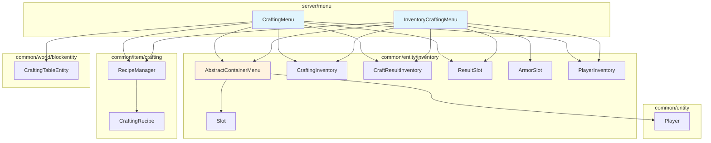

# Server Menu 模块

容器菜单系统，处理玩家与容器的交互逻辑（如工作台、玩家背包等）。

## 目录结构

```
src/server/menu/
├── CraftingMenu.hpp    # 工作台菜单和玩家背包菜单的头文件
└── CraftingMenu.cpp    # 工作台菜单和玩家背包菜单的实现
```

## 模块关系图



## 内部模块

| 类名 | 描述 |
|-----|------|
| CraftingMenu | 工作台容器菜单，管理 3x3 合成网格和结果槽位 |
| InventoryCraftingMenu | 玩家背包合成菜单，管理 2x2 合成网格、护甲槽和副手槽 |

**槽位布局差异**（重要）：
- `CraftingMenu`：槽位 0-8 为合成网格，槽位 9 为结果槽位
- `InventoryCraftingMenu`：槽位 0 为结果槽位，槽位 1-4 为合成网格

## 依赖项

### 上游依赖

| 依赖 | 路径 | 用途 |
|-----|------|------|
| AbstractContainerMenu | `common/entity/inventory/` | 容器菜单基类 |
| CraftingInventory | `common/entity/inventory/` | 合成网格背包 |
| CraftResultInventory | `common/entity/inventory/` | 合成结果背包 |
| Slot, ResultSlot, ArmorSlot | `common/entity/inventory/` | 槽位类型 |
| PlayerInventory | `common/entity/inventory/` | 玩家背包 |
| RecipeManager | `common/item/crafting/` | 配方查找 |
| CraftingTableEntity | `common/world/blockentity/` | 工作台方块实体 |
| ScreenType | `common/screen/` | 屏幕/界面类型枚举 |

### 下游使用者

| 使用者 | 用途 |
|-------|------|
| ContainerManager | 创建和管理容器菜单 |
| IntegratedServer | 处理玩家打开工作台的请求；本地容器点击路径内联处理（guard + setCarriedItem + toClickType + clicked），不再经 `ContainerPacketHandler`（该类已删除） |
| ContainerManager::handleClick | 远程玩家容器点击处理入口 |

## 容易踩的坑

### 1. 槽位索引常量混淆

两个类的槽位索引常量不同，不要硬编码索引值：

| 常量 | CraftingMenu | InventoryCraftingMenu |
|-----|--------------|----------------------|
| RESULT_SLOT | 9 | 0 |
| GRID_SLOT_START | 0 | 1 |

应使用各自类的常量，如 `CraftingMenu::RESULT_SLOT` 或 `InventoryCraftingMenu::RESULT_SLOT`。

### 2. 结果槽位点击处理

结果槽位点击需要特殊处理，不能直接使用基类的 `clicked()` 方法。两个菜单类都重写了 `clicked()` 方法，在结果槽位点击时调用 `_handleResultSlotClick()`。

### 3. 配方消耗逻辑

配方消耗物品时需要考虑原料数量可能大于 1 的情况，应使用 `recipe->getIngredientCount(slot)` 获取正确的消耗数量。另外，部分配方有剩余物品（如水桶→空桶），应使用 `recipe->getRemainingItems(grid)` 处理。

### 4. 手持物品堆叠检查

点击结果槽位时需要检查结果物品是否能与玩家手持物品堆叠，使用 `canStackResultWithCarried()` 辅助函数检查堆叠限制。

### 5. 菜单关闭时物品返回

关闭工作台时，合成网格中的物品需要返回玩家背包，在 `removed()` 方法中处理。

### 6. Shift+点击的目标槽位优先级

不同来源槽位的 Shift+点击有不同的目标优先级，`quickMoveStack()` 中需针对不同槽位类型实现不同的移动逻辑。

### 7. `stillValid` 验证

`CraftingMenu::stillValid()` 检查玩家与工作台的距离是否在 8 格以内（距离平方 ≤ 64）。若无关联方块实体（玩家背包内的 2x2 合成），则始终返回 `true`。
