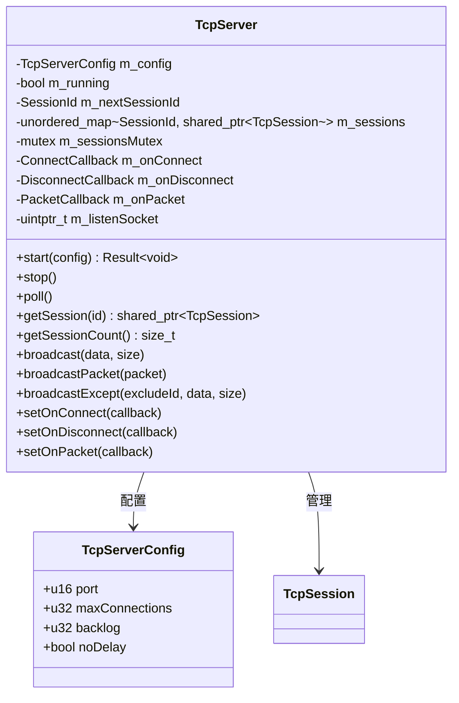
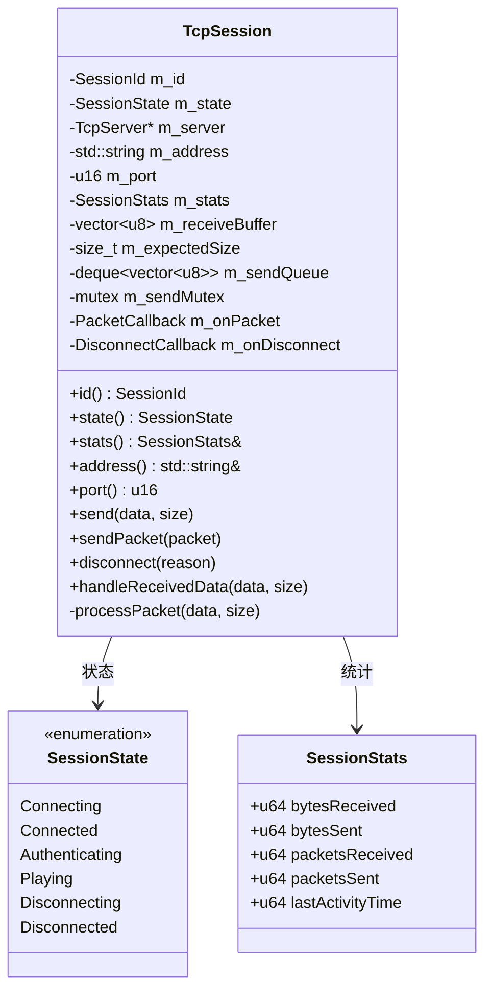
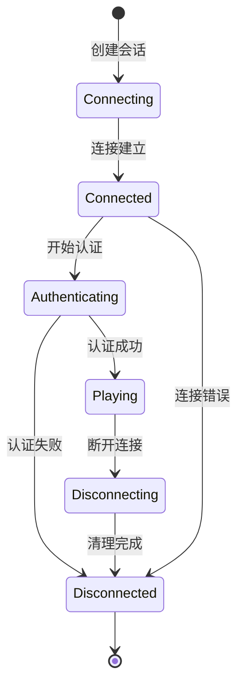
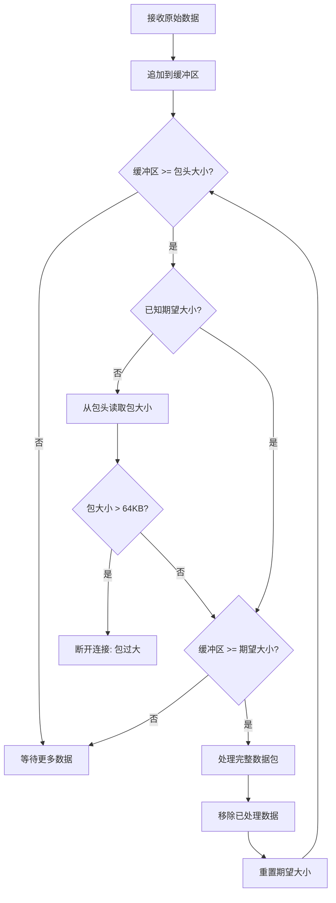
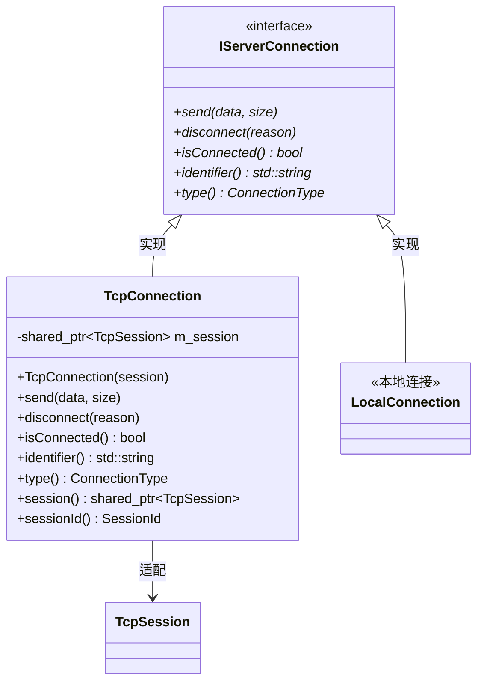
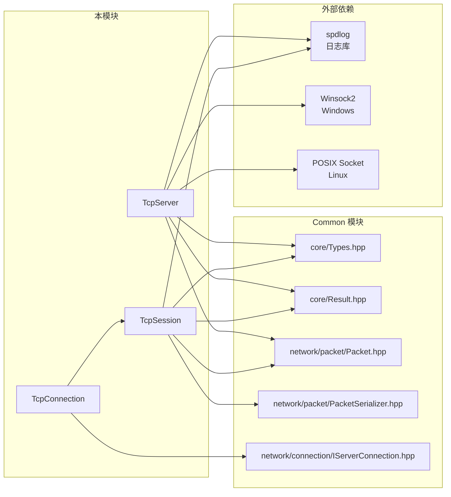

# Server Network Module

本目录包含服务端 TCP 网络通信模块，负责独立服务器（StandaloneServer）的远程客户端连接管理。

## 目录结构

```
src/server/network/
├── TcpServer.hpp       # TCP 服务器头文件
├── TcpServer.cpp       # TCP 服务器实现
├── TcpSession.hpp      # TCP 会话头文件
├── TcpSession.cpp      # TCP 会话实现
├── TcpConnection.hpp   # TCP 连接适配器头文件
├── TcpConnection.cpp   # TCP 连接适配器实现
└── README.md           # 本文档
```

## 文件详解

### TcpServer.hpp / TcpServer.cpp

**职责**：TCP 服务器核心实现，负责监听端口、接受连接、管理会话。

**主要类**：



**关键特性**：

| 特性 | 描述 |
|------|------|
| 非阻塞 I/O | 使用非阻塞 socket，支持单线程轮询 |
| 跨平台 | 支持 Windows (Winsock2) 和 Linux (POSIX socket) |
| 会话管理 | 自动分配 SessionId，线程安全的会话映射 |
| 连接限制 | 可配置最大连接数 |
| 回调机制 | 支持连接/断开/数据包回调 |

**重要方法**：

- `start(config)` - 启动服务器，绑定端口并开始监听
- `stop()` - 停止服务器，断开所有会话
- `poll()` - **核心方法**，在主循环中调用，处理新连接和数据收发
- `broadcast()` / `broadcastPacket()` - 向所有会话广播数据

---

### TcpSession.hpp / TcpSession.cpp

**职责**：表示单个客户端会话，管理会话状态、数据缓冲和统计信息。

**主要类型**：



**会话状态流转**：



**数据包解析流程**：



---

### TcpConnection.hpp / TcpConnection.cpp

**职责**：将 `TcpSession` 适配到 `IServerConnection` 接口，用于与游戏逻辑层解耦。

**类关系**：



**设计目的**：

| 连接类型 | 用途 | 场景 |
|----------|------|------|
| `TcpConnection` | 远程客户端 | StandaloneServer（多人服务器） |
| `LocalConnection` | 本地客户端 | IntegratedServer（单机模式） |

通过 `IServerConnection` 接口，`ServerWorld`、`EntityTracker` 等模块可以网络无关地处理玩家连接。

---

## 模块整体架构

```mermaid
flowchart TB
    subgraph 应用层
        StandaloneServer[StandaloneServer<br/>独立服务器]
        MinecraftServer[MinecraftServer<br/>服务器基类]
    end

    subgraph 网络层
        TcpServer[TcpServer<br/>TCP服务器]
        TcpSession[TcpSession<br/>客户端会话]
        TcpConnection[TcpConnection<br/>连接适配器]
    end

    subgraph 接口层
        IServerConnection[IServerConnection<br/>连接接口]
    end

    subgraph 数据包层
        Packet[Packet<br/>数据包基类]
        PacketSerializer[PacketSerializer<br/>序列化器]
        PacketDeserializer[PacketDeserializer<br/>反序列化器]
    end

    StandaloneServer --> TcpServer
    TcpServer --> TcpSession
    TcpSession --> PacketDeserializer
    TcpConnection --> TcpSession
    TcpConnection ..|> IServerConnection
    StandaloneServer --> TcpConnection
    TcpSession --> Packet
```

---

## 模块职责

### 整体职责

本模块负责**独立服务器的 TCP 网络通信**，包括：

1. **监听与接受连接** - 在指定端口监听，接受客户端连接
2. **会话生命周期管理** - 创建、维护、销毁客户端会话
3. **数据包收发** - 接收数据、解析数据包、发送数据
4. **连接抽象** - 提供统一的连接接口供上层使用

### 输入

| 输入来源 | 数据类型 | 说明 |
|----------|----------|------|
| 客户端连接 | TCP 连接请求 | 来自远程客户端的 TCP 连接 |
| 网络数据 | 原始字节流 | 客户端发送的二进制数据包 |
| 服务器命令 | 配置参数 | 端口、最大连接数、backlog 等 |
| 发送请求 | Packet/数据 | 上层逻辑请求发送的数据 |

### 输出

| 输出目标 | 数据类型 | 说明 |
|----------|----------|------|
| 连接回调 | TcpSession* | 新连接建立时触发 |
| 断开回调 | TcpSession*, reason | 连接断开时触发 |
| 数据包回调 | TcpSession*, data, size | 收到完整数据包时触发 |
| 网络数据 | 原始字节流 | 发送给客户端的数据 |

---

## 依赖关系



**依赖说明**：

| 依赖项 | 用途 |
|--------|------|
| `core/Types.hpp` | 基础类型定义（u8, u16, u32, u64, std::string 等） |
| `core/Result.hpp` | 错误处理（Result<T>, Error, ErrorCode） |
| `network/packet/Packet.hpp` | 数据包基类、PacketType 枚举 |
| `network/packet/PacketSerializer.hpp` | 数据包序列化 |
| `network/connection/IServerConnection.hpp` | 服务端连接接口 |
| `spdlog` | 日志输出 |
| `Winsock2` (Windows) | Windows socket API |
| `POSIX Socket` (Linux) | Linux socket API |

---

## 使用方法

### 基本使用流程

```cpp
#include "server/network/TcpServer.hpp"
#include "server/network/TcpConnection.hpp"

using namespace mc::server;

// 1. 创建服务器
auto server = std::make_unique<TcpServer>();

// 2. 设置回调
server->setOnConnect([](TcpSession* session) {
    spdlog::info("新连接: {}:{}", session->address(), session->port());
});

server->setOnDisconnect([](TcpSession* session, const std::string& reason) {
    spdlog::info("断开连接: {} - {}", session->address(), reason);
});

server->setOnPacket([](TcpSession* session, const u8* data, size_t size) {
    // 处理数据包
    // session->id() 获取会话ID
    // data, size 是完整的数据包
});

// 3. 启动服务器
TcpServerConfig config;
config.port = 25565;
config.maxConnections = 100;
config.noDelay = true;

auto result = server->start(config);
if (result.failed()) {
    spdlog::error("启动失败: {}", result.error().message());
    return;
}

// 4. 主循环
while (running) {
    server->poll();  // 处理网络事件
    // ... 其他逻辑
}

// 5. 停止服务器
server->stop();
```

### 创建连接适配器

```cpp
// 在玩家登录时，将 TcpSession 包装为 IServerConnection
auto session = tcpServer->getSession(sessionId);
auto connection = std::make_shared<TcpConnection>(session);

// 存储到玩家数据中
playerData->connection = connection;

// 使用连接接口发送数据
if (connection->isConnected()) {
    connection->send(data, size);
}

// 断开连接
connection->disconnect("被踢出");
```

### 广播消息

```cpp
// 广播原始数据
server->broadcast(data, size);

// 广播数据包
network::ChatBroadcastPacket packet("Hello, World!");
server->broadcastPacket(packet);

// 广播给除某人外的所有玩家
server->broadcastExcept(excludeSessionId, data, size);
```

---

## 容易踩的坑

### 1. Socket 句柄未存储到 TcpSession

**问题**：当前实现中 `handleSessionData()` 和 `sendSessionData()` 标记为 TODO，TcpSession 没有存储 socket 句柄。

**影响**：无法实际接收和发送数据。

**解决方案**：需要扩展 TcpSession 存储 socket 句柄：

```cpp
// TcpSession.hpp 中添加
#ifdef _WIN32
    uintptr_t m_socket = INVALID_SOCKET;
#else
    int m_socket = -1;
#endif

// TcpServer::acceptNewConnection() 中设置
session->setSocket(clientSocket);
```

### 2. 非阻塞模式下的部分接收

**问题**：`handleReceivedData()` 假设数据已完整接收，但非阻塞 socket 可能只收到部分数据。

**当前处理**：正确实现了缓冲区和期望大小机制，会等待完整包。

### 3. 线程安全

**问题**：`poll()` 在主线程调用，但回调可能修改共享状态。

**建议**：
- 回调中避免阻塞操作
- 使用 `std::mutex` 保护共享数据
- 考虑使用消息队列解耦

### 4. 包大小限制

**当前限制**：最大包大小 64KB。

```cpp
// TcpSession.cpp:84-87
if (m_expectedSize > 65536) { // 64KB最大包大小
    spdlog::error("Packet too large: {} bytes", m_expectedSize);
    disconnect("Packet too large");
    return;
}
```

**注意**：如果发送大包（如区块数据），需要确认不超过此限制。

### 5. Winsock 初始化

**问题**：Windows 需要初始化 Winsock。

**当前处理**：使用全局 `WinsockInitializer` 自动管理：

```cpp
// TcpServer.cpp
class WinsockInitializer {
    // ... 自动初始化/清理
};
static WinsockInitializer s_winsock;  // 全局实例
```

### 6. 会话状态检查

**问题**：在断开连接后继续使用会话。

**建议**：使用前检查状态：

```cpp
if (session->state() != SessionState::Playing) {
    return;  // 会话不可用
}
```

### 7. 数据包序列化失败

**问题**：`sendPacket()` 中序列化失败时只记录日志，不通知调用者。

```cpp
// TcpSession.cpp:31-37
void TcpSession::sendPacket(const network::Packet& packet) {
    auto result = packet.serialize();
    if (result.success()) {
        send(result.value().data(), result.value().size());
    } else {
        spdlog::error("Failed to serialize packet: {}", result.error().toString());
        // 注意：调用者不知道发送失败
    }
}
```

**建议**：返回 `Result<void>` 让调用者处理错误。

---

## 涉及的测试用例

当前测试框架中，TCP 网络模块的源文件被编译进测试可执行文件，但**没有专门的单元测试**。

测试文件被引用在 `tests/CMakeLists.txt` 第 179-181 行：

```cmake
${CMAKE_SOURCE_DIR}/src/server/network/TcpServer.cpp
${CMAKE_SOURCE_DIR}/src/server/network/TcpSession.cpp
${CMAKE_SOURCE_DIR}/src/server/network/TcpConnection.cpp
```

**相关测试建议**：

1. **单元测试** - 需要添加：
   - `TcpServerTest.cpp` - 测试服务器启动/停止/配置
   - `TcpSessionTest.cpp` - 测试数据包解析/状态转换
   - `TcpConnectionTest.cpp` - 测试适配器行为

2. **集成测试** - 相关测试文件：
   - `tests/server/test_integrated_server.cpp` - IntegratedServer 测试
   - `tests/server/core/ConnectionManagerTest.cpp` - 连接管理器测试
   - `tests/network/LocalServerConnectionTest.cpp` - 本地连接测试

3. **网络测试建议**：

```cpp
// 示例测试用例
TEST(TcpServerTest, StartStop) {
    TcpServer server;
    TcpServerConfig config;
    config.port = 25565;

    auto result = server.start(config);
    EXPECT_TRUE(result.success());
    EXPECT_TRUE(server.isRunning());

    server.stop();
    EXPECT_FALSE(server.isRunning());
}

TEST(TcpSessionTest, PacketReassembly) {
    TcpSession session(1, nullptr);

    // 模拟分片接收
    std::vector<u8> partial1 = {/* 前半部分数据 */};
    std::vector<u8> partial2 = {/* 后半部分数据 */};

    session.handleReceivedData(partial1.data(), partial1.size());
    // 验证缓冲区状态

    session.handleReceivedData(partial2.data(), partial2.size());
    // 验证完整包处理
}
```

---

## 与 IntegratedServer 的对比

| 特性 | StandaloneServer (本模块) | IntegratedServer |
|------|---------------------------|------------------|
| 网络层 | TcpServer + TcpSession | LocalConnection |
| 连接类型 | TcpConnection (远程) | LocalConnection (本地) |
| 多玩家 | 支持 | 单人 |
| 延迟 | 网络延迟 | 几乎无延迟 |
| 序列化 | 需要 | 需要（统一接口） |
| 适用场景 | 服务器/多人游戏 | 单机/单人游戏 |

---

## 性能考虑

1. **单线程轮询** - `poll()` 在主循环中调用，适合中小规模服务器
2. **非阻塞 I/O** - 不会阻塞主线程
3. **缓冲区预分配** - 接收缓冲区默认预留 4KB
4. **发送队列** - 使用 deque 管理待发送数据，支持优先级队列扩展

**扩展建议**：
- 大规模服务器可考虑使用 I/O 多路复用（epoll/IOCP）
- 添加发送缓冲区大小限制防止内存爆炸
- 实现数据包压缩减少带宽
