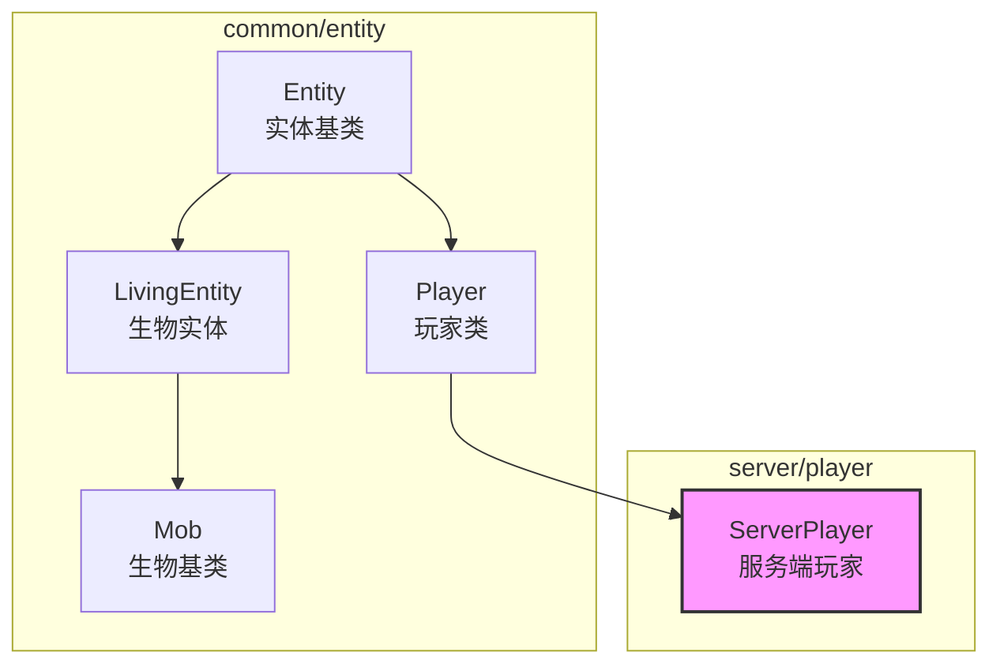
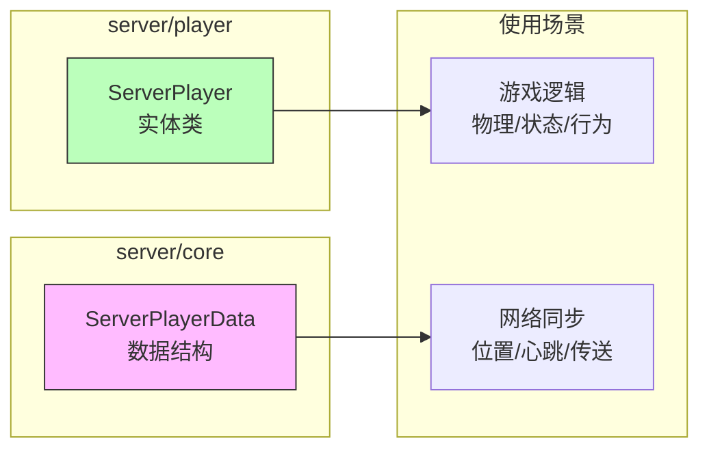

# Server Player Module

服务端玩家实体模块，定义服务端专用的玩家实体类。

## 目录结构

```
src/server/player/
├── ServerPlayer.hpp    # 服务端玩家实体头文件
└── ServerPlayer.cpp    # 服务端玩家实体实现
```

## 文件详解

### ServerPlayer.hpp

服务端玩家实体类定义，继承自 `Player` 基类。

**类定义：**
```cpp
class ServerPlayer : public Player {
public:
    ServerPlayer(EntityId id, const String& name);
    ~ServerPlayer() override = default;

    // 网络相关
    void sendChatMessage(const String& message);
    void sendSystemMessage(const String& message);

    // 世界相关
    void setWorld(ServerWorld* world);
    ServerWorld* getWorld() const;

    // 连接状态
    bool isOnline() const;
    void setOnline(bool online);

private:
    ServerWorld* m_world = nullptr;
    bool m_online = true;
};
```

**主要方法：**

| 方法 | 描述 |
|------|------|
| `sendChatMessage(message)` | 发送聊天消息给玩家 |
| `sendSystemMessage(message)` | 发送系统消息给玩家 |
| `setWorld(world)` | 设置所在世界 |
| `getWorld()` | 获取所在世界 |
| `setServer(server)` | 设置服务器引用 |
| `getServer()` | 获取服务器引用 |
| `isOnline()` | 检查玩家是否在线 |
| `setOnline(online)` | 设置在线状态 |
| `trySleep(bedPos)` | 尝试在指定位置睡眠 |
| `stopSleepInBed(resetTimer, updateFlag)` | 停止睡眠 |
| `wakeUp()` | 唤醒玩家（完全唤醒） |
| `isPlayerFullyAsleep()` | 检查玩家是否完全入睡 |
| `determineRespawnPosition()` | 确定重生位置 |
| `determineRespawnDimension()` | 确定重生维度 |
| `onPortalTriggered()` | 传送门触发回调（重写自 Entity） |
| `changeDimension(targetDim)` | 传送到另一个维度 |

---

### ServerPlayer.cpp

服务端玩家实体类的实现文件，包含以下功能：

#### 网络消息发送
- `sendChatMessage()` - 发送聊天消息给玩家
- `sendSystemMessage()` - 发送系统消息给玩家
- `syncExperience()` - 同步经验值到客户端

#### 经验系统
- `addExperience()` - 添加经验并同步
- `setExperienceLevel()` - 设置经验等级并同步
- `consumeExperience()` - 消耗经验并同步

**升级音效**: 当玩家升级时，ExperienceManager 会自动播放升级音效：
- 音效事件: `entity.player.levelup`
- 触发条件: 等级是 5 的倍数（5, 10, 15...）且距离上次播放至少 100 tick
- 音量: `(level > 30 ? 1.0 : level / 30.0) * 0.75`
- 实现: `ExperienceManager::handleLevelUp()` 通过 `Player::playSound()` 播放

#### 睡眠系统
- `trySleep()` - 尝试在床上睡眠
- `stopSleepInBed()` - 停止睡眠
- `wakeUp()` - 唤醒玩家
- `isPlayerFullyAsleep()` - 检查是否完全入睡
- `determineRespawnPosition()` - 确定重生位置
- `determineRespawnDimension()` - 确定重生维度

#### 维度传送系统
- `onPortalTriggered()` - 传送门触发回调（重写自 Entity）
- `changeDimension()` - 执行维度切换

**维度切换逻辑**（已集成传送门搜索/创建）：
1. 下骑乘/清除乘客
2. 计算目标坐标（使用 Teleporter::transformPosition）
3. **搜索目标维度的已存在传送门**（下界传送）
4. **如果未找到则创建新传送门**（使用 NetherTeleporter）
5. 记录传送门位置到 ServerDimension
6. 重置传送门状态和触发冷却
7. 调用 ServerDimensionManager 执行传送
8. 更新实体维度属性

**传送门搜索逻辑**:
- 主世界 → 下界：使用 `NetherTeleporter` 搜索半径 128 格内的传送门
- 下界 → 主世界：搜索半径 128 格
- 末地 → 主世界：固定出生点 (100, 49, 0)
- 主世界 → 末地：固定出生点 (100, 49, 0)，创建黑曜石平台

---

## 类继承关系



**继承层次说明：**

1. **Entity** - 实体基类，提供位置、速度、旋转、碰撞等基本属性
2. **Player** - 玩家类，添加：
   - 玩家尺寸常量（宽度、高度、眼睛高度）
   - 游戏模式、生命值、饥饿值
   - 经验系统
   - 能力标志（飞行、无敌等）
   - 物理移动支持（步进、跳跃）
   - 背包系统
3. **ServerPlayer** - 服务端玩家，添加：
   - 世界关联
   - 在线状态
   - 消息发送接口

---

## 与 ServerPlayerData 的区别

项目中存在两个玩家相关的类，它们有不同的职责：



| 特性 | ServerPlayer | ServerPlayerData |
|------|--------------|------------------|
| 所在目录 | `server/player/` | `server/core/` |
| 类型 | 实体类 | 数据结构 |
| 继承 | 继承自 `Player` | 纯数据结构 |
| 职责 | 游戏逻辑、物理模拟 | 网络同步、状态管理 |
| 生命周期 | 世界内实体 | 连接会话期间 |
| 内存管理 | 世界实体管理器 | PlayerManager |
| 当前状态 | **占位符** | **完整实现** |

**ServerPlayerData 的字段：**
- 玩家ID、用户名
- 网络连接（弱引用）
- 会话ID
- 位置、旋转、地面状态
- 游戏模式
- 传送确认
- 心跳统计（发送/接收时间、ping）
- 已加载区块
- 容器菜单状态

---

## 模块整体职责

服务端玩家模块负责：

1. **实体继承** - 继承 `Player` 基类的所有功能
2. **世界关联** - 维护玩家所在世界的引用
3. **在线状态** - 管理玩家的连接状态
4. **消息接口** - 提供消息发送接口（待实现）

---

## 输入和输出

### 输入

| 来源 | 数据类型 | 处理方式 |
|------|----------|----------|
| 实体系统 | `EntityId`, `String` | 构造函数初始化 |
| 服务端逻辑 | `ServerWorld*` | `setWorld()` 设置 |
| 聊天系统 | `String` | `sendChatMessage()` |
| 系统通知 | `String` | `sendSystemMessage()` |

### 输出

| 目标 | 数据类型 | 产生方式 |
|------|----------|----------|
| 客户端 | 聊天消息包 | `sendChatMessage()` |
| 客户端 | 系统消息包 | `sendSystemMessage()` |
| 状态查询 | 在线状态 | `isOnline()` |
| 状态查询 | 所在世界 | `getWorld()` |

---

## 依赖项

### 内部依赖

| 模块 | 用途 |
|------|------|
| `common/entity/Player.hpp` | 玩家基类 |
| `common/core/Types.hpp` | 基础类型（EntityId, String等）|

### 外部依赖

| 库 | 用途 |
|---|------|
| `spdlog` | 日志输出 |

---

## 使用方法

### 创建服务端玩家

```cpp
#include "server/player/ServerPlayer.hpp"

using namespace mc;

// 创建玩家实体
EntityId playerId = world.nextEntityId();
auto player = std::make_unique<ServerPlayer>(playerId, "Steve");

// 设置世界
player->setWorld(&serverWorld);

// 设置在线状态
player->setOnline(true);

// 发送消息（当前仅日志）
player->sendChatMessage("Welcome to the server!");
player->sendSystemMessage("Server will restart in 5 minutes.");
```

### 查询玩家状态

```cpp
// 检查在线状态
if (player->isOnline()) {
    // 玩家在线
}

// 获取所在世界
ServerWorld* world = player->getWorld();
if (world) {
    // 世界存在
}
```

---

## 容易踩的坑

### 1. 与 ServerPlayerData 的混淆

**问题：** 开发者可能混淆 `ServerPlayer` 和 `ServerPlayerData` 的使用场景。

**建议：**
- `ServerPlayer` 用于游戏逻辑（物理、AI、状态机）
- `ServerPlayerData` 用于网络同步（位置更新、心跳、传送）
- 当前服务端主要使用 `ServerPlayerData`，`ServerPlayer` 是预留的扩展

### 2. 消息发送实现

**已实现**：`sendChatMessage()` 和 `sendSystemMessage()` 通过网络包发送。

```cpp
void ServerPlayer::sendChatMessage(const String& message) {
    network::ChatMessagePacket chatPacket(message, static_cast<PlayerId>(id()));
    network::PacketSerializer payload;
    chatPacket.serialize(payload);
    const auto fullPacket = server::core::ConnectionManager::encapsulatePacket(
        network::PacketType::ChatBroadcast, payload.buffer());
    sendFullPacket(fullPacket);
}
```

**注意**：需要通过 `setConnection()` 设置网络连接才能发送消息。

### 3. 世界指针可能为空

**问题：** `getWorld()` 可能返回 `nullptr`。

**建议：**
```cpp
// 正确做法：检查世界是否存在
if (ServerWorld* world = player->getWorld()) {
    // 使用世界
}

// 错误做法：直接解引用
player->getWorld()->getChunk(x, z);  // 可能崩溃
```

### 4. 当前实现状态

**已实现功能**：
- 网络消息发送（ChatMessagePacket）
- 经验系统（添加、设置、消耗、同步）
- 睡眠系统（尝试睡眠、唤醒、重生点）
- 维度传送系统（下界/主世界传送门、坐标转换）

**待完善功能**：
- 实体追踪（追踪附近实体）
- 背包同步（物品变更通知）
- 统计数据（统计计数器）

**建议：**
- 参考 MC Java 1.16.5 的 `ServerPlayerEntity` 类

---

## 未来扩展计划

### 应该添加的功能

```cpp
class ServerPlayer : public Player {
public:
    // 网络连接
    void setConnection(network::ConnectionPtr connection);
    network::ConnectionPtr getConnection() const;
    bool hasConnection() const;

    // 物品拾取
    void collectItem(EntityId itemId, int count);

    // 方块交互
    bool interactBlock(const BlockPos& pos, const Vector3& hitPos);
    bool breakBlock(const BlockPos& pos);
    bool placeBlock(const BlockPos& pos, BlockId block);

    // 实体追踪
    void trackEntity(EntityId entityId);
    void untrackEntity(EntityId entityId);
    const std::unordered_set<EntityId>& trackedEntities() const;

    // 传送确认
    void teleport(double x, double y, double z, float yaw, float pitch);
    bool confirmTeleport(u32 teleportId);

    // 背包同步
    void syncInventory();
    void syncSelectedSlot(int slot);

    // 能力同步
    void syncAbilities();

    // 统计数据
    void incrementStat(const StatId& stat, int amount);

private:
    ServerWorld* m_world = nullptr;
    network::ConnectionWeakPtr m_connection;
    bool m_online = true;
    std::unordered_set<EntityId> m_trackedEntities;
    u32 m_pendingTeleportId = 0;
    bool m_waitingTeleportConfirm = false;
    // ... 更多字段
};
```

### 与 PlayerManager 的集成

```cpp
// PlayerManager 可能需要同时管理两种数据
class PlayerManager {
    // ServerPlayerData 用于网络同步
    std::unordered_map<PlayerId, ServerPlayerData> m_playerData;

    // ServerPlayer 用于游戏逻辑（未来）
    std::unordered_map<PlayerId, std::unique_ptr<ServerPlayer>> m_players;
};
```

---

## 测试用例

当前模块**没有专门的测试用例**，因为 `ServerPlayer` 类实现不完整。

相关的测试位于 `tests/server/core/PlayerManagerTest.cpp`，测试的是 `ServerPlayerData`。

**未来应该添加的测试：**

```cpp
// tests/server/player/ServerPlayerTest.cpp

TEST(ServerPlayerTest, Construction) {
    ServerPlayer player(1, "Steve");
    EXPECT_EQ(player.username(), "Steve");
    EXPECT_TRUE(player.isOnline());
    EXPECT_EQ(player.getWorld(), nullptr);
}

TEST(ServerPlayerTest, WorldManagement) {
    ServerPlayer player(1, "Steve");
    ServerWorld world;

    player.setWorld(&world);
    EXPECT_EQ(player.getWorld(), &world);
}

TEST(ServerPlayerTest, OnlineStatus) {
    ServerPlayer player(1, "Steve");

    player.setOnline(false);
    EXPECT_FALSE(player.isOnline());

    player.setOnline(true);
    EXPECT_TRUE(player.isOnline());
}

TEST(ServerPlayerTest, InheritedFromPlayer) {
    ServerPlayer player(1, "Steve");

    // 测试继承的方法
    EXPECT_FLOAT_EQ(player.health(), 20.0f);
    EXPECT_EQ(player.gameMode(), GameMode::Survival);
    player.setHealth(10.0f);
    EXPECT_FLOAT_EQ(player.health(), 10.0f);
}
```

---

## 与 MC Java 1.16.5 的对比

| MC Java | 本项目 | 说明 |
|---------|--------|------|
| `ServerPlayerEntity` | `ServerPlayer` | 对应类 |
| `ServerGamePacketListenerImpl` | `PacketHandler` | 数据包处理 |
| `ServerLevel` | `ServerWorld` | 世界类 |
| `Connection` | `ConnectionPtr` | 网络连接 |
| `GameProfile` | - | 玩家档案（未实现） |
| `ServerStatsCounter` | - | 统计计数器（未实现） |
| `PlayerAdvancements` | - | 成就系统（未实现） |
| `RecipeBook` | - | 配方书（未实现） |

---

## 总结

`ServerPlayer` 模块是一个**预留的扩展点**，当前实现仅作为占位符。实际的服务端玩家管理使用 `server/core/ServerPlayerData` 和 `server/core/PlayerManager`。

开发者在选择使用哪个类时应遵循：

1. **网络同步、心跳、传送** -> 使用 `ServerPlayerData`
2. **游戏逻辑、物理、AI** -> 使用 `ServerPlayer`（待完善）
3. **当前阶段** -> 主要使用 `ServerPlayerData`
