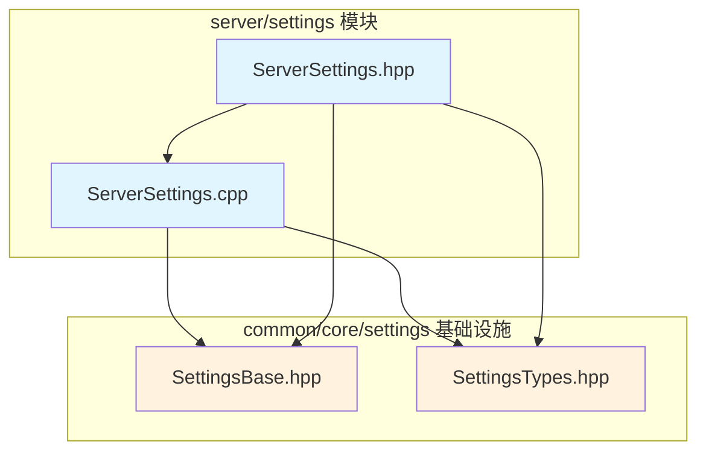

# Server Settings 模块

服务端设置模块，负责管理 Cubium 服务器的所有配置选项。

## 目录结构

```
src/server/settings/
├── ServerSettings.hpp    # 服务端设置类声明
└── ServerSettings.cpp    # 服务端设置类实现
```

## 内部模块关系



## 上下游外部依赖关系

### 上游依赖（本模块依赖的）

| 依赖 | 用途 |
|------|------|
| `common/core/settings/SettingsBase.hpp` | 设置基类，提供加载/保存框架 |
| `common/core/settings/SettingsTypes.hpp` | 设置类型定义（BooleanOption、RangeOption 等） |
| `common/core/DefaultValues.hpp` | 默认值常量 |
| `common/core/Result.hpp` | 错误处理 |
| `spdlog` | 日志输出 |
| `nlohmann/json` | JSON 序列化 |

### 下游依赖（依赖本模块的）

| 模块 | 用途 |
|------|------|
| `MinecraftServer` | 服务器启动时加载配置 |
| `StandaloneServer` | 独立服务器使用配置 |
| `IntegratedServer` | 内置服务器使用配置 |

## 设置分组

| 分组 | 设置项 |
|------|--------|
| network | serverPort, bindAddress, maxPlayers, onlineMode, motd, p2pEnabled |
| world | worldName, levelName, levelSeed, levelType, generateStructures, enableCommandBlock |
| game | defaultGameMode, difficulty, hardcore, pvpEnabled, allowFlight, playerIdleTimeout, tickRate |
| performance | viewDistance, simulationDistance, maxEntitiesPerChunk, chunkLoadRate |
| security | whiteList, blackList, maxTickTime, maxPacketSize |
| log | logLevel, logToFile, logFile, debugLogging |

## 容易踩的坑

### 1. 枚举值设置

```cpp
// 错误：无效值会被忽略
settings.difficulty.set(10);  // 无效值，设置不会生效

// 正确：使用命名常量
settings.difficulty.set(DifficultyValue::Hard);

// 或通过名称设置
settings.difficulty.setByName("hard");
```

### 2. 范围约束

超出范围的值会被自动 clamp：
- `settings.viewDistance.set(100)` → 实际值：32（最大值）
- `settings.serverPort.set(0)` → 实际值：1（最小值）

### 3. 设置文件不存在

加载不存在的文件不会失败，会使用默认值：
```cpp
auto result = settings.loadSettings("nonexistent.json");
// result.success() == true，所有设置都是默认值
```

### 4. 回调重复触发

相同值不会触发回调：
- `settings.maxPlayers.set(20)` → 默认值，回调不会触发
- `settings.maxPlayers.set(20)` → 值未改变，回调不会触发
- `settings.maxPlayers.set(50)` → 值改变，回调触发

### 5. 线程安全

SettingsBase 和设置类型不是线程安全的，在多线程环境中需要外部同步：
```cpp
std::mutex settingsMutex;
{
    std::lock_guard<std::mutex> lock(settingsMutex);
    settings.maxPlayers.set(50);
}
```

### 6. 类型转换

RangeOption 可以隐式转换为 i32，但建议显式获取：
```cpp
i32 players = settings.maxPlayers;  // OK（隐式转换）
u16 port = static_cast<u16>(settings.serverPort.get());  // 建议
```
