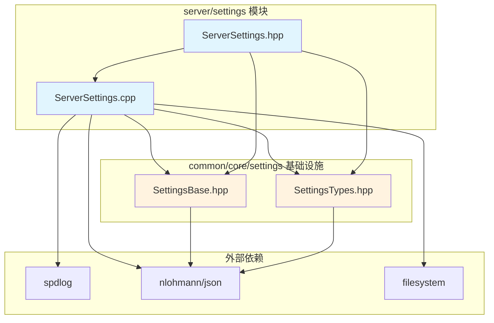
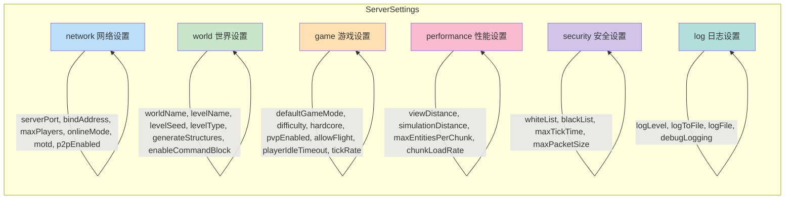
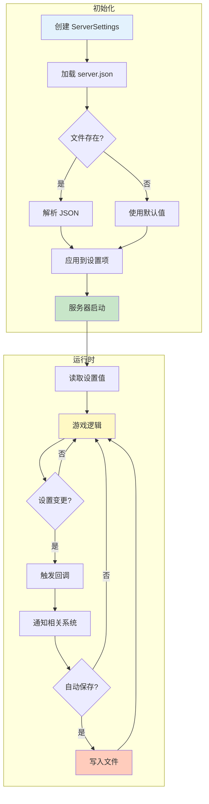
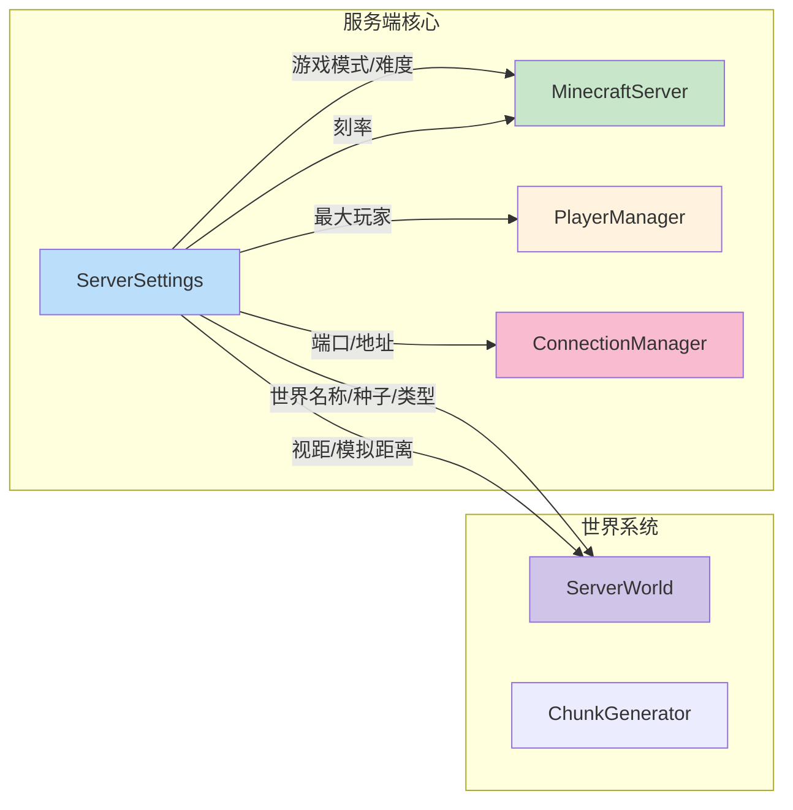

# Server Settings 模块

服务端设置模块，负责管理 Minecraft Reborn 服务器的所有配置选项。

## 目录结构

```
src/server/settings/
├── ServerSettings.hpp    # 服务端设置类声明
└── ServerSettings.cpp    # 服务端设置类实现
```

## 文件详解

### ServerSettings.hpp

服务端设置类的头文件，定义了 `ServerSettings` 类及其相关的枚举常量。

#### 职责

- 定义服务端所有配置选项的类型和默认值
- 提供设置加载/保存接口
- 定义世界类型、游戏模式、难度等枚举常量

#### 主要内容

```cpp
class ServerSettings : public SettingsBase {
public:
    // 网络设置
    RangeOption serverPort;       // 服务器端口 (1-65535, 默认 19132)
    StringOption bindAddress;     // 绑定地址 (默认 "0.0.0.0")
    RangeOption maxPlayers;       // 最大玩家数 (1-1000, 默认 20)
    BooleanOption onlineMode;     // 在线模式验证 (默认 true)
    StringOption motd;            // 服务器描述 (默认 "A Minecraft Reborn Server")
    BooleanOption p2pEnabled;     // P2P 连接 (默认 false)

    // 世界设置
    StringOption worldName;       // 世界名称 (默认 "world")
    StringOption levelName;       // 关卡名称 (默认 "Minecraft Reborn Server")
    StringOption levelSeed;       // 世界种子 (默认空，表示随机)
    EnumOption<u8> levelType;     // 世界类型 (默认/平坦/巨型生物群系/放大化)
    BooleanOption generateStructures;  // 生成结构 (默认 true)
    BooleanOption enableCommandBlock;  // 命令方块 (默认 false)

    // 游戏设置
    EnumOption<u8> defaultGameMode;  // 默认游戏模式
    EnumOption<u8> difficulty;       // 难度
    BooleanOption hardcore;          // 硬核模式 (默认 false)
    BooleanOption pvpEnabled;        // PVP (默认 true)
    BooleanOption allowFlight;       // 飞行 (默认 false)
    RangeOption playerIdleTimeout;   // 闲置超时 (0-1440 分钟, 默认 0)
    RangeOption tickRate;            // 刻率 (1-20, 默认 20)

    // 性能设置
    RangeOption viewDistance;        // 视距 (2-32 区块, 默认 10)
    RangeOption simulationDistance;  // 模拟距离 (2-32 区块, 默认 10)
    RangeOption maxEntitiesPerChunk; // 每区块最大实体 (1-1024, 默认 128)
    RangeOption chunkLoadRate;       // 区块加载速率 (1-100, 默认 16)

    // 安全设置
    BooleanOption whiteList;      // 白名单 (默认 false)
    BooleanOption blackList;      // 黑名单 (默认 true)
    RangeOption maxTickTime;      // 刻超时 (1000-60000 毫秒, 默认 60000)
    RangeOption maxPacketSize;    // 最大数据包大小 (默认 2MB)

    // 日志设置
    StringOption logLevel;        // 日志级别 (默认 "info")
    BooleanOption logToFile;      // 记录到文件 (默认 false)
    StringOption logFile;         // 日志文件名 (默认 "server.log")
    BooleanOption debugLogging;   // 调试日志 (默认 false)

    // 加载/保存方法
    Result<void> loadSettings(const std::filesystem::path& path);
    Result<void> saveSettings(const std::filesystem::path& path);
    static std::filesystem::path getDefaultPath();
};
```

#### 枚举常量

```cpp
// 世界类型
namespace LevelType {
    constexpr u8 Default = 0;      // 默认世界
    constexpr u8 Flat = 1;         // 超平坦
    constexpr u8 LargeBiomes = 2;  // 巨型生物群系
    constexpr u8 Amplified = 3;    // 放大化
}

// 游戏模式
namespace GameModeValue {
    constexpr u8 Survival = 0;     // 生存模式
    constexpr u8 Creative = 1;     // 创造模式
    constexpr u8 Adventure = 2;    // 冒险模式
    constexpr u8 Spectator = 3;    // 旁观模式
}

// 难度
namespace DifficultyValue {
    constexpr u8 Peaceful = 0;     // 和平
    constexpr u8 Easy = 1;         // 简单
    constexpr u8 Normal = 2;       // 普通
    constexpr u8 Hard = 3;         // 困难
}
```

### ServerSettings.cpp

服务端设置类的实现文件。

#### 职责

- 初始化所有设置选项的默认值和范围约束
- 注册设置选项到分组系统
- 实现 JSON 格式的加载/保存逻辑

#### 主要内容

- **构造函数**：初始化所有选项的默认值、范围约束，并注册到分组
- **loadSettings()**：从 JSON 文件加载设置，不存在时使用默认值
- **saveSettings()**：将当前设置保存到 JSON 文件
- **getDefaultPath()**：获取操作系统特定的设置文件路径

## 文件关系图



## 设置分组架构



## 模块概述

### 整体职责

| 职责 | 描述 |
|------|------|
| **配置管理** | 集中管理服务端所有配置选项 |
| **持久化** | 支持 JSON 格式的配置文件读写 |
| **类型安全** | 提供类型安全的配置访问接口 |
| **范围约束** | 自动约束数值型配置的有效范围 |
| **变更通知** | 支持配置变更时的回调通知 |
| **分组管理** | 按功能分组组织配置项 |

### 输入和输出

#### 输入

- **JSON 配置文件**：包含所有设置项的 JSON 文件
- **运行时修改**：通过 `set()` 方法修改设置值

#### 输出

- **JSON 配置文件**：将当前设置序列化为 JSON 格式
- **运行时访问**：通过 `get()` 方法获取设置值

### 依赖项

| 依赖 | 用途 |
|------|------|
| `common/core/settings/SettingsBase.hpp` | 设置基类，提供加载/保存框架 |
| `common/core/settings/SettingsTypes.hpp` | 设置类型定义（BooleanOption、RangeOption 等） |
| `common/core/Types.hpp` | 基础类型定义 |
| `common/core/Result.hpp` | 错误处理 |
| `spdlog` | 日志输出 |
| `nlohmann/json` | JSON 序列化 |
| `filesystem` | 文件路径操作 |

### 使用方法

#### 基本用法

```cpp
#include "server/settings/ServerSettings.hpp"

using namespace mc::server;

// 创建设置实例
ServerSettings settings;

// 从文件加载设置
auto result = settings.loadSettings("server.json");
if (result.failed()) {
    // 使用默认值继续
}

// 访问设置值
u16 port = settings.serverPort.get();
i32 maxPlayers = settings.maxPlayers;
String worldName = settings.worldName;

// 修改设置
settings.maxPlayers.set(50);
settings.difficulty.set(DifficultyValue::Hard);
settings.levelType.setByName("flat");

// 设置变更回调
settings.viewDistance.onChange([](i32 value) {
    spdlog::info("视距已更改为: {}", value);
    // 通知相关系统更新
});

// 保存设置
settings.saveSettings("server.json");
```

#### 使用默认路径

```cpp
ServerSettings settings;
auto path = ServerSettings::getDefaultPath();
settings.loadSettings(path);

// ... 修改设置 ...

settings.saveSettings(path);
```

#### 重置设置

```cpp
ServerSettings settings;

// 重置单个设置项
settings.viewDistance.reset();

// 重置整个分组
settings.resetGroupToDefaults("game");

// 重置所有设置
settings.resetToDefaults();
```

#### 自动保存

```cpp
ServerSettings settings;
settings.enableAutoSave("server.json");

// 任何修改都会自动触发保存
settings.maxPlayers.set(100);  // 自动保存
settings.difficulty.set(DifficultyValue::Hard);  // 自动保存
```

### 容易踩的坑

#### 1. 枚举值设置

```cpp
// 错误：无效值会被忽略
settings.difficulty.set(10);  // 无效值，设置不会生效

// 正确：使用命名常量
settings.difficulty.set(DifficultyValue::Hard);

// 或通过名称设置
settings.difficulty.setByName("hard");
```

#### 2. 范围约束

```cpp
// 超出范围的值会被自动 clamp
settings.viewDistance.set(100);  // 实际值：32（最大值）
settings.serverPort.set(0);      // 实际值：1（最小值）

// 获取范围信息
i32 min = settings.viewDistance.min();  // 2
i32 max = settings.viewDistance.max();  // 32
```

#### 3. 设置文件不存在

```cpp
// 加载不存在的文件不会失败，会使用默认值
auto result = settings.loadSettings("nonexistent.json");
// result.success() == true，所有设置都是默认值
```

#### 4. 回调重复触发

```cpp
// 相同值不会触发回调
settings.maxPlayers.set(20);  // 默认值，回调不会触发
settings.maxPlayers.set(20);  // 值未改变，回调不会触发
settings.maxPlayers.set(50);  // 值改变，回调触发
```

#### 5. 线程安全

```cpp
// ⚠️ SettingsBase 和设置类型不是线程安全的
// 在多线程环境中需要外部同步

std::mutex settingsMutex;

// 线程安全访问
{
    std::lock_guard<std::mutex> lock(settingsMutex);
    settings.maxPlayers.set(50);
}
```

#### 6. 类型转换

```cpp
// RangeOption 可以隐式转换为 i32
i32 players = settings.maxPlayers;  // OK

// 但不能直接用于需要其他类型的场合
u16 port = settings.serverPort;     // OK (隐式转换)
f32 distance = settings.viewDistance;  // 可能丢失精度

// 建议显式获取
u16 port = static_cast<u16>(settings.serverPort.get());
```

## 测试用例

测试文件位于 `tests/common/SettingsTest.cpp`，包含以下测试：

| 测试类 | 测试内容 |
|--------|----------|
| `ServerSettingsTest` | 服务端设置测试 |

### 测试用例详情

#### ServerSettingsTest.DefaultValues

验证所有默认值是否正确：

```cpp
ServerSettings settings;
EXPECT_EQ(settings.serverPort.get(), 19132);
EXPECT_EQ(settings.maxPlayers.get(), 20);
EXPECT_TRUE(settings.onlineMode.get());
EXPECT_EQ(settings.viewDistance.get(), 10);
EXPECT_EQ(settings.tickRate.get(), 20);
```

#### ServerSettingsTest.SaveAndLoadSettings

验证设置的保存和加载：

```cpp
// 保存设置
ServerSettings settings;
settings.serverPort.set(25565);
settings.maxPlayers.set(50);
settings.onlineMode.set(false);
settings.viewDistance.set(16);
settings.difficulty.set(DifficultyValue::Hard);
settings.saveSettings(path);

// 加载设置
ServerSettings loaded;
loaded.loadSettings(path);
EXPECT_EQ(loaded.serverPort.get(), 25565);
EXPECT_EQ(loaded.maxPlayers.get(), 50);
// ... 验证所有值
```

#### ServerSettingsTest.EnumOptionSerialize

验证枚举选项的序列化：

```cpp
ServerSettings settings;
settings.difficulty.set(DifficultyValue::Hard);

nlohmann::json j;
settings.difficulty.serialize(j);
EXPECT_EQ(j["difficulty"].get<String>(), "hard");
```

#### ServerSettingsTest.EnumOptionDeserialize

验证枚举选项的反序列化：

```cpp
ServerSettings settings;
nlohmann::json j = {{"difficulty", "peaceful"}};
settings.difficulty.deserialize(j);
EXPECT_EQ(settings.difficulty.get(), DifficultyValue::Peaceful);
```

## 配置文件格式

设置以 JSON 格式存储：

```json
{
    "version": 1,
    "network": {
        "serverPort": 19132,
        "bindAddress": "0.0.0.0",
        "maxPlayers": 20,
        "onlineMode": true,
        "motd": "A Minecraft Reborn Server",
        "p2pEnabled": false
    },
    "world": {
        "worldName": "world",
        "levelName": "Minecraft Reborn Server",
        "levelSeed": "",
        "levelType": "default",
        "generateStructures": true,
        "enableCommandBlock": false
    },
    "game": {
        "defaultGameMode": "survival",
        "difficulty": "normal",
        "hardcore": false,
        "pvpEnabled": true,
        "allowFlight": false,
        "playerIdleTimeout": 0,
        "tickRate": 20
    },
    "performance": {
        "viewDistance": 10,
        "simulationDistance": 10,
        "maxEntitiesPerChunk": 128,
        "chunkLoadRate": 16
    },
    "security": {
        "whiteList": false,
        "blackList": true,
        "maxTickTime": 60000,
        "maxPacketSize": 2097152
    },
    "log": {
        "logLevel": "info",
        "logToFile": false,
        "logFile": "server.log",
        "debugLogging": false
    }
}
```

## 设置流程图



## 与其他模块的交互



## 相关链接

- [SettingsBase 基类](../../common/core/settings/SettingsBase.hpp)
- [SettingsTypes 类型定义](../../common/core/settings/SettingsTypes.hpp)
- [客户端设置](../../client/settings/ClientSettings.hpp)
