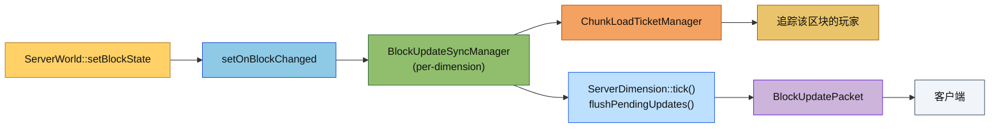

# Server Sync 模块

服务端同步模块，负责将服务端的世界数据同步给客户端。

## 目录结构

```
src/server/sync/
├── ChunkSendManager.hpp    # 区块发送管理器头文件
├── ChunkSendManager.cpp    # 区块发送管理器实现
├── EntitySyncManager.hpp   # 实体同步管理器头文件
├── EntitySyncManager.cpp   # 实体同步管理器实现
├── BlockUpdateSyncManager.hpp # 方块更新同步管理器头文件
├── BlockUpdateSyncManager.cpp # 方块更新同步管理器实现
├── LightSyncManager.hpp    # 光照同步管理器头文件
└── LightSyncManager.cpp    # 光照同步管理器实现
```

## 文件详解

### ChunkSendManager.hpp/cpp

区块发送管理器，负责将区块数据发送给客户端。

#### 职责

- 区块加载完成时自动发送给追踪该区块的玩家
- 玩家追踪变化时发送/卸载区块
- 区块卸载前发送卸载通知
- 异步区块序列化与主线程发送解耦
- 序列化时优先通过 `ServerChunkManager::getChunkShared()` 获取共享快照，避免 worker 线程回调期间区块被卸载导致的悬空访问

#### 与 ChunkLoadTicketManager 协同工作

```
玩家移动 → PlayerChunkTracker 计算新旧区块集合
         → ChunkLoadTicketManager 触发追踪变化回调
         → ChunkSendManager.onPlayerTrackingChange()
             → 区块已加载：立即发送
             → 区块未加载：等待加载完成后发送
```

#### 关键方法

| 方法 | 说明 |
|------|------|
| `sendChunkToPlayers(x, z, players, validateTracking=false)` | 发送区块给指定玩家列表，可选发送前校验追踪状态 |
| `sendChunkToTrackingPlayers(x, z)` | 发送区块给所有追踪该区块的玩家 |
| `unloadChunkFromPlayers(x, z, players)` | 发送卸载通知给指定玩家列表 |
| `unloadChunkFromTrackingPlayers(x, z)` | 发送卸载通知给所有追踪玩家 |
| `onPlayerTrackingChange(player, x, z, isTracking)` | 处理玩家追踪变化 |
| `onChunkPreUnload(x, z)` | 区块卸载前的处理 |
| `submitChunkData(x, z, data, players, validateTracking=false)` | 从 Worker 线程提交序列化数据（线程安全） |
| `processPendingSends()` | 主线程处理待发送队列 |
| `setOnChunkSend(callback)` | 设置区块发送回调 |
| `setOnChunkUnload(callback)` | 设置区块卸载回调 |

#### 线程安全设计

- 区块序列化在 Worker 线程执行
- 序列化完成后通过 `submitChunkData()` 提交到队列
- 主线程通过 `processPendingSends()` 处理队列并发送
- 当 `validateTracking=true` 时，发送前会调用 `isPlayerTracking()` 过滤过期目标，避免“先卸载后晚到加载包”导致客户端重现幽灵区块

---

### EntitySyncManager.hpp/cpp

实体同步管理器，负责实体位置的客户端同步。

#### 职责

- 追踪实体位置变化
- 发送实体生成/移动/销毁包
- 多玩家可见性管理
- 位置变化阈值检测

#### 关键方法

| 方法 | 说明 |
|------|------|
| `tick()` | 每 tick 同步实体位置 |
| `spawnEntity(entity)` | 生成新实体并通知客户端 |
| `removeEntity(entityId)` | 移除实体并通知客户端 |
| `forceFullUpdate(entityId)` | 强制发送完整更新 |
| `setOnEntitySpawn(callback)` | 设置实体生成回调 |
| `setOnEntityRemove(callback)` | 设置实体移除回调 |
| `setOnEntityMove(callback)` | 设置实体移动回调 |
| `setOnEntityStatus(callback)` | 设置实体状态回调 |
| `broadcastEntityStatus(entityId, status)` | 广播实体状态事件 |

#### 位置变化检测

```cpp
static constexpr f32 POSITION_THRESHOLD = 0.01f;  // 位置变化阈值
static constexpr f32 ROTATION_THRESHOLD = 1.0f;   // 旋转变化阈值（度）
```

只有超过阈值的变化才会触发同步，减少网络带宽。

---

### BlockUpdateSyncManager.hpp/cpp

方块更新同步管理器，负责把 `ServerWorld::setBlockState()` 产生的方块变化缓存到 pending 表，在服务器 tick 末统一发送给追踪该区块的玩家。

#### 职责

- 接收 `ServerWorld::setOnBlockChanged()` 回调
- 以方块坐标为粒度去重，同一坐标只保留最后一次状态
- 不做跨坐标合并，每个方块位置仍然单独发送
- Flush 时按区块查询 `ChunkLoadTicketManager::getTrackingPlayers()`
- 通过 `setOnBlockUpdate()` 把最终数据交给 `MinecraftServer` 发送 `BlockUpdatePacket`

#### 与 ServerWorld / ChunkLoadTicketManager 协同工作

```cpp
ServerWorld::setBlockState()
    → chunk->setBlockState()
    → setOnBlockChanged 回调
    → BlockUpdateSyncManager.queueBlockUpdate()

ServerDimension::tick()
    → chunkSendManager.processPendingSends()
    → blockUpdateSyncManager.flushPendingUpdates()
    → 按区块取 tracking 玩家
    → 发送 BlockUpdatePacket
```

#### 关键方法

| 方法 | 说明 |
|------|------|
| `queueBlockUpdate(pos, blockStateId)` | 记录方块更新，按位置覆盖旧状态 |
| `queueBlockUpdate(x, y, z, blockStateId)` | 记录方块更新的坐标重载 |
| `flushPendingUpdates()` | 主线程统一发送待处理的方块更新 |
| `setOnBlockUpdate(callback)` | 设置最终发送回调 |

---

### LightSyncManager.hpp/cpp

光照同步管理器，负责将光照数据从 WorldLightManager 同步到 ChunkSection。

#### 职责

- 区块加载后初始化光照
- 方块变化时触发光照检查
- 同步光照数据到 ChunkSection
- 初始化和同步过程中会持有区块共享快照，确保 worker 线程或回调链路中 chunk 不会在写回前失效

#### 关键方法

| 方法 | 说明 |
|------|------|
| `initializeChunkLighting(x, z)` | 区块加载后初始化光照 |
| `onBlockStateChanged(x, y, z, oldLevel, newLevel)` | 方块变化时触发光照检查 |
| `markLightChanged(type, pos)` | 标记光照变化，同步数据 |
| `syncLightDataToChunk(type, pos)` | 同步光照数据到 ChunkSection |

#### 光照同步流程

```
区块加载完成 → initializeChunkLighting()
             → 遍历所有 ChunkSection
             → 更新 SectionStatus
             → 复制光照数据到 WorldLightManager
             → 启用光源

方块变化 → onBlockStateChanged()
         → WorldLightManager.checkBlock()
         → 如果发光增加：onBlockEmissionIncrease()

光照变化 → markLightChanged()
         → 标记区块为脏
         → syncLightDataToChunk()
         → 从 WorldLightManager 获取光照数据
         → 写入 ChunkSection 的 NibbleArray
```

## 模块整体设计

### 整体职责

sync 模块是服务端数据同步的核心模块，负责将世界数据（区块、实体、光照）同步给客户端。每个 `ServerDimension` 实例各自持有一套独立的同步管理器，确保多维度之间数据隔离。主要职责包括：

1. **区块同步**：管理区块的发送、卸载，与玩家追踪系统集成
2. **实体同步**：追踪实体状态变化，广播给相关玩家
3. **光照同步**：维护光照数据的一致性，确保客户端渲染正确
4. **方块更新同步**：把世界写块事件批量化，避免手工直发和同坐标重复发送

### 输入和输出

#### 输入

| 数据源 | 数据类型 | 说明 |
|--------|----------|------|
| ServerChunkManager | ChunkData | 区块数据 |
| ChunkLoadTicketManager | 追踪玩家列表 | 区块→玩家映射 |
| EntityManager | Entity 实体 | 实体数据 |
| WorldLightManager | SWMRNibbleArray | 光照数据 |
| ServerWorld | BlockPos / BlockStateId | 方块变化事件 |
| 回调函数 | 网络发送 | 由 MinecraftServer 设置 |

#### 输出

| 输出类型 | 说明 |
|----------|------|
| 区块数据包 (ChunkDataPacket) | 发送给客户端的区块数据 |
| 卸载区块包 (UnloadChunkPacket) | 通知客户端卸载区块 |
| 实体生成包 (SpawnEntityPacket) | 实体生成通知 |
| 实体移动包 (EntityMovePacket) | 实体位置更新 |
| 实体移除包 (DestroyEntityPacket) | 实体移除通知 |
| 光照数据 | 写入 ChunkSection |
| 方块更新包 (BlockUpdatePacket) | 发送单个方块状态变化 |

### 依赖项

```
sync/
├── common/
│   ├── core/Types.hpp
│   ├── world/
│   │   ├── chunk/ChunkData.hpp
│   │   ├── chunk/ChunkPos.hpp
│   │   ├── chunk/ChunkLoadTicketManager.hpp
│   │   ├── block/BlockPos.hpp
│   │   ├── lighting/LightType.hpp
│   │   ├── lighting/manager/WorldLightManager.hpp
│   │   ├── lighting/storage/SWMRNibbleArray.hpp
│   │   └── entity/EntityManager.hpp
│   ├── network/sync/ChunkSync.hpp
│   └── util/math/Vector3.hpp
└── server/
    ├── world/ServerWorld.hpp
    └── world/ServerChunkManager.hpp

```

#### 备注

- `BlockUpdateSyncManager` 本身只负责 pending 去重和 flush，不直接拼接网络包
- 网络发送回调在 `MinecraftServer::setupWorldCallbacks()` 中设置，通过各维度的 `ServerDimension` 实例访问对应的同步管理器
- 所有 block update 的最终目标玩家都来自 `ChunkLoadTicketManager::getTrackingPlayers()`
- 同步管理器由各 `ServerDimension` 独立持有，每个维度有自己的一套同步管理器实例

### 使用方法

sync 模块的管理器由各 `ServerDimension` 创建和管理（每个维度各自持有独立的同步管理器实例）：

```cpp
// ServerDimension.hpp - 每个维度持有自己的同步管理器
class ServerDimension : public Dimension {
    // ...
    std::unique_ptr<sync::EntitySyncManager> m_entitySyncManager;
    std::unique_ptr<sync::ChunkSendManager> m_chunkSendManager;
    std::unique_ptr<sync::BlockUpdateSyncManager> m_blockUpdateSyncManager;
    std::unique_ptr<sync::LightSyncManager> m_lightSyncManager;
    // ...
};

// 初始化（在 ServerDimension::initialize() 中）
void ServerDimension::initialize() {
    m_world->initialize();

    // 创建同步管理器
    m_entitySyncManager = std::make_unique<sync::EntitySyncManager>(m_world->entityManager());
    m_chunkSendManager = std::make_unique<sync::ChunkSendManager>(
        *m_world->chunkManager(), m_world->chunkManager()->ticketManager());
    m_blockUpdateSyncManager = std::make_unique<sync::BlockUpdateSyncManager>(
        m_world->chunkManager()->ticketManager());
    m_lightSyncManager = std::make_unique<sync::LightSyncManager>(
        *m_world->lightManager(), *m_world->chunkManager());

    // 设置区块发送管理器指针
    m_world->chunkManager()->setChunkSendManager(m_chunkSendManager.get());
}

// 设置回调（在 MinecraftServer::setupWorldCallbacks() 中，遍历所有维度）
void MinecraftServer::setupWorldCallbacks() {
    m_dimensionManager->forEachDimension([this](Dimension& dim) {
        auto* serverDim = static_cast<ServerDimension*>(&dim);
        auto* world = serverDim->world();

        // 区块加载完成回调
        world->chunkManager()->setChunkLoadedCallback([serverDim](ChunkCoord x, ChunkCoord z) {
            serverDim->lightSyncManager()->initializeChunkLighting(x, z);
            serverDim->chunkSendManager()->sendChunkToTrackingPlayers(x, z);
        });

        // 方块变化回调：写入后进入 pending 队列，统一在 tick 末发送。
        world->setOnBlockChanged([serverDim](const BlockPos& pos, u32 blockStateId) {
            serverDim->blockUpdateSyncManager()->queueBlockUpdate(pos, blockStateId);
        });

        // 追踪变化回调
        world->chunkManager()->ticketManager().setTrackingChangeCallback(
            [serverDim](PlayerId player, ChunkCoord x, ChunkCoord z, bool isTracking) {
                serverDim->chunkSendManager()->onPlayerTrackingChange(player, x, z, isTracking);
            });
    });
}

// 维度 tick（在 ServerDimension::tick() 中）
void ServerDimension::tick() {
    Dimension::tick();

    if (m_world != nullptr) {
        m_world->tick();

        // 实体同步
        if (m_entitySyncManager) {
            m_entitySyncManager->tick();
        }

        // 区块发送处理
        if (m_chunkSendManager) {
            m_chunkSendManager->processPendingSends();
        }

        // 方块更新同步刷新
        if (m_blockUpdateSyncManager) {
            m_blockUpdateSyncManager->flushPendingUpdates();
        }
    }
}
```

### 容易踩的坑

#### 1. 线程安全问题

**问题描述**：ChunkSendManager 的区块序列化在 Worker 线程执行，直接调用网络发送会导致线程安全问题。

**解决方案**：使用 `submitChunkData()` 提交到队列，主线程通过 `processPendingSends()` 处理。

```cpp
// 错误：在 Worker 线程直接发送
void ChunkSendManager::sendChunkToPlayers(...) {
    // 不要在这里直接调用 m_onChunkSend！
}

// 正确：提交到队列
void ChunkSendManager::submitChunkData(ChunkCoord x, ChunkCoord z, 
                                        std::vector<u8> data, 
                                        std::vector<PlayerId> players) {
    std::lock_guard<std::mutex> lock(m_readyChunksMutex);
    m_readyChunks.emplace_back(x, z, std::move(data), std::move(players));
}
```

#### 2. 回调未设置

**问题描述**：如果 `setOnChunkSend` 等回调未设置，区块数据会被序列化但不会发送。

**解决方案**：在 `MinecraftServer::setupWorldCallbacks()` 中为每个维度设置所有回调。回调通过 `ServerDimension` 指针捕获对应维度的同步管理器。

```cpp
m_chunkSendManager->setOnChunkSend([this](PlayerId playerId, ChunkCoord x, ChunkCoord z, 
                                           const std::vector<u8>& data) {
    sendChunkDataPacket(playerId, x, z, data);
});
```

#### 3. 区块卸载顺序

**问题描述**：如果在区块卸载后才发送卸载通知，客户端可能会看到短暂的画面闪烁。

**解决方案**：在 ServerChunkManager::checkChunkUnloading() 中调用 `onChunkPreUnload()`，在区块卸载前发送通知。

```cpp
// ServerChunkManager.cpp
if (!holder->shouldLoad() && !ticketManager.hasTrackingPlayers(key)) {
    chunkSendManager->onChunkPreUnload(x, z);  // 先通知客户端
    unloadChunk(x, z);                          // 再卸载
}
```

#### 4. 光照数据同步时机

**问题描述**：如果在 WorldLightManager 计算完成前同步光照数据，客户端会看到错误的照明。

**解决方案**：确保光照引擎计算完成后再调用 `syncLightDataToChunk()`。

#### 5. 实体位置阈值过小

**问题描述**：如果位置变化阈值设置过小，会导致频繁发送位置更新，增加网络带宽。

**解决方案**：使用合理的阈值（位置 0.01，旋转 1 度），并在需要强制同步时使用 `forceFullUpdate()`。

#### 6. 方块更新不要直接发包

**问题描述**：如果在 `ServerWorld`、`IntegratedServer` 或 `StandaloneServer` 中直接发送 `BlockUpdatePacket`，会绕过 pending 去重和统一 flush，导致同一坐标重复发包。

**解决方案**：只让 `ServerWorld::setOnBlockChanged()` 产出事件，由 `BlockUpdateSyncManager` 统一缓存和发送。

### 涉及的测试用例

#### common/network/sync/ChunkSync 测试 (test_chunksync.cpp)

测试区块同步相关的数据结构和方法：

- **ChunkView 测试**：区块视距计算、区块差异计算
- **PlayerChunkTracker 测试**：玩家区块追踪、位置更新、视距变化
- **ChunkSyncManager 测试**：多玩家追踪、区块订阅、玩家断开连接清理
- **ChunkSerializer 测试**：区块序列化/反序列化、光照数据保留

#### server/LightSyncTests.cpp

测试光照同步相关功能：

- **NibbleArrayCopy**：NibbleArray 复制功能
- **ChunkSectionLightAccess**：ChunkSection 光照数组访问
- **ChunkSectionLightFill**：ChunkSection 光照填充
- **ChunkDataLightAccess**：ChunkData 光照访问
- **ChunkSectionSerializePreservesLight**：序列化保留光照数据
- **SectionPosEncodeDecode**：SectionPos 编码解码
- **WorldLightManagerCreation**：WorldLightManager 创建
- **WorldLightManagerTickWithoutWorkReturnsBudget**：无光照任务时 tick 返回预算

#### server/BlockUpdateSyncManagerTest.cpp

测试方块更新同步管理器：

- **DeduplicatesSameBlockWithinTick**：同一坐标多次写入只保留最后一次
- **SendsDistinctPositionsSeparately**：不同坐标同 tick 独立发送
- **SendsToAllTrackingPlayers**：同一区块的所有追踪玩家都会收到更新
- **SkipsPlayersWhoStopTrackingBeforeFlush**：flush 前取消追踪的玩家不会收到更新

#### server/ServerWorldBlockUpdateCallbackTest.cpp

测试服务端世界的方块变化回调：

- **SetBlockInvokesBlockChangedCallback**：`ServerWorld::setBlockState()` 会触发方块变化回调，并传递最终 stateId

#### 测试数量统计

| 测试文件 | 测试用例数 |
|----------|-----------|
| test_chunksync.cpp | 45+ |
| LightSyncTests.cpp | 15 |
| BlockUpdateSyncManagerTest.cpp | 4 |
| ServerWorldBlockUpdateCallbackTest.cpp | 1 |
| **总计** | **65+** |

## 数据流图

```
┌─────────────────────────────────────────────────────────────────────────────┐
│                              MinecraftServer                                 │
│                                                                             │
│  ┌─────────────────┐    ┌───────────────────────────────────────────┐      │
│  │ PlayerManager   │    │       ServerDimensionManager               │      │
│  │                 │    │                                           │      │
│  └────────┬────────┘    │  ┌─────────────────────────────────────┐ │      │
│           │             │  │       ServerDimension (每个维度)     │ │      │
│           │             │  │                                     │ │      │
│           │             │  │  ┌──────────────┐ ┌──────────────┐  │ │      │
│           │             │  │  │ ServerWorld  │ │ ServerChunk  │  │ │      │
│           │             │  │  │              │ │ Manager      │  │ │      │
│           │             │  │  └──────┬───────┘ └──────┬───────┘  │ │      │
│           │             │  │         │                │           │ │      │
│           │ 玩家位置更新 │  │         │ 区块加载/卸载  │ 实体生成   │ │      │
│           ▼             │  │         ▼                ▼           │ │      │
│           │             │  │  ┌─────────────────────────────────┐│ │      │
│           │             │  │  │       sync 模块（维度级）         ││ │      │
│           │             │  │  │                                 ││ │      │
│           │             │  │  │  ┌───────────────────┐          ││ │      │
│           │             │  │  │  │ ChunkSendManager  │◄── 追踪  ││ │      │
│           │             │  │  │  │                   │   玩家   ││ │      │
│           │             │  │  │  └─────────┬─────────┘          ││ │      │
│           │             │  │  │            │                     ││ │      │
│           │             │  │  │            ▼                     ││ │      │
│           │             │  │  │  ┌───────────────────┐          ││ │      │
│           │             │  │  │  │ EntitySyncManager │          ││ │      │
│           │             │  │  │  │ - tick()          │          ││ │      │
│           │             │  │  │  └─────────┬─────────┘          ││ │      │
│           │             │  │  │            │                     ││ │      │
│           │             │  │  │  ┌───────────────────┐          ││ │      │
│           │             │  │  │  │ BlockUpdateSync   │          ││ │      │
│           │             │  │  │  │ Manager           │          ││ │      │
│           │             │  │  │  └─────────┬─────────┘          ││ │      │
│           │             │  │  │            │                     ││ │      │
│           │             │  │  │  ┌───────────────────┐          ││ │      │
│           │             │  │  │  │ LightSyncManager  │          ││ │      │
│           │             │  │  │  └─────────┬─────────┘          ││ │      │
│           │             │  │  │            │                     ││ │      │
│           │             │  │  └────────────┼─────────────────────┘│ │      │
│           │             │  └───────────────┼──────────────────────┘ │      │
│           │             └──────────────────┼───────────────────────┘      │
│           ▼                                ▼                              │
│  ┌─────────────────────────────────────────────────────────────────────┐   │
│  │                         网络层                                       │   │
│  │                                                                     │   │
│  │  ChunkDataPacket, UnloadChunkPacket, SpawnEntityPacket, etc.       │   │
│  └─────────────────────────────────────────────────────────────────────┘   │
│                                                                             │
└─────────────────────────────────────────────────────────────────────────────┘
                                        │
                                        ▼
                              ┌─────────────────┐
                              │     Client      │
                              └─────────────────┘
```

**方块更新路径**：

```
ServerWorld::setBlockState() → setOnBlockChanged() → BlockUpdateSyncManager.queueBlockUpdate()
→ ServerDimension::tick() 末 flushPendingUpdates() → BlockUpdatePacket → 客户端
```

## 初始化顺序

sync 模块的初始化有严格的顺序要求（现在在 ServerDimension::initialize() 中完成）：

```
1. ServerDimension::initialize()
   └── ServerWorld::initialize()
       └── 创建 ServerChunkManager
       └── 创建 WorldLightManager
   └── 创建 EntitySyncManager（仅依赖 EntityManager）
   └── 创建 ChunkSendManager（依赖 ServerChunkManager + ChunkLoadTicketManager）
   └── 创建 BlockUpdateSyncManager（依赖 ChunkLoadTicketManager）
   └── 创建 LightSyncManager（依赖 WorldLightManager + ServerChunkManager）
   └── 设置区块发送管理器指针到 ServerChunkManager

2. MinecraftServer::setupWorldCallbacks()（遍历所有维度）
   └── 设置区块加载回调 → LightSyncManager.initializeChunkLighting()
                        → ChunkSendManager.sendChunkToTrackingPlayers()
   └── 设置方块变化回调 → BlockUpdateSyncManager.queueBlockUpdate()
   └── 设置追踪变化回调 → ChunkSendManager.onPlayerTrackingChange()
```

## 性能考虑

1. **区块序列化**：在 Worker 线程异步执行，避免阻塞主线程
2. **位置阈值检测**：只有超过阈值才发送更新，减少网络带宽
3. **追踪玩家列表**：通过 ChunkLoadTicketManager 高效查询，避免遍历所有玩家
4. **光照同步时机**：仅在光照变化时同步，避免每帧同步
5. **方块更新去重**：同一坐标只保留最后一次写入，避免递归写块和短时间重复更新造成额外带宽

## Mermaid 图


