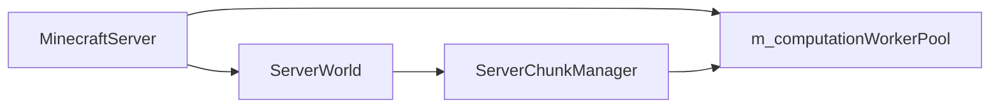
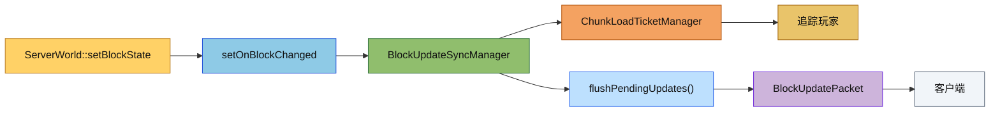

# Server World 模块

服务端世界模块，负责服务端的核心世界管理功能，包括区块管理、实体追踪、自然生成、天气系统等。

## 目录结构

```
src/server/world/
├── ServerWorld.hpp/cpp          # 服务端世界核心类
├── ServerChunkManager.hpp/cpp   # 区块管理器
├── ChunkGenerateTask.hpp/cpp    # 区块生成任务（提交到 ServerWorkerPool）
├── drop/
│   ├── BlockDropHandler.hpp/cpp # 方块掉落处理器
├── entity/
│   ├── EntityTracker.hpp/cpp    # 实体追踪器
│   └── ItemPickupManager.hpp/cpp # 物品拾取管理器
├── spawn/
│   ├── NaturalSpawner.hpp/cpp   # 自然生成器
│   └── SpawnConditions.hpp/cpp  # 生成条件检查
└── weather/
    └── WeatherManager.hpp/cpp   # 天气管理器
```

## 文件详解

### ServerWorld.hpp/cpp

**职责**：服务端世界的核心容器类，管理世界的所有基础组件。

**主要功能**：
- 实现 `IWorld`、`ICollisionWorld`、`StarLightLightingProvider` 接口
- 区块管理（加载、卸载、访问）
- 实体管理（生成、移除、查询）
- **方块实体管理**（通过区块代理，参考 MC 1.16.5 `World.getTileEntity/setTileEntity/removeTileEntity`）
- 光照计算与同步
- 方块写入回调链（`onBlockAdded/onBlockRemoved`、`updatePostPlacement`、`neighborChanged`）
- 方块变化回调（`setOnBlockChanged`，用于驱动方块更新同步）
- 声音回调（`setOnPlaySound`，用于把实体声音转发到服务器广播层）
- 粒子回调（`setOnBroadcastParticle`，用于粒子效果广播）
- 实体状态回调（`setOnBroadcastEntityStatus`，用于实体动画/音效事件广播）
- 世界事件回调（`setOnBroadcastWorldEvent`，用于世界事件广播）
- 爆炸回调（`setOnBroadcastExplosion`，用于爆炸事件广播到附近玩家）
- 物理模拟与碰撞检测
- Tick 调度（方块、流体）
- 存档保存编排（通过 `SaveManager` 驱动自动保存与全量保存）
- 天气状态管理

`ServerWorld.hpp` 需要显式 `using IWorld::...` 重新暴露 `BlockPos` 便捷重载，否则自身的 xyz 接口会把 `getBlockState`、`getFluidState`、`getBlockLight`、`getSkyLight`、`setBlockState`、`isWithinWorldBounds` 这些重载隐藏掉。所有已经拿到 `BlockPos` 的服务端调用点都应该优先走这些重载。

`ServerWorld` 现在还会把实体声音统一挂到 `setOnPlaySound(...)`。`MinecraftServer` 在创建世界时会把这个回调接到广播逻辑上，因此 `LivingEntity`、`MobEntity` 和 `Player` 的声音事件都能走同一条路径。

**关键成员**：
```cpp
class ServerWorld : public IWorld, public ICollisionWorld, public StarLightLightingProvider {
    ServerWorldConfig m_config;                              // 世界配置
    std::unique_ptr<ServerChunkManager> m_chunkManager;      // 区块管理器
    EntityManager m_entityManager;                            // 实体管理器
    EntityTracker m_entityTracker;                            // 实体追踪器
    std::unique_ptr<PhysicsEngine> m_physicsEngine;           // 物理引擎
    std::unique_ptr<CollisionCache> m_collisionCache;         // 碰撞缓存
    std::unique_ptr<TickManager> m_tickManager;               // Tick 管理器
    std::unique_ptr<WorldLightManager> m_lightManager;        // 光照管理器
    std::unique_ptr<WeatherManager> m_weatherManager;         // 天气管理器
    ItemPickupManager m_itemPickupManager;                    // 物品拾取管理器
    const loot::LootTableManager* m_lootTableManager;         // 掉落表管理器（用于爆炸掉落等）
    core::TimeManager* m_timeManager;                         // 时间管理器（外部引用）
    std::function<Difficulty()> m_difficultyCallback;         // 难度获取回调（从 MinecraftServer 获取）
};

// 调试世界检测
[[nodiscard]] bool isDebugWorld() const;  // 通过检查区块生成器类型判断是否为调试世界
```

**组件访问器**：

`ServerWorld` 提供直接访问内部组件的访问器方法，避免过度封装：

```cpp
// 区块管理器访问器
ServerChunkManager* chunkManager();
const ServerChunkManager* chunkManager() const;

// 实体管理器访问器
EntityManager& entityManager();
const EntityManager& entityManager() const;

// 实体追踪器访问器
EntityTracker& entityTracker();
const EntityTracker& entityTracker() const;

// 碰撞缓存访问器
CollisionCache* collisionCache();
const CollisionCache* collisionCache() const;

// 物理引擎访问器
PhysicsEngine* physicsEngine();
const PhysicsEngine* physicsEngine() const;

// 光照管理器访问器
WorldLightManager* lightManager();
const WorldLightManager* lightManager() const;

// 天气管理器访问器
WeatherManager* weatherManager();
const WeatherManager* weatherManager() const;

// Tick 管理器访问器
TickManager& tickManager();
const TickManager& tickManager() const;
```

**使用示例**：
```cpp
// 直接访问区块管理器进行同步区块获取
ChunkData* chunk = world->chunkManager()->getChunkSync(x, z);

// 直接访问实体管理器进行实体查询
Entity* entity = world->entityManager().getEntity(entityId);
bool exists = world->entityManager().hasEntity(entityId);
size_t count = world->entityManager().entityCount();

// 直接访问碰撞缓存
world->collisionCache()->invalidateChunkAndNeighbors(chunkX, chunkZ);
world->collisionCache()->clear();
```

**方块实体管理**：

`ServerWorld` 实现 `IWorld` 接口的方块实体管理方法，通过区块代理进行操作：

```cpp
// 获取方块实体
BlockEntity* getBlockEntity(const BlockPos& pos) override;
const BlockEntity* getBlockEntity(const BlockPos& pos) const override;

// 设置方块实体
void setBlockEntity(const BlockPos& pos, BlockEntity* entity) override;

// 移除方块实体
void removeBlockEntity(const BlockPos& pos) override;

// 获取可 tick 的方块实体列表
[[nodiscard]] std::vector<BlockEntity*> getTickableBlockEntities();
```

**方块实体自动管理**：

在 `setBlockState()` 中自动处理方块实体的创建和移除：

```cpp
// 当放置有方块实体的方块时（如箱子、熔炉）
if (newState && newState->block() && newState->block()->hasBlockEntity()) {
    auto blockEntity = newState->block()->createBlockEntity(pos);
    if (blockEntity) {
        setBlockEntity(pos, blockEntity);
    }
}

// 当方块类型改变时，移除旧方块实体
if (oldState && oldState->block() && oldState->block()->hasBlockEntity()) {
    removeBlockEntity(pos);
}
```

**方块实体 Tick 更新**：

在 `tick()` 中更新所有需要 tick 的方块实体：

```cpp
void tickBlockEntities() {
    auto tickables = getTickableBlockEntities();
    for (BlockEntity* entity : tickables) {
        if (entity && entity->needsTick()) {
            entity->tick();
        }
    }
}
```

**爆炸系统集成**：
- `ServerWorld` 持有 `LootTableManager` 引用，用于爆炸掉落生成
- `MinecraftServer` 初始化时通过 `setLootTableManager()` 设置
- `createExplosion()` 自动将 `LootTableManager` 传递给 `Explosion`
- 参考 `src/common/world/explosion/README.md` 了解爆炸掉落机制

**实体管理方法**：

`ServerWorld` 提供以下实体管理方法：

```cpp
// 生成实体（返回分配的实体ID）
EntityId spawnEntity(std::unique_ptr<Entity> entity) override;

// 移除实体（自动处理实体追踪器状态更新）
std::unique_ptr<Entity> removeEntity(EntityId id);

// 获取实体（IWorld 接口）
Entity* getEntity(EntityId id) override;
const Entity* getEntity(EntityId id) const override;
```

**重要说明**：
- `removeEntity()` 会自动从 `EntityTracker` 中移除实体追踪，调用者无需手动调用 `entityTracker().untrackEntity()`
- 如果直接使用 `entityManager().removeEntity()`，则需要手动处理追踪器状态

**不负责**：
- 玩家管理（由 `PlayerManager` 管理）
- 网络通信（由 `ConnectionManager` 管理）
- 时间管理（由 `TimeManager` 管理）

**存储相关补充**：
- `ServerWorld::saveAll()` 现在会走 `SaveManager::saveAll()`，用于 `/save-all` 和关服前全量落盘。
- `ServerWorld::tick()` 会驱动 `SaveManager::tick()`，使自动保存可以按 tick 运行。
- `/save-on` 和 `/save-off` 已接入 `SaveManager` 的启动/停止接口。

---

### ServerChunkManager.hpp/cpp

**职责**：区块加载、生成、卸载和取消的协调器，使用票据系统和生命周期状态机管理区块请求。

**主要功能**：
- 异步区块生成（Worker 线程池）
- 票据系统控制区块加载/卸载/取消
- 多来源票据统一调度（玩家、强制、传送、门、光照等）
- 请求代际保护，避免旧结果回写
- 区块状态管理（EMPTY → FULL）
- 按 `ChunkStatus::taskRange()` 为每个生成阶段构建对应的 `WorldGenRegion`，`FEATURES` / `NOISE` 会使用更大的邻域窗口，`getTopBlockY()` 遇到缺失 chunk 会直接断言
- 提供 `getChunkShared(x, z)` 共享快照接口，供 worker 线程完成回调、光照同步和区块发包等跨线程流程安全持有区块数据

**线程池归属**：
- `ServerChunkManager` 不再持有独立的 Worker 池实例
- 计算线程池由 `MinecraftServer` 统一管理，成员名为 `m_computationWorkerPool`
- `ServerWorld` 负责把该线程池注入当前世界和区块管理器

**模块关系**：
- `MinecraftServer` 创建、启动、停止计算线程池
- `ServerWorld` 保存线程池引用，并在切换区块管理器时重新绑定
- `ServerChunkManager` 仅负责提交区块生成任务，不负责线程池生命周期

**关键方法**：
```cpp
// 同步获取区块（阻塞）
ChunkData* getChunk(ChunkCoord x, ChunkCoord z);
ChunkData* getChunkSync(ChunkCoord x, ChunkCoord z);

// 异步获取区块
std::future<ChunkData*> getChunkAsync(ChunkCoord x, ChunkCoord z, const ChunkStatus* targetStatus);
void getChunkAsync(ChunkCoord x, ChunkCoord z, ChunkCallback callback, const ChunkStatus* targetStatus);

// 卸载区块
void unloadChunk(ChunkCoord x, ChunkCoord z);

// 票据管理
void updatePlayerPosition(PlayerId player, f64 x, f64 z);
void removePlayer(PlayerId player);
void forceChunk(ChunkCoord x, ChunkCoord z, bool force);
```

**区块生命周期**：
```
EMPTY → BIOMES → NOISE → SURFACE → CARVERS → FEATURES → LIGHT → HEIGHTMAPS → FULL
```

---

### ChunkGenerateTask.hpp/cpp

**职责**：区块生成任务，继承 `ITask` 接口，提交到 `ServerWorkerPool` 执行。

**主要功能**：
- 封装区块坐标、目标生成阶段、生成器函数
- 支持协作取消（通过 `atomic<bool>` 取消令牌）
- 异常安全（捕获生成器异常并返回失败状态）
- 返回生成的 `ChunkPrimer` 结果

**使用方法**：
```cpp
// 创建生成任务
auto task = std::make_unique<ChunkGenerateTask>(x, z, ChunkStatuses::FULL, generator);

// 提交到 ServerWorkerPool
pool.submit(std::move(task),
    [](bool success, ITask* task) {
        if (success) {
            auto* genTask = static_cast<ChunkGenerateTask*>(task);
            auto result = genTask->takeResult();
            // 使用生成的区块...
        }
    },
    TaskPriority::Normal);

// 带取消令牌
auto cancelToken = std::make_shared<std::atomic<bool>>(false);
pool.submit(std::move(task), callback, TaskPriority::Normal, cancelToken);
// 取消时设置
cancelToken->store(true);
```

**注意**：`ServerWorkerPool` 位于 `common/util/thread/`，是通用的任务池，不仅限于区块生成。

## 线程池迁移说明

区块生成线程池已经从 `ServerChunkManager` 迁移到 `MinecraftServer`。这样可以避免世界对象与区块管理器重复持有同类资源，并让服务器关闭流程更集中。

## 目录职责补充

### `ServerWorld.hpp/cpp`

- 新增 `setComputationWorkerPool(...)`
- 负责把服务器侧计算池绑定给当前世界与 `ServerChunkManager`

### `ServerChunkManager.hpp/cpp`

- 仅保留线程池指针引用
- `initialize()` 和异步生成逻辑直接使用外部注入的计算池

### `ChunkGenerateTask.hpp/cpp`

- 仍然是区块生成任务本体
- 现在由 `MinecraftServer::m_computationWorkerPool` 承载执行

## 模块关系



## 容易踩的坑

- 不要让 `ServerChunkManager` 再创建自己的计算池，否则会出现双池并发和关闭顺序混乱。
- 世界初始化后必须及时绑定 `m_computationWorkerPool`，否则异步区块请求会触发断言。
- 存储 IO 线程池和区块计算线程池是两套资源，不能混用。

## 测试用例

- `tests/server/test_chunk_worker_pool.cpp`
- `tests/server/test_server_chunk_manager.cpp`
- `tests/server/ServerWorldTest.cpp`

---

### drop/BlockDropHandler.hpp/cpp

**职责**：处理方块破坏时的掉落物生成，使用 LootTable 系统。

**主要功能**：
- 检查是否可采集（`canHarvestBlock`）
- 构建 LootContext（工具、位置、时运、精准采集等）
- 从方块掉落表生成掉落
- 在世界中生成掉落物实体（带随机散射速度）

**使用示例**：
```cpp
auto drops = BlockDropHandler::generateDrops(*world, pos, state, player, tool, lootTableManager);
if (!drops.empty()) {
    BlockDropHandler::spawnDrops(*world, pos, drops, player->uuid());
}
```

**关键方法**：
```cpp
// 生成掉落物列表
static std::vector<ItemStack> generateDrops(IWorld& world, const BlockPos& pos,
    const BlockState& state, const Player* player, const ItemStack* tool,
    const LootTableManager& lootTableManager);

// 在世界中生成掉落物实体
static std::vector<EntityId> spawnDrops(ServerWorld& world, const BlockPos& pos,
    const std::vector<ItemStack>& drops, const std::string& throwerUuid = "");

// 检查采集能力
static bool canHarvestBlock(const BlockState& state, const Player* player, const ItemStack* tool);
```

---

### entity/EntityTracker.hpp/cpp

**职责**：管理实体的客户端可见性，确定哪些玩家应该看到哪些实体。

**主要功能**：
- 基于距离和视距计算追踪范围
- 发送实体生成/销毁/更新包
- 位置变化检测与同步

**关键结构**：
```cpp
struct TrackedEntity {
    EntityId entityId;
    std::unordered_set<PlayerId> trackingPlayers;  // 正在追踪此实体的玩家
    Vector3 lastPosition;                           // 上次同步的位置
    f32 lastYaw, lastPitch;                         // 上次同步的旋转
    u32 updateCounter;                              // 更新计数器
    bool needsFullUpdate;                           // 是否需要完整更新
};
```

**追踪规则**：
- 怪物：追踪距离 10 区块（默认）
- 动物：追踪距离 10 区块
- 物品：追踪距离 10 区块
- 位置更新阈值：0.1 方块
- 旋转更新阈值：1 度

---

### entity/ItemPickupManager.hpp/cpp

**职责**：每 tick 检测玩家附近的 ItemEntity，处理拾取逻辑。

**主要功能**：
- 检测玩家附近的掉落物
- 处理拾取延迟和所有者限制
- 合并相同物品
- 发送背包更新和实体销毁包

**关键常量**：
```cpp
static constexpr f32 PICKUP_RANGE = 1.0f;           // 基础拾取范围
static constexpr f32 PICKUP_RANGE_SNEAKING = 0.5f;  // 潜行时拾取范围
static constexpr f32 MERGE_RANGE = 0.5f;            // 物品合并范围
static constexpr i32 DEFAULT_THROWER_PICKUP_DELAY = 10;  // 拾取延迟（ticks）
```

**拾取流程**：
1. 计算玩家拾取范围
2. 查找附近 AABB 内的物品实体
3. 检查拾取条件（延迟、所有者）
4. 调用 `ItemEntity::onPlayerPickup` 处理拾取
5. 发送 `ContainerContentPacket` 和 `CollectItemPacket`

---

### spawn/NaturalSpawner.hpp/cpp

**职责**：在世界中进行自然实体生成，每 tick 检查玩家周围区域。

**主要功能**：
- 基于生物群系配置选择生成条目
- 光照条件检查
- 密度限制管理
- SpawnCosts 系统

**生成规则**：
| 类型 | 距离限制 | 光照条件 | 数量上限 |
|------|---------|---------|---------|
| 怪物 | 24-128 格 | 黑暗（<=7） | 70 |
| 动物 | 24-128 格 | 光照充足（>7） | 10 |
| 环境生物 | 任意 | 黑暗 | 15 |
| 水生生物 | 水中 | - | 5 |

**关键类**：
```cpp
class MobDensityTracker;     // 实体密度追踪
class EntityDensityManager;  // 密度管理器
class NaturalSpawner;        // 自然生成器
```

---

### spawn/SpawnConditions.hpp/cpp

**职责**：提供生成位置的条件检查工具函数。

**主要功能**：
- 光照等级检查
- 位置碰撞检测
- 地面高度获取
- 水/岩浆检测

**关键函数**：
```cpp
namespace SpawnConditions {
    bool checkLightLevel(i32 skyLight, i32 blockLight, bool isMonster);
    bool canSpawnAtPosition(IWorld& world, i32 x, i32 y, i32 z, f32 entityWidth, f32 entityHeight);
    bool hasCollisionSpace(IWorld& world, i32 x, i32 y, i32 z, f32 width, f32 height);
    i32 getGroundHeight(IWorld& world, i32 x, i32 z);
    bool isInWater(IWorld& world, i32 x, i32 y, i32 z);
    bool isInLava(IWorld& world, i32 x, i32 y, i32 z);
}
```

---

### weather/WeatherManager.hpp/cpp

**职责**：管理世界天气状态，包括天气周期 tick 更新、天气命令处理、闪电生成。

**主要功能**：
- 天气状态管理（晴、雨、雷暴）
- 天气周期自动更新
- 强度渐变动画
- 闪电生成概率计算
- 天气命令处理

**使用示例**：
```cpp
WeatherManager weather;
weather.initialize(seed);
weather.setWorld(&world);

// 主循环
weather.tick();

// 检查天气变化
if (weather.hasWeatherChanged()) {
    broadcastWeatherUpdate();
}

// 天气命令
weather.setClear(6000);   // /weather clear 300
weather.setRain(12000);   // /weather rain 600
weather.setThunder(18000); // /weather thunder 900
```

**关键状态**：
```cpp
bool isRaining() const;      // 是否正在降雨
bool isThundering() const;   // 是否正在雷暴
f32 rainStrength(f32 partialTick = 0.0f) const;   // 降雨强度
f32 thunderStrength(f32 partialTick = 0.0f) const; // 雷暴强度
WeatherType weatherType() const;  // 当前天气类型
```

---

## 文件关系图

```
                    ┌─────────────────┐
                    │   ServerWorld   │
                    │  (核心容器)      │
                    └────────┬────────┘
                             │
         ┌───────────────────┼───────────────────┐
         │                   │                   │
         ▼                   ▼                   ▼
┌─────────────────┐ ┌─────────────────┐ ┌─────────────────┐
│ServerChunkManager│ │  EntityTracker  │ │ WeatherManager  │
│  (区块管理)      │ │  (实体追踪)      │ │  (天气管理)     │
└────────┬────────┘ └────────┬────────┘ └─────────────────┘
         │                   │
         ▼                   ▼
┌─────────────────┐ ┌─────────────────┐
│ChunkGenerateTask│ │ItemPickupManager│
│  (生成任务)      │ │  (物品拾取)      │
└────────┬────────┘ └─────────────────┘
         │                   │
         ▼                   ▼
┌─────────────────┐ ┌─────────────────┐
│ ServerWorkerPool│ │BlockDropHandler │
│  (通用线程池)   │ │  (方块掉落)      │
└─────────────────┘ └─────────────────┘

┌─────────────────┐
│ NaturalSpawner  │◄───── ServerWorld.tick()
│  (自然生成)      │
└────────┬────────┘
         │
         ▼
┌─────────────────┐
│ SpawnConditions │
│  (生成条件)      │
└─────────────────┘
```

---

## 模块职责总结

### 整体职责

Server World 模块是服务端的核心世界管理系统，负责：

1. **区块管理**：异步加载、生成、卸载区块
2. **实体管理**：实体生命周期、追踪、同步
3. **物理模拟**：碰撞检测、物理引擎
4. **光照计算**：天空光和方块光传播
5. **天气系统**：天气周期、闪电生成
6. **自然生成**：怪物、动物、环境生物生成
7. **物品拾取**：掉落物合并、拾取处理

### 输入和输出

**输入**：
- 玩家位置更新（触发区块加载）
- 方块破坏事件（触发掉落生成）
- 方块写入事件（触发方块更新同步）
- 游戏时间推进（tick 调用）
- 天气命令（/weather）
- 实体生成请求

**输出**：
- 区块数据（发送给客户端）
- 方块更新事件（同步给 `BlockUpdateSyncManager`）
- 实体生成/移动/销毁包
- 天气更新包
- 掉落物实体
- 物品拾取事件

### 依赖项

**内部依赖**：
- `common/world/` - 世界基础设施（IWorld, ChunkData, EntityManager）
- `common/entity/` - 实体系统（Entity, ItemEntity, Player）
- `common/physics/` - 物理引擎
- `common/network/` - 网络包

**外部依赖**：
- `server/core/` - 核心管理器（PlayerManager, ConnectionManager）
- `server/sync/` - 同步管理器（BlockUpdateSyncManager, ChunkSendManager, EntitySyncManager）

### 使用方法

```cpp
// 创建服务端世界
ServerWorldConfig config;
config.viewDistance = 10;
config.dimension = 0;
config.seed = 12345;

ServerWorld world(config);
world.initialize();

// 设置区块管理器
auto chunkManager = std::make_unique<ServerChunkManager>(world, std::move(generator));
// Worker 池由 MinecraftServer 注入，生命周期由服务器统一管理
chunkManager->setWorkerPool(&computationWorkerPool);
chunkManager->initialize();
world.setChunkManager(std::move(chunkManager));
// 注意：setChunkManager 会自动将 ServerWorldConfig.viewDistance 同步到新管理器

// 如果上层已经创建 BlockUpdateSyncManager，可以把方块变化事件转交给同步层
world.setOnBlockChanged([&blockUpdateSyncManager](const BlockPos& pos, u32 blockStateId) {
    blockUpdateSyncManager.queueBlockUpdate(pos, blockStateId);
});

// 主循环
while (running) {
    world.tick();  // 更新世界状态
}

// 关闭
world.shutdown();
```

---

## 容易踩的坑

### 1. 区块异步生成竞态条件

**问题**：多个线程同时请求同一区块时可能导致重复生成。

**解决方案**：`ServerChunkManager` 使用 `SingleChunkLifecycleManager` 管理每个区块的状态，通过 `m_syncGenerationMutex` 保护同步生成。

```cpp
// 正确：使用异步 API
auto future = chunkManager.getChunkAsync(x, z, &ChunkStatuses::FULL);

// 避免：在主线程频繁使用同步 API
ChunkData* chunk = chunkManager.getChunkSync(x, z);  // 会阻塞！
```

### 2. 实体追踪器内存泄漏

**问题**：实体移除后未从追踪器中取消追踪，导致内存泄漏。

**解决方案**：`ServerWorld::removeEntity()` 会自动处理实体追踪器状态更新，无需手动调用。

```cpp
// 正确：直接调用 removeEntity，它会自动取消追踪
world.removeEntity(entityId);

// 注意：如果直接使用 entityManager().removeEntity()，则需要手动取消追踪
world.entityTracker().untrackEntity(entityId);
world.entityManager().removeEntity(entityId);
```

### 3. 物品拾取延迟未处理

**问题**：刚丢弃的物品被玩家立即拾取。

**解决方案**：`ItemPickupManager` 自动处理拾取延迟，`ItemEntity` 默认有 10 tick 延迟。

```cpp
// ItemEntity 构造时自动设置延迟
ItemEntity entity(id, stack, x, y, z);
// 默认 pickupDelay = 10 ticks
```

### 4. 天气状态不同步

**问题**：客户端天气状态与服务端不一致。

**解决方案**：检查 `hasWeatherChanged()` 标志并广播天气更新包。

```cpp
weather.tick();
if (weather.hasWeatherChanged()) {
    broadcastWeatherUpdate(weather.state());
}
```

### 5. 自然生成密度限制

**问题**：怪物生成过多导致性能问题。

**解决方案**：`NaturalSpawner` 有内置密度限制：
- 怪物上限：70
- 动物上限：10
- 环境生物上限：15

### 6. 光照初始化时机

**问题**：区块加载后光照未初始化导致客户端显示错误。

**解决方案**：设置 `ChunkLoadedCallback` 在区块加载完成后初始化光照。

```cpp
chunkManager.setChunkLoadedCallback([this, &lightSyncManager](ChunkCoord x, ChunkCoord z) {
    lightSyncManager.initializeChunkLighting(x, z);
});
```

### 7. 未初始化世界直接调用 setBlockState

**问题**：在未调用 `initialize()` 的 `ServerWorld` 上调用 `setBlockState()`，会在光照更新阶段触发 `MC_ASSERT_RELEASE(false)`。

**解决方案**：所有方块写入测试和同步测试都必须先初始化世界，确保 `m_lightManager` 和 `m_tickManager` 已经创建。

### 8. 替换 ChunkManager 时视距回退

**问题**：替换 `ServerChunkManager` 后，如果未同步 `viewDistance`，新管理器会使用默认值 10，导致首帧加载区块数量异常。

**解决方案**：`ServerWorld::setChunkManager()` 现在会自动同步 `ServerWorldConfig.viewDistance`，无需在调用方重复设置。

### 9. 调试世界判断方式变更

**问题**：旧代码通过 `ServerWorldConfig.isDebugWorld` 字段判断是否为调试世界，但该字段默认值为 `true`，导致所有世界被错误地视为调试世界。

**解决方案**：现在通过 `IChunkGenerator::isDebugGenerator()` 虚方法检测区块生成器类型来判断：
- `ServerWorld::isDebugWorld()` 检查 `m_chunkManager->generator()->isDebugGenerator()`
- `DebugChunkGenerator::isDebugGenerator()` 返回 `true`
- 其他生成器（`NoiseChunkGenerator` 等）使用基类默认实现返回 `false`

```cpp
// 不要使用配置字段（已移除）
// if (config.isDebugWorld) { ... }

// 正确：使用 isDebugWorld() 方法
if (world->isDebugWorld()) {
    // 禁止方块放置、跳过天气更新等
}
```

---

## 测试用例

| 测试文件 | 测试内容 |
||---------|---------|
| `tests/server/world/EntityTrackerTest.cpp` | 实体追踪、玩家追踪、并发安全、距离计算 |
| `tests/server/world/ItemPickupManagerTest.cpp` | 拾取常量、物品合并、拾取延迟、物品过期、背包添加 |
| `tests/server/world/spawn/NaturalSpawnerTest.cpp` | 密度追踪、密度管理、生成限制、生成常量、MobSpawnInfo 工厂 |
| `tests/server/BlockUpdateSyncManagerTest.cpp` | 方块更新 pending 去重、追踪玩家过滤、tick flush |
| `tests/server/ServerWorldBlockUpdateCallbackTest.cpp` | ServerWorld 方块变化回调触发 |
| `tests/server/ServerWorldTest.cpp` | 服务端世界声音回调转发、isDebugWorld 检测 |
| `tests/server/test_chunk_worker_pool.cpp` | ChunkGenerateTask 与 ServerWorkerPool 集成测试 |
| `tests/common/util/thread/ServerWorkerPoolTest.cpp` | ServerWorkerPool 单元测试 |
| `tests/common/world/gen/DebugChunkGeneratorTest.cpp` | DebugChunkGenerator 功能、isDebugGenerator 虚方法 |
| `tests/common/world/chunk/ChunkDataBlockEntityTest.cpp` | ChunkData 方块实体存储测试（getBlockEntity、setBlockEntity、removeBlockEntity、边界情况、脏标记） |
| `tests/server/world/ServerWorldBlockEntityTest.cpp` | ServerWorld 方块实体代理测试（getBlockEntity、setBlockEntity、removeBlockEntity、世界引用设置、区块边界情况） |

### 测试覆盖范围

**EntityTracker**：
- 实体追踪/取消追踪
- 多实体追踪
- 重复追踪处理
- 玩家移除清理
- 距离计算
- 线程安全

**ItemPickupManager**：
- 拾取范围常量
- 物品实体拾取延迟
- 物品合并
- 物品过期
- 所有者系统
- 背包添加逻辑

**NaturalSpawner**：
- 密度追踪器初始状态
- 密度添加和衰减
- 密度管理器生成限制
- 生成常量验证
- SpawnCosts 验证
- MobSpawnInfo 工厂方法

**BlockUpdateSyncManager**：
- 同坐标多次写入只保留最后一次
- 不同坐标同 tick 独立发送
- 同一区块的所有追踪玩家都会收到更新
- flush 前取消追踪的玩家不会收到更新

**ServerWorldBlockUpdateCallback**：
- `ServerWorld::setBlockState()` 会触发方块变化回调
- 回调会收到最终的 stateId（空气为 0）

---

## 性能注意事项

1. **区块生成**：使用 Worker 线程池异步生成，避免阻塞主线程
2. **碰撞缓存**：`CollisionCache` 缓存区块碰撞数据，避免重复计算
3. **实体追踪**：使用空间哈希优化追踪范围计算
4. **物品合并**：使用网格哈希优化合并检测，O(n) 而非 O(n²)
5. **方块变化同步**：`setOnBlockChanged()` 只记录 pending，不在写块路径里直接发包，避免重复序列化和跨线程发送

---

## 相关文档

- [区块追踪系统](common/world/chunk/README.md)
- [光照系统](common/world/lighting/README.md)
- [实体系统](common/entity/README.md)
- [天气系统](common/world/weather/README.md)

## Mermaid 图


