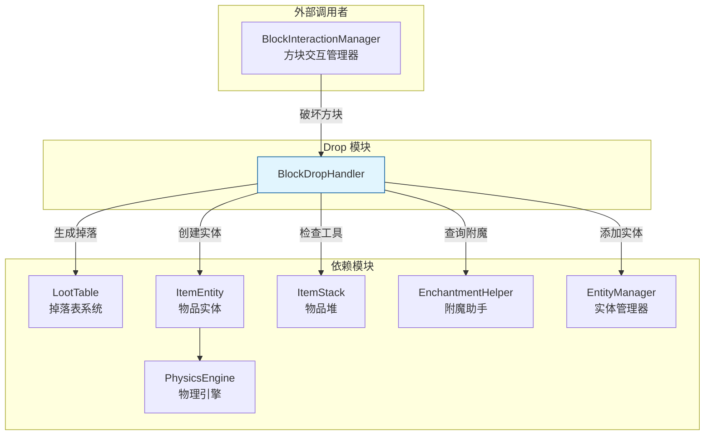
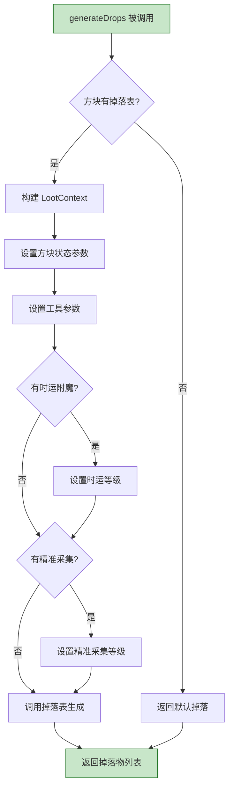
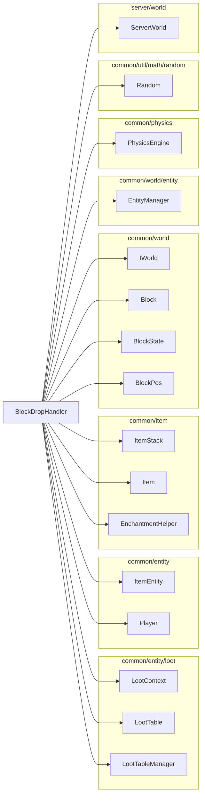
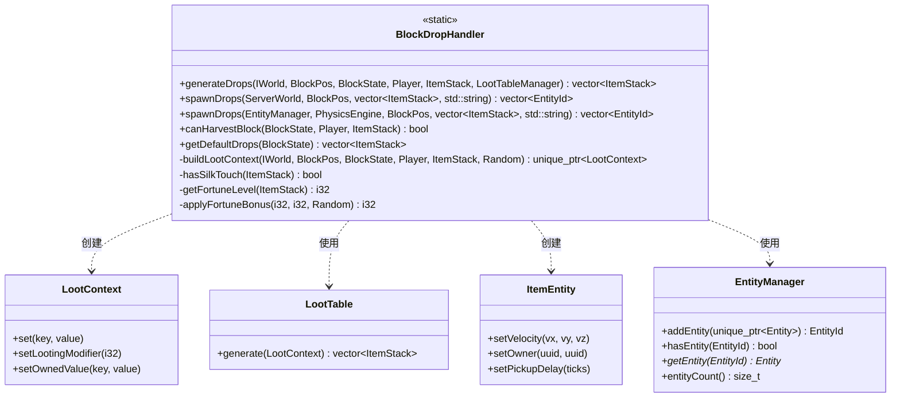
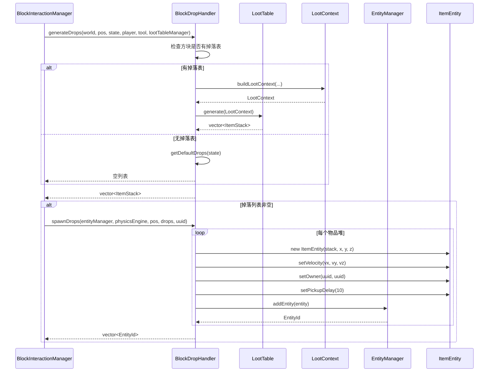

# Drop 模块

方块掉落物生成系统，负责处理方块被破坏时的掉落物生成逻辑。

## 目录结构

```
src/server/world/drop/
├── BlockDropHandler.hpp    # 方块掉落处理器头文件
└── BlockDropHandler.cpp    # 方块掉落处理器实现
```

## 模块概述



## 文件详解

### BlockDropHandler.hpp

方块掉落处理器头文件，定义了 `BlockDropHandler` 类的公共接口。

**公共方法：**

| 方法 | 说明 |
|------|------|
| `generateDrops()` | 生成方块破坏后的掉落物列表 |
| `spawnDrops(ServerWorld&, ...)` | 在 ServerWorld 中生成掉落物实体 |
| `spawnDrops(EntityManager&, ...)` | 在 EntityManager 中生成掉落物实体（内置服务端用） |
| `canHarvestBlock()` | 检查玩家是否能采集方块 |
| `getDefaultDrops()` | 获取方块的默认掉落（通常为空） |

**私有方法：**

| 方法 | 说明 |
|------|------|
| `buildLootContext()` | 构建 LootContext 用于掉落表生成 |
| `hasSilkTouch()` | 检查工具是否有精准采集附魔 |
| `getFortuneLevel()` | 获取工具的时运附魔等级 |
| `applyFortuneBonus()` | 应用时运加成到掉落数量 |

### BlockDropHandler.cpp

方块掉落处理器的实现文件。

**核心逻辑流程：**



**spawnDrops 实现细节：**

```mermaid
flowchart TD
    A[spawnDrops 被调用] --> B{掉落列表为空?}
    B -->|是| C[返回空列表]
    B -->|否| D[计算方块中心位置]

    D --> E[创建随机数生成器]
    E --> F[遍历掉落物列表]

    F --> G{物品堆为空?}
    G -->|是| F
    G -->|否| H[创建 ItemEntity]

    H --> I[设置随机散射速度<br/>vx,vy,vz ∈ [-0.05, 0.25]]
    I --> J[设置投掷者UUID<br/>防止立即拾取]
    J --> K[设置拾取延迟<br/>10 ticks = 0.5秒]
    K --> L[添加到世界]

    L --> M{还有更多物品?}
    M -->|是| F
    M -->|否| N[返回实体ID列表]

    style A fill:#bbdefb,stroke:#1565c0
    style N fill:#bbdefb,stroke:#1565c0
```

## 整体职责

BlockDropHandler 负责：

1. **掉落物生成** - 根据方块类型、工具、附魔等条件生成掉落物列表
2. **实体创建** - 在世界中创建 ItemEntity 并设置初始状态
3. **采集判断** - 判断玩家是否能采集特定方块
4. **附魔处理** - 处理时运、精准采集等附魔效果

## 输入和输出

### 输入

| 参数 | 类型 | 说明 |
|------|------|------|
| `world` | `IWorld&` | 世界引用，用于获取种子等信息 |
| `pos` | `BlockPos` | 被破坏方块的位置 |
| `state` | `BlockState` | 被破坏方块的方块状态 |
| `player` | `const Player*` | 破坏者（可为 null） |
| `tool` | `const ItemStack*` | 使用的工具（可为 null） |
| `lootTableManager` | `LootTableManager&` | 掉落表管理器 |

### 输出

| 输出 | 类型 | 说明 |
|------|------|------|
| 掉落物列表 | `std::vector<ItemStack>` | 生成的物品堆列表 |
| 实体ID列表 | `std::vector<EntityId>` | 创建的 ItemEntity ID 列表 |

## 依赖项

### 上游依赖



### 下游使用者

| 模块 | 文件 | 用途 |
|------|------|------|
| BlockInteractionManager | `server/interaction/BlockInteractionManager.cpp` | 处理方块破坏时生成掉落 |

## 使用方法

### 基本用法

```cpp
#include "server/world/drop/BlockDropHandler.hpp"

// 1. 生成掉落物列表
auto drops = BlockDropHandler::generateDrops(
    world,              // 世界引用
    pos,                // 方块位置
    state,              // 方块状态
    player,             // 破坏者（可为 nullptr）
    &tool,              // 工具（可为 nullptr）
    lootTableManager    // 掉落表管理器
);

// 2. 在世界中生成掉落物实体
if (!drops.empty()) {
    auto entityIds = BlockDropHandler::spawnDrops(
        serverWorld,    // ServerWorld 引用
        pos,            // 方块位置
        drops,          // 掉落物列表
        player->uuid()  // 投掷者UUID（防止立即拾取）
    );
}
```

### 使用 EntityManager 重载

```cpp
// 直接使用 EntityManager（适用于内置服务端）
auto entityIds = BlockDropHandler::spawnDrops(
    entityManager,      // EntityManager 引用
    physicsEngine,      // 物理引擎（可为 nullptr）
    pos,                // 方块位置
    drops,              // 掉落物列表
    playerUuid          // 投掷者UUID
);
```

### 检查是否可采集

```cpp
// 检查玩家是否能采集方块
if (BlockDropHandler::canHarvestBlock(state, player, &tool)) {
    // 玩家可以采集，生成掉落
    auto drops = BlockDropHandler::generateDrops(...);
}
```

## 容易踩的坑

### 1. 掉落表未注册

**问题**：如果方块的掉落表未在 `LootTableManager` 中注册，`generateDrops()` 会返回空列表。

**解决方案**：确保所有方块的掉落表都已正确注册。

```cpp
// 错误示例：方块未注册掉落表
const LootTable* lootTable = block.getLootTable(lootTableManager);
// lootTable == nullptr

// 正确做法：注册掉落表
lootTableManager.registerTable("minecraft:blocks/stone", stoneLootTable);
```

### 2. 工具检查顺序

**问题**：`canHarvestBlock()` 的检查顺序很重要。创造模式应该优先于工具检查。

**正确顺序**：
1. 方块硬度检查（基岩等不可破坏）
2. 创造模式检查
3. 方块是否需要工具检查
4. 工具有效性检查

```cpp
// BlockDropHandler::canHarvestBlock 的正确实现
if (state.hardness() < 0.0f) return false;  // 不可破坏
if (player && player->gameMode() == GameMode::Creative) return true;  // 创造模式
if (!state.requiresTool()) return true;  // 不需要工具
if (!tool || tool->isEmpty()) return false;  // 需要工具但没有
return tool->canHarvestBlock(state);  // 工具有效性
```

### 3. 随机种子一致性

**问题**：`generateDrops()` 使用基于世界种子和方块位置的随机种子。如果种子不一致，可能导致掉落物不同步。

**解决方案**：确保客户端和服务端使用相同的种子计算方式。

```cpp
// 种子计算方式
math::Random random(static_cast<u64>(world.seed() ^ static_cast<u64>(pos.x ^ pos.z)));
```

### 4. ItemEntity 拾取延迟

**问题**：新生成的 ItemEntity 默认有 10 tick 的拾取延迟。如果不设置投掷者 UUID，玩家可能立即拾取刚破坏的物品。

**解决方案**：始终设置 `throwerUuid` 参数。

```cpp
// 正确做法
BlockDropHandler::spawnDrops(world, pos, drops, player->uuid());
```

### 5. EntityManager vs ServerWorld 重载选择

**问题**：有两个 `spawnDrops()` 重载，选择错误可能导致编译错误或运行时问题。

**选择指南**：
- 使用 `ServerWorld&` 重载：独立服务端
- 使用 `EntityManager&` 重载：内置服务端（避免依赖 ServerWorld）

```cpp
// 独立服务端
BlockDropHandler::spawnDrops(serverWorld, pos, drops, uuid);

// 内置服务端
BlockDropHandler::spawnDrops(entityManager, physicsEngine, pos, drops, uuid);
```

### 6. 物理引擎传递

**问题**：使用 `EntityManager` 重载时，如果不传递 `PhysicsEngine`，ItemEntity 可能不会有物理效果。

**解决方案**：始终传递有效的 `PhysicsEngine` 指针。

```cpp
// 正确做法
BlockDropHandler::spawnDrops(entityManager, &physicsEngine, pos, drops, uuid);
```

## 涉及的测试用例

### tests/server/BlockDropHandlerTest.cpp

```cpp
TEST(BlockDropHandlerTest, SpawnDropsToEntityManagerCreatesItemEntities) {
    // 测试目的：验证 spawnDrops 能正确创建 ItemEntity

    // 1. 初始化注册表
    VanillaBlocks::initialize();
    Items::initialize();

    // 2. 创建 EntityManager 和测试数据
    EntityManager entityManager;
    const BlockPos pos(12, 80, -4);
    const std::vector<ItemStack> drops{ItemStack(*Items::APPLE, 2)};

    // 3. 调用 spawnDrops
    const auto spawned = BlockDropHandler::spawnDrops(
        entityManager,
        nullptr,  // 无物理引擎
        pos,
        drops,
        ""
    );

    // 4. 验证结果
    ASSERT_EQ(spawned.size(), 1u);           // 创建了1个实体
    EXPECT_TRUE(entityManager.hasEntity(spawned[0]));
    EXPECT_EQ(entityManager.entityCount(), 1u);

    const Entity* entity = entityManager.getEntity(spawned[0]);
    ASSERT_NE(entity, nullptr);
    EXPECT_EQ(entity->typeId(), entity::EntityTypeIdNumber::ITEM);  // 是物品实体
}
```

**测试覆盖**：
- ✅ EntityManager 重载的 spawnDrops
- ✅ ItemEntity 创建
- ✅ 实体类型验证

**待补充测试**：
- ⬜ generateDrops 基本功能
- ⬜ canHarvestBlock 各种情况
- ⬜ 时运附魔效果
- ⬜ 精准采集附魔效果
- ⬜ ServerWorld 重载的 spawnDrops
- ⬜ 随机速度生成

## 架构图



## 数据流


