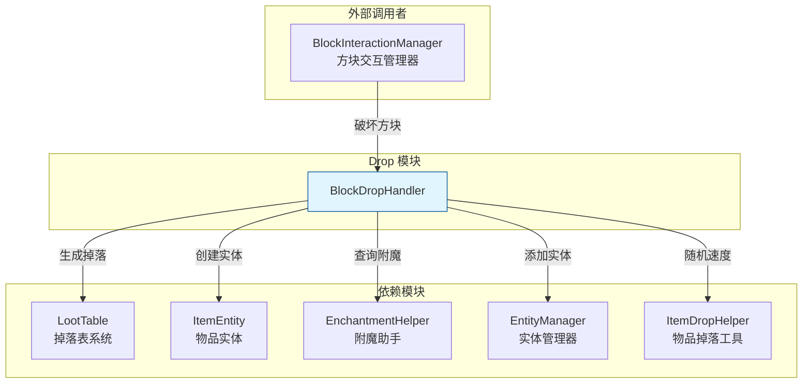

# Drop 模块

方块掉落物生成系统，负责处理方块被破坏时的掉落物生成逻辑。

## 目录结构

```
src/server/world/drop/
├── BlockDropHandler.hpp    # 方块掉落处理器头文件
└── BlockDropHandler.cpp    # 方块掉落处理器实现
```

## 内部模块关系



## 上下游外部依赖关系

### 上游依赖

| 模块 | 路径 | 说明 |
|------|------|------|
| LootContext | `common/item/loot/context/` | 掉落上下文构建 |
| LootTable | `common/item/loot/` | 掉落表生成 |
| LootTableManager | `common/item/loot/` | 掉落表管理 |
| ItemEntity | `common/entity/entities/item/` | 物品实体 |
| ExperienceOrbEntity | `common/entity/entities/orb/` | 经验球实体 |
| ItemStack | `common/item/core/` | 物品堆 |
| EnchantmentHelper | `common/item/enchantment/` | 附魔查询 |
| ItemDropHelper | `common/entity/utils/` | 物品掉落工具类 |
| EntityManager | `common/world/entity/` | 实体管理 |
| ServerWorld | `server/world/` | 服务端世界 |
| VanillaBlocks | `common/world/block/registry/` | 原版方块注册 |

### 下游使用者

| 模块 | 文件 | 用途 |
|------|------|------|
| BlockInteractionManager | `server/interaction/BlockInteractionManager.cpp` | 处理方块破坏时生成掉落 |

## 容易踩的坑

### 1. 掉落表未注册

如果方块的掉落表未在 `LootTableManager` 中注册，`generateDrops()` 会返回空列表并打印警告日志。确保所有方块的掉落表都已正确注册。

### 2. canHarvestBlock 检查顺序

检查顺序很重要，必须遵循：方块硬度检查 → 创造模式检查 → 方块是否需要工具检查 → 工具有效性检查。

### 3. 随机种子一致性

`generateDrops()` 使用基于世界种子和方块位置的随机种子。如果客户端和服务端种子计算方式不一致，可能导致掉落物不同步。

### 4. ItemEntity 拾取延迟

新生成的 ItemEntity 默认有 10 tick 的拾取延迟。如果不设置 `throwerUuid`，玩家可能立即拾取刚破坏的物品。始终设置 `throwerUuid` 参数。

### 5. spawnDrops 重载选择

有两个 `spawnDrops()` 重载：
- `ServerWorld&` 重载：独立服务端
- `EntityManager&` 重载：内置服务端（避免依赖 ServerWorld）

### 6. 物理引擎传递

使用 `EntityManager` 重载时，如果不传递 `PhysicsEngine`，ItemEntity 不会有物理效果。始终传递有效的 `PhysicsEngine` 指针。

### 7. 经验掉落与精准采集

精准采集挖掘矿石时不会掉落经验。`handleBlockBreakExperience()` 会自动处理此逻辑，但直接调用 `spawnOreExperience()` 时需自行判断。

### 8. ItemDropHelper 复用

`spawnDrops(ServerWorld&)` 内部使用 `ItemDropHelper::spawnItemEntities()` 统一生成物品实体，而 `spawnDrops(EntityManager&)` 版本直接创建 ItemEntity。两者的随机速度计算方式一致（`ItemDropHelper::getBlockDropVelocity()`），但建议优先使用 ServerWorld 版本以保持一致性。
