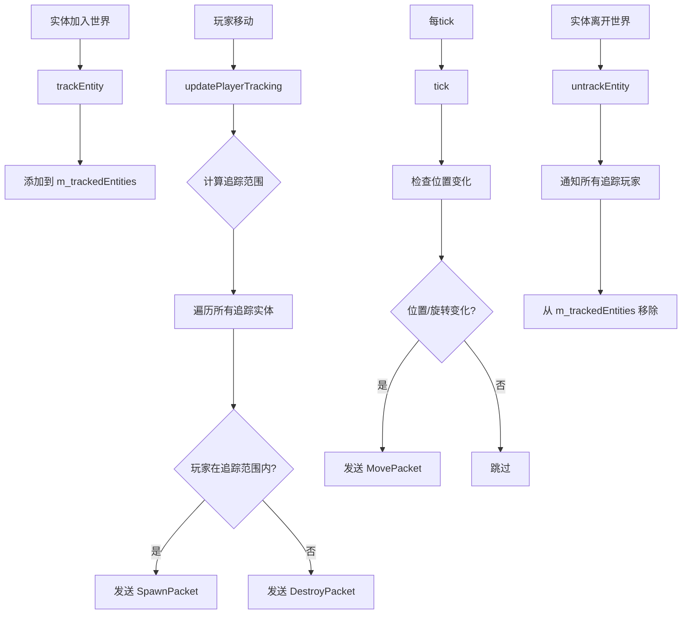
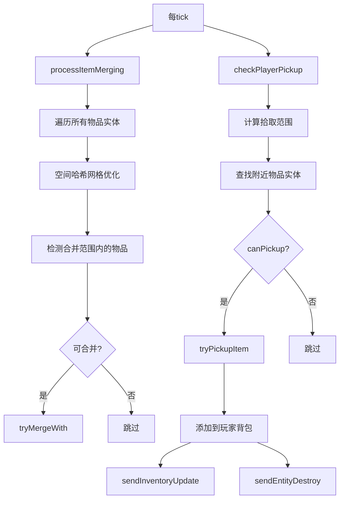

# Server World Entity 模块

本模块负责服务端实体的网络同步和物品拾取管理，是服务端世界系统的重要组成部分。

## 目录结构

```
src/server/world/entity/
├── EntityChunkTracker.hpp  # 实体所属区块跟踪器
├── EntityChunkTracker.cpp  # 实体所属区块跟踪器实现
├── EntityTracker.hpp       # 实体追踪器头文件
├── EntityTracker.cpp       # 实体追踪器实现
├── ItemPickupManager.hpp   # 物品拾取管理器头文件
└── ItemPickupManager.cpp   # 物品拾取管理器实现
```

---

## 文件详解

### EntityTracker.hpp / EntityTracker.cpp

**职责**: 管理实体的客户端可见性，确保玩家只看到其视野范围内的实体，并同步实体的位置、旋转、元数据等状态。

#### 核心类

##### `TrackedEntity` 结构体

```cpp
struct TrackedEntity {
    EntityId entityId;                        // 实体ID
    std::unordered_set<PlayerId> trackingPlayers;  // 正在追踪此实体的玩家
    Vector3 lastPosition;                     // 上次同步的位置
    f32 lastYaw = 0.0f;                       // 上次同步的偏航角
    f32 lastPitch = 0.0f;                     // 上次同步的俯仰角
    u32 updateCounter = 0;                    // 更新计数器
    bool needsFullUpdate = true;              // 是否需要完整更新
};
```

存储单个实体的追踪状态，包括哪些玩家正在追踪它以及上次同步的位置/旋转信息。

##### `EntityTracker` 类

| 方法 | 说明 |
|------|------|
| `trackEntity(Entity* entity)` | 开始追踪一个实体 |
| `untrackEntity(EntityId entityId)` | 停止追踪一个实体 |
| `isTracking(EntityId entityId)` | 检查实体是否正在被追踪 |
| `trackedEntityCount()` | 获取被追踪的实体数量 |
| `updatePlayerTracking(IServer&, PlayerId, const Vector3&)` | 更新玩家的追踪状态 |
| `removePlayer(PlayerId)` | 移除玩家的所有追踪 |
| `getPlayerTrackedEntities(PlayerId)` | 获取玩家正在追踪的实体列表 |
| `tick(IServer&)` | 每tick更新，发送位置变化包和脏元数据包 |
| `setTrackingDistance(i32 chunks)` | 设置实体追踪距离（区块数） |

#### 追踪流程



#### 网络包发送

| 包类型 | 使用场景 |
|--------|----------|
| `SpawnMobPacket` | 生成生物实体（LivingEntity） |
| `SpawnEntityPacket` | 生成非生物实体（如 ItemEntity） |
| `EntityMetadataPacket` | 发送实体脏元数据更新 |
| `EntityDestroyPacket` | 销毁实体 |
| `EntityTeleportPacket` | 实体传送/位置更新 |

---

### ItemPickupManager.hpp / ItemPickupManager.cpp

**职责**: 处理玩家拾取掉落物的逻辑，包括拾取检测、物品合并、背包更新等。

#### 核心类

##### `ItemPickupManager` 类

| 方法 | 说明 |
|------|------|
| `tick(IServer&)` | 每tick执行拾取检测和物品合并 |
| `checkPlayerPickup(IServer&, Entity&)` | 检查单个玩家的拾取 |
| `tryPickupItem(IServer&, Entity&, ItemEntity&)` | 尝试拾取物品 |
| `processItemMerging(IServer&)` | 处理物品实体合并 |

#### 常量配置

```cpp
static constexpr f32 PICKUP_RANGE = 1.0f;              // 基础拾取范围（方块）
static constexpr f32 PICKUP_RANGE_EXTENDED = 1.5f;    // 扩展拾取范围
static constexpr f32 PICKUP_RANGE_SNEAKING = 0.5f;    // 潜行时拾取范围
static constexpr f32 MERGE_RANGE = 0.5f;              // 物品合并检测范围
static constexpr i32 DEFAULT_THROWER_PICKUP_DELAY = 10;  // 拾取延迟（ticks）
static constexpr i32 MERGE_DELAY = 20;                // 物品合并延迟（ticks）
```

#### 拾取流程



#### 物品合并优化

使用空间哈希网格优化合并检测，避免 O(n²) 复杂度：

```cpp
// 单元格大小为合并范围的2倍
constexpr f32 CELL_SIZE = MERGE_RANGE * 2.0f;
std::unordered_map<i64, std::vector<ItemEntity*>> grid;

// 将物品分配到网格单元格
for (ItemEntity* item : itemEntities) {
    i32 cellX = static_cast<i32>(std::floor(pos.x / CELL_SIZE));
    i32 cellZ = static_cast<i32>(std::floor(pos.z / CELL_SIZE));
    i64 key = (static_cast<i64>(cellX) << 32) | (static_cast<i64>(cellZ) & 0xFFFFFFFF);
    grid[key].push_back(item);
}
```

---

## 模块关系图

```mermaid
graph TB
    subgraph "server/world/entity"
        ET[EntityTracker]
        IPM[ItemPickupManager]
    end
    
    subgraph "server/application"
        IS[IServer]
        MS[MinecraftServer]
    end
    
    subgraph "server/core"
        PM[PlayerManager]
        CM[ConnectionManager]
        SPD[ServerPlayerData]
    end
    
    subgraph "common/entity"
        E[Entity]
        LE[LivingEntity]
        ME[MobEntity]
        IE[ItemEntity]
        P[Player]
    end
    
    subgraph "common/network/packet"
        SEP[SpawnEntityPacket]
        SMP[SpawnMobPacket]
        EDP[EntityDestroyPacket]
        ETP[EntityTeleportPacket]
        CIP[CollectItemPacket]
        CCP[ContainerContentPacket]
    end
    
    subgraph "common/world/entity"
        EM[EntityManager]
    end
    
    ET --> IS
    ET --> PM
    ET --> CM
    ET --> EM
    ET --> E
    ET --> LE
    ET --> ME
    ET --> IE
    ET --> SEP
    ET --> SMP
    ET --> EDP
    ET --> ETP
    
    IPM --> IS
    IPM --> PM
    IPM --> CM
    IPM --> EM
    IPM --> IE
    IPM --> P
    IPM --> CIP
    IPM --> CCP
    
    MS --> ET
    MS --> IPM
```



---

## 整体职责

本模块作为服务端世界系统的一部分，负责：

1. **实体网络同步** (`EntityTracker`)
   - 管理实体的客户端可见性
   - 基于距离和视距计算追踪范围
   - 发送实体生成/销毁/更新包
   - 位置变化检测和同步

2. **物品拾取管理** (`ItemPickupManager`)
   - 检测玩家附近的掉落物
   - 处理拾取延迟和所有者限制
   - 物品合并（空间哈希优化）
   - 背包更新和实体销毁通知

---

## 输入和输出

### 输入

| 来源 | 数据 |
|------|------|
| `EntityManager` | 实体列表、实体状态 |
| `PlayerManager` | 玩家列表、玩家数据 |
| `IServer` | 服务器接口、世界引用 |
| `Player` | 玩家位置、背包状态 |
| `ItemEntity` | 物品实体状态、拾取延迟 |

### 输出

| 目标 | 数据 |
|------|------|
| 客户端 | 实体生成/销毁/移动包 |
| 客户端 | 背包更新包 |
| 客户端 | 物品拾取动画包 |
| `ItemEntity` | 合并状态、移除标记 |

---

## 依赖项

### 内部依赖

```cpp
// 服务端核心
#include "server/application/IServer.hpp"
#include "server/core/PlayerManager.hpp"
#include "server/core/ConnectionManager.hpp"
#include "server/core/ServerPlayerData.hpp"
#include "server/world/ServerWorld.hpp"

// 实体系统
#include "common/entity/core/Entity.hpp"
#include "common/entity/core/LivingEntity.hpp"
#include "common/entity/core/MobEntity.hpp"
#include "common/entity/entities/item/ItemEntity.hpp"
#include "common/entity/entities/player/Player.hpp"
#include "common/entity/inventory/PlayerInventory.hpp"

// 网络包
#include "common/network/packet/EntityPackets.hpp"
#include "common/network/packet/InventoryPackets.hpp"
#include "common/network/packet/PacketSerializer.hpp"

// 世界
#include "common/world/entity/EntityManager.hpp"
```

### 外部依赖

- `spdlog` - 日志输出
- `std::mutex` - 线程安全

---

## 使用方法

### 在 MinecraftServer 中初始化

```cpp
// MinecraftServer.hpp
class MinecraftServer : public IServer {
private:
    EntityTracker m_entityTracker;
    ItemPickupManager m_itemPickupManager;
    // ...
};

// MinecraftServer.cpp
void MinecraftServer::tick() {
    // 更新实体追踪
    m_entityTracker.tick(*this);
    
    // 处理物品拾取
    m_itemPickupManager.tick(*this);
}

void MinecraftServer::onPlayerMove(PlayerId playerId, const Vector3& newPos) {
    // 更新玩家追踪范围
    m_entityTracker.updatePlayerTracking(*this, playerId, newPos);
}

void MinecraftServer::onEntitySpawn(Entity* entity) {
    // 开始追踪新实体
    m_entityTracker.trackEntity(entity);
}

void MinecraftServer::onEntityRemove(EntityId entityId) {
    // 停止追踪实体
    m_entityTracker.untrackEntity(entityId);
}
```

### 配置追踪距离

```cpp
// 设置追踪距离为 12 区块
m_entityTracker.setTrackingDistance(12);
```

---

## 容易踩的坑

### 1. 线程安全问题

`EntityTracker` 使用 `std::mutex` 保护内部状态，但在持有锁时不应调用外部回调：

```cpp
// 错误：可能导致死锁
void EntityTracker::tick(IServer& server) {
    std::lock_guard<std::mutex> lock(m_mutex);
    // ... 在锁内调用 server.connectionManager().broadcast() 可能死锁
}

// 正确：先收集需要发送的数据，释放锁后再发送
void EntityTracker::tick(IServer& server) {
    std::vector<PacketData> packets;
    {
        std::lock_guard<std::mutex> lock(m_mutex);
        // 收集数据
    }
    // 释放锁后发送
    for (const auto& packet : packets) {
        server.send(packet);
    }
}
```

### 2. 实体 ID 类型转换

协议使用 `u32` 作为实体 ID，但内部使用 `EntityId`：

```cpp
// EntityId 转 u32（协议限制）
packet.setEntityId(static_cast<u32>(entity->id()));
```

### 3. 物品拾取延迟

刚丢弃的物品有 10 tick 的拾取延迟，防止玩家立即拾取自己丢弃的物品：

```cpp
// ItemEntity 默认延迟为 10 ticks
static constexpr i32 DEFAULT_THROWER_PICKUP_DELAY = 10;
```

### 4. 实体类型判断

`sendSpawnPacket` 根据实体类型选择不同的包：

```cpp
// LivingEntity 使用 SpawnMobPacket（包含 headYaw）
auto* livingEntity = dynamic_cast<LivingEntity*>(entity);
if (livingEntity != nullptr) {
    // SpawnMobPacket
} else {
    // SpawnEntityPacket
}
```

### 5. UUID 处理

实体的 UUID 在实体构造时随机生成（MC 1.16.5 行为），网络同步时使用 `util::uuidFromString()` 转换：

```cpp
// 使用实体的真实 UUID（MC 1.16.5 行为：UUID 在实体构造时随机生成）
packet.setUuid(util::uuidFromString(entity->uuid()));
```

**注意**：
- Entity 内部以 `std::string` 存储 UUID（32字符十六进制）
- 网络包需要 `std::array<u8, 16>` 格式
- 使用 `util::uuidFromString()` 进行转换

### 6. 物品合并顺序

在物品合并时，需要避免重复处理：

```cpp
// 通过指针比较确定处理顺序
if (item2 <= item1) {
    continue;  // 避免重复处理
}
```

---

## 测试用例

### EntityTrackerTest.cpp

| 测试名称 | 说明 |
|----------|------|
| `TrackEntity` | 测试追踪单个实体 |
| `TrackMultipleEntities` | 测试追踪多个实体 |
| `TrackSameEntityTwice` | 测试重复追踪同一实体 |
| `UntrackEntity` | 测试停止追踪实体 |
| `UntrackNonExistentEntity` | 测试停止追踪不存在的实体 |
| `IsTrackingReturnsFalseForUnknownEntity` | 测试未知实体返回 false |
| `TrackedEntityCount` | 测试追踪实体计数 |
| `SetTrackingDistance` | 测试设置追踪距离 |
| `RemovePlayerClearsTracking` | 测试移除玩家清除追踪 |
| `GetPlayerTrackedEntitiesEmpty` | 测试新玩家无追踪实体 |
| `TrackingDistanceCalculation` | 测试追踪距离计算 |
| `ConcurrentTrackUntrack` | 测试并发追踪/取消追踪 |
| `ConcurrentTrackAndCount` | 测试并发追踪和计数 |
| `TrackedEntityTest.DefaultValues` | 测试 TrackedEntity 默认值 |
| `TrackedEntityTest.TrackingPlayersSet` | 测试追踪玩家集合 |
| `TrackLivingEntity` | 测试追踪 LivingEntity |
| `TrackMobEntity` | 测试追踪 MobEntity |
| `TrackEntityWithPosition` | 测试带位置的实体追踪 |

### ItemPickupManagerTest.cpp

| 测试名称 | 说明 |
|----------|------|
| `ConstantsAreCorrect` | 测试常量值正确性 |
| `DefaultConstructor` | 测试默认构造函数 |
| `CalculatePickupRange_Normal` | 测试拾取范围计算 |
| `ItemEntity_CanBePickedUp` | 测试物品可拾取状态 |
| `ItemEntity_PickupDelay` | 测试拾取延迟 |
| `ItemEntity_Age` | 测试物品年龄 |
| `ItemEntity_CanMergeWith` | 测试物品可合并检测 |
| `ItemEntity_TryMergeWith` | 测试物品合并操作 |
| `ItemEntity_TryMergeWith_FullStack` | 测试满堆叠不能合并 |
| `ItemEntity_Expiration` | 测试物品过期 |
| `ItemEntity_InfiniteLifetime` | 测试无限存活时间 |
| `ItemEntity_Owner` | 测试所有者设置 |
| `ItemEntity_SetItemStack` | 测试物品堆替换 |
| `AddItem_EmptyInventory` | 测试空背包添加物品 |
| `AddItem_ExistingStack` | 测试添加到已有堆叠 |
| `AddItem_FullInventory` | 测试满背包添加失败 |
| `AddItem_DifferentItems` | 测试添加不同物品 |

---

## 参考

- MC 1.16.5 `EntityTracker` - 实体追踪系统
- MC 1.16.5 `EntityItem.onCollideWithPlayer` - 物品拾取逻辑
### EntityChunkTracker.hpp / EntityChunkTracker.cpp

**职责**: 跟踪实体当前所属区块，为区块卸载保存和跨区块移动修正提供稳定映射。

#### 核心类

##### `EntityChunkTracker` 类

| 方法 | 说明 |
|------|------|
| `onEntityAdded()` | 实体加入世界时登记当前区块 |
| `onEntityMoved()` | 实体跨区块移动时迁移登记 |
| `onEntityRemoved()` | 实体离开世界时注销登记 |
| `getEntitiesInChunk()` | 查询区块当前登记的实体ID |
| `getEntityChunk()` | 查询单个实体当前登记区块 |

#### 持久化流程位置

- `ServerWorld::spawnEntity()` 负责初次登记
- `ServerWorld::tick()` 每帧根据实体当前位置校正所属区块
- `ServerWorld::onChunkUnloading()` 依赖该映射收集并移除区块内实体

---
