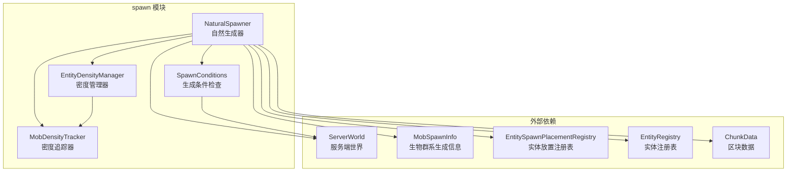
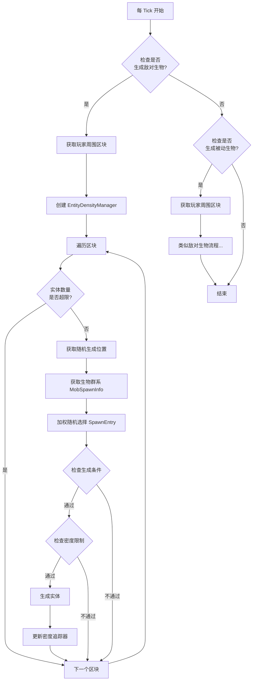

# Spawn 模块 - 实体自然生成系统

## 目录结构

```
spawn/
├── NaturalSpawner.hpp      # 自然生成器头文件
├── NaturalSpawner.cpp      # 自然生成器实现
├── DespawnManager.hpp      # 生物消失管理器头文件
├── DespawnManager.cpp      # 生物消失管理器实现
├── SpawnConditions.hpp     # 生成条件检查工具
└── SpawnConditions.cpp     # 生成条件检查实现
```

## 模块概述

Spawn 模块负责服务端的实体自然生成机制，实现了类似 Minecraft Java Edition 1.16.5 的自然生成系统。该模块在每 tick 检查玩家周围区域，根据生物群系配置、光照条件和实体密度限制来生成实体。

## 文件详细介绍

### NaturalSpawner.hpp / NaturalSpawner.cpp

**职责**: 核心自然生成器，负责管理实体生成循环和密度控制。

**主要类**:

#### 1. MobDensityTracker（实体密度追踪器）

追踪区域内的实体密度，用于 SpawnCosts 系统。

```cpp
class MobDensityTracker {
public:
    void addCharge(const Vector3& pos, f64 charge);      // 添加实体密度
    [[nodiscard]] f64 getTotalCharge(const Vector3& pos) const;  // 获取指定位置的总密度
    void clear();                                         // 清除所有密度数据
    [[nodiscard]] size_t size() const;                   // 获取密度条目数量
};
```

**密度衰减算法**:
- 使用欧几里得距离计算衰减
- 有效范围：64 格（4096 平方距离）
- 衰减公式：`falloff = 1.0 - (distance / 64.0)`
- 同位置按完整成本计入，超过 64 格后不再贡献密度

#### 2. EntityDensityManager（实体密度管理器）

管理各类实体的数量和密度限制。

```cpp
class EntityDensityManager {
public:
    EntityDensityManager(i32 viewDistance,
                         std::unordered_map<entity::EntityClassification, i32> entityCounts,
                         MobDensityTracker& densityTracker);

    [[nodiscard]] bool canSpawn(entity::EntityClassification classification) const;
    [[nodiscard]] bool canSpawnWithDensity(const std::string& entityTypeId,
                                            const Vector3& pos,
                                            const SpawnCosts& spawnCosts) const;
    void onSpawn(const std::string& entityTypeId, const Vector3& pos, const SpawnCosts& spawnCosts);
    [[nodiscard]] i32 getCount(entity::EntityClassification classification) const;
};
```

**实体数量限制**（来自 NaturalSpawner 常量）:

| 分类 | 最大实例数 |
|------|-----------|
| Monster（怪物） | 70 |
| Creature（动物） | 10 |
| Ambient（环境生物） | 15 |
| WaterCreature（水生生物） | 5 |
| WaterAmbient（水生环境生物） | 20 |

`EntityDensityManager` 会在构造时持有一份分类数量快照，不再借用外部临时 map，因此它可以安全地跨出计数函数的作用域使用。

#### 3. NaturalSpawner（自然生成器）

主生成器类，每 tick 执行实体生成逻辑。

```cpp
class NaturalSpawner {
public:
    // 区块生成时调用，用于放置被动动物
    void spawnInChunk(ServerWorld& world, i32 chunkX, i32 chunkZ,
                      const MobSpawnInfo& spawnInfo, Random& random);

    // 每tick调用，进行自然生成
    void tick(ServerWorld& world, bool hostile, bool passive);

    // 配置方法
    void setSpawnDistance(i32 chunks);
    void setSpawnRange(i32 range);
    void setMaxEntities(i32 max);

    // 常量
    static constexpr f64 MIN_SPAWN_DISTANCE_SQ = 24.0 * 24.0;   // 最小生成距离
    static constexpr f64 MAX_SPAWN_DISTANCE_SQ = 128.0 * 128.0; // 最大生成距离
};
```

**生成规则**:

| 分类 | 光照条件 | 距离要求 | 特殊条件 |
|------|---------|---------|---------|
| 怪物 | 光照 ≤ 7 | 24-128 格 | 黑暗环境 |
| 动物 | 光照 > 7 | 24-128 格 | 每 400 tick 尝试一次 |
| 环境生物 | 光照 ≤ 7 | 24-128 格 | 随机概率 |
| 水生生物 | 在水中 | 24-128 格 | 需要水域 |

### DespawnManager.hpp / DespawnManager.cpp

**职责**: 管理生物的自然消失机制，防止实体无限累积。

**主要类**:

```cpp
class DespawnManager {
public:
    DespawnManager() = default;
    
    // 每 tick 调用，检查实体的消失条件
    void tick(ServerWorld& world);
    
    // 配置
    void setEnabled(bool enabled);
    [[nodiscard]] bool isEnabled() const;
    
    // 常量
    static constexpr f64 INSTANT_DESPAWN_DISTANCE_SQ = 128.0 * 128.0;  // 立即消失距离
    static constexpr f64 RANDOM_DESPAWN_DISTANCE_SQ = 32.0 * 32.0;     // 随机消失距离
    static constexpr i32 MIN_IDLE_TIME = 600;                           // 最小空闲时间
    static constexpr i32 DESPAWN_CHANCE_DENOMINATOR = 800;              // 消失概率分母
};
```

**消失规则**（参考 MC 1.16.5）:

| 条件 | 消失行为 |
|------|---------|
| 距离玩家 > 128 格（立即消失距离） | 立即消失 |
| 距离玩家 > 32 格（随机消失距离）且空闲 > 600 tick | 1/800 概率消失 |
| 和平难度下的怪物 | 立即消失 |
| 命名牌命名（isNoDespawnRequired = true） | 永不消失 |
| 正在骑乘其他实体（isRiding = true） | 永不消失 |
| AnimalEntity（canDespawn 返回 false） | 永不消失 |

**使用示例**:

```cpp
#include "server/world/spawn/DespawnManager.hpp"

// 在服务器 tick 循环中调用
mc::world::spawn::DespawnManager despawnManager;

void onTick() {
    // 在刷怪后执行消失检查
    if (m_naturalSpawner) {
        m_naturalSpawner->tick(*m_world, true, true);
    }
    if (m_despawnManager) {
        m_despawnManager->tick(*m_world);
    }
}
```

### SpawnConditions.hpp / SpawnConditions.cpp

**职责**: 提供生成位置的条件检查工具函数。

**命名空间函数**:

```cpp
namespace SpawnConditions {
    // 检查光照等级是否满足生成条件
    bool checkLightLevel(i32 skyLight, i32 blockLight, bool isMonster);

    // 检查位置是否可以生成实体
    bool canSpawnAtPosition(IWorld& world, i32 x, i32 y, i32 z,
                            f32 entityWidth, f32 entityHeight);

    // 检查位置是否有足够的碰撞空间
    bool hasCollisionSpace(IWorld& world, i32 x, i32 y, i32 z,
                           f32 width, f32 height);

    // 检查方块是否阻止生成
    bool blockPreventsSpawn(bool isLiquid, bool isAir);

    // 获取地面高度
    i32 getGroundHeight(IWorld& world, i32 x, i32 z);

    // 检查位置是否在水中
    bool isInWater(IWorld& world, i32 x, i32 y, i32 z);

    // 检查位置是否在岩浆中
    bool isInLava(IWorld& world, i32 x, i32 y, i32 z);
}
```

**光照检查逻辑**:

```cpp
bool SpawnConditions::checkLightLevel(i32 skyLight, i32 blockLight, bool isMonster) {
    i32 effectiveLight = std::max(skyLight, blockLight);
    
    if (isMonster) {
        return effectiveLight <= 7;   // 怪物需要黑暗
    } else {
        return effectiveLight > 7;    // 动物需要光照
    }
}
```

## 模块关系图



## 生成流程



## 整体职责

### 核心功能

1. **自然生成（Natural Spawning）**: 每tick在玩家周围区域生成实体
2. **区块生成放置（Chunk Generation Spawning）**: 区块首次生成时放置被动动物
3. **密度控制（Density Control）**: 通过 SpawnCosts 系统限制高密度区域的实体数量
4. **数量限制（Cap Limits）**: 按实体分类限制最大实例数

### 生成条件检查

- **光照条件**: 怪物需要黑暗（光照≤7），动物需要光照（光照>7）
- **距离限制**: 距离玩家 24-128 格
- **碰撞空间**: 实体需要有足够的站立空间
- **放置类型**: 地面、水中、岩浆中等特定环境要求

## 输入和输出

### 输入

| 数据 | 来源 | 说明 |
|------|------|------|
| ServerWorld | 外部传入 | 服务端世界实例，用于获取区块、方块状态、光照等 |
| MobSpawnInfo | Biome | 生物群系配置的生成信息，包含可生成的实体类型列表 |
| 玩家位置 | ServerWorld | 用于确定生成区域和距离检查 |
| 实体计数 | EntityManager | 当前各类实体的数量 |
| 区块状态 | ServerChunkManager | 区块加载状态和高度图 |

### 输出

| 数据 | 目标 | 说明 |
|------|------|------|
| 新实体 | ServerWorld | 生成的实体被添加到世界 |
| 密度数据 | MobDensityTracker | 记录已生成实体的密度分布 |

## 依赖项

### 内部依赖

```
common/world/spawn/MobSpawnInfo.hpp        # 生成配置数据结构
common/entity/EntitySpawnPlacementRegistry.hpp  # 实体放置规则
common/entity/EntityRegistry.hpp           # 实体类型注册表
common/entity/EntityClassification.hpp     # 实体分类枚举
common/entity/Entity.hpp                   # 实体基类
common/world/IWorld.hpp                    # 世界接口
common/world/block/Block.hpp               # 方块定义
common/world/block/Material.hpp            # 方块材质
common/util/math/random/Random.hpp         # 随机数生成器
```

### 外部依赖

- **spdlog**: 日志输出

## 使用方法

### 基本使用

```cpp
#include "server/world/spawn/NaturalSpawner.hpp"

// 创建自然生成器
mc::world::spawn::NaturalSpawner spawner;

// 配置生成参数
spawner.setSpawnDistance(8);   // 生成距离（区块）
spawner.setSpawnRange(20);     // 玩家周围生成范围（方块）
spawner.setMaxEntities(200);   // 最大实体数量

// 每 tick 调用
void onTick() {
    // hostile=true 生成敌对生物，passive=true 生成被动生物
    spawner.tick(serverWorld, true, true);
}

// 区块生成时调用（用于放置被动动物）
void onChunkGenerated(i32 chunkX, i32 chunkZ, const MobSpawnInfo& spawnInfo) {
    mc::math::Random rng(seed);
    spawner.spawnInChunk(serverWorld, chunkX, chunkZ, spawnInfo, rng);
}
```

### 密度管理

```cpp
// 创建密度追踪器
mc::world::spawn::MobDensityTracker tracker;

// 添加密度点
tracker.addCharge(Vector3(100.0f, 64.0f, 200.0f), 1.0);

// 查询位置密度
f64 density = tracker.getTotalCharge(Vector3(105.0f, 64.0f, 205.0f));

// 创建密度管理器
std::unordered_map<mc::entity::EntityClassification, mc::i32> counts;
counts[mc::entity::EntityClassification::Monster] = 30;

mc::world::spawn::EntityDensityManager manager(10, counts, tracker);

// 检查是否可以生成
if (manager.canSpawn(mc::entity::EntityClassification::Monster)) {
    // 可以生成怪物
}

// 生成后更新密度
mc::world::spawn::SpawnCosts costs(1.0, 0.5);
manager.onSpawn("minecraft:zombie", position, costs);
```

### 条件检查

```cpp
#include "server/world/spawn/SpawnConditions.hpp"

// 检查光照
bool canSpawn = mc::world::spawn::SpawnConditions::checkLightLevel(
    skyLight, blockLight, isMonster
);

// 检查位置是否可以生成
bool validPosition = mc::world::spawn::SpawnConditions::canSpawnAtPosition(
    world, x, y, z, entityWidth, entityHeight
);

// 检查是否在水中
bool inWater = mc::world::spawn::SpawnConditions::isInWater(world, x, y, z);

// 获取地面高度
mc::i32 groundY = mc::world::spawn::SpawnConditions::getGroundHeight(world, x, z);
```

## 容易踩的坑

### 1. 实体数量限制不生效

**问题**: `EntityDensityManager::canSpawn()` 返回 true，但实际不应生成。

**原因**: 实体计数未正确传递给 `EntityDensityManager`。

**解决方案**: 确保从 `EntityManager` 正确获取实体分类计数。

```cpp
// 错误示例
std::unordered_map<mc::entity::EntityClassification, mc::i32> counts;  // 空的！

// 正确示例
auto counts = entityManager.getEntityCountsByClassification();
```

### 2. 密度追踪器内存泄漏

**问题**: `MobDensityTracker` 不断增长，内存占用持续增加。

**原因**: 未定期清理密度数据。

**解决方案**: 在合适的时机（如每 tick 结束或玩家离开时）调用 `clear()`。

```cpp
// 定期清理
if (tickCount % 6000 == 0) {  // 每 5 分钟
    m_densityTracker.clear();
}
```

### 3. 区块生成时的 SpawnInfo 获取

**问题**: `spawnInChunk()` 生成的实体类型不正确。

**原因**: 使用了错误的生物群系 `MobSpawnInfo`。

**解决方案**: 从区块的生物群系容器获取正确的 `MobSpawnInfo`。

```cpp
// 错误示例
auto spawnInfo = MobSpawnInfo::createPlains();  // 硬编码！

// 正确示例
BiomeId biomeId = chunk->getBiome(8, 8, 8);  // 获取区块中心生物群系
const Biome& biome = BiomeRegistry::instance().getBiome(biomeId);
const MobSpawnInfo& spawnInfo = biome.getMobSpawnInfo();
```

### 4. 光照检查时机

**问题**: 怪物在光照充足的区域生成。

**原因**: 光照数据尚未更新。

**解决方案**: 确保在光照计算完成后进行生成检查。

```cpp
// 确保光照已更新
world->updateLighting(x, y, z);

// 然后再检查
u8 skyLight = world.getSkyLight(x, y, z);
u8 blockLight = world.getBlockLight(x, y, z);
```

### 5. 实体放置类型不匹配

**问题**: 水生生物在陆地上生成。

**原因**: 未正确设置实体的放置类型。

**解决方案**: 确保在 `EntitySpawnPlacementRegistry` 中正确注册。

```cpp
// 注册水生生物
mc::world::spawn::EntitySpawnPlacementRegistry::registerPlacement(
    "minecraft:cod",
    mc::world::spawn::PlacementType::InWater,
    mc::HeightmapType::MotionBlockingNoLeaves
);
```

### 6. 生成距离计算

**问题**: 实体在玩家视野外生成。

**原因**: 距离检查使用的是曼哈顿距离而非欧几里得距离。

**解决方案**: 使用正确的距离平方计算。

```cpp
// 错误示例
f64 distance = std::abs(dx) + std::abs(dy) + std::abs(dz);

// 正确示例
f64 distanceSq = dx * dx + dy * dy + dz * dz;
if (distanceSq >= MIN_SPAWN_DISTANCE_SQ && distanceSq <= MAX_SPAWN_DISTANCE_SQ) {
    // 在有效范围内
}
```

### 7. SpawnCosts 判断

**问题**: `isValid()` 返回 false 导致密度检查被跳过。

**原因**: `SpawnCosts` 默认构造的 `energyBudget` 和 `charge` 都是 0。

**解决方案**: 只在需要时创建有效的 `SpawnCosts`。

```cpp
// 无效（会被跳过）
mc::world::spawn::SpawnCosts costs;  // energyBudget=0, charge=0

// 有效
mc::world::spawn::SpawnCosts costs(1.0, 0.7);  // energyBudget=1.0, charge=0.7
```

## 涉及的测试用例

### 单元测试文件

| 文件 | 测试数量 | 说明 |
|------|---------|------|
| `tests/server/world/spawn/NaturalSpawnerTest.cpp` | 37 | NaturalSpawner 核心功能测试 |
| `tests/common/entity/EntitySpawnPlacementRegistryTest.cpp` | 15 | 实体放置注册表测试 |
| `tests/common/world/EntityManagerSpawnTest.cpp` | 15 | 实体管理器生成集成测试 |

### 测试覆盖范围

#### NaturalSpawnerTest.cpp

**MobDensityTracker 测试**:
- `MobDensityTracker_InitialState` - 初始状态为空
- `MobDensityTracker_AddCharge` - 添加密度点
- `MobDensityTracker_GetTotalCharge` - 获取密度值
- `MobDensityTracker_MultipleCharges` - 多个密度点累计
- `MobDensityTracker_Clear` - 清除所有数据
- `MobDensityTracker_DistanceFalloff` - 距离衰减计算

**EntityDensityManager 测试**:
- `EntityDensityManager_CanSpawn` - 分类数量检查
- `EntityDensityManager_CanSpawnWithLimit` - 达到上限时检查
- `EntityDensityManager_CanSpawnWithDensity` - 密度预算检查
- `EntityDensityManager_OnSpawn` - 生成后更新密度
- `EntityDensityManager_GetCount` - 获取分类计数

**NaturalSpawner 测试**:
- `CreateSpawner` - 创建生成器
- `SetSpawnDistance` - 设置生成距离
- `SetSpawnRange` - 设置生成范围
- `SetMaxEntities` - 设置最大实体数

**常量测试**:
- `Constants_MinSpawnDistance` - 最小生成距离
- `Constants_MaxSpawnDistance` - 最大生成距离
- `Constants_MaxMonsters` - 怪物上限
- `Constants_MaxCreatures` - 动物上限

**SpawnCosts 测试**:
- `SpawnCosts_DefaultValues` - 默认值
- `SpawnCosts_ValidValues` - 有效值
- `SpawnCosts_ZeroBudget` - 零预算无效

#### EntitySpawnPlacementRegistryTest.cpp

- `IsInitialized` - 初始化状态
- `GetPlacementTypeForKnownEntity` - 已知实体放置类型
- `GetPlacementTypeForUnknownEntity` - 未知实体默认类型
- `GetHeightmapTypeForKnownEntity` - 高度图类型
- `LandAnimalsRegistered` - 陆生动物注册
- `WaterCreaturesRegistered` - 水生生物注册
- `MonstersRegistered` - 怪物注册
- `LavaCreaturesRegistered` - 岩浆生物注册

#### EntityManagerSpawnTest.cpp

- `AddEntity` - 添加实体
- `AddMultipleEntities` - 批量添加
- `AddDifferentEntityTypes` - 不同类型实体
- `GetEntity` - 获取实体
- `RemoveEntity` - 移除实体
- `EntityPositionAfterSpawn` - 生成后位置
- `SpawnFromSpawnedEntityData` - 从数据生成

## 与 MC 1.16.5 的对应关系

| 本项目类 | MC 1.16.5 对应类 |
|---------|-----------------|
| `NaturalSpawner` | `WorldEntitySpawner.NaturalSpawner` |
| `EntityDensityManager` | `WorldEntitySpawner.EntityDensityManager` |
| `MobDensityTracker` | `WorldEntitySpawner.MobDensityTracker` |
| `SpawnConditions` | `EntitySpawnPlacementRegistry` (部分) |
| `MobSpawnInfo` | `MobSpawnInfo` |
| `SpawnEntry` | `MobSpawnInfo.Spawners` |
| `SpawnCosts` | `MobSpawnInfo.SpawnCosts` |
| `SpawnReason` | `SpawnReason` |
| `PlacementType` | `EntitySpawnPlacementRegistry.PlacementType` |

## 性能考虑

1. **密度追踪器**: 使用简单的 `std::vector` 存储，每次查询为 O(n)。对于大量实体，可能需要优化为空间分区结构。

2. **生成循环**: 每tick遍历所有玩家周围区块，可能成为性能瓶颈。建议：
   - 使用随机抽样而非全量遍历
   - 缓存已生成的区块信息
   - 限制每tick的生成尝试次数

3. **碰撞检测**: `hasCollisionSpace()` 可能触发多次方块查询，建议缓存结果。

## 未来改进

1. **异步生成**: 将实体生成逻辑移到独立线程
2. **区域缓存**: 缓存生物群系的 `MobSpawnInfo`
3. **智能采样**: 使用泊松盘采样优化生成位置分布
4. **玩家影响**: 根据玩家活动调整生成概率
