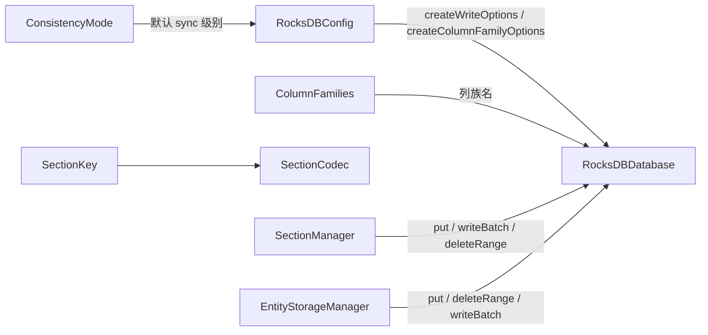

# RocksDB 存储层

## 目录结构

```
src/server/world/storage/db/
├── RocksDBDatabase.hpp/cpp    # 数据库封装（打开/读写/批量/范围删除/迭代/快照/备份/flush/close）
├── RocksDBConfig.hpp          # RocksDB 配置（MemTable/LSM/压缩/WAL/后台线程/Bloom），并由此推导写选项
├── ColumnFamilies.hpp         # 列族名常量与 16 个列族的创建/命名规范
├── ConsistencyMode.hpp        # 一致性模式枚举，唯一决定"默认写入是否等 WAL fsync"
├── SectionKey.hpp             # Section 键结构（维度 + 区块坐标 + 段 Y，13 字节编码）
├── SectionCodec.hpp/cpp       # SectionData 定义与序列化（ZSTD 压缩、内容哈希）
└── README.md                  # 本文档
```

## 内部模块关系



`RocksDBDatabase` 是全存储层唯一的数据库句柄持有者；其余模块只通过它访问 RocksDB，不直接持有 `rocksdb::DB*`（`rawDB()` 仅供 `BackupManager` 内部使用）。

## 上下游外部依赖关系

### 上游（谁依赖了这个模块）

- `section/SectionManager` - Section 读写与批量刷盘
- `entity/EntityStorageManager`、`blockentity/BlockEntityStorageManager` - 实体/方块实体持久化
- `player/PlayerDataManager`、`scoreboard/` - 玩家与计分板数据
- `snapshot/BackupManager` - 备份/恢复
- `SingleLevelStorageManager` - 打开/关闭数据库、装配 `RocksDBConfig`

### 下游（这个模块依赖了谁）

- `rocksdb` - 键值存储引擎
- `zstd` - Section 压缩
- `common/core/Result.hpp`、`common/core/Types.hpp`
- `common/profiler/TraceEvents.hpp` - `TraceEvents.Storage.Db` 追踪
- `spdlog` - 日志

## 容易踩的坑

1. **`options.sync` 只能由 `ConsistencyMode` 决定**：`consistencyModeSyncsEveryWrite()`（`ConsistencyMode.hpp`）是唯一的判据，`enableWAL` 只管 WAL 写不写、不管 fsync。历史上这里还有一个独立的 `walSync` 布尔开关且默认 `true`，把服务端实际配置的 `Eventual` 完全架空——每次 `put`/`deleteRange` 都要等一次 fsync，关服时 2048 个 section + 1089 次范围删除因此多花约 10 秒。新增写入开关前先确认它不会重新引入"配置项失效"。
2. **`sync=false` 不等于不写 WAL**：`disableWAL=false` 时写入仍进 WAL，进程崩溃可由 WAL 回放恢复；`sync` 只决定是否等待 fsync（即是否抵御操作系统崩溃/断电）。
3. **单条写入永远比一次批量提交贵**：`put`/`del`/`deleteRange` 各自是一次完整的 Write 调用，`sync=true` 时各付一次 fsync。需要写多条数据时必须用 `writeBatch`，把 N 次 fsync 压成 1 次。
4. **`writeBatch` 拒绝空批次**：空批次同样要付一次完整 WAL 写入，调用方必须在提交前判空（这也是断言而非静默跳过）。
5. **`getCF` 返回的 `ColumnFamilyHandle*` 由 `RocksDBDatabase` 拥有**：调用方不负责释放，但必须保证句柄生命周期内完成写入——`close()` 会先 flush 再销毁句柄，任何跨越 `close()` 的批次都会用到悬垂句柄。
6. **`WriteBatch` 内按插入顺序生效**：批内各条目获得递增序列号，因此"先 `DeleteRange` 整段删除、再 `Put` 新行"会得到"旧行消失、新行存活"的结果；顺序写反则新行会被自己的删除指令抹掉。
7. **`close()` 会等待 flush 完成**：本层写入默认不逐条 fsync，`close()` 若不等待就把 memtable 交给析构，这次会话的数据就只剩 WAL 一条退路。
